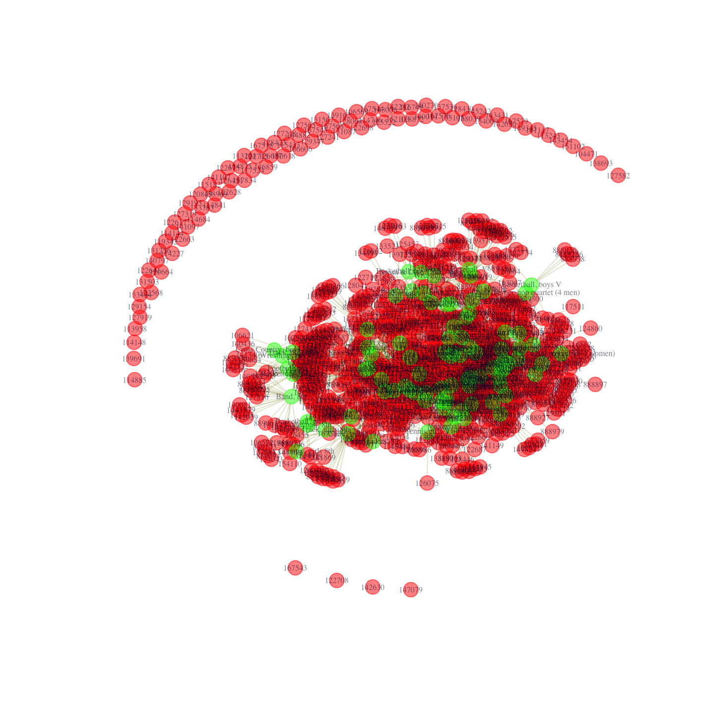
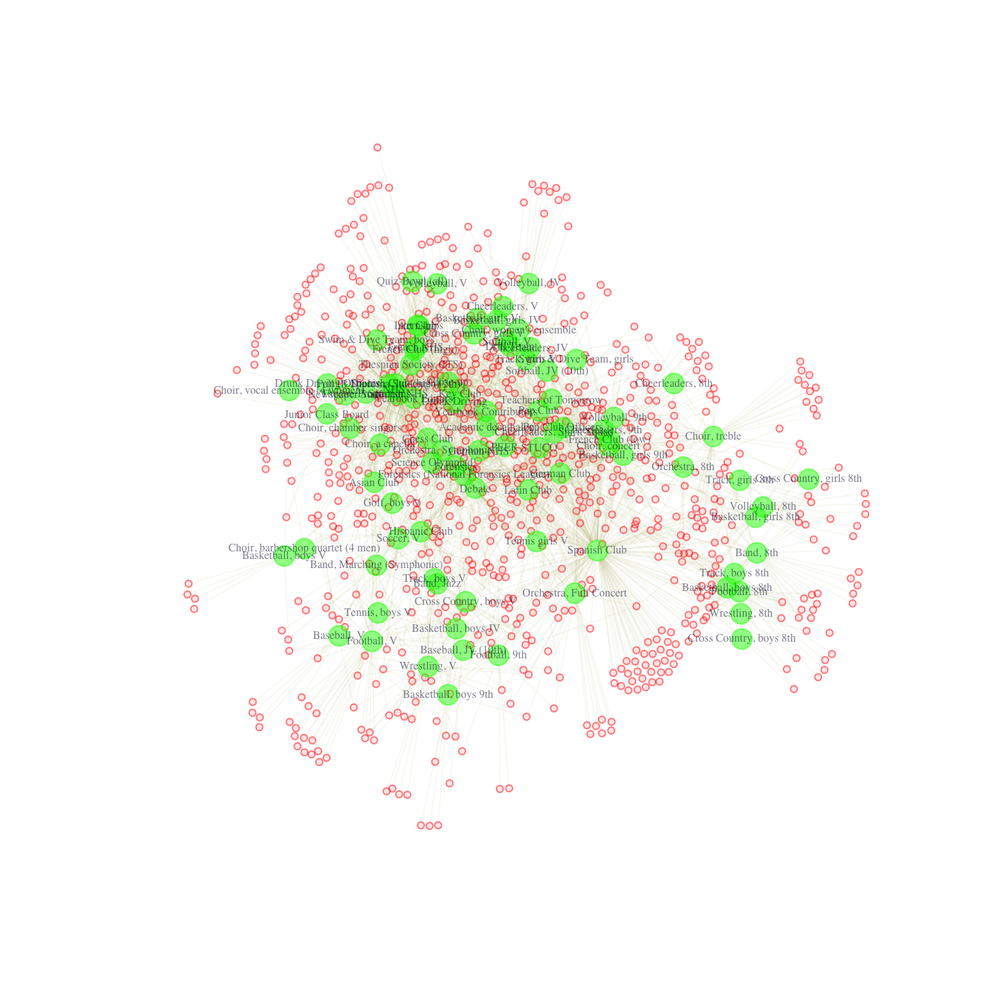
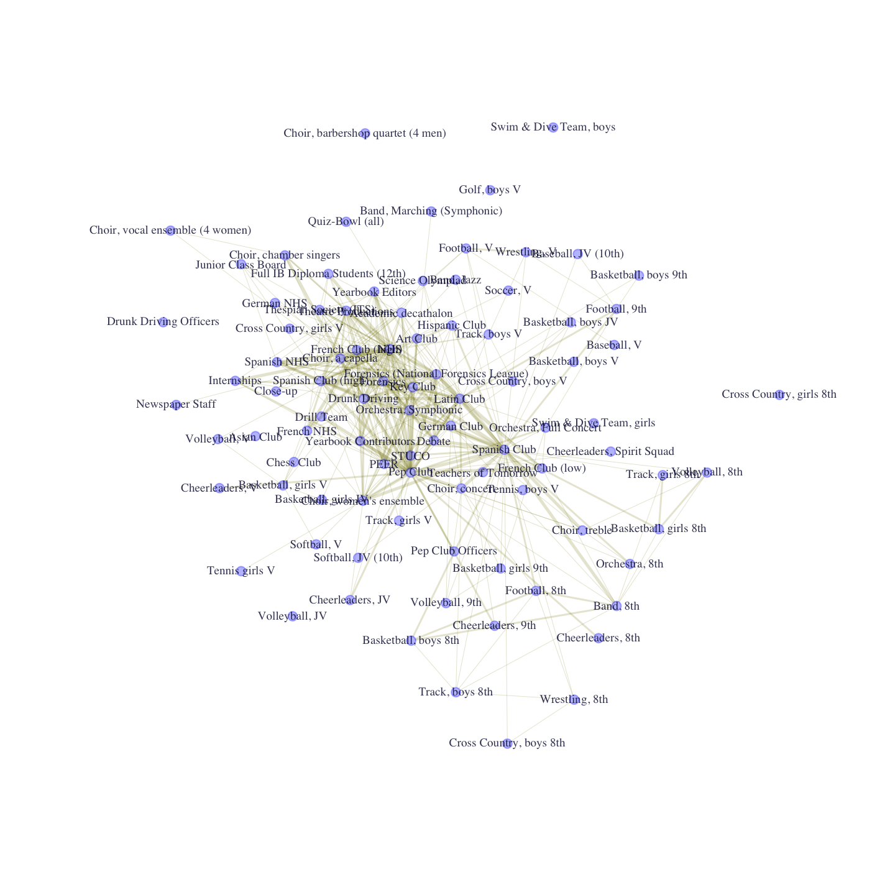

# Two-mode Networks: Affilitations and Dualities {#ch11-Two-mode-Networks}

This tutorial walks through the analysis of two-mode (affiliation) data in R. We will cover how to plot two-mode network data using the **igraph** package, how to transform it into one mode data and how to calculate traditional measures, like centrality. The tutorial will draw directly on many of the previous tutorials, including [Chapter 5](#ch5-Network-Visualization-R) (visualization), [Chapter 8](#ch8-Network-Cohesion-Communities-R) (cohesion and groups), and [Chapter 9](#ch9-Network-Centrality-Hierarchy-R) (centrality). We will work with affiliation data collected by Daniel McFarland on student extracurricular affiliations. It is a longitudinal data set, with 3 waves - 1996, 1997, 1998, although we will only use the first wave, 1996. We consider dynamics on two-mode networks in [Chapter 13, Part 3](#ch13-Two-mode-Network-Models-ERGM-STERGM-R) (statistical models for two-mode networks). The data consist of students (anonymized) and the student clubs in which they are members (e.g., National Honor Society, wrestling team, cheerleading squad, etc.). The data thus allow us to capture the duality of social life in the school, as students are linked by being in the same clubs, and clubs are linked by sharing the same students.

Substantively, we are motivated by the following questions: a) Which student clubs serve to integrate the school and which are more peripheral?  b) Which student clubs tend to share members at high rates? c) What is the shared feature, or theme, that brings these clubs together in a cluster?  Overall, we are interested in the manner in which membership in clubs serves to integrate (or divide) the school. 

## Example Affiliation Data

We will use the **igraph** package for this tutorial.


```r
library(igraph) 
```

Our data are stored in three files: an affiliation matrix (showing which students are part of which clubs), a student attribute file (showing the attributes of the students), and a club attribute file (showing the attributes of the clubs). Let's read in the affiliation file from a URL:


```r
url1 <- "https://github.com/JeffreyAlanSmith/Integrated_Network_Science/raw/master/data/affiliations_1996.txt"

affiliations96 <- read.delim(file = url1, check.names = FALSE)
```

We need to preserve the original column names for labeling our visualizations so we use the "check.names = FALSE" argument. The affiliation matrix is organized with students on the rows and clubs on the columns. 


```r
dim(affiliations96)
```

```
## [1] 1295   91
```

We can see that there are 1295 students and 91 clubs. The affiliation matrix is based on a series of club membership dummy variables, coded "1" for membership, "0" for no membership. Let's take a look at the data (just the first 6 rows and 6 columns):


```r
affiliations96[1:6, 1:6] 
```

```
##        Academic decathalon Art Club Asian Club Band, 8th Band, Jazz Band, Marching (Symphonic)
## 101498                   0        0          0         0          0                          0
## 104452                   0        0          0         0          0                          1
## 104456                   0        0          0         0          0                          0
## 104462                   0        0          0         0          0                          0
## 104471                   0        0          0         0          0                          0
## 105215                   0        0          0         0          0                          0
```

We can see, for example, that the second student in the data is part of the marching band while the first student is not. Note that the rownames of the matrix capture the ids of the students. To get a sense of the data, let’s look at the affiliations for the first student in 1996. Here we grab the first row in the affiliation data and locate the 1s in that row:


```r
affils_student1 <- affiliations96[1, ]
affils_student1[which(affils_student1 == 1)]
```

```
##        NHS Spanish Club (high) Spanish NHS Theatre Productions Thespian Society (ITS)
## 101498   1                   1           1                   1                      1
```

We can see that student 1 was a member of the NHS, Spanish Club, Spanish NHS, Theatre Productions and Thespian Society. And now we will read in the attribute data. We have two files, one for the students and one for the clubs.


```r
url2 <- "https://github.com/JeffreyAlanSmith/Integrated_Network_Science/raw/master/data/attributes_students.txt"

attributes_students <- read.delim(file = url2, stringsAsFactors = FALSE)

url3 <- "https://github.com/JeffreyAlanSmith/Integrated_Network_Science/raw/master/data/attributes_clubs.txt"

attributes_clubs <- read.delim(file = url3, stringsAsFactors = FALSE)
```

The student data frame only includes students (1295 rows) and includes student specific attributes. The student specific attributes are: 

-  gender (male, female) 
-  grade96 (grade in 1996) 
-  grade97 (grade in 1997) 
-  race (Asian, black, Hispanic, Native American, white). 

Let's take a look at the first five rows of our student data frame.


```r
attributes_students[1:5, ]
```

```
##      ids    type gender grade96 grade97  race missing96 missing97
## 1 101498 student female      11      12 white         0         0
## 2 104452 student   male       9      10 black         0         0
## 3 104456 student female       9      10 white         0         0
## 4 104462 student   male       9      10 black         0         0
## 5 104471 student female       9      10 black         0         0
```

The club data frame only includes clubs (91 rows) and includes club specific attributes.The main club attributes of interest are:  

-  club_type_detailed (Academic Interest, Academic Competition, Ethnic Interest, Individual Sports, Leadership, Media, Performance Art, Service, Team Sports) 
-  club_profile (how much attention does the club get? low, moderate, high, very high) 
-  club_feeder (does club feed another club, like 8th grade football to 9th grade football?)
-  club_type_gender (is club mixed gender, just boys or just girls?)
-  club_type_grade (which grades, if any, is club restricted to?). 

Now, let's take a look at the first five rows of our club data frame. 


```r
attributes_clubs[1:5, ]
```

```
##                   ids type missing96 missing97   club_type_detailed club_type_general club_type_gender club_profile club_season club_commitment club_type_grade club_feeder
## 1 Academic decathalon club         0         0 Academic Competition          Academic       boys_girls          low      spring        not_high      all_grades          no
## 2            Art Club club         0         0      Performance Art   Performance Art       boys_girls          low    all_year        not_high      all_grades          no
## 3          Asian Club club         0         0      Ethnic Interest   Ethnic Interest       boys_girls          low    all_year        not_high      all_grades          no
## 4           Band, 8th club         0         0      Performance Art   Performance Art       boys_girls          low    all_year            high          eighth         yes
## 5          Band, Jazz club         0         0      Performance Art   Performance Art       boys_girls     moderate    all_year            high          ninth+          no
```

Note that the student attribute data frame must be sorted in the same order as the rows of the affiliation matrix, while the club attribute data frame must be sorted in the same order as the columns of the affiliation matrix. This is already done for our data.

We will now make a combined data frame, that puts together the student attributes with the club attributes. This will be useful when constructing the igraph object below. We will proceed by stacking the student data frame on top of the club data frame (as the igraph object will order the nodes by rows and then columns). For student specific attributes, we will put in NAs for the clubs; for club specific attributes, we will put in NAs for the students. For example, it does not make sense to think of a club having a 'race', so we put in an NA for race. There are also a few attributes that pertain to both students and clubs and here there are no structural NAs, as both node types have meaningful values. These include `ids` (a unique identifier), `type` (student or club), `missing96` (is node missing in 1996, 0 = no; 1 = yes), `missing97` (is node missing in 1997, 0 = no; 1 = yes).

Let's start with those variables that have meaningful values for both students and clubs. In this case, we simply need to stack the values for students on top of the values for clubs.


```r
shared_var_names <- c("ids", "type", "missing96", "missing97")

shared <- rbind(attributes_students[, shared_var_names], 
                attributes_clubs[, shared_var_names])
```

And now let's move to the student specific attributes, putting in NAs for the clubs. We will keep this simple and first create vectors of NAs of the right length (91), representing the values for the clubs. We will then put that together with the student values for race, gender and grade. 


```r
num_clubs <- nrow(attributes_clubs)
NA_dat_club <- rep(NA, num_clubs)

student_var_names <- c("race", "gender", "grade96", "grade97")

student_specific <- rbind(attributes_students[, student_var_names], 
                          data.frame(race = NA_dat_club, 
                                     gender = NA_dat_club,
                                     grade96 = NA_dat_club,
                                     grade97 = NA_dat_club))
```

And now we do the same thing for club specific attributes, putting in NAs for the students and then stacking the data together; again, with the students stacked on top of the clubs. 


```r
num_students <- nrow(attributes_students)
NA_dat_student <- rep(NA, num_students)

club_var_names<- c("club_type_detailed", "club_profile", 
                   "club_feeder", "club_type_gender", 
                   "club_type_grade")

club_specific <- rbind(data.frame(club_type_detailed = NA_dat_student, 
                                  club_profile = NA_dat_student,
                                  club_feeder = NA_dat_student,
                                  club_type_gender = NA_dat_student,
                                  club_type_grade = NA_dat_student), 
                       attributes_clubs[, club_var_names])
```

And now let's combine the three data frames together, column-wise. 


```r
attributes_students_clubs <- cbind(shared, student_specific, club_specific)
```


```r
head(attributes_students_clubs)
```

```
##      ids    type missing96 missing97  race gender grade96 grade97 club_type_detailed club_profile club_feeder club_type_gender club_type_grade
## 1 101498 student         0         0 white female      11      12               <NA>         <NA>        <NA>             <NA>            <NA>
## 2 104452 student         0         0 black   male       9      10               <NA>         <NA>        <NA>             <NA>            <NA>
## 3 104456 student         0         0 white female       9      10               <NA>         <NA>        <NA>             <NA>            <NA>
## 4 104462 student         0         0 black   male       9      10               <NA>         <NA>        <NA>             <NA>            <NA>
## 5 104471 student         0         0 black female       9      10               <NA>         <NA>        <NA>             <NA>            <NA>
## 6 105215 student         0         0 white female      11      12               <NA>         <NA>        <NA>             <NA>            <NA>
```

For the students, we correctly see NA values for the club specific columns (like `club_type_detailed`). Before we construct our igraph object, we first need to remove any students or clubs who were not in the school in the 1996 year (the focus of our analysis here). We can determine this by looking at the `missing96` column in the `attributes_students_clubs` data frame. Let's only keep those cases where `missing96` is equal to 0 (i.e., not missing). We need to do this for both the attribute data frame and the affiliation matrix. Note that we must identify the missing students and clubs separately and use that to reduce the rows and columns in the affiliation matrix. 


```r
not_missing <- attributes_students_clubs$missing96 == 0

is_student <- attributes_students_clubs$type == "student"
not_missing_student <- not_missing[is_student]

is_club <- attributes_students_clubs$type == "club"
not_missing_club <- not_missing[is_club]

affiliations96_nomiss <- affiliations96[not_missing_student, not_missing_club]

attributes_nomiss <- attributes_students_clubs[not_missing, ]
```

We are now in position to create our two-mode graph in igraph. The function is `graph_from_incidence_matrix()`. The main arguments are incidence (the two-mode affiliation matrix) and mode. Here we set mode to "all", telling igraph to create mutual connections between student and club.


```r
affil_net96 <- graph_from_incidence_matrix(incidence = affiliations96_nomiss, 
                                           mode = "all")
```


```r
affil_net96 
```

```
## IGRAPH c8a3f95 UN-B 1029 2641 -- 
## + attr: type (v/l), name (v/c)
## + edges from c8a3f95 (vertex names):
##   [1] 101498--NHS                                   101498--Spanish Club (high)                   101498--Spanish NHS                           101498--Theatre Productions                   101498--Thespian Society (ITS)                104452--Band, Marching (Symphonic)            104452--Basketball, boys 9th                  104452--Football, 9th                         104452--Latin Club                            104456--German Club                           104456--Latin Club                            104462--Basketball, boys JV                   104462--Choir, concert                        104462--Football, 9th                         104462--Latin Club                            104462--Spanish Club                         
##  [17] 105215--Theatre Productions                   105215--Thespian Society (ITS)                106517--Basketball, girls 9th                 106517--Orchestra, Full Concert               106517--Pep Club                              106517--Track, girls V                        106572--Basketball, girls 8th                 106587--Cheerleaders, 9th                     106587--Orchestra, Full Concert               106587--Pep Club                              106592--Band, 8th                             106592--Football, 8th                         106604--Choir, treble                         106604--Orchestra, 8th                        106604--Pep Club                              106604--Spanish Club                         
##  [33] 106609--Band, Jazz                            106609--Spanish Club                          106621--Track, boys 8th                       106709--Orchestra, Symphonic                  106709--Spanish Club                          109492--Baseball, V                           109493--French Club (high)                    109493--Wrestling, V                          113047--Asian Club                            113047--Football, V                           113047--Tennis, boys V                        113050--Football, V                           113053--Forensics                             113053--Forensics (National Forensics League) 113053--German Club                           113060--NHS                                  
##  [49] 113060--PEER                                  113107--Soccer, V                             113107--Swim & Dive Team, boys                113122--Choir, women's ensemble               113122--Spanish Club                          113123--Choir, women's ensemble               113127--Debate                                113127--Forensics (National Forensics League) 113127--Key Club                              113127--Spanish Club                          113137--Debate                                113137--Forensics                             113137--Forensics (National Forensics League) 113140--Debate                                113140--Forensics (National Forensics League) 113140--German Club                          
##  [65] 113140--Spanish Club                          113168--French Club (low)                     113168--Latin Club                            113211--Cheerleaders, Spirit Squad            113211--Choir, concert                        113211--Pep Club                              113211--Spanish Club                          113214--Choir, concert                        113214--Drill Team                            113214--German Club                           113214--Pep Club                              113214--Softball, V                           113429--Academic decathalon                   113429--Key Club                              113429--Orchestra, Full Concert               113429--Pep Club                             
##  [81] 113429--Science Olympiad                      113433--Football, V                           113479--Choir, women's ensemble               113479--Drunk Driving                         113479--Key Club                              113479--PEER                                  113694--Asian Club                            113694--Choir, a capella                      113694--Choir, chamber singers                113694--Orchestra, Symphonic                  113719--French Club (high)                    113719--Orchestra, Symphonic                  113719--Pep Club                              113719--Yearbook Contributors                 113939--French Club (high)                    113939--NHS                                  
##  [97] 114002--Football, V                           114002--Wrestling, V                          114010--PEER                                  114010--Pep Club                              114010--Yearbook Editors                      114015--Softball, V                           114015--Yearbook Contributors                 114025--Choir, a capella                      114025--Orchestra, Symphonic                  114025--Theatre Productions                   114037--Basketball, girls JV                  114037--Forensics (National Forensics League) 114037--Latin Club                            114037--NHS                                   114037--Orchestra, Symphonic                  114037--Spanish Club (high)                  
## [113] 114037--Spanish NHS                           114037--STUCO                                 114037--Yearbook Editors                      114071--Forensics                             114071--Forensics (National Forensics League) 114071--Key Club                              114073--Debate                                114073--Forensics                             114073--Forensics (National Forensics League) 114076--Key Club                              114076--Latin Club                            114076--Orchestra, Symphonic                  114078--Basketball, boys JV                   114078--Latin Club                            114078--Spanish Club                          114085--Spanish Club                         
## + ... omitted several edges
```

We can see that there are 1029 nodes and 2641 edges. Note that the two-mode, or bipartite, network has a vertex attribute called `type` that indicates the kind of node. `type` is automatically created by igraph and attached as a vertex attribute. A False corresponds to the students (rows) and True corresponds to the clubs (columns). We thus have a network of students and clubs where all ties link students to clubs (based on membership). Let’s grab the vertex attribute type from the two-mode igraph object.


```r
type96 <- vertex_attr(affil_net96, "type") 
```


```r
table(type96) 
```

```
## type96
## FALSE  TRUE 
##   938    91
```

We see that there are 938 students and 91 clubs in the school. And now we can go ahead and put the attributes of the nodes onto the igraph object. We will add attributes for `race`, `gender`, `grade96`, `club_type_detailed` and `club_profile`. Remember that `race`, `grade96` and `gender` are only relevant for students (clubs have an NA), while `club_type_detailed` and `club_profile` are only relevant for clubs (students have an NA). 


```r
affil_net96 <- set_vertex_attr(graph = affil_net96, name = "race", 
                               value = attributes_nomiss$race)

affil_net96 <- set_vertex_attr(graph = affil_net96, name = "gender", 
                               value = attributes_nomiss$gender)

affil_net96 <- set_vertex_attr(graph = affil_net96, name = "grade96", 
                               value = attributes_nomiss$grade96)

affil_net96 <- set_vertex_attr(graph = affil_net96, name = "club_type_detailed", 
                               value = attributes_nomiss$club_type_detailed)

affil_net96 <- set_vertex_attr(graph = affil_net96, name = "club_profile", 
                               value = attributes_nomiss$club_profile)
```

## Plotting the Network
Now that we have our two-mode networks constructed, let's first figure out how to create a nice plot. The **igraph** package has excellent plotting functionality that allows you to assign visual attributes to igraph objects before you plot. The alternative is to pass 20 or so arguments to the `plot.igraph()` function, which can get messy.

Each node (or "vertex") object is accessible by calling `V(g)`, and you can call (or create) a node attribute by using the `$` operator (i.e., `V(g)$name_of_attribute`).  Let's now use this notation to set the vertex color, with special attention to making graph objects slightly transparent. We'll use the `rgb()` function in R to do this. We specify the levels of red, green, and blue and "alpha-channel" (a.k.a. opacity) using this syntax: `rgb(red, green, blue, alpha)`. To return solid red, one would use this call: `rgb(red = 1, green = 0, blue = 0, alpha = 1)`. We will make nodes, edges, and labels slightly transparent so that when things overlap it is still possible to read them. You can read up on the RGB color model at http://en.wikipedia.org/wiki/RGB_color_model. In this case let’s color the students red and the affiliations green. Here we set the students red and set the opacity to .5:


```r
V(affil_net96)$color[type96 == FALSE] <- rgb(red = 1, green = 0, 
                                             blue = 0, alpha = .5)
```

And now we set the clubs green: 


```r
V(affil_net96)$color[type96 == TRUE] <- rgb(red = 0, green = 1, 
                                            blue = 0, alpha = .5) 
```

Notice that we index the `V(g)$color` object by using the `type96` variable used above. Students correspond to False in the type variable and clubs correspond to True. From here on out, we do not specify "red = ", "green = ", "blue = ", and "alpha = ". These are the default arguments (R knows the first number corresponds to red, the second to green, and so on). Now we'll set some other graph attributes:


```r
V(affil_net96)$label <- V(affil_net96)$name # setting label of nodes
V(affil_net96)$label.color <- rgb(0, 0, .2, .5) # set the color of the labels
V(affil_net96)$label.cex <- .5 # make the labels of the nodes smaller
V(affil_net96)$size <- 6 # set size of nodes to 6
V(affil_net96)$frame.color <- V(affil_net96)$color # set color around nodes 
```

We can also set edge attributes. We set the edge attributes using the `E()` function. Here we'll make the edges nearly transparent and slightly yellow because there will be so many edges in this graph:


```r
E(affil_net96)$color <- rgb(.5, .5, 0, .2)
```

We can also specify which layout we will use. In this case, we will use the Fruchterman-Reingold force-directed layout algorithm. Generally speaking, when you have a ton of edges, the Kamada-Kawai layout algorithm works well. It can, however, be slow for networks with many nodes. As a default, igraph will use the grid based implementation of the algorithm in the case of more than a thousand vertices. This implementation is faster, but can fail to produce a plot with any meaningful pattern if you have too many isolates. Also note that for more recent versions of igraph, the F-R layout has been rewritten and will produce bad looking plots if a network has more than 999 vertices. You need to fix the grid parameter to "nogrid" to fix the problem. Our network has more than 999 vertices and has many isolates. Therefore, we want to offset the default and specify that we do not want to use the grid implementation.


```r
layout <- layout_with_fr(affil_net96, grid = "nogrid")
```

Now, we'll open a pdf "device" on which to plot. This is just a connection to a pdf file. We will go ahead and save it to our working directory, which can be set using `setwd()` and checked using `getwd()`.


```r
pdf("magact_stdnt_actvts_1996.pdf")
plot(affil_net96, layout = layout)
dev.off() 
```



Once we break off the connection, the created plot will be saved out in the working directory, saved as "magact_stdnt_actvts_1996.pdf" (for convenience, we have also included a version of the plot in this html output).  Now, if you open the pdf output, you'll notice that you can zoom in on any part of the graph ad infinitum without losing any resolution. How is that possible in such a small file? It's possible because the pdf device output consists of data based on vectors: lines, polygons, circles, ellipses, etc., each specified by a mathematical formula that your pdf program renders when you view it. Regular bitmap or jpeg picture output, on the other hand, consists of a pixel-coordinate mapping of the image in question, which is why you lose resolution when you zoom in on a digital photograph or a plot produced as a picture.

Looking at the output, this plot is oddly reminiscent of a crescent and star, but impossible to read. Part of the problem is the way in which the layout algorithms deal with the isolates. For example, layout_with_fr will squish all of the connected nodes into the center creating a useless "hairball"-like visualization.

Let's remove all of the isolates (the crescent), change a few aesthetic features, and replot. First, we'll remove isolates, by deleting all nodes with a degree of 0, meaning that they have zero edges. In this case, this means students who are part of no clubs or clubs that have no members. Then, we'll suppress labels for students and make their nodes smaller and more transparent. Then we'll make the edges narrower and more transparent. Then, we'll replot using various layout algorithms. 

Here we identify the isolates and then remove them from the network:


```r
degree0 <- which(degree(affil_net96) == 0)
affil_net96_noisolates <- delete_vertices(affil_net96, degree0)
```

Here we extract the type of node for this subsetted network:


```r
type96_noisolates <- vertex_attr(affil_net96_noisolates, "type")
```


```r
table(type96_noisolates) 
```

```
## type96_noisolates
## FALSE  TRUE 
##   850    91
```

Let's create a vector that identifies if the node is a student or not.


```r
is_student_type <- type96_noisolates == FALSE
```

We see that we still have 91 clubs but many students have been removed. Now, let’s tweak some of the plotting parameters. We will take off the labels for the students, change the color of the students and make the student nodes smaller.


```r
V(affil_net96_noisolates)$label[is_student_type] <- NA
V(affil_net96_noisolates)$color[is_student_type] <- rgb(1, 0, 0, .1)
V(affil_net96_noisolates)$size[is_student_type] <- 2
```

Here we change some of the edge attributes for the plot.


```r
E(affil_net96_noisolates)$color <- rgb(.5, .5, 0, .05)
```

Now let's create the plot, saving out it out as a pdf. First with Kamada-Kawai layout:


```r
pdf("magact_stdnt_actvts_1996_layout_with_kk.pdf")
plot(affil_net96_noisolates, layout = layout_with_kk)
dev.off()
```


We can see that the clubs are colored green and have labels, while the students are colored a transparent red and have no labels. Now with the FR layout.


```r
pdf("magact_stdnt_actvts_1996_layout_with_fr.pdf")
plot(affil_net96_noisolates, layout = layout_with_fr)
dev.off()
```



Note that if we ran this again we would get a slightly different figure. The nice thing about the Fruchterman-Reingold layout in this case is that it really emphasizes centrality -- the nodes that are most central are nearly always placed in the middle of the plot. More generally, these plots are nice in that they emphasize the dualistic nature of student and club (or person and affiliation). We see that certain clubs and students are placed in close proximity to each other. In this way, we get a space, where students and clubs tend to cluster together, with sets of students tending to join the same kinds of clubs. For example, we can see that eighth grade boy’s track and eighth grade boy’s cross-country tend to cluster together. They are linked in the sense that students in one club tend to be in another. From the other side, students on these teams are placed close together in the space, as they are linked through common patterns of club membership (here eighth grade boy sports). 

We can also incorporate the node attributes into the plot. Here, we will do a quick plot where the nodes are colored based on racial identity. Student will be colored by racial identity while clubs will all be green, as before. We will use the `recode()` function in the car package to set the colors of the nodes. We only want to change the color for the students, however, and so we restrict the recoding to just those cases where type is a student. 


```r
library(car)

race <- V(affil_net96_noisolates)$race[is_student_type]

student_node_color <- recode(race,
                             "'white' = 'red'; 
                             'Hispanic' = 'grey';
                             'Asian' = 'blue';
                             'black' = 'yellow';
                             'Native American' = 'black'")
```

And now we set the color of the nodes (both fill and frame of the circle) based on the vector of colors defined above, just changing the values for the students. 


```r
V(affil_net96_noisolates)$color[is_student_type] <- student_node_color 
V(affil_net96_noisolates)$frame.color[is_student_type] <- student_node_color
```

For this plot we will also take off the labels for the clubs. 


```r
V(affil_net96_noisolates)$label[!is_student_type] <- NA
```

And now we can go ahead and produce the plot (this time we won't save it out as a pdf). 


```r
plot(affil_net96_noisolates)
```


We can see that our students are colored yellow, red, blue, etc., while the clubs are all green. At first glance, it would appear that students tend to be closest to other students of the same race (i.e., they join the same clubs), but that pockets of racial groups are often intermixed in the same region of the plot. We will return to the question of racial segregation in affiliations below. 

While the two-mode network representation is useful and intuitive, it is often easier to actually analyze the one-mode projections of the network, and that is what we turn to next. 

## Single Mode Networks
Having plotted our two-mode network for the 1996 year, we now move to an analysis that focuses on the one-mode projections of the network. We will produce two networks, one for student-to-student ties and one for club-to-club ties based on the student-to-club network analyzed above. For the student-to-student network, all of the nodes are students and we define a tie between two students based on the number of clubs they have in common. For the club-to-club network, all the nodes are clubs, and we define a tie between clubs based on the number of members they have in common. 

### Constructing One-Mode Projections
We will begin by producing the one-mode projection using matrix multiplication. This is done using R's matrix algebra commands. We first need to get the affiliation data into the matrix format. To get the one-mode representation of ties between rows (students in our example), multiply the matrix by its transpose. To get the one-mode representation of ties between columns (clubs in our example), multiply the transpose of the matrix by the matrix.  Note that you must use the matrix-multiplication operator `%*%`  rather than a simple asterisk. For the club to club network: 


```r
affiliations96_nomiss <- as.matrix(affiliations96_nomiss)
club_club96 <- t(affiliations96_nomiss) %*% affiliations96_nomiss 
```


```r
club_club96[1:5, 1:5]
```

```
##                     Academic decathalon Art Club Asian Club Band, 8th Band, Jazz
## Academic decathalon                  29        3          1         0          1
## Art Club                              3       33          0         0          0
## Asian Club                            1        0          8         0          0
## Band, 8th                             0        0          0        46          0
## Band, Jazz                            1        0          0         0         17
```

The values in the matrix capture the number of people who are members of the row club and column club. For example, there are three students who are part of the Academic decathlon club and the Art club. Note that the diagonal tells us the number of students in that club. So, there are 33 students in the Art club. 


```r
dim(club_club96) 
```

```
## [1] 91 91
```

The matrix is square with the number of rows and columns equal to the number of clubs, 91 in this case. If we wanted to get the student to student network, we would take the affiliation matrix and multiply it by the transpose of the affiliation matrix:


```r
student_student96 <- affiliations96_nomiss %*% t(affiliations96_nomiss) 
```


```r
student_student96[1:5, 1:5] 
```

```
##        101498 104452 104456 104462 104471
## 101498      5      0      0      0      0
## 104452      0      4      1      2      0
## 104456      0      1      2      1      0
## 104462      0      2      1      5      0
## 104471      0      0      0      0      0
```

The values capture the number of clubs that student i (on the rows) and j (on the columns) have in common. 


```r
dim(student_student96) 
```

```
## [1] 938 938
```

Again, we have a square matrix, but this time the rows and columns are equal to the number of students in the school. We can now take those matrices and create two igraph objects. This will make it possible to plot and calculate statistics on the one-mode networks.

It is also possible to use the functions within igraph to construct the one-mode networks directly from the two-mode network, without having to do the matrix multiplication. Here we will rely on the `bipartite_projection()` function, which converts a two-mode (bipartite) network to two one-mode (unipartite) networks. 


```r
onemode96 <- bipartite_projection(affil_net96)
```

This is a list with two objects (`proj1` and `proj2`). The first is the student-student projection and the second is the club-club projection. Let's take a look at the club-to-club network: 


```r
club_net96 <- onemode96$proj2
```

Note that an edge weight has been automatically passed to the constructed graph. The weight for the club-to-club network is based on the number of shared members between i and j. This is stored as an edge attribute called `weight`. We can extract useful information from this object, including the names of the nodes, here the clubs.


```r
club_names <- V(club_net96)$name 
```


```r
length(club_names) 
```

```
## [1] 91
```

We see there are 91 names. We can also grab the matrix from this igraph object. We include an attr argument to get the values in the matrix.


```r
mat <- as_adjacency_matrix(graph = club_net96, attr = "weight", sparse = F)
```


```r
mat[1:5, 1:5]
```

```
##                     Academic decathalon Art Club Asian Club Band, 8th Band, Jazz
## Academic decathalon                   0        3          1         0          1
## Art Club                              3        0          0         0          0
## Asian Club                            1        0          0         0          0
## Band, 8th                             0        0          0         0          0
## Band, Jazz                            1        0          0         0          0
```

This matrix is the same as `club_club96` except for the diagonal. The diagonal here is set to 0, as igraph takes out the self-weight (number of members) when constructing the network. 

### Plotting One-Mode Projections
We now turn to plotting the single mode, club-to-club network (we could do an analogous plot for students). One of the main challenges of plotting these networks is that the one-mode projections of two-mode networks tend to be quite dense. We will thus need to pay special attention to the coloring of the edges, noting that the edges themselves are weighted. We will begin by setting vertex attributes, making sure to make them slightly transparent by altering the alpha input to the `rgb()` function.


```r
V(club_net96)$label.color <- rgb(0, 0, .2, .8)
V(club_net96)$label.cex <- .60 
V(club_net96)$size <- 6
V(club_net96)$color <- rgb(0, 0, 1, .3)
V(club_net96)$frame.color <- V(club_net96)$color 
```

We will also set the edge opacity/transparency as a function of how many students each club has in common (the weight of the edge that connects the two clubs). We use the `log()` function to make sure all transparencies are on relatively the same scale, then divide by twice the maximum edge weight to get them on a scale from about .1 and .5.


```r
egalpha <- log1p(E(club_net96)$weight) / max(log1p(E(club_net96)$weight) * 2)
E(club_net96)$color <- rgb(.25, .75, 0, egalpha)
```

For illustrative purposes, let's compare how the LGL (layout generator for larger graphs) and Fruchterman-Reingold algorithms render this graph:


```r
pdf("magact_stdnt_actvts_1996_clubs.pdf")
plot(club_net96, main = "layout_with_lgl", layout = layout_with_lgl)
plot(club_net96, main = "layout_with_fr", layout = layout_with_fr) 
dev.off()
```


Be sure to go to the second page in the pdf to see the FR layout. You might like the LGL layout for this graph, because the center of the graph is very busy if you use the Fruchterman-Reingold layout. 

The plot looks okay but is pretty dense, making it harder to interpret. In this next plot, we will pare things down a bit, weighting the edges to produce a simpler plot. We will make the width of the edges proportional to the edge weight, based on the following logic.  We first calculate the mean and standard deviation of the raw weights. We then assign a new weight, determined by how much the raw weight is below/above the mean. All edge weights equal to or below the mean get a -1 in our new weighting scheme, which will reduce the density of the plot considerably (we set the weight to -1 to ensure that these edges do not show up in the plot). All edges between 0 and 1 standard deviations above the mean weight get a .5, while all edges between 1 and 2 standard deviations get a 1.5. Finally, all edges above 2 standard deviations get a 2.5. Note that these values are only used for plotting purposes. 


```r
std_weight <- sd(E(club_net96)$weight)
weight_mean_center <- (E(club_net96)$weight - mean(E(club_net96)$weight))

recode_weight <- E(club_net96)$weight
recode_weight[weight_mean_center <= 0] <- -1
recode_weight[(weight_mean_center > 0) & (weight_mean_center <= std_weight)] <- .5
recode_weight[(weight_mean_center > std_weight) & 
                (weight_mean_center <= std_weight * 2)] <- 1.5
recode_weight[weight_mean_center > std_weight * 2] <- 2.5
```

We will now apply our new weighting scheme to the widths of the edges. We will also change the color of the edges (to be the same across all edges). 


```r
E(club_net96)$color <- rgb(.5, .5, 0, .2)
E(club_net96)$width <- recode_weight
V(club_net96)$size <- 3
```


```r
plot(club_net96, layout = layout_with_lgl)
```



The plot offers important insight into the structure of club membership in the school. We can see that there are a number of grade-specific sports teams on the periphery and a core consisting of more generalist clubs, like Pep Club and National Honor Society (NHS). Now, we want to take the basic intuition from our plot and analyze the network more formally. We will consider key measures of centrality. 

## Club-to-Club Network
Here we will analyze the weighted version of the club-to-club network, based on the idea that some clubs share more members than others. We could, of course, also analyze the binary version of the network (equal to 1 if ij have at least one member in common and 0 if not). The problem with the binary network is that it equates two clubs who have one shared member with clubs who have 5 (6, 7, etc.) common members. Binary networks also tend to be quite dense, as they capture pretty weak relationships in the case of one-mode projections. Many clubs may share at least one member together, making the ties in the network not very differentiating. Thus, we will generally want to use the weighted version of the network when analyzing a one-mode projection of a two-mode network. 

One thing we have to consider is what form the weights should take when doing different calculations. There are a number of different options and different weights are appropriate for different measures. igraph will use the edge weights on the igraph object by default. We can, however, tell igraph, within particular functions, to use a different set of weights, which will be useful in certain cases. Let's go ahead and create a couple different versions of the edge weights (based on the number of shared members). Let's first create a set of standardized edge weights. Here we take the number of members that i and j share but we divide by the standard deviation of those counts, thus standardizing the weights by the spread of the data. Standardizing the weights is useful as the centrality scores can be interpreted on a common metric; convenient, for example, if we are trying to make comparisons across networks.


```r
weights <- E(club_net96)$weight 
scaled_weights <- weights / sd(weights) 
```

For certain measures, we will want to use a set of weights based on the inverse of the original weights. Here we take the inverse of the scaled weights calculated above:


```r
invscaled_weights <- 1 / scaled_weights
```

### Centrality 
We begin by calculating a simple weighted degree measure. Here we use a `strength()` function. The main arguments are:

- graph = network of interest
- mode = in, out or all (type of degree)
- weights = edge weights to use, by default weight attribute on network

We begin with the default weights, the count of members in common.


```r
deg_normalweights <- strength(club_net96, mode = "all") 
```

And here we use the scaled version of the weights.


```r
deg_scaledweights <- strength(club_net96, mode = "all", 
                              weights = scaled_weights) 
```

Let's look at the first 10 values for our two centrality calculations:

```r
deg_data <- data.frame(deg_normalweights, deg_scaledweights)
```


```r
deg_data[1:10, ]
```

```
##                            deg_normalweights deg_scaledweights
## Academic decathalon                      142         31.551195
## Art Club                                  87         19.330662
## Asian Club                                29          6.443554
## Band, 8th                                 79         17.553130
## Band, Jazz                                39          8.665469
## Band, Marching (Symphonic)                37          8.221086
## Baseball, JV (10th)                       32          7.110129
## Baseball, V                               27          5.999171
## Basketball, boys 8th                      45          9.998618
## Basketball, boys 9th                      30          6.665746
```

Note that if we use the `degree()` function (as we did in other tutorials), this would not use the weights at all, just using a binarized version of the network (where ij = 0 if they have at least one member in common). 


```r
deg_noweight <- degree(club_net96, mode = "all")
```


```r
cor(deg_scaledweights, deg_noweight) 
```

```
## [1] 0.8587135
```

We can see that the non-weighted version is highly correlated with the weighted calculation but it is not identical. Let's also calculate closeness centrality. The function is `closeness()` (like in [Chapter 9](#ch9-Network-Centrality-Hierarchy-R)) but here we will include an input for weights. For closeness, we will use the inverted version of the weights, as two clubs with more common members are actually closer. Using the regular weights can lead to some odd results, as we demonstrate below. This is the case as higher edge weights mean more members in common, which in turn means lower distance/higher closeness. But in calculating distance (the first step in calculating closeness), igraph treats the weights in the opposite manner, assuming that higher weights imply higher distances between nodes. We thus adjust for that and use the inverted weights. Here we calculate both versions, first using the inverted weights, and then using the regular weights.


```r
close_invweights <- closeness(club_net96, weights = invscaled_weights)
close_weights <- closeness(club_net96, weights = scaled_weights)
```

As a quick check let's see how correlated these closeness measures are with degree centrality:


```r
cor(deg_normalweights, close_invweights) 
```

```
## [1] 0.7981294
```

Using the inverted weights, closeness and degree are highly correlated, as we would expect. What about the correlation between closeness and degree when we do not use the inverted weights? 


```r
cor(deg_normalweights, close_weights) 
```

```
## [1] 0.2043294
```

Using the regular weights, the correlation (between degree and closeness) is lower than what we would expect, suggesting it is problematic to calculate closeness using the regular, not-inverted weighting scheme. 

Now that we have calculated some example centrality scores, let's get a sense of which clubs tend to be most important to this school, in terms of integrating the school socially. Let's see which clubs are the most central for degree, just looking at the top 10. Let's order the centrality scores from high to low and grab the first 10. 


```r
deg_top10 <- order(deg_scaledweights, decreasing = T)[1:10] 
```

Now, let's see which clubs correspond to those top 10.


```r
toptenclubs_degree <- club_names[deg_top10]
```


```r
data.frame(high_degree = toptenclubs_degree)
```

```
##                              high_degree
## 1                               Pep Club
## 2                                    NHS
## 3                           Spanish Club
## 4                          Drunk Driving
## 5                             Latin Club
## 6                               Key Club
## 7  Forensics (National Forensics League)
## 8                   Orchestra, Symphonic
## 9                    Spanish Club (high)
## 10                    French Club (high)
```

Let's also take a look at the bottom 10 for degree (setting decreasing to F):


```r
deg_bottom10 <- order(deg_scaledweights, decreasing = F)[1:10]
bottomtenclubs_degree <- club_names[deg_bottom10]
```


```r
data.frame(high_degree = toptenclubs_degree,
           low_degree = bottomtenclubs_degree)
```

```
##                              high_degree                        low_degree
## 1                               Pep Club            Swim & Dive Team, boys
## 2                                    NHS          Cross Country, girls 8th
## 3                           Spanish Club Choir, barbershop quartet (4 men)
## 4                          Drunk Driving           Cross Country, boys 8th
## 5                             Latin Club                    Tennis girls V
## 6                               Key Club                    Volleyball, JV
## 7  Forensics (National Forensics League)   Choir, vocal ensemble (4 women)
## 8                   Orchestra, Symphonic                Basketball, boys V
## 9                    Spanish Club (high)                 Cheerleaders, 8th
## 10                    French Club (high)                    Tennis, boys V
```

The bottom clubs tend to be sports teams and grade (or gender) specific clubs, as opposed to the more generalist clubs making up the high degree clubs. 

Finally, it will be useful to consider which club attributes are associated with network centrality. Here, we will consider club profile, showing how much attention the clubs get in the school. Are higher status clubs more/less central to the network? Let's create a new data frame combining club profile with our calculated centrality scores (after turning `club_profile` into an ordered factor). We will grab `club_profile` from the igraph object.


```r
club_profile <- factor(V(club_net96)$club_profile, ordered = T, 
                    levels = c("low", "moderate", "high", "very_high"))

centrality_data <- data.frame(deg_data, club_profile = club_profile)
```


```r
head(centrality_data)
```

```
##                            deg_normalweights deg_scaledweights club_profile
## Academic decathalon                      142         31.551195          low
## Art Club                                  87         19.330662          low
## Asian Club                                29          6.443554          low
## Band, 8th                                 79         17.553130          low
## Band, Jazz                                39          8.665469     moderate
## Band, Marching (Symphonic)                37          8.221086     moderate
```

And now we will use the `aggregate()` function to calculate the mean and standard deviation of degree for each value of `club_profile` (low, moderate, high, very high).


```r
aggregate(deg_scaledweights ~ club_profile, data = centrality_data, FUN = mean)
```

```
##   club_profile deg_scaledweights
## 1          low          24.89827
## 2     moderate          20.30023
## 3         high          15.04843
## 4    very_high          14.07213
```


```r
aggregate(deg_scaledweights  ~ club_profile, data = centrality_data, FUN = sd)
```

```
##   club_profile deg_scaledweights
## 1          low         28.904978
## 2     moderate         18.779931
## 3         high         11.708920
## 4    very_high          8.552113
```

The results indicate that lower profile clubs tend to have, on average, higher degree centrality than higher profile clubs. Low profile clubs also have higher variance in degree. This suggests that low profile clubs are quite heterogeneous, with some clubs (like the large, generalist service clubs) central to the network, while others (like low status individual sports) are on the outskirts. Centrality for the low profile clubs is thus driven mostly by the type of club, and this can lead to widely varying results. In contrast, highly visible clubs, like Drill or Varsity Cheerleading, have more uniform positions in the network - rarely the very top, central node, but rarely on the outside of the network either. High profile clubs are high status, in part, because they are exclusive, as it is difficult to gain membership. High profile clubs thus tend to be smaller, with a kind of upper limit to how central (in networks terms) they can be. This might be indicative of a network connectivity versus status/exclusivity trade-off. 

What can we substantively conclude about the organization of this school? First, we can see that central clubs tend to be generalist, serving a potentially wide part of the school. We see things like Pep Club, Spanish Club and National Honor School. These are clubs with relatively low bars for membership and relatively low time commitments. This makes it possible for many people to be members of those clubs, while also simultaneously being part of other clubs in the school. On the other end, we tend to see sports teams and competitive academic teams on the periphery of the club-to-club network. These clubs are a kind of greedy institution, demanding full commitment from its members. This may create internal cohesion, but it also means that sports teams are unlikely to create bridges or to integrate the school as a whole. Members of the tennis team may only see other members of the tennis team.  We also see that high profile clubs tend have lower means and variance for degree centrality, suggesting something about the network consequences of being more exclusive. This analysis has focused on centrality, but it is possible to do other kinds of analyses, such as community detection, blockmodeling and the like. 

### Groups
We will now turn to a short analysis of the group structure of this club-to-club network. The basic question is which clubs tend to cluster together, so that a large number of students tend to be members of the same set of clubs. We will use a simple fast and greedy algorithm here, with the weights included as a key input. In this case, we do not want the inverted version of the weights. A higher number of shared members means the clubs are more likely to be in the same group, indicating a stronger relationship between the clubs. We use the scaled version of the weights.


```r
groups_scaledweights <- cluster_fast_greedy(club_net96, 
                                            weights = scaled_weights)
```

Let's see what kinds of clubs are in each group, where a group is defined by a set of clubs that have high (weighted) rates of interaction with each other, defined here by sharing students. To explore this, we will look at the type of clubs that tend to be in each group. We will first put together a little data frame to assist with this, pairing the group memberships with the club name and the type of club (Academic Competition, Team Sports, etc.).


```r
group_dat <- data.frame(group = as.numeric(membership(groups_scaledweights)), 
                        name = V(club_net96)$name, 
                        club_type_detailed = V(club_net96)$club_type_detailed)
```


```r
head(group_dat)
```

```
##   group                       name   club_type_detailed
## 1     2        Academic decathalon Academic Competition
## 2     4                   Art Club      Performance Art
## 3     2                 Asian Club      Ethnic Interest
## 4     5                  Band, 8th      Performance Art
## 5     2                 Band, Jazz      Performance Art
## 6     1 Band, Marching (Symphonic)      Performance Art
```
And now let's look at the membership of each group, starting with group 1. 


```r
group_dat[group_dat[, "group"] == 1, ]
```

```
##    group                              name club_type_detailed
## 6      1        Band, Marching (Symphonic)    Performance Art
## 7      1               Baseball, JV (10th)        Team Sports
## 8      1                       Baseball, V        Team Sports
## 10     1              Basketball, boys 9th        Team Sports
## 11     1               Basketball, boys JV        Team Sports
## 12     1                Basketball, boys V        Team Sports
## 24     1 Choir, barbershop quartet (4 men)    Performance Art
## 32     1             Cross Country, boys V  Individual Sports
## 40     1                     Football, 9th        Team Sports
## 41     1                       Football, V        Team Sports
## 50     1                      Golf, boys V  Individual Sports
## 66     1                         Soccer, V        Team Sports
## 73     1            Swim & Dive Team, boys  Individual Sports
## 77     1                    Tennis, boys V  Individual Sports
## 81     1                     Track, boys V  Individual Sports
## 89     1                      Wrestling, V  Individual Sports
```

Here we calculate a little table, showing the proportion of clubs (in group 1) that fall into each type of club. 


```r
prop.table(table(group_dat$club_type_detailed[group_dat$group == 1]))
```

```
## 
## Individual Sports   Performance Art       Team Sports 
##             0.375             0.125             0.500
```

It looks like group 1 is made up of mostly sport teams. And now for the rest of the groups: 

```r
group_dat[group_dat[, "group"] == 2, ]
```

```
##    group                            name   club_type_detailed
## 1      2             Academic decathalon Academic Competition
## 3      2                      Asian Club      Ethnic Interest
## 5      2                      Band, Jazz      Performance Art
## 15     2            Basketball, girls JV          Team Sports
## 16     2             Basketball, girls V          Team Sports
## 22     2                      Chess Club Academic Competition
## 23     2                Choir, a capella      Performance Art
## 25     2          Choir, chamber singers      Performance Art
## 28     2 Choir, vocal ensemble (4 women)      Performance Art
## 30     2                        Close-up    Academic Interest
## 34     2          Cross Country, girls V    Individual Sports
## 38     2          Drunk Driving Officers              Service
## 44     2              French Club (high)    Academic Interest
## 46     2                      French NHS    Academic Interest
## 47     2 Full IB Diploma Students (12th)    Academic Interest
## 49     2                      German NHS    Academic Interest
## 52     2                     Internships    Academic Interest
## 53     2              Junior Class Board           Leadership
## 56     2                 Newspaper Staff                Media
## 57     2                             NHS              Service
## 64     2                 Quiz-Bowl (all) Academic Competition
## 65     2                Science Olympiad Academic Competition
## 68     2                     Softball, V          Team Sports
## 70     2             Spanish Club (high)    Academic Interest
## 71     2                     Spanish NHS    Academic Interest
## 78     2             Theatre Productions      Performance Art
## 79     2          Thespian Society (ITS)      Performance Art
## 87     2                   Volleyball, V          Team Sports
## 90     2           Yearbook Contributors                Media
## 91     2                Yearbook Editors                Media
```


```r
prop.table(table(group_dat$club_type_detailed[group_dat$group == 2]))
```

```
## 
## Academic Competition    Academic Interest      Ethnic Interest    Individual Sports           Leadership                Media      Performance Art              Service          Team Sports 
##           0.13333333           0.26666667           0.03333333           0.03333333           0.03333333           0.10000000           0.20000000           0.06666667           0.13333333
```

Group 2 is centered around academic clubs and performance art.


```r
group_dat[group_dat[, "group"] == 3, ]
```

```
##    group                                  name   club_type_detailed
## 35     3                                Debate Academic Competition
## 42     3                             Forensics Academic Competition
## 43     3 Forensics (National Forensics League) Academic Competition
## 72     3                                 STUCO           Leadership
## 86     3                        Volleyball, JV          Team Sports
```


```r
prop.table(table(group_dat$club_type_detailed[group_dat$group == 3]))
```

```
## 
## Academic Competition           Leadership          Team Sports 
##                  0.6                  0.2                  0.2
```
We can see that group 3 is a small group centered on academic competition.


```r
group_dat[group_dat[, "group"] == 4, ]
```

```
##    group                       name club_type_detailed
## 2      4                   Art Club    Performance Art
## 14     4      Basketball, girls 9th        Team Sports
## 17     4          Cheerleaders, 8th        Team Sports
## 18     4          Cheerleaders, 9th        Team Sports
## 19     4           Cheerleaders, JV        Team Sports
## 20     4 Cheerleaders, Spirit Squad        Team Sports
## 21     4            Cheerleaders, V        Team Sports
## 26     4             Choir, concert    Performance Art
## 27     4              Choir, treble    Performance Art
## 29     4    Choir, women's ensemble    Performance Art
## 36     4                 Drill Team    Performance Art
## 37     4              Drunk Driving            Service
## 45     4          French Club (low)  Academic Interest
## 51     4              Hispanic Club    Ethnic Interest
## 54     4                   Key Club            Service
## 55     4                 Latin Club  Academic Interest
## 58     4             Orchestra, 8th    Performance Art
## 59     4    Orchestra, Full Concert    Performance Art
## 60     4       Orchestra, Symphonic    Performance Art
## 61     4                       PEER            Service
## 62     4                   Pep Club            Service
## 63     4          Pep Club Officers            Service
## 67     4        Softball, JV (10th)        Team Sports
## 69     4               Spanish Club  Academic Interest
## 74     4    Swim & Dive Team, girls  Individual Sports
## 75     4       Teachers of Tomorrow  Academic Interest
## 76     4             Tennis girls V  Individual Sports
## 83     4             Track, girls V  Individual Sports
## 85     4            Volleyball, 9th        Team Sports
```


```r
prop.table(table(group_dat$club_type_detailed[group_dat$group == 4]))
```

```
## 
## Academic Interest   Ethnic Interest Individual Sports   Performance Art           Service       Team Sports 
##        0.13793103        0.03448276        0.10344828        0.27586207        0.17241379        0.27586207
```

Group 4 is a heterogeneous group, with sport teams, performance art, and generalist service clubs (like key club). 


```r
group_dat[group_dat[, "group"] == 5,]
```

```
##    group                     name club_type_detailed
## 4      5                Band, 8th    Performance Art
## 9      5     Basketball, boys 8th        Team Sports
## 13     5    Basketball, girls 8th        Team Sports
## 31     5  Cross Country, boys 8th  Individual Sports
## 33     5 Cross Country, girls 8th  Individual Sports
## 39     5            Football, 8th        Team Sports
## 48     5              German Club  Academic Interest
## 80     5          Track, boys 8th  Individual Sports
## 82     5         Track, girls 8th  Individual Sports
## 84     5          Volleyball, 8th        Team Sports
## 88     5           Wrestling, 8th  Individual Sports
```


```r
prop.table(table(group_dat$club_type_detailed[group_dat$group == 5]))
```

```
## 
## Academic Interest Individual Sports   Performance Art       Team Sports 
##        0.09090909        0.45454545        0.09090909        0.36363636
```

 Finally, looking at group 5, we see a small group centered around sports teams (specifically for younger students). Now, let's get a broader picture of the group structure. Let's plot the network but color the nodes based on group membership. 


```r
V(club_net96)$color <- membership(groups_scaledweights)
```

Let's also highlight those nodes who have high degree. This will let us see how the central nodes fall into different groups. We will color the frame of the top ten nodes red, as a means of highlighting those high degree clubs.


```r
V(club_net96)$frame.color[deg_top10] <- rgb(1, 0, 0, .75)
```

Let's plot the network, and use the group ids as the labels.


```r
set.seed(105)
group_label <- group_dat$group
plot(club_net96, main = "Coloring by Groups", 
     vertex.label = group_label, vertex.label.cex = .75)
```


Note that a few of these clubs don't seem to be placed very well. For example, JV volleyball is quite isolated and difficult to place in a group (the isolated green node). We may consider breaking them out into their own group. Assuming we are satisfied with the analysis, we can proceed to interpret the found groups. The plot makes clear that there are two periphery groups (group 1 and group 5) that consist of sports teams that have low co-membership with other clubs. The remaining groups (2, 3, 4) are more heterogeneous and make up the core of the network, with lots of co-membership across clubs in different groups. We also see that the most central clubs are spread across those three groups. So, it is not the case that all of the most central clubs fall into a single group. Instead, the different groups revolve around different clubs that help integrate that set of students. For example, group 2 is centered around NHS, Spanish club high and French Club high. Group 4 is centered around Spanish Club (low), French Club (low) and Pep club. Roughly speaking then, both group 2 and group 4 are integrative, heterogeneous groups, but one centers more strongly on academic excellence than the other.  We thus have a set of membership patterns that generally fall into: exclusively sports (group 1 and 5), sports, service and performance art  (group 4), academic competition (group 3) and mixed academic (group 2).

## Using the tnet package
We have thus far analyzed our weighted networks by treating the edges as valued, and summing up those valued edges when calculating things like degree centrality. The downside of this approach is that it does not differentiate the weights on the edges from the number of edges. For example, an actor with one very strong relationship could have high weighted degree, perhaps higher than other actors with many (somewhat weaker) relationships. On the other hand, ignoring the weights only captures the number of edges, treating each edge as a 0 or a 1. We can draw on the **tnet** package to calculate measures that get beyond some of these limitations (@tnet). The basic idea is to include a parameter that puts a relative weight on the number of edges compared to the edge weights (strength of relationship). Let's first read in the **tnet** package. 


```r
library(tnet)
```

And now we need to get the data in a form that **tnet** can use. The **tnet** package takes a weighted edgelist, with the last column capturing the weights. Let's get the edgelist from the igraph object. 


```r
club_edgelist96 <- as_edgelist(graph = club_net96, names = F)
```

And now we add the scaled weights to the edgelist and put useful columns names onto the matrix.


```r
club_edgelist96 <- cbind(club_edgelist96, scaled_weights)
colnames(club_edgelist96) <- c("sender", "receiver", "weights")
```

The **tnet** package doesn't handle undirected networks especially well. So, before we run any analysis, we need to construct the edgelist so that every edge from i to j has the reverse edge also included (j to i). We will accomplish this by taking the edgelist, switching column 1 and column 2, and then stacking it underneath the current edgelist. 


```r
club_edgelist96 <- rbind(club_edgelist96, club_edgelist96[, c(2, 1, 3)])
```


```r
head(club_edgelist96)
```

```
##      sender receiver   weights
## [1,]      1       54 1.9997237
## [2,]      1       59 0.4443830
## [3,]      1       62 1.3331491
## [4,]      1       65 1.3331491
## [5,]      1       44 0.8887661
## [6,]      1       60 0.8887661
```

```r
dim(club_edgelist96)
```

```
## [1] 2722    3
```

We can see that there are 2722 edges (or 1361 undirected edges). Now, we are ready to calculate our weighted centrality measures. For degree, the function is `degree_w()`. The main arguments are:

- net = network of interest, as weighted edgelist
- measure = type of measure: degree calculates measure ignoring the weights; alpha considers the weights
- type = out or in degree
- alpha = weight to put on counts compared to edge weights. 0 = all weight on counts; 1 = all weight on edge weights

We will first calculate degree putting all of the weight on the edge weights, setting alpha to 1. This means that the number of edges is ignored in the calculation, and we simply sum up all of the weights (i.e., the weights for each edge involving node i). 


```r
degree_alpha1 <- degree_w(net = club_edgelist96, measure = "alpha",
                          type = "out", alpha = 1)
```


```r
head(degree_alpha1) 
```

```
##      node     alpha
## [1,]    1 31.551195
## [2,]    2 19.330662
## [3,]    3  6.443554
## [4,]    4 17.553130
## [5,]    5  8.665469
## [6,]    6  8.221086
```

The output is a matrix with two columns, one with the ids and one with the centrality score (the `alpha` column). This is the same as the calculation in **igraph** using the weights to calculate degree. We stored those results in `deg_scaledweights`. Now, let's do the other extreme and put all the weight on the edge count, ignoring the edge weights (alpha = 0). 


```r
degree_alpha0 <- degree_w(net = club_edgelist96, measure = "alpha",
                          type = "out", alpha = 0)
```


```r
head(degree_alpha0)
```

```
##      node alpha
## [1,]    1    47
## [2,]    2    40
## [3,]    3    22
## [4,]    4    17
## [5,]    5    26
## [6,]    6    24
```

This is the same as the calculation in **igraph** that ignores the weights, stored in `deg_noweight`. Finally, let's do something in between and set alpha to .5, putting some weight on both the counts and edge weights. 


```r
degree_alpha.5 <- degree_w(net = club_edgelist96, measure="alpha", 
                           type = "out", alpha = .5)
```

We can check to see how much this affects the results by calculating the correlation between our measures. We need to take the second column from the output, as this is the centrality measure of interest.


```r
cor(degree_alpha1[, 2], degree_alpha.5[, 2])
```

```
## [1] 0.97487
```

```r
cor(degree_alpha0[, 2], degree_alpha.5[, 2]) 
```

```
## [1] 0.9489498
```

We can see that in this case setting alpha to .5 offers very similar results to having full or no weight on the edge weights. 

We now turn to the same exercise for closeness. Here the function is `closeness_w()`. The main arguments are again net and alpha.  We start by setting alpha to 1, putting full weight on the edge weights. Note that in this case we do not have to invert the weights (as we did in **igraph**) as the algorithm employed here does this by default. 


```r
close_alpha1 <- closeness_w(net = club_edgelist96, alpha = 1) 
```


```r
head(close_alpha1) 
```

```
##      node   closeness  n.closeness
## [1,]    1 0.010976898 1.219655e-04
## [2,]    2 0.010183332 1.131481e-04
## [3,]    3 0.006155898 6.839886e-05
## [4,]    4 0.011741035 1.304559e-04
## [5,]    5 0.008258114 9.175683e-05
## [6,]    6 0.007146988 7.941097e-05
```

The output is a matrix with three columns: ids, closeness and scaled closeness (closeness / (n - 1)). This is directly analogous (although there are some slight technical differences) to our calculation in **igraph** using the inverted weights and the `closeness()` function. This was stored as `close_invweights`. And now we can do the same thing setting alpha to 0 (ignoring edge weights). 


```r
close_alpha0 <- closeness_w(club_edgelist96, alpha = 0) 
```


```r
head(close_alpha0) 
```

```
##      node   closeness  n.closeness
## [1,]    1 0.007518797 8.354219e-05
## [2,]    2 0.007142857 7.936508e-05
## [3,]    3 0.006250000 6.944444e-05
## [4,]    4 0.006097561 6.775068e-05
## [5,]    5 0.006493506 7.215007e-05
## [6,]    6 0.006410256 7.122507e-05
```

To get the same calculation in **igraph** we would do the following. 


```r
close_igraph_noweight <- closeness(club_net96, weights = NA)
```

Note that weights is set to NA, as the default is to use the weights on the igraph object and we don’t want that here. 


```r
head(close_igraph_noweight)
```

```
##        Academic decathalon                   Art Club                 Asian Club                  Band, 8th                 Band, Jazz Band, Marching (Symphonic) 
##                0.007518797                0.007142857                0.006250000                0.006097561                0.006493506                0.006410256
```

We can see it is the same as the second column above. And again we can set alpha to a value different than 0 or 1. 


```r
close_alpha.5 <- closeness_w(club_edgelist96, alpha = .5) 
```

Let's check the correlation between putting no weight on the edge weights (alpha = 0) and .5 weight:


```r
cor(close_alpha0[, 2], close_alpha.5[, 2]) 
```

```
## [1] 0.8766644
```

We see the versions of closeness centrality are highly correlated but not identical.

## Racial Segregation
In this section, we shift our focus to the attributes of the students and how this maps onto affiliation patterns. Our main question is how strong homophily is along racial lines. Do students tend to be members of clubs with students of the same racial identity? Or is there racial heterogeneity in club memberships? There are a number of ways that we might address this question, and here we take two different approaches. In the first case, we ask how many (weighted) edges connecting students are homophilous. If student i and student j are both members of Spanish Club, are they the same or different racial identity? We will calculate this over all co-membership edges (where student i and student j are in the same club) and then ask what proportion of all (weighted) edges match on race. In the second case, we will calculate a slightly different version of the same homophily statistic; we will calculate how many times a student is in a club with at least one other student of the same race. This captures a kind of baseline level of homophily: do students ever join clubs where they cannot find a student of the same race? 

Note that these calculations set the stage for our analysis in [Chapter 13](#ch13-Two-mode-Network-Models-ERGM-STERGM-R), where we cover statistical models for two-mode networks. The two versions of racial homophily represent two (extreme) versions of the kinds of homophily terms that can be included in our statistical models.

### Proportion of Co-membership Edges where Students Match on Race
In this section we walk through the steps to calculate the number of weighted edges that match on race. We begin by grabbing the student-student network from the one mode object constructed above (here we need `proj1`, rather than `proj2`).


```r
student_net96 <- onemode96$proj1
```

It will be useful to work with the edgelist version of the network. Here we extract the edgelist from the student-student network, adding the weight column to the data frame. 


```r
student_edges <- as_edgelist(graph = student_net96)
student_edges <- data.frame(student_edges, weight = E(student_net96)$weight)
colnames(student_edges)[1:2] <- c("sender", "receiver")
```

And let's take a look at the edgelist: 

```r
head(student_edges)
```

```
##   sender receiver weight
## 1 101498   113060      1
## 2 101498   113939      1
## 3 101498   114037      3
## 4 101498   114671      2
## 5 101498   114679      4
## 6 101498   114850      3
```
These edges capture the co-membership ties between students. So, for example, student 101498 and 113060 are in one club together, while 101498 and 114037 are in three together (looking at the weight column). We can also think of these weighted edges as the number of two-paths between student i and j; as i and j are connected in the original, two-mode network through a common club. For example,  101498 and 113060 are both members of NHS, creating a two-path in the two-mode network (101498-NHS-113060) or one edge in the one-mode network (101498-113060). It will be useful to consider the two-path interpretation as the statistical models covered in [Chapter 13, Part 3](#ch13-Two-mode-Network-Models-ERGM-STERGM-R) will specify these kinds of processes using the two-mode specification. 

In order to calculate if i and j match on race (assuming they are in the same club), we need to get the racial information in a more accessible format. Here we will grab the ids of the students and their racial information and put them together in a data frame.


```r
race_dat <- data.frame(name = V(student_net96)$name, 
                       race = V(student_net96)$race)
```


```r
head(race_dat)
```

```
##     name  race
## 1 101498 white
## 2 104452 black
## 3 104456 white
## 4 104462 black
## 5 104471 black
## 6 105215 white
```

And now we can go ahead and map the racial information of the nodes onto the edgelist extracted above. The goal is to get the race of the sender and receiver of each edge onto a single data frame, to facilitate our homophily calculation (do i and j identify as the same race?). We will use a `match()` function to accomplish this. The idea is to match the id from `race_dat` (based on name) with the sender (or receiver) id from `student_edges`. We will then grab the race value associated with that sender (or receiver) id.  We will do this once for sender and once for receiver, and then put everything together in a data frame. 


```r
sender_race <- race_dat[match(student_edges[, "sender"], 
                              race_dat[, "name"]), "race"]

receiver_race <- race_dat[match(student_edges[, "receiver"], 
                                race_dat[, "name"]), "race"]

student_edges <- data.frame(student_edges, sender_race, receiver_race)
```


```r
head(student_edges)
```

```
##   sender receiver weight sender_race receiver_race
## 1 101498   113060      1       white         white
## 2 101498   113939      1       white         black
## 3 101498   114037      3       white         black
## 4 101498   114671      2       white         white
## 5 101498   114679      4       white         Asian
## 6 101498   114850      3       white         white
```
We now have the sender id, the receiver id, the weight on the edge, as well as the sender and receiver racial identity. Let's see which of those sender-receiver pairs is the same race:


```r
same_race <- student_edges[, "sender_race"] == student_edges[, "receiver_race"]
```

We are now in a position to calculate our statistic of interest, the proportion of weighted edges between students where student i and j are of the same race (or the number of two-paths that match on race). We need two pieces of information: first, the total number of weighted edges that match on race; and second, the total number of weighted edges. The total number of weighted edges can be calculated by summing the weight column in our `student_edges` data frame. The number of weighted edges that match on race is based on the same calculation but restricted to where `sender_race` is the same as `receiver_race`, identified above.


```r
sum(student_edges[same_race == T, "weight"]) / sum(student_edges[, "weight"])
```

```
## [1] 0.4675944
```

This means that about .468 of all connections between i and j match on race. This suggests that many co-membership ties exist between students of different racial identities, consistent with the figure constructed above. Note that this result might be partly driven by generalist clubs (like NHS) which tend to be large, racially heterogeneous entities. Such clubs would have a disproportionate impact on increasing the number of two-paths that mismatch on race. We will consider this more carefully in [Chapter 13, Part 3](#ch13-Two-mode-Network-Models-ERGM-STERGM-R), where we will examine racial homophily, while controlling for other factors, like differences in club size. 

### Do Students Match Racially with at Least One Other Student? 
We now turn to our second set of analyses, where we ask how often students match, racially, with at least one other student in the club (they are a member of). Here it will be easier to work with the two-mode version of the network. We will construct an edgelist with the sender as the students and the receiver as the clubs. We set names to F, as we do not want the node labels, instead outputting the node number in the edgelist (this will make it  easier to map race onto the sender/receiver for that edge).


```r
club_student_edges <- as_edgelist(graph = affil_net96, names = F)
colnames(club_student_edges)[1:2] <- c("sender", "receiver")
```


```r
head(club_student_edges)
```

```
##      sender receiver
## [1,]      1      995
## [2,]      1     1008
## [3,]      1     1009
## [4,]      1     1016
## [5,]      1     1017
## [6,]      2      944
```

And now we will grab the race attributes of the nodes from the igraph object (the two-mode version of the network): 


```r
race2 <- V(affil_net96)$race
```

We now need to determine for each edge, student-club, if the student is the same race as at least one other member of the club. There are a number of ways we could go about calculating this. Here we will lay out each step in a loop (which might be a slow option for a large network). The basic logic is to first grab the race of the focal student (in the edge in question). We then grab the race of all other students in that club (excluding the student of interest). We then ask if the race of the focal student matches any student in the club. This is done over all student-club edges in the network and stored in an object called `match_race`.


```r
match_race <- NA

for (i in 1:nrow(club_student_edges)){
  
  # grabbing race of student in edge:
  send_race <- race2[club_student_edges[i, "sender"]]
  
  # getting race of students in club of interest, excluding student in edge:
  club_id <- club_student_edges[i, "receiver"] 
  edges_to_club <- club_student_edges[-i, "receiver"] == club_id
  student_ids <- club_student_edges[-i, ][edges_to_club, "sender"] 
  club_race_composition <- race2[student_ids] 
  
  # asking if race of focal student race matches any other student in club:
  match_race[i] <- send_race %in% club_race_composition
  }
```


```r
head(match_race)
```

```
## [1] TRUE TRUE TRUE TRUE TRUE TRUE
```
This tells us, for example, that for the first edge, the student (101498) is the same race as at least one other student in the club (NHS). And now we can calculate the overall proportion that match, calculated over all student-club edges in the network:


```r
prop.table(table(match_race))
```

```
## match_race
##      FALSE       TRUE 
## 0.02309731 0.97690269
```

This suggests that almost all students have at least one other student in their clubs that matches on racial identity. In this way, students are very unlikely to be the sole, 'outsider' differing on race with all other members of the club.  This is particularly interesting in the case of smaller racial groups, like Native American or Asian, where, by chance, we might expect them to join clubs and be the only other person of their racial identity. The fact that this rarely happens is telling. 

Substantively then, our two analyses suggest that students are likely to be in clubs where some of the students are of a different race (based on the first calculation), but are very much unlikely to find themselves racially isolated in a club (based on the second calculation). In this way, students are unlikely to join clubs where there is a bad mismatch between their race and the race of the other students; but it does mean that a club can have a mix of different racial groups. Of course, some of the racial matching might arise by chance and it is important to determine how much of the racial homophily is driven solely by the overall composition of the school (as well as other factors of interest, like the tendency for students to join similar types of clubs). We return to this in [Chapter 13, Part 3](#ch13-Two-mode-Network-Models-ERGM-STERGM-R), statistical models for two-mode networks.  

## Club Centrality and Attributes
As a final example, we connect the analysis of club centrality to the analysis of student attribute segregation. In Section 4.1 we determined which clubs were more/less central to the network. Here, we reexamine this question, while incorporating information about the student attributes (see Section 11.6.1 and 11.6.2 above). The basic question is whether more central clubs tend be more or less segregated in terms of student attributes, like grade, gender or race. Are more peripheral clubs more homogeneous? And more formally, is the proportion of students with the same grade (or gender) higher in central, bridging clubs or in peripheral, exclusive ones? For example, we might think that the proportion matching would be higher (so more segregated) in the periphery, harder to access clubs. If so, that would suggest that central clubs are locales for multiple grades and genders, acting as integrating spaces across key student identities. 

Our goal is to calculate the proportion of student pairs within each club that have the same gender or grade. We will then correlate the proportion matching with the centrality scores previously calculated. 

As a first step, we need to determine which students are in which clubs. To accomplish this, we will create a list, where each element shows the student ids in the club in question. We will work with the raw affiliation matrix, `affiliations96_nomiss`. For each column in the matrix (i.e., each club), we will identify which students have a "1", and are thus members of the club. We will do this for all clubs using `apply()` and setting MARGIN to 2 (in order to repeat the function for each column). We set the function of interest using the FUN input.


```r
student_id_list <- apply(affiliations96_nomiss, MARGIN = 2, 
                         FUN = function(x) which(x == 1))
```

The output is a list, one entry (of student ids) for each club. Let's look at the first two clubs: 


```r
student_id_list[1:2]
```

```
## $`Academic decathalon`
## 113429 114920 115229 115460 118699 122638 122662 126330 128412 133022 133962 138751 139362 141015 148535 167506 167508 888892 888898 888947 888965 888976 888988 889001 889016 889036 889039 889048 889085 
##     34     72     85     88    126    196    208    290    351    424    453    504    526    576    657    693    695    727    733    782    800    811    823    836    851    871    874    883    920 
## 
## $`Art Club`
## 119336 121389 122619 122671 122672 122683 122684 122687 126259 126281 126782 129101 129354 133959 138539 139362 141149 149824 888890 888900 888901 888930 888947 888948 888959 888978 888985 888991 889016 889028 889071 889080 889083 
##    135    160    181    217    218    225    226    228    286    289    306    366    384    452    496    526    592    665    725    735    736    765    782    783    794    813    820    826    851    863    906    915    918
```

We see the students who are in the Academic decathlon club and the Art Club. The numbers correspond to the rows in the affiliation matrix for the student in question.

And now we need to write a little function to calculate the proportion of students who match on grade or gender in a given club. This is a little different than what we accomplished with the racial segregation analysis above (11.6.2), where we asked if a particular student in a club matched or not with other students in the club. Here, we ask what proportion of all student pairs in a club match on the attribute of interest: do student i and student j (over all i,j in the club) have the same grade, gender, etc.?  

Our function will take two arguments: first, a vector of student attributes (grade or gender) for all students in the school; and second, the ids of the students in the club of interest. Note that the input ids are not based on the labels, but refer to the rows in the affiliation matrix, as stored in `student_id_list`.


```r
prop_same_func <- function(attribute, ids){

  #Arguments:
  #attribute: vector of attributes
  #ids: ids of nodes
  
  # subset attributes to just students in club of interest
  club_subset <- attribute[ids]
  
  # calculate number in each category
  tab_attribute <- table(club_subset)

  # calculate number of students in club
  num_students <- sum(tab_attribute)

  # calculate number of pairs that match; accomplished
  # by squaring and summing the number in each category
  # while also adjusting for diagonal, 
  # as we do not want to count the number of
  # times i matches with self
  num_match <- sum(tab_attribute ^ 2) - num_students

  # now calculating proportion that match, by dividing
  # number that match by total number of pairs, excluding 
  # diagonal (where i is the same student)
  prop_same <- num_match / (num_students * (num_students - 1))
}
```

And now we will apply our function to the vector of gender values for our students. We will first grab gender from the igraph object (just for students, so setting type to FALSE). We then apply our function over each set of students ids, one for each club; this is stored in `student_id_list`. We use `lapply()` as we want to run the function over each element of `student_id_list`. 


```r
gender <- V(affil_net96)$gender[V(affil_net96)$type == FALSE]

same_gender_prop <- lapply(student_id_list, FUN = prop_same_func, 
                           attribute = gender)
```

It will be useful to have the calculated values stored as a numeric object (rather than a list), so let's go ahead and do that using an `unlist()` function. 


```r
same_gender_prop <- unlist(same_gender_prop)
```


```r
head(same_gender_prop)
```

```
##        Academic decathalon                   Art Club                 Asian Club                  Band, 8th                 Band, Jazz Band, Marching (Symphonic) 
##                  0.4876847                  0.4886364                  0.5714286                  0.4975845                  0.5588235                  0.5384615
```

And we can see that we have a numeric vector showing the proportion of student pairs in the club that match on gender. So, for example, .488 of all pairs in Academic decathlon are the same gender. 

And now we can go ahead and do a simple correlation analysis. We will correlate the centrality scores, based on degree centrality, with our same gender proportion measure. 


```r
cor(deg_normalweights, same_gender_prop)
```

```
## [1] -0.4342763
```

And now we do the same thing for grade:

```r
grade <- V(affil_net96)$grade96[V(affil_net96)$type == FALSE]

same_grade_prop <- lapply(student_id_list, FUN = prop_same_func, 
                          attribute = grade)

same_grade_prop <- unlist(same_grade_prop)

cor(deg_normalweights, same_grade_prop)
```

```
## [1] -0.279257
```

It looks like less central clubs, do in fact, have higher levels of segregation, being more homogeneous in terms of gender and grade (especially for gender). We see a negative correlation, so that more central clubs have lower proportion matching. This suggests that the affiliation network is held together by low commitment ('blow-off') clubs that anyone can join and this serves to bring disparate group interests (e.g., on gender, on age and skill) into contact with one another, even if fleeting. The more demanding, distinguishing activities play to core identities and are more exclusive. As such, the affiliation network reinforces identity-selection and differentiation but provides means for secondary association and integration across those interests via easy to access clubs. In this way, intermittent locales arise to maintain overall integration.

This lab on two-mode networks has included a wide variety of analyses, opening up important questions about the memberships that individual students take on. We could push this analysis further by considering these processes together, in a single model. For example, how much does the composition of the clubs (gender, race, etc.) matter when students decide which clubs to join? Or is it simply about the clubs type (sports, academic, etc.)? The larger goal would be to tease out the decision rules that student use in joining clubs. See [Chapter 13](#ch13-Two-mode-Network-Models-ERGM-STERGM-R) for examples. Further analyses could also look more closely at the kinds of trajectories that students take on and the consequences for such different career paths within the school.

This tutorial has covered the analysis of two-mode data. In [Chapter 12](#ch12-Networks-Culture-R), we will take up related issues of duality when analyzing cultural (or textual) data. We will cover topic modeling and latent spaces. 
