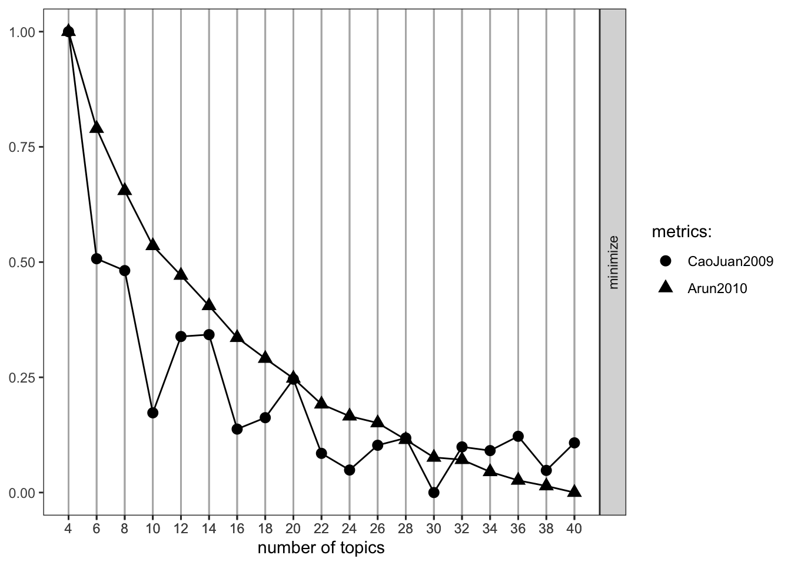
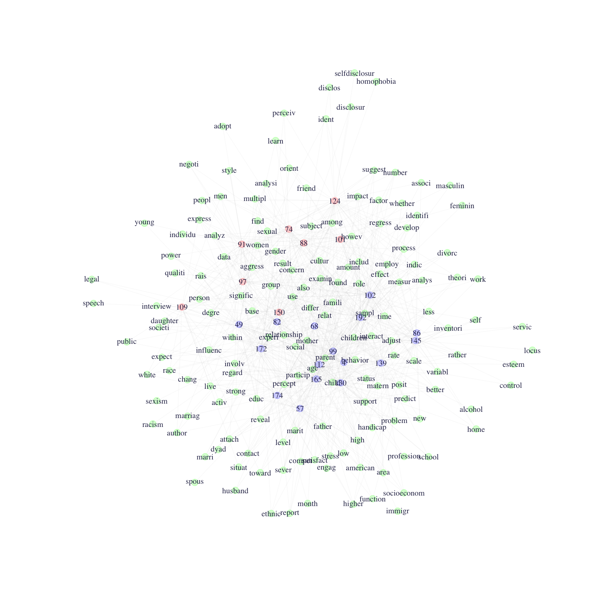

# 12, Part 1. Cultural Structures {.unnumbered #ch12-Networks-Structure-Culture-text-R}

This is the first tutorial for Chapter 12, covering the application of network ideas to the analysis of cultural data. This tutorial will build directly on the material from Chapter 11, on two-mode data. In [Chapter 11](#ch11-Two-mode-Networks), we analyzed typical affiliation data, where the rows were actors and the columns organizations. In this tutorial, we will be working with textual data, applying the ideas of duality to a very different kind of data source, one based on words in documents. We will walk through the basics of topic modeling in R. Topic modeling is a natural language processing technique that uncovers the latent topics that structure the words used in a set of documents.  We will cover the following: basic data management of textual data; modeling textual data using LDA (latent Dirichlet allocation); and representing textual data as a network.

For our empirical case, we analyze textual data based on a set of sociology abstracts (drawn from recent dissertations). We are interested in discovering the latent topics that exist in the data, where each topic is defined by having a distinct pattern of words associated with it. We are also interested in seeing which abstracts get placed together and why. In this way we are trying to uncover the underlying structure of the field of sociology (as represented in abstracts), where certain words and researchers are associated with a topic and certain topics are closer to each other than others. We thus see the intuition of a network approach played out using textual data. As this is a textbook on network analysis, we will not focus on the technical details of topic modeling; instead, we will focus on the substantive application of network ideas to textual data. For those interested in more technical details on topic models, see the **topicmodels** [documentation](https://cran.r-project.org/web/packages/topicmodels/vignettes/topicmodels.pdf). And for information on text mining and textual analysis in general, see @Feinerer2008.

## Getting the Data Ready
We will need a number of packages to analyze our textual data, here dissertation abstracts in sociology. We will need: **NLP** (basic processing of natural language), **tm** (text mining package), **SnowballC** (word stemming package), **topicmodels** (package for modeling the topics), and **ldatuning** (package for evaluating the models). Let's go ahead and load them all.


```r
library(NLP)
library(tm)
library(SnowballC)
library(topicmodels) 
library(ldatuning) 
```

Note that topic modeling is computationally heavy and can require a long run time. The data we will use for this lab is only a very small (random) sample of the original corpus of dissertations. If this was an analysis for an actual paper, we would want to use the whole set of data, or at least a much larger sample.  Let's read in the data, treating our text strings as strings rather than as categories:


```r
url1 <- "https://github.com/JeffreyAlanSmith/Integrated_Network_Science/raw/master/data/sociologysample.csv"

abstracts <- read.csv(file = url1, stringsAsFactors = FALSE)
```

We can use the `str()` function to take a look at the data.


```r
str(abstracts) 
```

```
## 'data.frame':	199 obs. of  2 variables:
##  $ obs : int  39628 39745 49780 18794 17548 6848 34226 12683 1170 34437 ...
##  $ text: chr  "Ontogenic variables, such as the experience of the parent's abuse as a child and current_depression or substanc"| __truncated__ "This study_analyzes attitudes of area residents toward mineral_extraction and processing in the Northern Great_"| __truncated__ "This dissertation is an experiment in thinking with the story, not about the story in order to erase_the_bounda"| __truncated__ "The concepts of parent_empowerment and participation, currently popular in the disability field, that emerge fr"| __truncated__ ...
```

We see there are two columns (`obs` and `text`), the first for the observation and the second for the actual text of the abstract. There are 199 abstracts in the data. For example, let’s look at the text of the first abstract. 


```r
abstracts[1, "text"] 
```

```
## [1] "Ontogenic variables, such as the experience of the parent's abuse as a child and current_depression or substance abuse, were expected_to_have_a_greater_impact on the risk of child_abuse than microsystem and exosystem_variables such as family functioning, domestic violence, income, community safety, and social support. It was expected that social_support would have the greatest_impact of these broader system variables. It is believed that attachment_style_mediates the relationship between the ontogenic system level and microsystem/exosystem level variables. Secondary data were used to examine these systemic impacts. The dataset was obtained from the National_Data_Archive on Child Abuse and Neglect. The sample_consisted of 265 women, the majority of whom were African-American and who had a high_school_education or GED. The majority of these women were employed, while others were in school or a training_program at the time of the interview. Over 50 percent_of_the_sample had never been married. A multiple_regression_analysis_was_conducted_to_examine_the_impact of factors from three systems levels on the risk of child abuse. Variables were entered into the multiple_regression equation after they had demonstrated significance in bi-variate analyses with Bonferroni corrections. Mother's age was entered first in this equation in order to control for any potential effect of this variable as it has been shown_to_be_significantly_related_to_risk of abuse. Entered in the second step were the ontogenic variables found to be significant: depression and locus of control. In the third and final step, the microsystem and exosystem_variables found_to_have_a_significant_impact on the risk of abuse were entered: the number of social supports available to the mother, the mother's assessment_of_family_functioning and the frequency of domestic_violence perpetrated against her. Locus of control and mother's depression were demonstrated to be the most important predictors in the equation. Domestic violence_and_social_support were the next most important predictors, with family_functioning becoming non-significant in this equation. This supports the hypothesis that ontogenic variables have the greater_impact in predicting risk of physical abuse. A path_analysis_was_conducted_in_order_to_examine the possible time order and causal_nature of these variables. All variables were included in this analysis. The only variables found to impact the risk of physical_abuse were depression and locus of control. The only route from experiencing childhood_sexual_abuse to the risk of committing child_physical_abuse was through the level of depression currently being experienced by the mother. Mother's locus_of_control impacted the risk of abuse directly as well as through its impact on depression. Risk of abuse was not influenced directly by the experience_of_sexual abuse."
```

We can see that this is literally the text of the dissertation abstract, word for word. This is the data that we want to analyze. Before we can analyze the data, we need to create a corpus based on the words used in the abstracts. We basically need to transform the raw text data into a set of words (for each abstract) that are directly comparable across abstracts. We want to know which words are used together frequently and which abstracts are using which words. We thus need to have the data in a format where such comparisons are possible. By creating a Corpus object from our abstracts, we will be able to use various functions in R that are designed to standardize text data.

Here we will use a `Corpus()` function. Note that the `Corpus()` function will not take text data directly as input. We thus need to use a `VectorSource()` function within the main function, with the input as the text of interest (`abstracts$text`).


```r
abstracts_corp <- Corpus(VectorSource(abstracts$text))
```


```r
length(abstracts_corp)
```

```
## [1] 199
```

The length is 199, one for each of the abstracts in our original data. It will be useful to clean the corpus a bit before we actually try to analyze it. Textual data can be messy. We need to make the inputs (abstracts in this case) as uniform as possible, to facilitate comparison. We will go through a series of steps on how to streamline the textual data, making the abstracts consistent and informative. For example, let's change everything to lower case. If one dissertation uses the word "network" and another uses "Network", we don’t want to treat them as having used different words. We will make use of the `tm_map()` function to clean up the corpus. The inputs are the corpus and the function we want to use (telling R how to change the text). Here we will set the function to tolower.


```r
abstracts_corp <- tm_map(abstracts_corp, tolower)
```

Let's take a look at the first abstract:


```r
abstracts_corp[[1]]$content
```

```
## [1] "ontogenic variables, such as the experience of the parent's abuse as a child and current_depression or substance abuse, were expected_to_have_a_greater_impact on the risk of child_abuse than microsystem and exosystem_variables such as family functioning, domestic violence, income, community safety, and social support. it was expected that social_support would have the greatest_impact of these broader system variables. it is believed that attachment_style_mediates the relationship between the ontogenic system level and microsystem/exosystem level variables. secondary data were used to examine these systemic impacts. the dataset was obtained from the national_data_archive on child abuse and neglect. the sample_consisted of 265 women, the majority of whom were african-american and who had a high_school_education or ged. the majority of these women were employed, while others were in school or a training_program at the time of the interview. over 50 percent_of_the_sample had never been married. a multiple_regression_analysis_was_conducted_to_examine_the_impact of factors from three systems levels on the risk of child abuse. variables were entered into the multiple_regression equation after they had demonstrated significance in bi-variate analyses with bonferroni corrections. mother's age was entered first in this equation in order to control for any potential effect of this variable as it has been shown_to_be_significantly_related_to_risk of abuse. entered in the second step were the ontogenic variables found to be significant: depression and locus of control. in the third and final step, the microsystem and exosystem_variables found_to_have_a_significant_impact on the risk of abuse were entered: the number of social supports available to the mother, the mother's assessment_of_family_functioning and the frequency of domestic_violence perpetrated against her. locus of control and mother's depression were demonstrated to be the most important predictors in the equation. domestic violence_and_social_support were the next most important predictors, with family_functioning becoming non-significant in this equation. this supports the hypothesis that ontogenic variables have the greater_impact in predicting risk of physical abuse. a path_analysis_was_conducted_in_order_to_examine the possible time order and causal_nature of these variables. all variables were included in this analysis. the only variables found to impact the risk of physical_abuse were depression and locus of control. the only route from experiencing childhood_sexual_abuse to the risk of committing child_physical_abuse was through the level of depression currently being experienced by the mother. mother's locus_of_control impacted the risk of abuse directly as well as through its impact on depression. risk of abuse was not influenced directly by the experience_of_sexual abuse."
```

We can see all the words are now lower case. We also need to deal with some odd mistakes in the data. We can see from the first abstract that the raw textual data sometimes has multiple words stuck together. For example, in the first abstract current and depression are put together as current_depression. That does not yield a meaningful word, so we need to split those words up into separate words, whenever that happens. In this case, we need to write our own little function (called `split_words()`) to perform this task. This function will make use of `content_transformer()`, which is a function used to create text transformations that are not already built into R. Here, we will write a little function within `content_transformer()` that will find all the _ and replace them with a space. This is accomplished using the `gsub()` function. The main arguments to `gsub()` are pattern (the pattern to look for) and replacement (the replacement text for the specified pattern). x is the text of interest.  


```r
gsub_function <- function(x, pattern) gsub(pattern, replacement = " ", x)
split_words <- content_transformer(gsub_function)
```

And here we apply our function to the corpus using `tm_map()`.


```r
abstracts_corp <- tm_map(abstracts_corp, split_words, pattern = "_")
```

Let’s check to make sure it worked, looking at the first abstract:


```r
abstracts_corp[[1]]$content 
```

```
## [1] "ontogenic variables, such as the experience of the parent's abuse as a child and current depression or substance abuse, were expected to have a greater impact on the risk of child abuse than microsystem and exosystem variables such as family functioning, domestic violence, income, community safety, and social support. it was expected that social support would have the greatest impact of these broader system variables. it is believed that attachment style mediates the relationship between the ontogenic system level and microsystem/exosystem level variables. secondary data were used to examine these systemic impacts. the dataset was obtained from the national data archive on child abuse and neglect. the sample consisted of 265 women, the majority of whom were african-american and who had a high school education or ged. the majority of these women were employed, while others were in school or a training program at the time of the interview. over 50 percent of the sample had never been married. a multiple regression analysis was conducted to examine the impact of factors from three systems levels on the risk of child abuse. variables were entered into the multiple regression equation after they had demonstrated significance in bi-variate analyses with bonferroni corrections. mother's age was entered first in this equation in order to control for any potential effect of this variable as it has been shown to be significantly related to risk of abuse. entered in the second step were the ontogenic variables found to be significant: depression and locus of control. in the third and final step, the microsystem and exosystem variables found to have a significant impact on the risk of abuse were entered: the number of social supports available to the mother, the mother's assessment of family functioning and the frequency of domestic violence perpetrated against her. locus of control and mother's depression were demonstrated to be the most important predictors in the equation. domestic violence and social support were the next most important predictors, with family functioning becoming non-significant in this equation. this supports the hypothesis that ontogenic variables have the greater impact in predicting risk of physical abuse. a path analysis was conducted in order to examine the possible time order and causal nature of these variables. all variables were included in this analysis. the only variables found to impact the risk of physical abuse were depression and locus of control. the only route from experiencing childhood sexual abuse to the risk of committing child physical abuse was through the level of depression currently being experienced by the mother. mother's locus of control impacted the risk of abuse directly as well as through its impact on depression. risk of abuse was not influenced directly by the experience of sexual abuse."
```

It looks right. We can see that current and depression are now separate words, rather than current_depression. Let’s do a similar splitting based on words put together with a /.


```r
abstracts_corp <- tm_map(abstracts_corp, split_words, pattern = "/")
```

Let's also remove punctuation as this is not substantively useful. The function here is `removePunctation()`. This will take out commas, periods, apostrophes and so on.  In this case we do not need to use a content_transformer function as `removePunctuation()` is a built-in transformation in the **tm** package. 


```r
abstracts_corp <- tm_map(abstracts_corp, removePunctuation)
```

Let's also remove all of the numbers from the corpus.


```r
abstracts_corp <- tm_map(abstracts_corp, removeNumbers)
```

Now let's designate a set of words to remove. For example, we may want to remove commonly used words that don't add much to differentiate word use in the abstracts. For example, if everyone uses "is" it may make sense to remove it from all abstracts. Here we can use the `stopwords()` function (set to english) to get commonly used words. 


```r
stopwords("english")
```

```
##   [1] "i"          "me"         "my"         "myself"     "we"         "our"        "ours"       "ourselves"  "you"        "your"       "yours"      "yourself"   "yourselves" "he"         "him"        "his"        "himself"    "she"        "her"        "hers"       "herself"    "it"        
##  [23] "its"        "itself"     "they"       "them"       "their"      "theirs"     "themselves" "what"       "which"      "who"        "whom"       "this"       "that"       "these"      "those"      "am"         "is"         "are"        "was"        "were"       "be"         "been"      
##  [45] "being"      "have"       "has"        "had"        "having"     "do"         "does"       "did"        "doing"      "would"      "should"     "could"      "ought"      "i'm"        "you're"     "he's"       "she's"      "it's"       "we're"      "they're"    "i've"       "you've"    
##  [67] "we've"      "they've"    "i'd"        "you'd"      "he'd"       "she'd"      "we'd"       "they'd"     "i'll"       "you'll"     "he'll"      "she'll"     "we'll"      "they'll"    "isn't"      "aren't"     "wasn't"     "weren't"    "hasn't"     "haven't"    "hadn't"     "doesn't"   
##  [89] "don't"      "didn't"     "won't"      "wouldn't"   "shan't"     "shouldn't"  "can't"      "cannot"     "couldn't"   "mustn't"    "let's"      "that's"     "who's"      "what's"     "here's"     "there's"    "when's"     "where's"    "why's"      "how's"      "a"          "an"        
## [111] "the"        "and"        "but"        "if"         "or"         "because"    "as"         "until"      "while"      "of"         "at"         "by"         "for"        "with"       "about"      "against"    "between"    "into"       "through"    "during"     "before"     "after"     
## [133] "above"      "below"      "to"         "from"       "up"         "down"       "in"         "out"        "on"         "off"        "over"       "under"      "again"      "further"    "then"       "once"       "here"       "there"      "when"       "where"      "why"        "how"       
## [155] "all"        "any"        "both"       "each"       "few"        "more"       "most"       "other"      "some"       "such"       "no"         "nor"        "not"        "only"       "own"        "same"       "so"         "than"       "too"        "very"
```

Here we remove any word in that list from each abstract using the `removeWords()` function.


```r
abstracts_corp <- tm_map(abstracts_corp, removeWords, stopwords("english"))
```

Now, let's add a few more words to our stopword list. Again, we want to remove words that are not differentiating for the corpus at hand (here abstracts from sociology dissertations). We will add the following words that were not in the default stop list. 


```r
myStopwords <- c("dissertation", "chapter", "chapters", "research", 
                 "researcher" ,"researchers" ,"study", "studies", 
                 "studied", "studys", "studying", "one", "two", "three")
```

We tried to include words that are not informative for this corpus, as they are generic and widely used. For example, many abstracts may mention a "chapter one" but that does not make it substantively important that chapter and one are used together frequently.  We could, of course, imagine a slightly different list, and we must be aware that are our results will differ if we exclude different words. We now go ahead and remove those words from the corpus. 


```r
abstracts_corp <- tm_map(abstracts_corp, removeWords, myStopwords)
```

Now, let's take out any redundant whitespace between words using the `stripWhitespace()` function. 


```r
abstracts_corp <- tm_map(abstracts_corp, stripWhitespace)
```

Finally, we will stem the document using a `stemDocument()` function. This reduces similar words to a single stem word. For example, test and testing would be reduced to test. The idea is that they convey the same basic meaning and should be treated as the same. 


```r
abstracts_corp <- tm_map(abstracts_corp, stemDocument)
```

Let's again take a look at the first abstract: 


```r
abstracts_corp[[1]]$content
```

```
## [1] "ontogen variabl experi parent abus child current depress substanc abus expect greater impact risk child abus microsystem exosystem variabl famili function domest violenc incom communiti safeti social support expect social support greatest impact broader system variabl believ attach style mediat relationship ontogen system level microsystem exosystem level variabl secondari data use examin system impact dataset obtain nation data archiv child abus neglect sampl consist women major africanamerican high school educ ged major women employ other school train program time interview percent sampl never marri multipl regress analysi conduct examin impact factor system level risk child abus variabl enter multipl regress equat demonstr signific bivari analys bonferroni correct mother age enter first equat order control potenti effect variabl shown signific relat risk abus enter second step ontogen variabl found signific depress locus control third final step microsystem exosystem variabl found signific impact risk abus enter number social support avail mother mother assess famili function frequenc domest violenc perpetr locus control mother depress demonstr import predictor equat domest violenc social support next import predictor famili function becom nonsignific equat support hypothesi ontogen variabl greater impact predict risk physic abus path analysi conduct order examin possibl time order causal natur variabl variabl includ analysi variabl found impact risk physic abus depress locus control rout experienc childhood sexual abus risk commit child physic abus level depress current experienc mother mother locus control impact risk abus direct well impact depress risk abus influenc direct experi sexual abus"
```

After all of this you end up with a string of word stems with many common words removed. This is done for each input (here abstract) in the corpus. Note that the cleaning process is fraught with difficulties. For example, stemming is far from perfect and can lead to some unexpected results. For example, experiment and experience have the same stem (experi) while child and children do not. This could be what you want, but it may not. More generally, synonyms will not be treated as the same word (i.e., stemming will not capture the idea that kid and child are often used to capture similar ideas). Similarly, we have to be careful about the choice of words to include in the stop list. We want to remove words that are not differentiating, but how long of a list we should construct and which words should be included are difficult (context-specific) questions. 

Assuming we are satisfied with the cleaning process, we are now in a position to create a document-term matrix. We need to create a document-term matrix as this will serve as input to our LDA model, where the words and abstracts are placed into latent topics. The document-term matrix is a complex object, capturing how many times each document (the rows) used a particular term (the columns). We will use a `DocumentTermMatrix()` function, with the corpus as input.  


```r
abstracts_dtm <- DocumentTermMatrix(abstracts_corp)
```


```r
abstracts_dtm
```

```
## <<DocumentTermMatrix (documents: 199, terms: 4298)>>
## Non-/sparse entries: 20228/835074
## Sparsity           : 98%
## Maximal term length: 25
## Weighting          : term frequency (tf)
```

We can see that there are 199 documents and 4298 unique terms in our document-term matrix. The values in the matrix correspond to the number of times each document (i.e., abstract) used a given term (i.e., word). 20228 of the values in the matrix are non-sparse, or greater than 1, and 835074 are sparse, equal to 0; where a 0 means that the document did not use the term.  Thus, about 98% of the possible 'ties' between documents and terms do not actually exist (`835074 / (20228 + 835074)`), suggesting that many words are not used widely across abstracts. We also see that the longest word in the corpus is length 25 (i.e., 25 letters).

We can use the `inspect()` function to take a look at particular documents or terms. Here we look at the first abstract:


```r
inspect(abstracts_dtm[1, ]) 
```

```
## <<DocumentTermMatrix (documents: 1, terms: 4298)>>
## Non-/sparse entries: 114/4184
## Sparsity           : 97%
## Maximal term length: 25
## Weighting          : term frequency (tf)
## Sample             :
##     Terms
## Docs abus child control depress enter impact mother risk support variabl
##    1   14     5       5       6     4      9      6    9       5      12
```

By default, inspect will print the top ten terms used. We can see here that the first document used the word 'abus' 14 times, 'child' 5 times, and so on.  We can also use inspect to look at the columns. Here we look at the top ten documents that use the term risk:


```r
inspect(abstracts_dtm[, "risk"]) 
```

```
## <<DocumentTermMatrix (documents: 199, terms: 1)>>
## Non-/sparse entries: 11/188
## Sparsity           : 94%
## Maximal term length: 4
## Weighting          : term frequency (tf)
## Sample             :
##      Terms
## Docs  risk
##   1      9
##   116    1
##   117    2
##   118    1
##   143    1
##   173    1
##   19     1
##   53     2
##   63     1
##   75     1
```

We can see that the term 'risk' is used 9 times in the first document, 1 time in the 116th document and so on. 

We can also use the `Terms()` function to get all of the terms (i.e., words) used and the `Docs()` function to get all of the document ids (here abstracts). Here we look at the first 6 terms.


```r
head(Terms(abstracts_dtm))
```

```
## [1] "abus"            "africanamerican" "age"             "analys"          "analysi"         "archiv"
```

Finally, it may be of use to extract the actual matrix from the document-term matrix. Here we apply `as.matrix()` on the document-term matrix:


```r
mat_abstract_words <- as.matrix(abstracts_dtm)
```


```r
dim(mat_abstract_words)
```

```
## [1]  199 4298
```

We can see there are 199 rows (documents) and 4298 columns (terms).  And let's take a look at the first five rows and columns:


```r
mat_abstract_words[1:5, 1:5]
```

```
##     Terms
## Docs abus africanamerican age analys analysi
##    1   14               1   1      1       3
##    2    0               0   0      0       3
##    3    1               0   0      0       3
##    4    0               0   0      0       0
##    5    0               0   0      1       0
```

We can see, for example, that the first document used 'abus' 14 times (same as we saw above). We can take this matrix and calculate summary measures. For example, we can calculate how many different terms the first document used (by asking how many times the first row of the matrix is greater than 0):


```r
sum(mat_abstract_words[1, ] > 0)
```

```
## [1] 114
```

Note that the document-term matrix is analogous to the affiliation matrices we saw in the previous tutorial, where students were on the rows and clubs were on the columns. Here, with textual data, we have documents on the rows and terms on the columns.

## Topic Modeling 
Now, we want to analyze our document-term matrix, applying topic models to the text-based data. We will utilize LDA, latent Dirichlet allocation. LDA attempts to uncover the underlying, or latent, topics in the corpus of interest. Different (latent) topics create different word use and we can use the co-occurrence of words in a document to uncover which words hang together under a given topic. A topic will have a high probability of yielding a set of words when those words are used together at high rates. In a similar way, we can ask which abstracts are likely to fall into which topic, based on their distribution of word choice. In many ways, this is conceptually similar to the positional analysis from [Chapter 10](#ch10-Positions-Roles-R), where nodes were placed in the same position if they had the same pattern of ties to other nodes. Here, two abstracts are likely to be in the same topic if they use the same set of words. 

### LDA: Initial Model
We need to set a few parameters before we can run the model. LDA utilizes Gibbs sampling, a randomized algorithm for obtaining a sequence of observations from a multivariate probability distribution. This sequence will be used to approximate the joint distribution of topics and words. Here we set the key inputs to the algorithm: 


```r
burnin <- 200 # number of omitted Gibbs iterations at beginning
iter <- 3000 # number of iterations
thin <- 2000 # number of omitted iterations between each kept iteration 
seed <- list(2003, 5,63, 100001, 765) #seeds to enable reproducibility
nstart <- 5 # number of repeated random starts
best <- TRUE # only continue model on the best model
```

The model also requires that a researcher set the number of topics prior to estimation (similar to setting the number of clusters in [Chapter 10](#ch10-Positions-Roles-R)). Here we will set the number at 5, noting that this is a pretty arbitrary choice. We will consider more principled ways of setting the number of topics below. 


```r
k <- 5
```

Now we are ready to run LDA using Gibbs sampling. The function is `LDA()`. The main arguments are:

- x = document term matrix
- k = number of topics
- method = either VEM or Gibbs
- control = list of control input 


```r
ldaOut <- LDA(x = abstracts_dtm, k = k, method = "Gibbs", 
              control=list(nstart = nstart, seed = seed, best = best,
                           burnin = burnin, iter = iter, thin = thin))
```

Now let's explore the results. First, we can use a `topics()` function to extract the most likely topic for each abstract. 


```r
ldaOut_topics <- topics(ldaOut)
```


```r
head(ldaOut_topics)
```

```
## 1 2 3 4 5 6 
## 1 2 5 1 2 5
```

This suggests that the first abstract is most likely to fall into topic 1, the second is likely to fall into topic 2 and so on. We can also extract more nuanced information, looking at the probabilities of each abstract going into each latent topic. Thus, rather than just looking at the most likely topic, we can see the relative probability of a given abstract belonging to a given topic. The probabilities can be extracted using `@gamma` on the model object:


```r
topicProbabilities <- ldaOut@gamma
```


```r
head(topicProbabilities)
```

```
##            [,1]       [,2]      [,3]      [,4]       [,5]
## [1,] 0.59589041 0.09246575 0.1404110 0.1061644 0.06506849
## [2,] 0.11111111 0.32659933 0.2053872 0.2424242 0.11447811
## [3,] 0.09623431 0.14225941 0.1589958 0.1715481 0.43096234
## [4,] 0.22147651 0.20805369 0.1610738 0.1946309 0.21476510
## [5,] 0.11034483 0.61379310 0.1000000 0.1000000 0.07586207
## [6,] 0.14644351 0.17991632 0.1799163 0.1422594 0.35146444
```

We can see that the first abstract has a 0.596 probability of being in topic 1 and much lower probabilities for the other topics. Of course, at this point we do not know anything about what the latent topics correspond to. So, let's go ahead and take a look at the topics. Here we will look at the most likely words associated with each latent topic. This amounts to finding the probability that a given topic will yield a given word and selecting those words with the highest probability. We use the `terms()` function with the lda object as input, as well as the number of terms to consider (here set to 10). 


```r
ldaOut_terms <- terms(ldaOut, 10)
```


```r
ldaOut_terms
```

```
##       Topic 1        Topic 2     Topic 3    Topic 4    Topic 5   
##  [1,] "parent"       "state"     "social"   "women"    "cultur"  
##  [2,] "famili"       "polit"     "model"    "student"  "ident"   
##  [3,] "children"     "organ"     "work"     "educ"     "social"  
##  [4,] "relationship" "communiti" "use"      "particip" "ethnic"  
##  [5,] "behavior"     "develop"   "interact" "american" "examin"  
##  [6,] "mother"       "servic"    "theori"   "role"     "nation"  
##  [7,] "support"      "system"    "relat"    "school"   "within"  
##  [8,] "signific"     "econom"    "develop"  "black"    "case"    
##  [9,] "child"        "polici"    "effect"   "group"    "practic" 
## [10,] "result"       "local"     "individu" "experi"   "movement"
```

We can see that topic 4 (for example) yields words like women, student and education, while topic 1 yields words like parent, family, and children. Note that we can get the actual probabilities for the terms using the `posterior()` function. More generally, it is important to see that the topics are simultaneously constituted by the set of words that are used together and the abstracts that tend to use those words, analogous to the ideas explored in the tutorial on two-mode, affiliation networks.  

### LDA: Picking the Number of Topics
Our initial analysis set the number of latent topics to 5. But we could just as easily have used a different number, yielding a different set of results. The issue of how to determine the appropriate numbers of topics is a difficult one, in part, because there is no single, universally accepted way of doing this. One approach is to redo the analysis using different numbers of topics, interpreting the latent topics at different scales, or resolutions. A quick overview of a corpus may require 10 topics, while something more refined may require 25. We may need 100 topics for a really detailed topical inspection. This strategy is fairly robust (as one does not have to pick a single number of topics) but is also somewhat unsatisfying. It would be nice to have a simple set of results that we can point to as our best estimate of what the true latent topics are. For this, we need a systematic way of finding the optimal number of topics for the corpus. Here we can make use of the functions in the ldatuning package. The basic idea is to rerun the model using increasingly higher number of topics. As k increases, we calculate different fit statistics as a means of comparison, eventually picking the one with the best fit. There are a number of possible fit statistics we could use. Here we utilize two, one suggested by @Arun2010 and the other by @Juan2009. For example, @Arun2010 suggest selecting the model (i.e., number of latent topics) that minimizes the cosine distance between topics. The main function is `FindTopicNumber()`. The main arguments are:

- dtm = document-term matrix
- topics = vector of number of topics to consider
- metrics = which metrics to use to evaluate different topic numbers
- method = estimation routine, same as with LDA
- control = list of controls, same as with LDA
- mc.cores = number of cores to utilize

Here, we rerun the model, varying the number of topics from 4 to 40 (doing it every other number to save time). We set the metrics to "CaoJuan2009" and "Arun2010". Note that this can take a bit to run. 


```r
fitmodel <- FindTopicsNumber(dtm = abstracts_dtm, 
                             topics = seq(from = 4, to = 40, by = 2), 
                             metrics = c("CaoJuan2009", "Arun2010"), 
                             method = "Gibbs", 
                             control = list(nstart = 1, seed = c(30), 
                                            best = best, burnin = burnin, 
                                            iter = iter, thin = thin), 
                             mc.cores = 2,  verbose = TRUE)
```


```r
fitmodel
```

```
##    topics CaoJuan2009 Arun2010
## 1      40  0.06359749 322.2180
## 2      38  0.06015966 325.9417
## 3      36  0.06441433 329.1180
## 4      34  0.06263168 333.9887
## 5      32  0.06309096 340.8725
## 6      30  0.05739855 342.1717
## 7      28  0.06420134 352.2448
## 8      26  0.06329599 361.7429
## 9      24  0.06020666 365.6039
## 10     22  0.06228409 372.4103
## 11     20  0.07153718 387.0902
## 12     18  0.06673595 398.3489
## 13     16  0.06531436 410.1995
## 14     14  0.07709557 428.3069
## 15     12  0.07686266 445.5500
## 16     10  0.06734270 462.3836
## 17      8  0.08508528 493.6755
## 18      6  0.08656703 528.9791
## 19      4  0.11489348 584.0326
```

Once we fit the model under different numbers of topics, we can go ahead and plot the fit statistics. The function is `FindTopicsNumber_plot()`.


```r
FindTopicsNumber_plot(fitmodel) 
```



Based on our two fit statistics of interest, we might choose a number of topics around 30. The Arun statistic is technically minimized at 40, but given that the CaoJaun fit statistic gets worse after 30 (and the Arun statistic has basically plateaued at this point), we may be in better shape using k at 30. If we were interested in examining a less disaggregated solution, setting k to 10 or 16 would be appropriate. We will now go ahead and rerun the same model as before (with the original control parameters) but set k to 30.


```r
k <- 30

ldaOut2 <- LDA(x = abstracts_dtm, k = k, method = "Gibbs", 
              control = list(nstart = nstart, seed = seed, best = best,
                             burnin = burnin, iter = iter, thin = thin))
```

And now let's look at the results. We will focus on the terms, showing the most likely terms for each topic (i.e., the terms that each topic is most likely to yield). 


```r
ldaOut_terms2 <- terms(ldaOut2, 10)
```

Let's look at a few example columns (out of the 30 total): 


```r
ldaOut_terms2[, c(2, 14, 20, 23, 24)]
```

```
##       Topic 2     Topic 14    Topic 20       Topic 23 Topic 24  
##  [1,] "involv"    "japanes"   "parent"       "women"  "program" 
##  [2,] "school"    "technolog" "children"     "sexual" "use"     
##  [3,] "educ"      "resourc"   "mother"       "men"    "data"    
##  [4,] "parent"    "right"     "child"        "gender" "effect"  
##  [5,] "particip"  "firm"      "famili"       "style"  "measur"  
##  [6,] "interview" "japan"     "relationship" "experi" "influenc"
##  [7,] "teacher"   "arrow"     "adjust"       "race"   "find"    
##  [8,] "scienc"    "foreign"   "support"      "also"   "perform" 
##  [9,] "percept"   "learn"     "age"          "famili" "high"    
## [10,] "learn"     "invest"    "matern"       "factor" "increas"
```

What can we conclude substantively from our analysis? First, we can see that some of these topics are easier to interpret than others. Topic 2, for example, clearly centers on school outcomes (school, education, involve, parent). Other topics are a bit harder to parse, and may be an indication that we need to take another look at our model (or text cleaning decisions). For example, Topic 24 is defined by pretty broad, general terms (program, use, data, effect) and is not easy to label. In such cases, it may be useful to examine the abstracts directly to understand why they had been put together. Second, we can see that many of the topics do seem to center on recognizable research areas in the discipline. Topic 23, for example, is about women, gender and sexuality, while Topic 20 focuses on the family. Other topics cover more narrowly defined areas, like Topic 14 that is centered on Japan and investment firms. As a researcher, we would want to walk through the latent topics, interpreting each one and drawing out the larger implications for the substantive case in question. Given these kinds of results, a researcher could also try to predict which researchers fall into which latent topic; for example, based on type of university they attended, gender, etc. Similarly, we could ask how being in a given topic is associated with later career success (i.e., finding a job after graduation).

## A Network Representation
A researcher may also be interested in producing a network representation of the textual data. This makes it possible to apply network measures, models and visualizations to the corpus. So far we have cleaned the data, modeled the data using LDA but we have not explicitly constructed a network object. Here we go ahead and do that, creating a two-mode network of abstracts by words. Let’s load the **igraph** package. 


```r
library(igraph)
```

We will make use of the abstracts by words matrix extracted earlier. Let’s take a look at the first five rows and columns. The values in the matrix show the number of times that abstract used that word. 


```r
mat_abstract_words[1:5, 1:5] 
```

```
##     Terms
## Docs abus africanamerican age analys analysi
##    1   14               1   1      1       3
##    2    0               0   0      0       3
##    3    1               0   0      0       3
##    4    0               0   0      0       0
##    5    0               0   0      1       0
```

In this case, let’s focus on just a subset of the full matrix. We will look at the network of abstracts and words associated with topic 20 ("family") and topic 23 ("gender").  Thus, we are using the LDA results above (specifically the latent topics) to inform our analysis here. Let’s grab the vector showing which topic each abstract is most likely to be in. 


```r
ldaOut_topics2 <- topics(ldaOut2)
```

Now we subset the full abstract-word matrix to just include those abstracts that are most likely to be in topic in 20 or 23. 

```r
in_20_23 <- ldaOut_topics2 %in% c(20, 23)
mat_abstract_words_subset <- mat_abstract_words[in_20_23, ]
```

Let’s also reduce the words a bit as well. We will only consider words that are used frequently in topics 20 and 23. This will simplify the picture, eliminating words that are not so relevant for these two topics. Here we calculate the number of times each word was used.


```r
worduse <- colSums(mat_abstract_words_subset)
```

Let’s only keep those words that were used more than 5 times.


```r
mat_abstract_words_subset <- mat_abstract_words_subset [, worduse > 5]
```


```r
dim(mat_abstract_words_subset)
```

```
## [1]  24 159
```

We have now reduced our matrix to 24 abstracts and 159 words. We are now in a position to construct the abstract-word network. We will construct a two-mode network, where there are two types of nodes (abstracts and words) and abstracts are connected to words (and vice versa) but there are no direct ties between nodes of the same type. An edge exists if abstract i used word j. We will use the `graph_from_incidence()` function, setting mode to all (creating mutual connections between abstract and words) and keeping the weights (based on the number of times that abstract i used word j). 


```r
abstract_word_net <- graph_from_incidence_matrix(mat_abstract_words_subset,
                                                 mode = "all", weighted = T)
```

We will now grab the vertex attribute `type` from the two-mode graph object:


```r
type <- vertex_attr(abstract_word_net, "type") 
```


```r
table(type)  
```

```
## type
## FALSE  TRUE 
##    24   159
```

We see that there are 24 abstracts (FALSE) and 159 words (TRUE). Now, let’s go ahead and plot the network, to see what we can learn from turning the textual data into a network. We first set some plotting parameters. Let’s first set the words green: 


```r
V(abstract_word_net)$color[type == TRUE] <- rgb(red = 0, green = 1, 
                                                blue = 0, alpha = .2) 
```

Note that we just change the color for those nodes where `type` is equal to TRUE (the words). Now let’s set the color for the abstracts. Here we want to differentiate the two topics. Let’s color topic 20 (family) blue and topic 23 (gender) red. In order to do this we need to identify which of the abstracts are in topic 20 and which are in topic 23. We must also remember that many of the nodes are words (`type` equal to TRUE). First, let’s get the names of the abstracts in each topic:


```r
in20 <- names(which(ldaOut_topics2 == 20))
in23 <- names(which(ldaOut_topics2 == 23))
```

Now we set all those in topic 20 to blue:


```r
which_topic20 <- V(abstract_word_net)$name %in% in20
V(abstract_word_net)$color[which_topic20] <- rgb(red = 0, green = 0, 
                                                 blue = 1, alpha = .2)
```

Note that we grabbed the vertex names from the network and then asked which matched those in topic 20. And here we do the same thing with topic 23, setting it to red. 


```r
which_topic23 <- V(abstract_word_net)$name %in% in23
V(abstract_word_net)$color[which_topic23] <- rgb(red = 1, green = 0, 
                                                blue = 0, alpha = .2)
```

 Now we'll set some other plotting arguments.
 

```r
V(abstract_word_net)$label <- V(abstract_word_net)$name
V(abstract_word_net)$label.color <- rgb(0, 0, .2, .85)
V(abstract_word_net)$label.cex <- .75
V(abstract_word_net)$size <- 3
V(abstract_word_net)$frame.color <- V(abstract_word_net)$color
```

Here we set the color of the edges.


```r
E(abstract_word_net)$color <- rgb(.5, .5, .5, .04)
```

And now we plot the network. 


```r
set.seed(106)
plot(abstract_word_net, layout = layout_with_fr)
```



What can we learn from the graph? First, we can see that the blue nodes (topic 20) tend to cluster together and the red nodes (topic 23) tend to cluster together. This suggests that the topics found in the LDA do appear to capture meaningful distinctions amongst the abstracts. 

Second, we can see that there is a set of core words associated with each topic. We see words like family, children, relationship, parent, and mother cluster together close to the blue nodes, those in topic 20.  We see words like women, gender, and sexuality cluster together close to the red nodes, those in topic 23. This is in line with our previous analysis but here we get the results arranged in a spatial layout. 

Third, we see that some the abstracts are on the periphery of the network. For example, abstract 109 (in topic 23) does not use the words at the core of the network very heavily. Instead, abstract 109 uses words like legal and speech that are rarely used by any of the abstracts in the gender (or family) topic. 

Fourth, the plot makes clear that there is at least some overlap in usage of words across these topics. Most of the blue nodes (the abstracts in topic 20) and the red nodes (abstracts in topic 23) are reasonably close together in the plot and the plot as a whole is quite dense. This suggests that while the usage of the core words is different across topics, there is much in common as well. A family paper is likely to mention gender (or women) even if its main concern is about family, children and the like. On the other hand, the periphery words (i.e. those words that are rarely used) are unlikely to be shared between the two topics. In this way, a topic (or subfield) carves out a niche by emphasizing certain key words that are of general interest, while also employing topic specific language that is unlikely to be shared more widely. 

Given this kind of initial picture, a researcher could go on to do additional analyses on the network, asking about things like centrality, group structure and the like. For example, we may be interested in examining which words serve to bridge our two topics. 

Overall, this tutorial has offered an initial glimpse of how to analyze textual data in R, while offering an example of how duality could be applied to a very different type of data source. We will draw on many of these ideas in the next tutorial for [Chapter 12](#ch12-Networks-Cultural-Spaces-CA-R), where we cover cultural spaces (using correspondence analysis).

