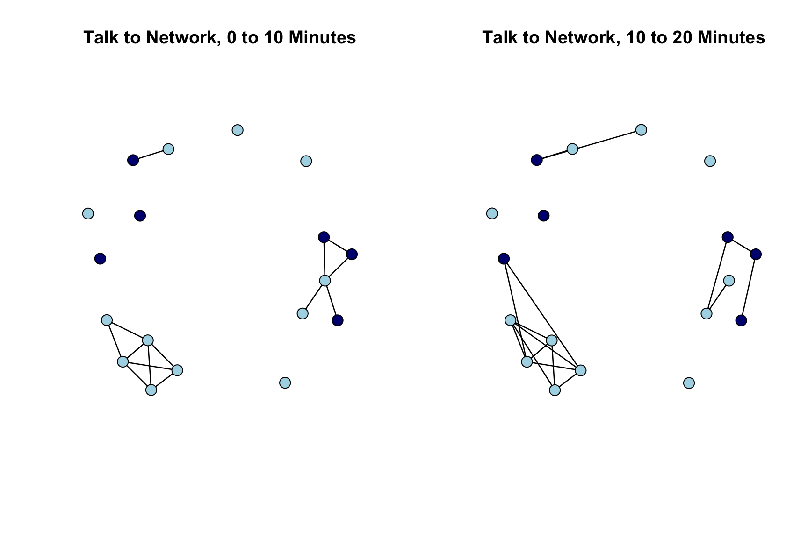

# 13, Part 2. Longitudinal Network Models: STERGM {.unnumbered #ch13-Longitudinal-Network-Models-STERGM-R}

This is the second tutorial for Chapter 13 on statistical network models. The first tutorial covered the case of [cross-sectional network data](#ch13-Cross-Sectional-Network-Models-ERGM-R). Here, we assume that a researcher has data on at least two time points and is interested in modeling change in the network over time. In this tutorial, we will walk through the estimation and interpretation of separable temporal exponential random graph models (STERGM). We can think of STERGM as a longitudinal extension to ERGM (see previous tutorial). 

With STERG models, we are interested in predicting the formation and dissolution of edges from time T to T+1 (however defined). The model is appropriate for cases where the edges can be defined discretely, for the periods defined in the study. For example, we could predict the formation/dissolution of edges from data collected on relationships amongst students at two different time points. We will consider relational event models, appropriate for continuous-time, streaming data in the fourth tutorial ([Chapter 13, Part 4](#ch13-Relational-Event-Models-R)).

For this tutorial, we will use network data collected by Daniel McFarland on adolescents in a classroom. We have four discrete networks, capturing changes in network ties across different segments of a single class period.  An edge exists in the first network if i and j talked in the first 10 minutes of the class (0-10 minutes); there is an edge in the second network if i and j talked in the second 10 minutes (10-20 minutes); there is an edge in the third network if i and j talked in the third 10 minutes (20-30 minutes); and there is an edge in the fourth network if i and j talked j in the last segment of the class (30-40 minutes). The networks are treated as undirected.

Substantively, our main question is how interaction partners in the classroom shift over a single class period. What mechanisms predict the adding of a tie that did not exist earlier in the class? What mechanisms predict the dropping of a tie? And are the mechanisms that predict the adding of a tie the same as dropping one? For example, students are likely to initiate conversations (i.e., add ties) with students who are sitting physically nearby. On the other hand, once two students are talking, sitting adjacent might not have a large effect on maintaining the tie over time; as they have already overcome the initial hurdle of being physically distant. 

## Getting the Data Ready
We will make use of the **network** and **sna** packages in this tutorial (rather than **igraph**). 


```r
library(sna)
library(network)
library(networkDynamic)
```

As a first step, we will load our four networks, already constructed as network objects.


```r
url1 <- "https://github.com/JeffreyAlanSmith/Integrated_Network_Science/raw/master/data/talk_nets_undirected.RData"

load(url(description = url1))
```

Let's take a look at the four networks, `talk_time1`, `talk_time2`, `talk_time3` and `talk_time4`:


```r
talk_time1
```

```
##  Network attributes:
##   vertices = 18 
##   directed = FALSE 
##   hyper = FALSE 
##   loops = FALSE 
##   multiple = FALSE 
##   bipartite = FALSE 
##   total edges= 14 
##     missing edges= 0 
##     non-missing edges= 14 
## 
##  Vertex attribute names: 
##     gender race vertex.names 
## 
## No edge attributes
```

```r
talk_time2
```

```
##  Network attributes:
##   vertices = 18 
##   directed = FALSE 
##   hyper = FALSE 
##   loops = FALSE 
##   multiple = FALSE 
##   bipartite = FALSE 
##   total edges= 16 
##     missing edges= 0 
##     non-missing edges= 16 
## 
##  Vertex attribute names: 
##     gender race vertex.names 
## 
## No edge attributes
```

```r
talk_time3
```

```
##  Network attributes:
##   vertices = 18 
##   directed = FALSE 
##   hyper = FALSE 
##   loops = FALSE 
##   multiple = FALSE 
##   bipartite = FALSE 
##   total edges= 13 
##     missing edges= 0 
##     non-missing edges= 13 
## 
##  Vertex attribute names: 
##     gender race vertex.names 
## 
## No edge attributes
```

```r
talk_time4
```

```
##  Network attributes:
##   vertices = 18 
##   directed = FALSE 
##   hyper = FALSE 
##   loops = FALSE 
##   multiple = FALSE 
##   bipartite = FALSE 
##   total edges= 12 
##     missing edges= 0 
##     non-missing edges= 12 
## 
##  Vertex attribute names: 
##     gender race vertex.names 
## 
## No edge attributes
```

`talk_time1` corresponds to interactions taking place in the first 'period' (0-10 minutes), `talk_time2` corresponds to interactions taking place in the second 'period' (10-20 minutes) and so on. Note that each of these networks already has attributes mapped onto them; specifically gender and race. In this case, all nodes are present in each period of observation. Each network (period 1 through 4) thus has the same set of nodes. In many cases, however, nodes may enter or exit through time (i.e., be present in period 1 but not period 2). We consider problems of entry/exit in the next lab, on two-mode networks. 

Let's plot the networks for the first two periods. We will set the color of the nodes by gender (navy blue for male and light blue for female). We start by extracting gender from the first network. 


```r
gender <- get.vertex.attribute(talk_time1, "gender")
```


```r
head(gender)
```

```
## [1] "female" "female" "female" "female" "female" "male"
```

We now set color based on gender. 


```r
cols <- ifelse(gender == "male", "navy blue", "light blue")
```

We will also set the layout for the plot to be the same across the two periods. This makes it easier to see how edges are dropped/added from period to period. We accomplish this by defining the locations (`locs`) to place the nodes and then using the coord argument in the plot statement. We define the locations of the nodes based on the period 1 network. 


```r
locs <- network.layout.fruchtermanreingold(talk_time1, layout.par = NULL)

par(mfrow = c(1, 2))

plot(talk_time1, main = "Talk to Network, 0 to 10 Minutes", 
     vertex.col = cols, coord = locs, vertex.cex = 2)

plot(talk_time2, main = "Talk to Network, 10 to 20 Minutes", 
     vertex.col = cols, coord = locs, vertex.cex = 2) 
```



We see that the basic structure of the network is pretty similar period to period, but specific edges do change. For example, in a number of instances students who were isolates (did not talk to anyone in the first 10 minutes) become active, socially, making connections to existing groups of talking students. We also see that one social group is almost entirely female, but otherwise boys and girls seem to mix pretty freely in this classroom.

STERG models require that our discrete, longitudinal networks be put together as a networkDynamic object. The function is `networkDynamic()`. In this case, the only input we need is a list of networks, where the networks are placed into a list in sequential order (see [Chapter 3](#ch3-Dynamic-Network-Data-R) for more complicated examples; e.g., where there are time changing vertex attributes or nodes becoming inactive/active over time). The resulting networkDynamic object will serve as input into our STERG model. 


```r
net_dynamic_4periods <- networkDynamic(network.list = list(talk_time1, 
                                                           talk_time2, 
                                                           talk_time3,
                                                           talk_time4))
```


```r
net_dynamic_4periods
```

```
## NetworkDynamic properties:
##   distinct change times: 5 
##   maximal time range: 0 until  4 
## 
## Includes optional net.obs.period attribute:
##  Network observation period info:
##   Number of observation spells: 1 
##   Maximal time range observed: 0 until 4 
##   Temporal mode: discrete 
##   Time unit: step 
##   Suggested time increment: 1 
## 
##  Network attributes:
##   vertices = 18 
##   directed = FALSE 
##   hyper = FALSE 
##   loops = FALSE 
##   multiple = FALSE 
##   bipartite = FALSE 
##   net.obs.period: (not shown)
##   total edges= 25 
##     missing edges= 0 
##     non-missing edges= 25 
## 
##  Vertex attribute names: 
##     active gender race vertex.names 
## 
##  Edge attribute names: 
##     active
```

Note that the default here is to set the start time (or onset) at 0 and the terminus at 4, defined as the period where no further change is recorded. We thus have a starting point of period 0 and changes occurring in period 1 , 2 and 3. Let's look at the object as a data frame.


```r
net_dynamic_4periods_dat <- as.data.frame(net_dynamic_4periods)
```


```r
head(net_dynamic_4periods_dat)
```

```
##   onset terminus tail head onset.censored terminus.censored duration edge.id
## 1     0        4    2   11          FALSE             FALSE        4       1
## 2     0        3    8    9          FALSE             FALSE        3       2
## 3     0        4    1    7          FALSE             FALSE        4       3
## 4     0        1    7    8          FALSE             FALSE        1       4
## 5     0        1    7    9          FALSE             FALSE        1       5
## 6     0        1    2    3          FALSE             FALSE        1       6
```

We can see that there is an edge between node 2 and node 11 in period 0 (onset) and this lasts to the end of the observation period. As another example, the edge between node 7 and 8 is present in period 0 (duration = 1), but is dropped during period 1.

We will also add an edge covariate to the networkDynamic object. Here we will include the seating arrangement in the classroom, as we might expect that students who sit close together are more likely to talk to one another. Let's read in the edgelist. 


```r
url2 <- "https://github.com/JeffreyAlanSmith/Integrated_Network_Science/raw/master/data/discrete_talk_nets_seating.txt"

seating_edgelist <- read.table(file = url2, header = T)
```


```r
head(seating_edgelist)
```

```
##   ego_id alter_id
## 1      1        7
## 2      1        9
## 3      1       15
## 4      2        3
## 5      2        5
## 6      2       11
```

The data is stored as an edgelist, where i->j exists if node i is sitting near (i.e., adjacent) to node j. Let's turn the seating edgelist into a matrix and then add it to the networkDynamic object. We will first take the seating edgelist and turn it into a directed network object. We will then symmetrize it to make it undirected. We will use a 'weak' rule when symmetrizing the matrix, so if i is next to j or j is next to i, the matrix will have a 1 for both ij and ji (we do this to ensure that the matrix is logically consistent, so that if i is next to j, then j must be next to i). The `symmetrize()` function will output a matrix by default, which is what we want here. We will then attach the matrix to the networkDynamic object using `set.network.attribute()`.


```r
seating_network <- network(x = seating_edgelist, directed = T, 
                           vertices = data.frame(ids = 1:18)) 

seating_matrix <- symmetrize(seating_network, rule = "weak")

set.network.attribute(net_dynamic_4periods, "seating", seating_matrix)
```

## STERGMs
We are now ready to run an initial STERG model, where the goal is to predict the adding and dropping (or keeping) of edges across discretely defined time periods. This amounts to running separate ERGMs predicting the formation and persistence/dissolution of edges, given the network at time T. Note that the **tergm** package will allow us to choose if we want to model the keeping of an edge (persistence) or dropping of an edge (dissolution) for the persistence/dissolution portion of the model. 

For the formation model, we run an ERGM predicting an edge between i-j in T+1, given that the i-j edge does not exist in the current network, time T. For the persistence model, we run an ERGM predicting an edge between i-j in time T+1, given that i-j does exist in time T. For the dissolution model, we run an ERGM predicting the absence of an edge between i-j in time T+1, given that i-j does exist in time T. In this way, STERGM is a direct extension of the exponential random graph models covered in the previous tutorial. The models are simply run with the addition of a time component, and corresponding conditioning to capture the formation and persistence/dissolution of edges. This means that the model specifications that work in the ERGM case will (mostly) be appropriate in the STERGM case. In this case, the network is undirected so we will only include terms appropriate for undirected networks. 

Let's load the tergm package [@tergm]. Note this depends on **networkDynamic** and **ergm**. Let's also load **tsna**.


```r
library(tergm) 
library(tsna)
```

### Model 1: Just Edges

The main function is `tergm()`. The key arguments are: 

- formula = formula specifying the formation and persistence/dissolution equation
- estimate = type of estimation to use in fitting model 
- constraints = formula specifying any constraints to put on model
- control = list of inputs to control estimation algorithm; set using `control.tergm()`
- times = periods to include in estimating model

Note that the formation and persistence/dissolution formulas are specified separately and do not need to be the same. The formation formula is set using `Form(~...)`. The persistence/dissolution formulas can be set using `Diss(~...)` or `Persist(~...)`. If we use Persist, then we will predict if the i-j edge remains from one period to the next. If we use Diss we predict the dissolution, or dropping, of edges from one period to next. For our example, we will focus on the persistence model. With the persistence model, positive effects make it more likely for an edge to last from one period to another. Note also that the constraints and control arguments work in very similar ways to what we saw in the ERGM case (see previous tutorial). For our first model, we will do something simple and only include a term for edges, capturing the base rate of tie formation/persistence. We set estimate to CMLE. 

```r
stergm_mod1 <- tergm(net_dynamic_4periods ~ Form(~ edges) + Persist(~ edges),
                     estimate = "CMLE", times = 0:3)
```


```r
summary(stergm_mod1)
```

```
## Call:
## tergm(formula = net_dynamic_4periods ~ Form(~edges) + Persist(~edges), 
##     estimate = "CMLE", times = 0:3)
## 
## Conditional Maximum Likelihood Results:
## 
##                  Estimate Std. Error MCMC % z value Pr(>|z|)    
## Form(1)~edges     -3.2859     0.2630      0 -12.495   <1e-04 ***
## Persist(1)~edges   0.4249     0.3119      0   1.362    0.173    
## ---
## Signif. codes:  0 '***' 0.001 '**' 0.01 '*' 0.05 '.' 0.1 ' ' 1
## 
##      Null Deviance: 636.3  on 459  degrees of freedom
##  Residual Deviance: 186.8  on 457  degrees of freedom
##  
## AIC: 190.8  BIC: 199.1  (Smaller is better. MC Std. Err. = 0)
```

We can see that we have two different equations, one for tie formation and one for tie persistence. The results suggest that ties form at a lower rate than if people were randomly forming ties (based on the negative coefficient on edges for the formation model). To get a sense of what the results mean, we can look at the coefficient on edges for the tie persistence model. If we take the .4249, we can calculate the probability of an edge persisting from one period to the next:


```r
exp(.4249) / (1 + exp(.4249))
```

```
## [1] 0.6046552
```

Thus, an edge that existed in one period has a .605 probability of still existing in the next period.

Note that we set times to 0:3, as we want to model the formation and persistence of edges across our four time periods. If we tried to run the following bit of code, without times explicitly set, we would run into problems: `wrong_mod1 <- tergm(net_dynamic_4periods ~ Form(~ edges) + Persist(~ edges), estimate = "CMLE")`

If we had run the dissolution model, we would get the same basic results but the .4249 would now be negative (as we are predicting the dropping of a tie):


```r
summary(tergm(net_dynamic_4periods ~ Form(~ edges) + Diss(~ edges), 
              estimate = "CMLE", times = 0:3))
```

```
## Call:
## tergm(formula = net_dynamic_4periods ~ Form(~edges) + Diss(~edges), 
##     estimate = "CMLE", times = 0:3)
## 
## Conditional Maximum Likelihood Results:
## 
##               Estimate Std. Error MCMC % z value Pr(>|z|)    
## Form(1)~edges  -3.2859     0.2630      0 -12.495   <1e-04 ***
## Diss(1)~edges  -0.4249     0.3119      0  -1.362    0.173    
## ---
## Signif. codes:  0 '***' 0.001 '**' 0.01 '*' 0.05 '.' 0.1 ' ' 1
## 
##      Null Deviance: 636.3  on 459  degrees of freedom
##  Residual Deviance: 186.8  on 457  degrees of freedom
##  
## AIC: 190.8  BIC: 199.1  (Smaller is better. MC Std. Err. = 0)
```

### Model 2: Edges, Homophily and Nodefactor 
We will now try a little more interesting model, including nodematch and nodefactor terms for gender and race. The nodefactor terms capture basic differences in degree by the nodal attribute of interest (i.e., do girls talk more than boys in class?), while the nodematch terms capture if there is homophily on the attribute (do girls tend to talk to other girls in class?). Here we will keep the formulas for formation and persistence the same. 


```r
stergm_mod2 <- tergm(net_dynamic_4periods ~
                       Form(~ edges + nodematch("gender") + 
                              nodefactor("gender") +  
                              nodematch("race") + 
                              nodefactor("race")) + 
                       Persist(~ edges + nodematch("gender") + 
                                 nodefactor("gender") + 
                                 nodematch("race") + 
                                 nodefactor("race")), 
                     estimate = "CMLE", times = 0:3)
```


```r
summary(stergm_mod2)
```

```
## Call:
## tergm(formula = net_dynamic_4periods ~ Form(~edges + nodematch("gender") + 
##     nodefactor("gender") + nodematch("race") + nodefactor("race")) + 
##     Persist(~edges + nodematch("gender") + nodefactor("gender") + 
##         nodematch("race") + nodefactor("race")), estimate = "CMLE", 
##     times = 0:3)
## 
## Conditional Maximum Likelihood Results:
## 
##                                   Estimate Std. Error MCMC % z value Pr(>|z|)    
## Form(1)~edges                     -3.01959    0.82990      0  -3.639 0.000274 ***
## Form(1)~nodematch.gender           0.63323    0.55982      0   1.131 0.258000    
## Form(1)~nodefactor.gender.male     0.40814    0.36992      0   1.103 0.269888    
## Form(1)~nodematch.race            -0.08931    0.66430      0  -0.134 0.893056    
## Form(1)~nodefactor.race.white     -1.07422    0.54052      0  -1.987 0.046879 *  
## Persist(1)~edges                   0.85108    1.13717      0   0.748 0.454209    
## Persist(1)~nodematch.gender        0.71104    0.78997      0   0.900 0.368074    
## Persist(1)~nodefactor.gender.male -0.89406    0.54060      0  -1.654 0.098163 .  
## Persist(1)~nodematch.race         -0.59615    0.75889      0  -0.786 0.432134    
## Persist(1)~nodefactor.race.white  -0.08171    0.51961      0  -0.157 0.875045    
## ---
## Signif. codes:  0 '***' 0.001 '**' 0.01 '*' 0.05 '.' 0.1 ' ' 1
## 
##      Null Deviance: 636.3  on 459  degrees of freedom
##  Residual Deviance: 172.0  on 449  degrees of freedom
##  
## AIC: 192  BIC: 233.3  (Smaller is better. MC Std. Err. = 0)
```
Race and gender would not appear to play a large role in the formation or persistence of edges in this classroom network, although there is some evidence that students who identify as white initiate interactions at lower rates. The fit (based on BIC) is actually worse than in model 1, just including edges.

### Model 3: Edges, Nodefactor, and Seating
As a third model, we will incorporate seating arrangements into the formation and persistence models. The question is whether students who sit close to one another are more likely to initiate, and then maintain, interaction ties. Here, we will include an edgecov term with the seating matrix as the input. Note that we have already included the seating matrix on the networkDynamic object above (so no further manipulation is necessary here). Given our results above, we will drop most of the gender and race terms from the model, just keeping the nodefactor terms for race in the formation model and gender in the persistence model.


```r
stergm_mod3 <- tergm(net_dynamic_4periods ~ 
                        Form(~ edges +
                               nodefactor("race") +
                               edgecov("seating")) + 
                        Persist(~ edges + 
                                  nodefactor("gender") +
                                  edgecov("seating")),  
                      estimate = "CMLE", times = 0:3)
```


```r
summary(stergm_mod3)
```

```
## Call:
## tergm(formula = net_dynamic_4periods ~ Form(~edges + nodefactor("race") + 
##     edgecov("seating")) + Persist(~edges + nodefactor("gender") + 
##     edgecov("seating")), estimate = "CMLE", times = 0:3)
## 
## Conditional Maximum Likelihood Results:
## 
##                                   Estimate Std. Error MCMC % z value Pr(>|z|)    
## Form(1)~edges                      -3.3301     0.4996      0  -6.666   <1e-04 ***
## Form(1)~nodefactor.race.white      -0.8750     0.4161      0  -2.103   0.0355 *  
## Form(1)~edgecov.seating             2.3582     0.5574      0   4.231   <1e-04 ***
## Persist(1)~edges                    0.6369     1.2705      0   0.501   0.6161    
## Persist(1)~nodefactor.gender.male  -0.8748     0.7035      0  -1.244   0.2137    
## Persist(1)~edgecov.seating          0.3550     1.1585      0   0.306   0.7593    
## ---
## Signif. codes:  0 '***' 0.001 '**' 0.01 '*' 0.05 '.' 0.1 ' ' 1
## 
##      Null Deviance: 636.3  on 459  degrees of freedom
##  Residual Deviance: 158.3  on 453  degrees of freedom
##  
## AIC: 170.3  BIC: 195  (Smaller is better. MC Std. Err. = 0)
```
It looks like being physically close in the classroom increases the probability of forming a tie but less so for the probability of the tie persisting from one period to the next (although the standard errors are high here). The odds of a tie forming between i and j is `exp(2.3582)` = 10.572 times higher if i and j are sitting close together than if they are not sitting close together. This suggests the importance of opportunity for beginning social ties. The results are similar if we kept the full range of nodefactor and nodematch terms on race and gender.

### Model 4: Adding GWESP to the Model
For our last model, we will include a gwesp term, capturing if students form (and keep) edges when they share many common interaction partners. Here we will only include gwesp in the formation model, as including it in the persistence model leads to estimation problems. 


```r
set.seed(107)

stergm_mod4 <- tergm(net_dynamic_4periods ~ 
                        Form(~ edges + 
                               nodefactor("race") +  
                               edgecov("seating") + 
                               gwesp(decay = .5, fixed = T)) + 
                        Persist(~ edges +
                                  nodefactor("gender") +
                                  edgecov("seating")),
                      estimate = "CMLE", times = 0:3, 
                      control = control.tergm(CMLE.ergm = 
                                           control.ergm(MCMC.burnin = 50000, 
                                                    MCMC.interval = 3000, 
                                                    MCMC.samplesize = 6500)))
```

The model with gwesp is estimated with MCMC estimation so we need to check the diagnostics, to make sure the model is converging. This is directly analogous to the kind of diagnostics we saw in the ERGM case. 


```r
mcmc.diagnostics(stergm_mod4, vars.per.page = 4)
```


There are two sets of diagnostics; first for the formation model and then for the persistence model. Looks okay on the whole, although we might consider rerunning with different input parameters or a simpler model. Let's take a look at the model results. 


```r
summary(stergm_mod4)
```

```
## Call:
## tergm(formula = net_dynamic_4periods ~ Form(~edges + nodefactor("race") + 
##     edgecov("seating") + gwesp(decay = 0.5, fixed = T)) + Persist(~edges + 
##     nodefactor("gender") + edgecov("seating")), estimate = "CMLE", 
##     control = control.tergm(CMLE.ergm = control.ergm(MCMC.burnin = 50000, 
##         MCMC.interval = 3000, MCMC.samplesize = 6500)), times = 0:3)
## 
## Monte Carlo Conditional Maximum Likelihood Results:
## 
##                                   Estimate Std. Error MCMC % z value Pr(>|z|)    
## Form(1)~edges                      -4.1382     0.5368      0  -7.708  < 1e-04 ***
## Form(1)~nodefactor.race.white      -0.6255     0.3811      0  -1.641 0.100728    
## Form(1)~edgecov.seating             1.4868     0.5749      0   2.586 0.009702 ** 
## Form(1)~gwesp.fixed.0.5             0.9417     0.2810      0   3.351 0.000806 ***
## Persist(1)~edges                    0.6543     1.2901      0   0.507 0.612008    
## Persist(1)~nodefactor.gender.male  -0.8758     0.7157      0  -1.224 0.221065    
## Persist(1)~edgecov.seating          0.3374     1.1704      0   0.288 0.773100    
## ---
## Signif. codes:  0 '***' 0.001 '**' 0.01 '*' 0.05 '.' 0.1 ' ' 1
## 
##      Null Deviance: 636.3  on 459  degrees of freedom
##  Residual Deviance: 146.3  on 452  degrees of freedom
##  
## AIC: 160.3  BIC: 189.2  (Smaller is better. MC Std. Err. = 0.1137)
```

The results suggest that students tend to form talking relationships when they have common interaction partners (looking at the positive, significant gwesp coefficient). So, if i and j talk with the same other students in Time T, they are likely to start talking with each other in T + 1.

## Checking Model Fit
Let's go ahead and check the fit of the model. One way of seeing if the model is fitting well is to simulate networks based on the underlying model and then compare the statistics in the simulated networks to that observed in the true networks (analogous to the `gof()` function in the ERGM case). Note that the simulations combine the formation and persistence processes and output the generated networks (based on both processes) at a given time slice. We will use a `simulate()` function. The main arguments are:

- object = model of interest
- nsim = number of separate replications; set to 1 in case of networkDynamic object
- time.slices = number of distinct periods to run dynamic simulation over
- nw.start = indicator for what network to start simulation at; nw.start=1 to begin with first observed network
- monitor = formula indicating statistics to calculate on the simulated networks. 

For our simulation we will set time.slices to 1000, so we simulate change over 1000 different time periods. Of course our actual data only has 4 time periods, but since the model is about the general tendencies of tie formation and persistence, having a larger number of time periods simply adds more information about how the model is fitting (i.e., can it generate realistic networks over many periods that correspond to what we saw in the actual data?). We will start the simulations at the time 1 network. We set monitor to edges and triadcensus (there are four types as the network is undirected). Note that triadcensus was not a term in the model. We use `set.seed()` to ease reproducibility.


```r
set.seed(130)
sim_mod4 <- simulate(stergm_mod4, nsim = 1, time.slices = 1000,
                     nw.start = 1, monitor = ~ edges + triadcensus(c(0, 1, 2, 3)))
```

If we take the generated object, `sim_mod4`, and use the `attributes()` function, we can grab the statistics for each generated network (specified in the monitor formula). This is housed under the `stats` part of the object. 


```r
sim_stats <- attributes(sim_mod4)$stats
```


```r
head(sim_stats)
```

```
## Markov Chain Monte Carlo (MCMC) output:
## Start = 1 
## End = 7 
## Thinning interval = 1 
##      edges triadcensus.0 triadcensus.1 triadcensus.2 triadcensus.3
## [1,]    14           619           177            13             7
## [2,]    13           635           159            17             5
## [3,]    10           667           140             7             2
## [4,]     7           711            98             7             0
## [5,]    12           645           153            15             3
## [6,]    13           636           156            20             4
## [7,]    11           665           129            19             3
```

There are 1000 rows, 1 for each generated network. We see that there is a column for edges and four columns for the triadcensus, showing the count for edges and the four triad types (null triads, triads with 1 tie, triads with 2 ties and triads with 3 ties) for each simulated network (or time period in the larger simulation). This can be compared to what we saw in the observed network. We will use a `tErgmStats()` function to calculate the statistics on the observed network.  The main arguments are:

- nd = networkDynamic object
- formula = ergm formula describing terms to calculate statistics on
- start = period where calculations should start
- end = period where calculations should end

We will set formula to include edges and triadcensus, matching what was calculated on the simulated networks above. We set start to 0 and end to 3, as we have 4 time periods, starting from 0 (onset). 


```r
true_values <- tErgmStats(nd = net_dynamic_4periods, 
                          formula = '~ edges + triadcensus(c(0, 1, 2, 3))', 
                          start = 0, end = 3)
```


```r
true_values
```

```
## Time Series:
## Start = 0 
## End = 3 
## Frequency = 1 
##   edges triadcensus.0 triadcensus.1 triadcensus.2 triadcensus.3
## 0    14           613           188             9             6
## 1    16           584           213            14             5
## 2    13           625           177            11             3
## 3    12           640           165             6             5
```
Here we summarize the statistics of the simulated networks using `apply()` (summarizing over the columns): 


```r
sim_values <- apply(sim_stats, 2, summary)
```

And now let’s add some useful rownames to the values calculated above.


```r
rownames(sim_values) <- paste("sim", rownames(sim_values), sep = "_")
```


```r
sim_values
```

```
##              edges triadcensus.0 triadcensus.1 triadcensus.2 triadcensus.3
## sim_Min.     5.000       409.000        70.000         2.000         0.000
## sim_1st Qu. 13.000       557.000       161.000        16.000         2.000
## sim_Median  16.000       597.000       189.000        24.000         4.000
## sim_Mean    15.979       595.934       189.173        26.188         4.705
## sim_3rd Qu. 19.000       633.250       218.000        35.000         6.000
## sim_Max.    34.000       741.000       294.000        89.000        24.000
```
Here we calculate the true values over the 4 periods as a means of comparison. 


```r
true_values_mean <- colMeans(true_values)
```

Putting together the true and simulated values:


```r
rbind(sim_values, true_mean = true_values_mean)
```

```
##              edges triadcensus.0 triadcensus.1 triadcensus.2 triadcensus.3
## sim_Min.     5.000       409.000        70.000         2.000         0.000
## sim_1st Qu. 13.000       557.000       161.000        16.000         2.000
## sim_Median  16.000       597.000       189.000        24.000         4.000
## sim_Mean    15.979       595.934       189.173        26.188         4.705
## sim_3rd Qu. 19.000       633.250       218.000        35.000         6.000
## sim_Max.    34.000       741.000       294.000        89.000        24.000
## true_mean   13.750       615.500       185.750        10.000         4.750
```
Looks like the model is fitting okay, although the simulated networks have too many intransitive triads (`triadcensus.2`). We could imagine adjusting the model to account for that. As another way of assessing fit, we can extract networks from particular time periods and plot them against the observed network (we could also run a movie over all of the simulated networks). Here we will take the network from time period 10. We will use the `network.extract()` function, setting at to 10. 


```r
net10 <- network.extract(sim_mod4, at = 10)
```

And now let’s plot the simulated network against the observed network, here just from the first 10 minute period.


```r
par(mfrow = c(1, 2))
plot(talk_time1, main = "Observed Network from 0-10 Minutes")
plot(net10, main = "Example Simulated Network")
```


Looks okay on the whole, although we might consider adding additional homophliy terms to try and deal with the over count of intransitive triads.

Overall, our results suggest that seating arrangements structure the formation of interaction ties. Individuals sitting close together are likely to initiate interactions.  Gender and race have relatively weak effects on the formation of ties. For example, even though there is one group of isolated girls, the overall effect of gender on formation of ties is not particularly strong. We also see that students tend to form new ties to people in their social cluster, with students initiating talking relationships with other students who have the same (current) partners as themselves. The tie persistence results are less clear, with few good predictors in the persistence model. In sum, the results suggest that classroom interactions are largely based on opportunity structure and norms of interaction: one tends to talk to other students in close proximity (socially or physically); once an initial discussion relationship is prompted, however, the interaction between i-j has its own internal dynamics largely independent of other, external factors.

This tutorial has covered statistical models for discrete, longitudinal network data. In the next tutorial, we consider the application of ERGMs and STERGMs to the case of [two-mode](#ch13-Two-mode-Network-Models-ERGM-STERGM-R) (or bipartite) networks. 
