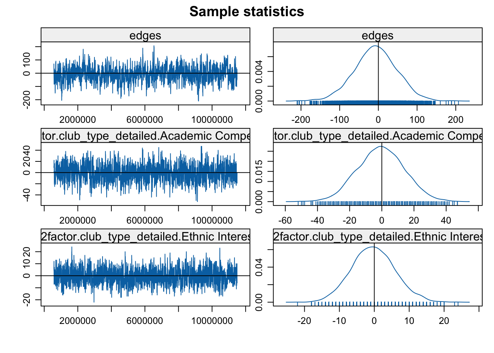
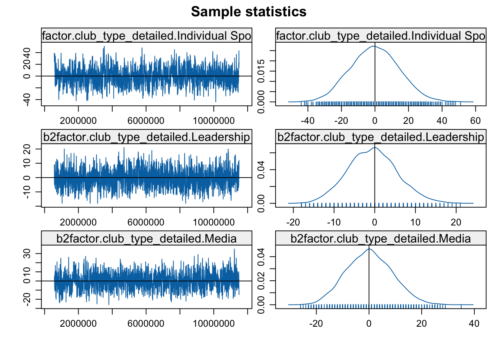
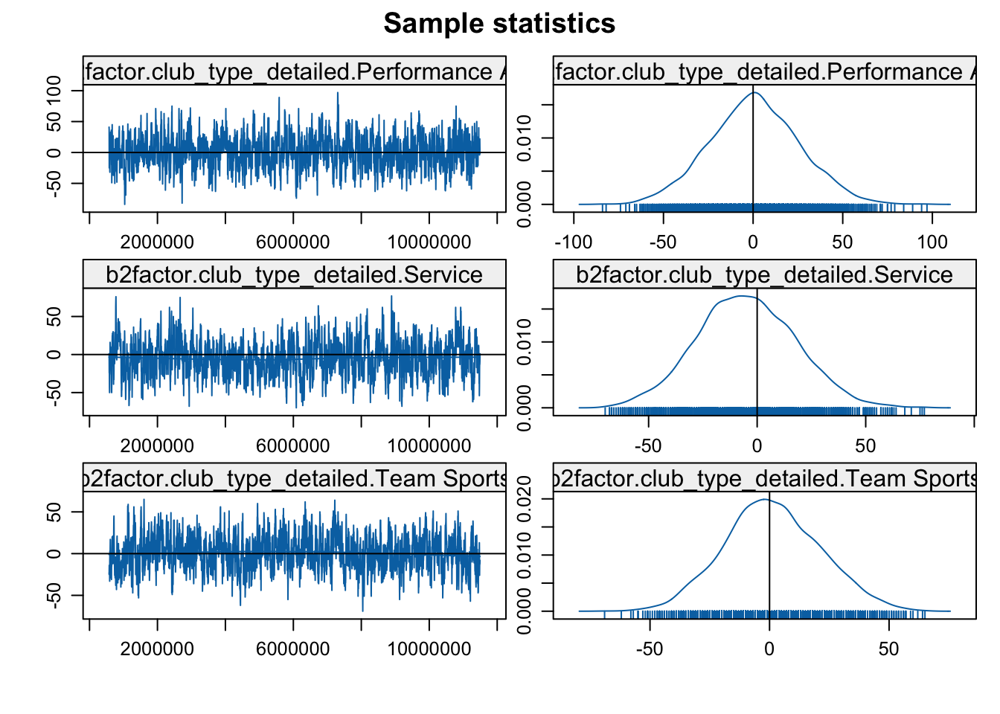
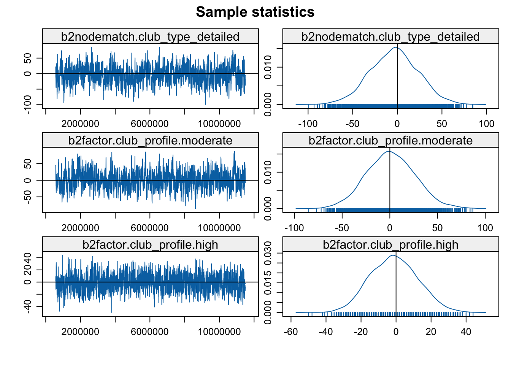
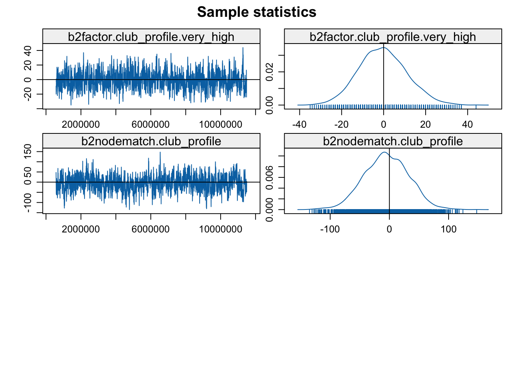
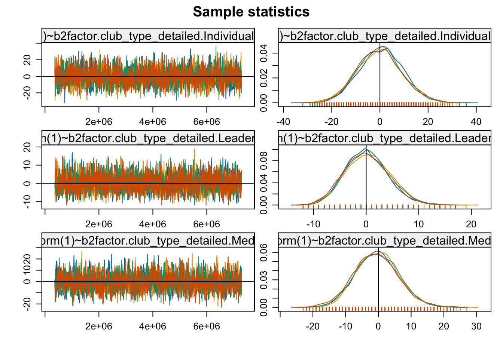
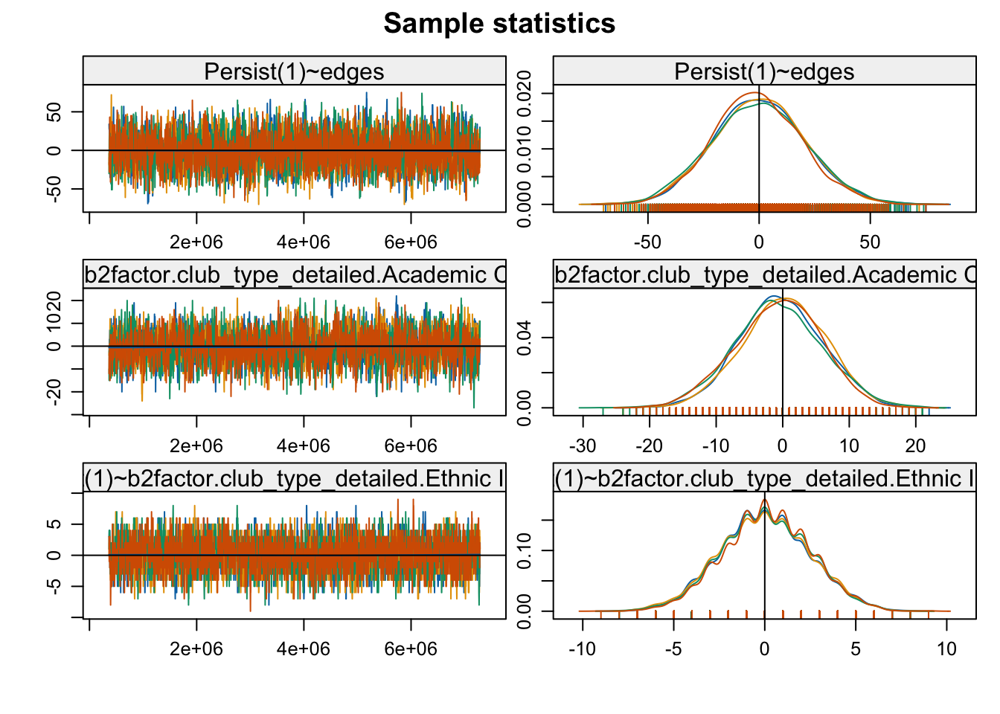
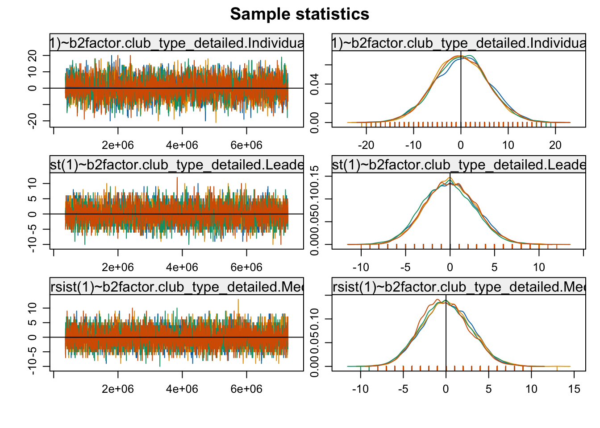
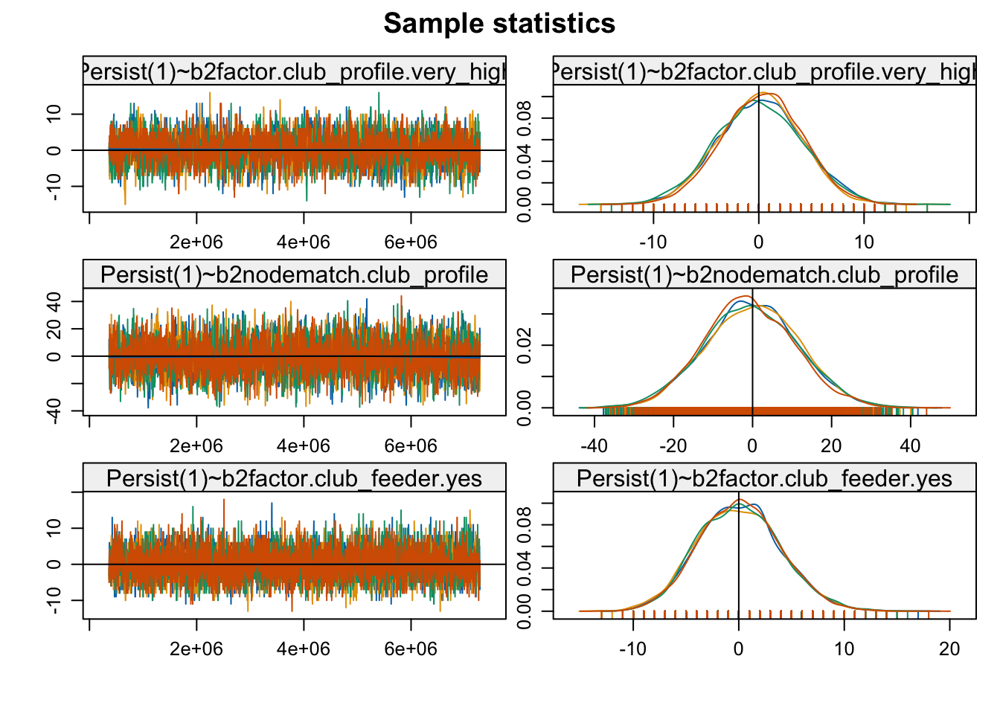

# 13, Part 3. Two-mode Network Models {.unnumbered #ch13-Two-mode-Network-Models-ERGM-STERGM-R}

This is the third tutorial for Chapter 13, covering statistical network models in R. The first two tutorials covered network models for one-mode networks. [Part 1](#ch13-Cross-Sectional-Network-Models-ERGM-R) covered cross-sectional network models (ERGM), while [Part 2](#ch13-Longitudinal-Network-Models-STERGM-R) covered longitudinal network models (STERGM). In this tutorial, we will apply ERGMs and STERGMs to two-mode network data. Two-mode, or bipartite, networks are based on two types of actors (e.g., students and clubs). Ties exist between actors of different modes, but there are no ties between actors of the same mode. See [Chapter 11](#ch11-Two-mode-Networks) for details. We will draw heavily on the ERGM and STERGM tutorials, demonstrating how the specification and interpretation of the models must be rethought for two-mode networks. For example, even simple terms, like those capturing homophily, are not so simple when there are two kinds of actors in the network. We will cover cross-sectional models (ERGM) first, to get a sense of the model mechanics for two-mode networks. We will then cover longitudinal models (STERGM), appropriate for over time two-mode data. 

Our substantive case is based on students joining clubs in a high school. We introduced this example in [Chapter 11](#ch11-Two-mode-Networks). We will work with data from two years, 1996 and 1997. We have basic information about the students, the clubs, and which students are members of which clubs for both years. Our goal is to tease out how students join, drop and keep their club affiliations through time. For example, are certain kinds of clubs more effective at keeping their members than others? Do students join a mixture of clubs (sports and academic) or do they stick to one kind of club (just sports)? And how strongly do students segregate themselves along racial lines? More generally, are the processes of tie gain (students joining clubs) the same as tie loss (students leaving clubs), and what does that tell us about the social dynamics of the school? In answering these questions, we will build on our results from [Chapter 11](#ch11-Two-mode-Networks), where we found, for example, that club memberships were partly segregated along racial lines, while generalist, service clubs served to integrate the school, which was otherwise divided along tracks of sports, academic interest, etc. 

## Affiliation Data
We will make use of the network package for this tutorial, as well as the **ergm** and **tergm** packages.


```r
library(network)
library(ergm)
library(tergm)
library(networkDynamic)
```

Let's begin by reading in our data. We will first read in the affiliation matrices for the 1996 and 1997 school years, showing the club memberships for each student in the school. We have separate files for each year.


```r
url1 <- "https://github.com/JeffreyAlanSmith/Integrated_Network_Science/raw/master/data/affiliations_1996.txt"

affiliations96 <- read.delim(file = url1, check.names = F)

url2 <- "https://github.com/JeffreyAlanSmith/Integrated_Network_Science/raw/master/data/affiliations_1997.txt"

affiliations97 <- read.delim(file = url2, check.names = F)
```

Let's look at the first six rows and columns for 1996.


```r
affiliations96[1:6, 1:6]
```

```
##        Academic decathalon Art Club Asian Club Band, 8th Band, Jazz Band, Marching (Symphonic)
## 101498                   0        0          0         0          0                          0
## 104452                   0        0          0         0          0                          1
## 104456                   0        0          0         0          0                          0
## 104462                   0        0          0         0          0                          0
## 104471                   0        0          0         0          0                          0
## 105215                   0        0          0         0          0                          0
```

Students are on the rows and clubs are on the columns. A 1 means that student i is part of club j in 1996 (e.g., the second student, 104452, is part of the symphonic marching band). Let's take a look at the dimensions of the affiliation matrices:


```r
dim(affiliations96)
```

```
## [1] 1295   91
```

```r
dim(affiliations97)
```

```
## [1] 1295   91
```

We can see that there are 1295 students (on the rows) and 91 clubs (on the columns) for both 1996 and 1997. Note that the 1295 students reflects all students present in at least one year. Thus, students who are in the school in 1996 but leave (i.e., graduate) are in the 1996 and 1997 matrices. Similarly, students who enter in 1997, but are not in the school in 1996, are in both matrices. We will deal with node entry and exit later on. 

And now we will read in the attribute data. We will read in a combined data frame, containing the attributes of both students and clubs. This was constructed in [Chapter 11](#ch11-Two-mode-Networks).


```r
url3 <- "https://github.com/JeffreyAlanSmith/Integrated_Network_Science/raw/master/data/attributes_students_clubs.txt"

attributes_students_clubs <- read.delim(file = url3, stringsAsFactors = F)
```


```r
nrow(attributes_students_clubs)
```

```
## [1] 1386
```

Note that the data frame has 1386 rows, 1295 students + 91 clubs. Note also that the students come first in the data frame (the first 1295 rows), followed by the clubs. Let's look at the first six rows: 


```r
head(attributes_students_clubs)
```

```
##      ids    type missing96 missing97  race gender grade96 grade97 club_type_detailed club_profile club_feeder club_type_gender club_type_grade
## 1 101498 student         0         0 white female      11      12               <NA>         <NA>        <NA>             <NA>            <NA>
## 2 104452 student         0         0 black   male       9      10               <NA>         <NA>        <NA>             <NA>            <NA>
## 3 104456 student         0         0 white female       9      10               <NA>         <NA>        <NA>             <NA>            <NA>
## 4 104462 student         0         0 black   male       9      10               <NA>         <NA>        <NA>             <NA>            <NA>
## 5 104471 student         0         0 black female       9      10               <NA>         <NA>        <NA>             <NA>            <NA>
## 6 105215 student         0         0 white female      11      12               <NA>         <NA>        <NA>             <NA>            <NA>
```

And here we look at the last six rows (using a `tail()` function):


```r
tail(attributes_students_clubs)
```

```
##                        ids type missing96 missing97 race gender grade96 grade97 club_type_detailed club_profile club_feeder club_type_gender      club_type_grade
## 1381        Volleyball, JV club         0         0 <NA>   <NA>      NA      NA        Team Sports     moderate         yes            girls ninth_tenth_eleventh
## 1382         Volleyball, V club         0         0 <NA>   <NA>      NA      NA        Team Sports         high          no            girls               ninth+
## 1383        Wrestling, 8th club         0         0 <NA>   <NA>      NA      NA  Individual Sports          low         yes             boys               eighth
## 1384          Wrestling, V club         0         0 <NA>   <NA>      NA      NA  Individual Sports     moderate          no             boys               ninth+
## 1385 Yearbook Contributors club         0         0 <NA>   <NA>      NA      NA              Media     moderate          no       boys_girls           all_grades
## 1386      Yearbook Editors club         0         0 <NA>   <NA>      NA      NA              Media         high          no       boys_girls           all_grades
```

The data frame includes student attributes, like `race` (Asian, black, Hispanic, Native American, white), as well as club attributes like `club_profile` (how much attention does the club get? low, moderate, high, very high) and `club_type_detailed` (Academic Interest, Academic Competition, Ethnic Interest, Individual Sports, Leadership, Media, Performance Art, Service, Team Sports). For all student attributes, like `race` and `gender`, the clubs get NA values, while for all club attributes, like `club_profile`, the students get NA values. See [Chapter 11](#ch11-Two-mode-Networks) for more details. The following variables have meaningful values for both students and clubs: `ids` (a unique identifier), `type` (student or club), `missing96` (is node missing in 1996?), and `missing97` (is node missing in 1997?).

Let's do a quick table on type:

```r
table(attributes_students_clubs$type)
```

```
## 
##    club student 
##      91    1295
```

Before we construct our bipartite network, we need to create two more variables, which will be essential when running the models below. We will first construct a variable called, `studentgender_clubgender`. This simply combines the values for gender, for students, with the values for `club_type_gender`, for clubs.  `gender` shows the gender of the specific student (male or female), while `club_type_gender` shows if the club is just boys, mixed gender, or just girls. By forming a single variable, it will be easier to adjust the models for the fact that certain types of students (e.g., female) are unlikely to join certain types of clubs (just boy clubs). The values for `gender` (students) comes first, followed by `club_type_gender` (clubs).


```r
gender <- attributes_students_clubs$gender
students <- attributes_students_clubs$type == "student"

club_type_gender <- attributes_students_clubs$club_type_gender
clubs <- attributes_students_clubs$type == "club"
  
studentgender_clubgender <- c(gender[students], club_type_gender[clubs])

attributes_students_clubs$studentgender_clubgender <- studentgender_clubgender
```

And now we do the same thing, combining student grade and club grade. `grade96` shows the grade of the student in the 1996 school year while `club_type_grade` shows which grades (if any) the club is restricted to. Again, the goal is to make it easier to adjust for the fact that certain students (e.g., those in grade 12) are unlikely to join certain types of clubs (eighth grade football). We do this for grade in both 1996 and 1997.


```r
grade96 <- attributes_students_clubs$grade96
grade97 <- attributes_students_clubs$grade97
 
club_type_grade <- attributes_students_clubs$club_type_grade

studentgrade96_clubgrade <- c(grade96[students], club_type_grade[clubs])
studentgrade97_clubgrade <- c(grade97[students], club_type_grade[clubs])

attributes_students_clubs$studentgrade96_clubgrade <- studentgrade96_clubgrade
attributes_students_clubs$studentgrade97_clubgrade <- studentgrade97_clubgrade
```

We are now in a position to construct our bipartite (two-mode) networks. Here, we will just construct the network using the 1996 data, as we will use the 1996 network in the cross-sectional models. We will consider network change, between 1996 and 1997, in the STERGM section below. Note that in constructing our network, the attribute data frame must be sorted to be consistent with the affiliation matrix. This means that the students in the attribute data frame should be sorted in the same order as the rows in the affiliation matrix, while the clubs in the attribute data frame should be sorted in the same order as the columns of the affiliation matrix (with the students coming first in the attribute data frame followed by the clubs). This is already done in our case. And now we turn our attribute data frame into a list, to make it easier to construct the network (as the network input is a matrix, meaning we cannot use the vertices argument in the `network()` function). 


```r
attribute_list <- do.call(list, attributes_students_clubs)
```

Let's also make sure our affiliation data is treated as a matrix in R: 


```r
affiliations96 <- as.matrix(affiliations96)
```

And now we construct the network, setting bipartite to T and using the affiliation matrix and the attribute list as inputs. 


```r
bnet96 <- network(affiliations96, bipartite = T, 
                  vertex.attr = attribute_list)
```

We now have a two-mode network based on the 1996 school year. We will, however, need to clean up the network a bit before we can run any models. We need to drop all students who are not in the high school in 1996. In particular, the school includes grades 8-12, so all students in grades 6 or 7 in 1996 need to be removed (as they joined the school in later years). All clubs are present in both years, so we only have to worry about entry/exit for the students. We will utilize the `missing96` column in our combined data frame to remove those students not in the network in 1996.

We begin by creating a copy of our network (as we do not want to remove nodes from the original network). We then use a `delete.vertices()` function to remove the nodes of interest, in this case all nodes where `missing96` is equal to 1 (note that the `delete.vertices()` function will directly modify the input network).


```r
bnet96_nomiss <- bnet96
missing96 <- which(attributes_students_clubs[, "missing96"] == 1)
delete.vertices(bnet96_nomiss, missing96)
```


```r
bnet96_nomiss
```

```
##  Network attributes:
##   vertices = 1029 
##   directed = FALSE 
##   hyper = FALSE 
##   loops = FALSE 
##   multiple = FALSE 
##   bipartite = 938 
##   total edges= 2641 
##     missing edges= 0 
##     non-missing edges= 2641 
## 
##  Vertex attribute names: 
##     club_feeder club_profile club_type_detailed club_type_gender club_type_grade gender grade96 grade97 ids missing96 missing97 race studentgender_clubgender studentgrade96_clubgrade studentgrade97_clubgrade type vertex.names 
## 
##  Edge attribute names not shown
```
We now have a two-mode network with 938 students and 91 clubs (1029 total). The students constitute the first mode while the clubs constitute the second mode (more generally, the rows are set as the first mode and columns as the second mode). A number of vertex attributes have also been added to the network, which will be useful when running the models. 

## ERGM on a Two-mode Network
Our goal is to run a series of ERGMs on our two-mode network. The simplest option is to project the two-mode network into two one-mode networks, and analyze in the normal fashion. See [Chapter 13, Part 1](#ch13-Cross-Sectional-Network-Models-ERGM-R) for ERGMs on one-mode networks. Projecting the network is not an ideal solution, however, as this throws away important information, and can lead to incorrect inference. We will specify our models while maintaining both modes in the network. The network is defined by the ties between students and clubs, where a tie exists if student i is a member of club j. We are thus trying to predict which students are likely to be members of which clubs. The process of specifying an ERGM is similar to what we have already seen (in [Part 1](#ch13-Cross-Sectional-Network-Models-ERGM-R)), but the model terms are often a little different in the case of two-mode data. We will walk through the process of specifying two-mode ERGMs step-by-step, building up the model as we go. 

### Edges
We will start with a simple model and just include a term for edges. The edges term is directly analogous to the edges term seen in previous tutorials, except here we must remember that edges can only exist between actors of different modes. As we have specified our network as bipartite, the model is estimated assuming this structure, where edges are only possible between students and clubs. 


```r
mod1 <- ergm(bnet96_nomiss ~ edges)
```


```r
summary(mod1)
```

```
## Call:
## ergm(formula = bnet96_nomiss ~ edges)
## 
## Maximum Likelihood Results:
## 
##       Estimate Std. Error MCMC % z value Pr(>|z|)    
## edges -3.44427    0.01977      0  -174.3   <1e-04 ***
## ---
## Signif. codes:  0 '***' 0.001 '**' 0.01 '*' 0.05 '.' 0.1 ' ' 1
## 
##      Null Deviance: 118331  on 85358  degrees of freedom
##  Residual Deviance:  23558  on 85357  degrees of freedom
##  
## AIC: 23560  BIC: 23569  (Smaller is better. MC Std. Err. = 0)
```

We can interpret the coefficient in terms of the baseline probability of a tie existing. The probability is: `exp(-3.44427) / (1 + exp(-3.44427))` =  .0309402. Thus, about 3 percent of all possible edges actually exist. If we want to see where this comes from, we can calculate the probability directly by taking the affiliation matrix, summing up over all cells (to get the number of edges) and dividing by the total number possible (the number of rows times the number of columns).


```r
affil_mat96 <- as.matrix(bnet96_nomiss)
sum(affil_mat96) / (nrow(affil_mat96) * ncol(affil_mat96))
```

```
## [1] 0.03094028
```

### Adjusting for Structural Issues: Gender and Grade Specific Clubs
We now turn to some tricky structural issues in the data. Most pressing is the fact that some student-club combinations cannot occur, or occur at extremely low rates. We need to adjust our model for these cases, or run the risk of biasing the estimates. For example, girls are very unlikely to join boys sports teams (e.g., wrestling or football), while boys are unlikely to join girls sports teams (volleyball). There are similar structural issues with grade, as some clubs are restricted to certain grades. For example, students in grade 9, 10, 11 or 12 do not join eighth grade sports teams (e.g., 8th grade football). 

To account for these structural conditions, we will include nodemix terms in the model for gender and grade, capturing the student-club combinations that are unlikely to exist. The two attributes of interest are `studentgender_clubgender` and `studentgrade96_clubgrade`.  By default, nodemix will include terms for all student-club combinations. We, however, only want to include terms for the rare cases of interest (e.g., boys joining girls sports). So, let's create two vectors, defining which terms we want to include for the grade and gender variables. We will start with gender. Remember that student gender is measured as male or female, while club gender is measured as boys, boys_girls, or girls. We want to print out the combinations of student-club genders (e.g., "male.boys"). By default, nodemix will print the terms sorted alphabetically, first by the second level (clubs) and then by the first level (students). Let's create our vector of names (student-club combinations) with that ordering in mind.


```r
student_gender <- sort(as.character(c("female", "male")))
club_gender <- sort(c("boys", "boys_girls", "girls"))

gender_levels <- paste(rep(student_gender, times = length(club_gender)), 
                      rep(club_gender, each = length(student_gender)),
                      sep = "." )
```


```r
data.frame(gender_levels)
```

```
##       gender_levels
## 1       female.boys
## 2         male.boys
## 3 female.boys_girls
## 4   male.boys_girls
## 5      female.girls
## 6        male.girls
```

The terms of interest are female.boys and male.girls; as these are the rare events we want to adjust for, girls joining boys clubs and boys joining girls clubs. This corresponds to spots 1 and 6 from the summary statistics, so let's create a vector holding that information. 


```r
gender_terms <- c(1, 6)
```

And now we look at the grade attribute, `studentgrade96_clubgrade`. Student grade is measured as 8, 9, 10, 11 or 12. Club grade is measured as: eighth (just eighth graders), ninth (just ninth graders), ninth_tenth_eleventh (just ninth, tenth or eleventh graders), and ninth+ (no eighth graders). The value is all_grades if there are no restrictions on membership, in terms of grade. Let's get all student-club combinations for grade and put them together to be consistent with the nodemix term (sorted by the second level and then by the first level):


```r
student_grades <- sort(as.character(c(8:12)))
club_grades <- sort(c("all_grades", "eight", "ninth", "ninth_tenth_eleventh", "ninth+"))

grade_levels <- paste(rep(student_grades, times = length(club_grades)), 
                      rep(club_grades, each = length(student_grades)),
                      sep = "." )
```


```r
data.frame(grade_levels)
```

```
##               grade_levels
## 1            10.all_grades
## 2            11.all_grades
## 3            12.all_grades
## 4             8.all_grades
## 5             9.all_grades
## 6                 10.eight
## 7                 11.eight
## 8                 12.eight
## 9                  8.eight
## 10                 9.eight
## 11                10.ninth
## 12                11.ninth
## 13                12.ninth
## 14                 8.ninth
## 15                 9.ninth
## 16 10.ninth_tenth_eleventh
## 17 11.ninth_tenth_eleventh
## 18 12.ninth_tenth_eleventh
## 19  8.ninth_tenth_eleventh
## 20  9.ninth_tenth_eleventh
## 21               10.ninth+
## 22               11.ninth+
## 23               12.ninth+
## 24                8.ninth+
## 25                9.ninth+
```

The grade variable is more complicated, but we want to include terms for any student-club combination that should not exist; like 12th graders in a ninth grade club, 12.ninth. Based on the order from the summary statistics, this corresponds to: 6 (10.eighth), 7 (11.eighth), 8 (12.eighth), 10 (9.eighth), 11 (10.ninth), 12 (11.ninth), 13 (12.ninth), 14 (8.ninth), 18 (12.ninth_tenth_eleventh), 19 (8.ninth_tenth_eleventh) and 24 (8.ninth+).


```r
grade_terms <- c(6, 7, 8, 10, 11, 12, 13, 14, 18, 19, 24)
```

We can now estimate our model, including nodemix terms for studentgender_clubgender and studentgrade96_clubgrade. We will specify which terms to include using the levels2 argument, setting it to the vectors defined above. To simplify the estimation of the model, we will specify these terms using an `Offset()` function (although we could have estimated the coefficients within the model). When using `Offset()`, the coefficients are not estimated and are instead set using the values supplied in the coef argument. This is appropriate in our case as the coefficients are based on logical conditions (e.g., 12th graders do not join 9th grade clubs) and can be set a priori by the researcher. Here, we set the coefficients to -10 for every term. We set the coefficients to -10 as we want to estimate the models conditioned on the fact that these student-club combinations are very rare.


```r
offset_coefs_gender <- rep(-10, length(gender_terms))
offset_coefs_grade <- rep(-10, length(grade_terms))

mod2 <- ergm(bnet96_nomiss ~ edges + 
               Offset(~ nodemix("studentgender_clubgender", 
                              levels2 = gender_terms), 
                      coef = offset_coefs_gender) + 
               Offset(~ nodemix("studentgrade96_clubgrade", 
                              levels2 = grade_terms), 
                      coef = offset_coefs_grade))
```


```r
summary(mod2)
```

```
## Call:
## ergm(formula = bnet96_nomiss ~ edges + Offset(~nodemix("studentgender_clubgender", 
##     levels2 = gender_terms), coef = offset_coefs_gender) + Offset(~nodemix("studentgrade96_clubgrade", 
##     levels2 = grade_terms), coef = offset_coefs_grade))
## 
## Maximum Likelihood Results:
## 
##       Estimate Std. Error MCMC % z value Pr(>|z|)    
## edges -2.99179    0.01994      0    -150   <1e-04 ***
## ---
## Signif. codes:  0 '***' 0.001 '**' 0.01 '*' 0.05 '.' 0.1 ' ' 1
## 
##      Null Deviance: 118331  on 85358  degrees of freedom
##  Residual Deviance:  21515  on 85357  degrees of freedom
##  
## AIC: 21517  BIC: 21526  (Smaller is better. MC Std. Err. = 0)
```

All of the offset terms are set to -10, although they are not printed out here. We see that the edge coefficient is different than with mod1, suggesting the importance of adjusting our model for structural/logical constraints. Note also that the model fit should only be compared to other models with the same set of offset terms. 

In this case, we used nodemix terms to capture structural conditions in the data, but we could imagine using nodemix terms to answer more substantive questions. We could test if certain types of students (e.g., girls) are more likely to join certain types of clubs (academic, leadership, etc.), although we will not consider this here.

## Second Mode Terms
We will now do something a little more interesting, and add nodefactor and homophily terms to our model. With two-mode networks, nodefactor and homophily terms can take two forms, with different terms for the first and second mode. Here we focus on the second mode, the clubs. We consider the first mode, students, below. 

### Nodefactor
Nodefactor terms capture differences in degree across nodes, here clubs, with different attributes. We are interested in the main effect of club type (sports, academic, etc.) and club profile (low, moderate, high, very high) on membership. For example, do high profile clubs have more members than low profile clubs?

The term of interest is b2factor (b2 indicating the second mode of a bipartite network). We will include b2factor terms for each club attribute of interest, `club_type_detailed` and `club_profile`. We include a levels argument for `club_profile` to set the order that the results are printed. By default, the results are printed in alphabetical order. In this case, that would correspond to high (1), low (2), moderate (3), very high (4), with high excluded as the reference. But we want the results to run from moderate (3) to high (1) to very high (4), with low (2) excluded (as this is easier to interpret). For `club_type_detailed`, we use the levels argument to set the second category, academic interest, as the reference. We set levels to -2 to exclude only the second category. 


```r
mod3a <- ergm(bnet96_nomiss ~ edges + 
               Offset(~nodemix("studentgender_clubgender", 
                              levels2 = gender_terms), 
                      coef = offset_coefs_gender) + 
               Offset(~nodemix("studentgrade96_clubgrade", 
                              levels2 = grade_terms), 
                      coef = offset_coefs_grade) + 
                b2factor("club_type_detailed", levels = -2) + 
                b2factor("club_profile", levels = c(3, 1, 4)))
```


```r
summary(mod3a)
```

```
## Call:
## ergm(formula = bnet96_nomiss ~ edges + Offset(~nodemix("studentgender_clubgender", 
##     levels2 = gender_terms), coef = offset_coefs_gender) + Offset(~nodemix("studentgrade96_clubgrade", 
##     levels2 = grade_terms), coef = offset_coefs_grade) + b2factor("club_type_detailed", 
##     levels = -2) + b2factor("club_profile", levels = c(3, 1, 
##     4)))
## 
## Maximum Likelihood Results:
## 
##                                                  Estimate Std. Error MCMC % z value Pr(>|z|)    
## edges                                            -2.82059    0.04035      0 -69.902   <1e-04 ***
## b2factor.club_type_detailed.Academic Competition -0.44051    0.08242      0  -5.345   <1e-04 ***
## b2factor.club_type_detailed.Ethnic Interest      -1.03174    0.16677      0  -6.186   <1e-04 ***
## b2factor.club_type_detailed.Individual Sports    -0.41835    0.08391      0  -4.986   <1e-04 ***
## b2factor.club_type_detailed.Leadership           -0.36924    0.18887      0  -1.955   0.0506 .  
## b2factor.club_type_detailed.Media                -0.16730    0.14109      0  -1.186   0.2357    
## b2factor.club_type_detailed.Performance Art       0.10725    0.06436      0   1.666   0.0956 .  
## b2factor.club_type_detailed.Service               0.31118    0.06262      0   4.970   <1e-04 ***
## b2factor.club_type_detailed.Team Sports           0.45881    0.07798      0   5.883   <1e-04 ***
## b2factor.club_profile.moderate                   -0.29070    0.05741      0  -5.064   <1e-04 ***
## b2factor.club_profile.high                       -0.94788    0.09396      0 -10.088   <1e-04 ***
## b2factor.club_profile.very_high                  -0.48185    0.11402      0  -4.226   <1e-04 ***
## ---
## Signif. codes:  0 '***' 0.001 '**' 0.01 '*' 0.05 '.' 0.1 ' ' 1
## 
##      Null Deviance: 118331  on 85358  degrees of freedom
##  Residual Deviance:  21116  on 85346  degrees of freedom
##  
## AIC: 21140  BIC: 21252  (Smaller is better. MC Std. Err. = 0)
```

We see, for example, that competitive academic clubs and individual sports tend to have fewer members than academic interest clubs (the reference), while service clubs (like National Honors Society) and team sports tend to be large. We also see that high profile clubs have, if anything, fewer members than low profile clubs. This largely reinforces the picture from [Chapter 11](#ch11-Two-mode-Networks), where we found that generalist service clubs occupied more central, integrating positions in the network. More formally, we can interpret the coefficient on individual sports (for example) as follows: the odds of a student being part of an individual sports team is `exp(-0.41835)` times lower than the odds of being part of an academic interest club. It is worth emphasizing that b2factor is based only on club attributes, and is thus different from nodemix (see above), which incorporates attributes from both modes.

### Homophily
We now turn to adding homophily terms to the model, still focusing on the attributes of the clubs. Homophily terms capture if actors tend to form ties with similar other actors. Homophily is more complicated with two-mode networks than with one-mode networks. This is the case as there are no direct ties from nodes of the same type; in our case, there are no ties from students to students or from clubs to clubs. So, if we are interested in homophily on a club attribute, say club type, we cannot ask if team sports are tied to other team sports, as there are no ties between clubs. Instead, we must ask if similar clubs are linked together through students; e.g., do students in team sports tend to be members of other team sports?

More technically, we must shift to counts of two-paths, based on homophily on the attribute of interest. The basic idea is to sum up the number of times that we see A-i-B, where A and B are clubs with the same attribute (e.g., both team sports) and i is a student in both A and B. The count is technically over half the number of two-paths, to avoid double counting (as A-i-B is substantively the same as B-i-A). The term is b2nodematch. A positive coefficient on b2nodematch would indicate that students are members of similar kinds of clubs, above what can be explained by other terms in the model. 

One complication is that we must decide on how to sum up the homophilous two-paths. In the simplest case, we can sum up all of the two-paths that match on the attribute of interest. This is the default specification. We may, however, have good reason to incorporate some discounting, so that adding one more two-path (for a given edge) only marginally increases the count, once we reach a certain threshold. For example, if student i is a member of the football team, (i-football edge), then if i is also a member of the wrestling team, that would be a strong signal of matching on club type (both team sports). But adding another team sport membership, say i is also a member of the baseball team, may not offer quite as much information; as we already know that i joins team sports. We may then want to count the second two-path less than the first.

We can control the discounting using a beta parameter, which raises the count of two-paths (for a given edge) to beta. Setting beta to 1 would yield the number of two-paths (for an edge) where there is a match on the club attribute of interest (so the i-football edge would contribute a count of 2). Setting beta to 0 gives us the other extreme: showing if the given edge is involved in at least one homophilous two-path (so the i-football edge would contribute a count of 1).  The count of two-paths, raised to beta, is then summed over all edges and divided by 2. See @bomiriya2014 for details.

For our model, we will include nodematch terms for club type and club profile. We set beta to .25, but we could imagine using a range of values (estimating the model each time), using model fit statistics to evaluate the choice of beta. 


```r
set.seed(1007)

mod3b <- ergm(bnet96_nomiss ~ edges + 
                Offset(~nodemix("studentgender_clubgender", 
                              levels2 = gender_terms), 
                      coef = offset_coefs_gender) + 
                Offset(~nodemix("studentgrade96_clubgrade", 
                              levels2 = grade_terms), 
                      coef = offset_coefs_grade) + 
                b2factor("club_type_detailed", levels = -2) + 
                b2nodematch("club_type_detailed", beta = .25) + 
                b2factor("club_profile", levels = c(3, 1, 4)) + 
                b2nodematch("club_profile", beta = .25), 
              control = control.ergm(MCMC.burnin = 20000,
                                     MCMC.samplesize = 3000))
```

The first thing to note is that the model is now being fit using MCMC techniques. This means that we should check if the model is fitting well. Let's use the `mcmc.diagnostics()` function.


```r
mcmc.diagnostics(mod3b)
```



Looks okay in general, so let's go ahead and interpret the results. 


```r
summary(mod3b)
```

```
## Call:
## ergm(formula = bnet96_nomiss ~ edges + Offset(~nodemix("studentgender_clubgender", 
##     levels2 = gender_terms), coef = offset_coefs_gender) + Offset(~nodemix("studentgrade96_clubgrade", 
##     levels2 = grade_terms), coef = offset_coefs_grade) + b2factor("club_type_detailed", 
##     levels = -2) + b2nodematch("club_type_detailed", beta = 0.25) + 
##     b2factor("club_profile", levels = c(3, 1, 4)) + b2nodematch("club_profile", 
##     beta = 0.25), control = control.ergm(MCMC.burnin = 20000, 
##     MCMC.samplesize = 3000))
## 
## Monte Carlo Maximum Likelihood Results:
## 
##                                                   Estimate Std. Error MCMC % z value Pr(>|z|)    
## edges                                            -3.596083   0.075080      0 -47.897  < 1e-04 ***
## b2factor.club_type_detailed.Academic Competition -0.323232   0.085331      0  -3.788 0.000152 ***
## b2factor.club_type_detailed.Ethnic Interest      -0.844453   0.169750      0  -4.975  < 1e-04 ***
## b2factor.club_type_detailed.Individual Sports    -0.296443   0.083610      0  -3.546 0.000392 ***
## b2factor.club_type_detailed.Leadership           -0.171296   0.193888      0  -0.883 0.376978    
## b2factor.club_type_detailed.Media                 0.028381   0.138718      0   0.205 0.837889    
## b2factor.club_type_detailed.Performance Art       0.129749   0.059862      0   2.167 0.030198 *  
## b2factor.club_type_detailed.Service               0.361836   0.059245      0   6.107  < 1e-04 ***
## b2factor.club_type_detailed.Team Sports           0.502725   0.075382      0   6.669  < 1e-04 ***
## b2nodematch.club_type_detailed                    0.413830   0.070045      0   5.908  < 1e-04 ***
## b2factor.club_profile.moderate                   -0.075008   0.059536      0  -1.260 0.207713    
## b2factor.club_profile.high                       -0.538820   0.098625      0  -5.463  < 1e-04 ***
## b2factor.club_profile.very_high                  -0.003789   0.124166      0  -0.031 0.975654    
## b2nodematch.club_profile                          0.779436   0.088837      0   8.774  < 1e-04 ***
## ---
## Signif. codes:  0 '***' 0.001 '**' 0.01 '*' 0.05 '.' 0.1 ' ' 1
## 
##      Null Deviance: 118331  on 85358  degrees of freedom
##  Residual Deviance:  20965  on 85344  degrees of freedom
##  
## AIC: 20993  BIC: 21124  (Smaller is better. MC Std. Err. = 0.9958)
```

We can see that students do, in fact, tend to join clubs of the same type (based on the positive, significant coefficient for b2nodematch.club_type_detailed). Students in one academic competition club (debate) tend to be in other academic competition clubs (chess club). We see similar results for nodematch on club profile, as students in very high profile clubs (cheerleading) tend to be in other clubs that are very high profile (student council). This suggests something about the status hierarchy operating in the school, and offers a more explicit test than seen in [Chapter 11](#ch11-Two-mode-Networks). [Chapter 11](#ch11-Two-mode-Networks) showed that clubs tended to be grouped together along broad divides of sports, academic interest, etc., but here we can see more clearly how clubs of the same specific type and profile are tied at high rates. Note that these homophily coefficients are estimated net of the nodefactor terms. More generally, we see that two-mode ERGMs can differentiate between main effects of attributes (certain types of clubs have more members) and homophily (students join clubs with similar attributes).

## First Mode Terms
We now turn to adding the analogous terms (nodefactor and nodematch) for the first mode, students. Here we focus on student attributes, specifically for race. We will add b1factor and b1nodematch terms to the model (b1 indicating the first mode of a bipartite network). For b1factor, we test if there are differences in degree by racial groups (do white students join clubs at lower rates than Asian students?). For b1nodematch, we test if clubs are segregated along racial lines. We will count the number of two paths, i-A-j, where i and j are students of the same race and A is a club that both i and j are members of. Again, we can use the beta argument to set the discounting when summing up the two-paths that match on the attribute of interest (e.g., if student i joins club A and that creates 10 student to student two-paths that match on race, how should that 10 be discounted?). We will set beta to .15. Note, however, that if we set beta to 0 or 1 we would get the same basic calculations seen in the tutorial for [Chapter 11](#ch11-Two-mode-Networks), where we went over, step-by-step, how to calculate the number of matching two-paths on race. Section 11.6.1 corresponds to the case where beta is set to 1 (the total number of two-paths where students match on race), while Section 11.6.2 corresponds to setting beta to 0 (the number of student-club edges where students match racially with at least one other student in the club).

To help with estimation convergence, we will also set the reference category for the b1factor term to include Asian (1), Hispanic (3) and Native American (4)  (basically collapsing some of the smaller categories into a single 'other' category). Finally, we will tweak the control parameters, increasing the burnin and sample size. This can take a little while to run, so we might want to include parallel processing options to speed things up (here we set the number of processors to 4).   


```r
mod4 <- ergm(bnet96_nomiss ~ edges + 
               Offset(~nodemix("studentgender_clubgender", 
                              levels2 = gender_terms), 
                      coef = offset_coefs_gender) + 
                Offset(~nodemix("studentgrade96_clubgrade", 
                              levels2 = grade_terms), 
                      coef = offset_coefs_grade) + 
               b2factor("club_type_detailed", levels = -2) + 
               b2nodematch("club_type_detailed", beta = .25) + 
               b2factor("club_profile", levels = c(3, 1, 4)) + 
               b2nodematch("club_profile", beta = .25) +
               b1factor("race", levels = -c(1, 3, 4)) + 
               b1nodematch("race", beta = .15), 
             control = control.ergm(MCMC.burnin = 30000, 
                                    MCMC.samplesize = 5000, 
                                    parallel = 4, 
                                    parallel.type = "PSOCK"))
```

Let's go ahead and look at the results.


```r
summary(mod4)
```

```
## Call:
## ergm(formula = bnet96_nomiss ~ edges + Offset(~nodemix("studentgender_clubgender", 
##     levels2 = gender_terms), coef = offset_coefs_gender) + Offset(~nodemix("studentgrade96_clubgrade", 
##     levels2 = grade_terms), coef = offset_coefs_grade) + b2factor("club_type_detailed", 
##     levels = -2) + b2nodematch("club_type_detailed", beta = 0.25) + 
##     b2factor("club_profile", levels = c(3, 1, 4)) + b2nodematch("club_profile", 
##     beta = 0.25) + b1factor("race", levels = -c(1, 3, 4)) + b1nodematch("race", 
##     beta = 0.15), control = control.ergm(MCMC.burnin = 30000, 
##     MCMC.samplesize = 5000, parallel = 4, parallel.type = "PSOCK"))
## 
## Monte Carlo Maximum Likelihood Results:
## 
##                                                  Estimate Std. Error MCMC % z value Pr(>|z|)    
## edges                                            -6.83027    0.14712      0 -46.426   <1e-04 ***
## b2factor.club_type_detailed.Academic Competition -0.05914    0.05116      0  -1.156   0.2477    
## b2factor.club_type_detailed.Ethnic Interest      -0.24224    0.11227      0  -2.158   0.0310 *  
## b2factor.club_type_detailed.Individual Sports     0.39357    0.05757      0   6.836   <1e-04 ***
## b2factor.club_type_detailed.Leadership            0.10532    0.13252      0   0.795   0.4268    
## b2factor.club_type_detailed.Media                 0.15606    0.09393      0   1.661   0.0966 .  
## b2factor.club_type_detailed.Performance Art       0.17197    0.03435      0   5.006   <1e-04 ***
## b2factor.club_type_detailed.Service               0.14154    0.03296      0   4.294   <1e-04 ***
## b2factor.club_type_detailed.Team Sports           0.95282    0.05173      0  18.420   <1e-04 ***
## b2nodematch.club_type_detailed                    0.33851    0.06648      0   5.092   <1e-04 ***
## b2factor.club_profile.moderate                    0.07439    0.04003      0   1.858   0.0632 .  
## b2factor.club_profile.high                       -0.10308    0.07348      0  -1.403   0.1607    
## b2factor.club_profile.very_high                   0.16866    0.09232      0   1.827   0.0677 .  
## b2nodematch.club_profile                          0.69575    0.08628      0   8.064   <1e-04 ***
## b1factor.race.black                              -1.11809    0.05122      0 -21.830   <1e-04 ***
## b1factor.race.white                              -1.51223    0.06228      0 -24.281   <1e-04 ***
## b1nodematch.race                                  5.04005    0.18534      0  27.194   <1e-04 ***
## ---
## Signif. codes:  0 '***' 0.001 '**' 0.01 '*' 0.05 '.' 0.1 ' ' 1
## 
##      Null Deviance: 118331  on 85358  degrees of freedom
##  Residual Deviance:  20437  on 85341  degrees of freedom
##  
## AIC: 20471  BIC: 20630  (Smaller is better. MC Std. Err. = 1.304)
```

It looks like black and white students are members of fewer clubs than Asian, Native American or Hispanic students (the reference), while there is segregation along racial lines (looking at the b1nodematch term). Students are unlikely to find themselves in clubs where there are few (or even no) students of the same race. For example, by chance we might expect Asian students (a small racial group) to often be in clubs with few other Asian students, but empirically this rarely happens. This offers a more formal test, and confirmation, of the basic results found in [Chapter 11](#ch11-Two-mode-Networks); unlike with Chapter 11, here we explicitly control for other factors, like differences in club size (across types of clubs) and differences in degree (number of affiliations) across racial groups. Looking at AIC and BIC, we see that the model fit is improved quite a bit from the previous model.

## Clustering
As a final set of models, we consider adding a term to capture clustering in the network. Here, we want to know if there are sets of students who join the same clubs. For example, we might expect a set of students to be joint members of chess, forensics and debate; another set might be part of cheerleading, yearbook, and student council. This opens up important questions about the patterns, or profiles, of club affiliations that students take on (we could also think of this in terms of identities). In ERGM-terms, we are asking if certain pairs of clubs share members at high rates; or, conversely, if certain pairs of students share a high number of clubs. 

In previous labs, we included a GWESP term to capture clustering. GWESP is based on the shared partner count around edges. With two-mode networks, we must shift to terms that capture the non-edgewise shared partner distribution. We want to count the number of students shared by clubs (or vice versa), but clubs are not tied together; we thus need to consider the shared partners around non-edges. We can specify the count of shared partners separately, based on the two modes of interest. The term is gwb2nsp (geometrically weighted non-edgewise shared partner distribution) when we focus on the second mode. In our case, gwb2nsp captures the number of shared students between pairs of clubs. The term is gwb1nsp for the first mode. In our case, this counts the number of shared clubs between pairs of students. As with GWESP, we can set a decay parameter to discount higher counts of shared partners (i.e., students or clubs).

We need to read in the **ergm.terms.contrib** package to use the gwb1nsp or gwb2nsp terms, as these terms are user contributed (and currently not part of the main ergm package). Unfortunately, to use contributed ergm terms, we must install the package from source. This means that a user must have the required software already installed to compile the package (see https://mac.r-project.org/tools/ for the Mac operating system or https://cran.r-project.org/bin/windows/Rtools/ for Windows). We will also need the **remotes** package to install from the github location.


```r
remotes::install_github("statnet/ergm.terms.contrib")
library(ergm.terms.contrib)
```

The **ergm.terms.contrib** package should now be installed and loaded. This means that we can go ahead and run our ERGM with gwb2nsp or gwb1nsp as terms in the model. We will focus on gwb2nsp, looking at the clustering of students between pairs of clubs. For our first model, let's include edges, the offset terms and the gwb2nsp term. We will set the decay parameter to 3 for gwb2nsp. We set the decay parameter fairly high in this case because sharing a small number of students (or even a single student) between clubs may not be a strong sign of having shared clusters of students. We would likely set this lower if we were focusing on the first mode (as sharing 2 or 3 clubs would be a strong signal that two students join similar clubs).


```r
mod5a <- ergm(bnet96_nomiss ~ edges + 
               Offset(~nodemix("studentgender_clubgender", 
                              levels2 = gender_terms), 
                      coef = offset_coefs_gender) + 
                Offset(~nodemix("studentgrade96_clubgrade", 
                              levels2 = grade_terms), 
                      coef = offset_coefs_grade) + 
                gwb2nsp(3, fixed = T), 
              control = control.ergm(MCMC.burnin = 30000, 
                                     MCMC.samplesize = 5000, 
                                     parallel = 4, 
                                     parallel.type = "PSOCK"))
```


```r
summary(mod5a)
```

```
## Call:
## ergm(formula = bnet96_nomiss ~ edges + Offset(~nodemix("studentgender_clubgender", 
##     levels2 = gender_terms), coef = offset_coefs_gender) + Offset(~nodemix("studentgrade96_clubgrade", 
##     levels2 = grade_terms), coef = offset_coefs_grade) + gwb2nsp(3, 
##     fixed = T), control = control.ergm(MCMC.burnin = 30000, MCMC.samplesize = 5000, 
##     parallel = 4, parallel.type = "PSOCK"))
## 
## Monte Carlo Maximum Likelihood Results:
## 
##                 Estimate Std. Error MCMC % z value Pr(>|z|)    
## edges           -3.15961    0.04525      0  -69.82   <1e-04 ***
## gwb2nsp.fixed.3  0.06358    0.01532      0    4.15   <1e-04 ***
## ---
## Signif. codes:  0 '***' 0.001 '**' 0.01 '*' 0.05 '.' 0.1 ' ' 1
## 
##      Null Deviance: 118331  on 85358  degrees of freedom
##  Residual Deviance:  21499  on 85356  degrees of freedom
##  
## AIC: 21503  BIC: 21522  (Smaller is better. MC Std. Err. = 0.303)
```

It looks like students do tend to cluster in sets of clubs. The positive coefficient for gwb2nsp suggests that clubs share students (or have common members) at a higher rate than if students were randomly part of clubs, given the baseline rate of club membership. Let's add in the nodematch and nodefactor terms for race (for students).


```r
mod5b <- ergm(bnet96_nomiss ~ edges + 
               Offset(~nodemix("studentgender_clubgender", 
                              levels2 = gender_terms), 
                      coef = offset_coefs_gender) + 
                Offset(~nodemix("studentgrade96_clubgrade", 
                              levels2 = grade_terms), 
                      coef = offset_coefs_grade) + 
                b1factor("race", levels = -c(1, 3, 4)) + 
                b1nodematch("race", beta = .15) + 
                gwb2nsp(3, fixed = T),
              control = control.ergm(MCMC.burnin = 30000, 
                                     MCMC.samplesize = 5000, 
                                     parallel = 4, 
                                     parallel.type = "PSOCK"))
```


```r
summary(mod5b)
```

```
## Call:
## ergm(formula = bnet96_nomiss ~ edges + Offset(~nodemix("studentgender_clubgender", 
##     levels2 = gender_terms), coef = offset_coefs_gender) + Offset(~nodemix("studentgrade96_clubgrade", 
##     levels2 = grade_terms), coef = offset_coefs_grade) + b1factor("race", 
##     levels = -c(1, 3, 4)) + b1nodematch("race", beta = 0.15) + 
##     gwb2nsp(3, fixed = T), control = control.ergm(MCMC.burnin = 30000, 
##     MCMC.samplesize = 5000, parallel = 4, parallel.type = "PSOCK"))
## 
## Monte Carlo Maximum Likelihood Results:
## 
##                     Estimate Std. Error MCMC % z value Pr(>|z|)    
## edges               -5.79116    0.13374      0 -43.301   <1e-04 ***
## b1factor.race.black -0.99290    0.05735      0 -17.313   <1e-04 ***
## b1factor.race.white -1.32951    0.06515      0 -20.408   <1e-04 ***
## b1nodematch.race     4.29586    0.17038      0  25.213   <1e-04 ***
## gwb2nsp.fixed.3      0.07049    0.01434      0   4.917   <1e-04 ***
## ---
## Signif. codes:  0 '***' 0.001 '**' 0.01 '*' 0.05 '.' 0.1 ' ' 1
## 
##      Null Deviance: 118331  on 85358  degrees of freedom
##  Residual Deviance:  20977  on 85353  degrees of freedom
##  
## AIC: 20987  BIC: 21034  (Smaller is better. MC Std. Err. = 1.595)
```

It looks like clubs still share members at higher rates than expected by chance, controlling for racial segregation in club membership. As a final model, lets add back in the nodefactor and nodematch terms for club attributes (club type and club profile). Here, we will change a few of the arguments in control.ergm to try and speed up the run time (e.g., relaxing the convergence criterion a bit). This can still take quite a bit to run.


```r
mod5c <- ergm(bnet96_nomiss ~ edges + 
               Offset(~nodemix("studentgender_clubgender", 
                              levels2 = gender_terms), 
                      coef = offset_coefs_gender) + 
                Offset(~nodemix("studentgrade96_clubgrade", 
                              levels2 = grade_terms), 
                      coef = offset_coefs_grade) + 
                b2factor("club_type_detailed", levels = -2) + 
                b2nodematch("club_type_detailed", beta = .25) + 
                b2factor("club_profile", levels = c(3, 1, 4)) + 
                b2nodematch("club_profile", beta = .25) +
                b1factor("race", levels = -c(1, 3, 4)) + 
                b1nodematch("race", beta = .15) + 
                gwb2nsp(3, fixed = T),
              control = control.ergm(MCMC.burnin = 30000,
                                  MCMC.samplesize = 5000, 
                                  parallel = 4,
                                  parallel.type = "PSOCK",
                                  MCMLE.confidence.boost = 1.25,
                                  MCMLE.confidence = .95))
```


```r
summary(mod5c)
```

```
## Call:
## ergm(formula = bnet96_nomiss ~ edges + Offset(~nodemix("studentgender_clubgender", 
##     levels2 = gender_terms), coef = offset_coefs_gender) + Offset(~nodemix("studentgrade96_clubgrade", 
##     levels2 = grade_terms), coef = offset_coefs_grade) + b2factor("club_type_detailed", 
##     levels = -2) + b2nodematch("club_type_detailed", beta = 0.25) + 
##     b2factor("club_profile", levels = c(3, 1, 4)) + b2nodematch("club_profile", 
##     beta = 0.25) + b1factor("race", levels = -c(1, 3, 4)) + b1nodematch("race", 
##     beta = 0.15) + gwb2nsp(3, fixed = T), control = control.ergm(MCMC.burnin = 30000, 
##     MCMC.samplesize = 5000, parallel = 4, parallel.type = "PSOCK", 
##     MCMLE.confidence.boost = 1.25, MCMLE.confidence = 0.95))
## 
## Monte Carlo Maximum Likelihood Results:
## 
##                                                  Estimate Std. Error MCMC % z value Pr(>|z|)    
## edges                                            -6.76588    0.14940      0 -45.287   <1e-04 ***
## b2factor.club_type_detailed.Academic Competition -0.03669    0.05035      0  -0.729   0.4662    
## b2factor.club_type_detailed.Ethnic Interest      -0.20416    0.11096      0  -1.840   0.0658 .  
## b2factor.club_type_detailed.Individual Sports     0.41768    0.05720      0   7.302   <1e-04 ***
## b2factor.club_type_detailed.Leadership            0.13056    0.13033      0   1.002   0.3164    
## b2factor.club_type_detailed.Media                 0.18204    0.09297      0   1.958   0.0502 .  
## b2factor.club_type_detailed.Performance Art       0.17674    0.03207      0   5.510   <1e-04 ***
## b2factor.club_type_detailed.Service               0.14303    0.03126      0   4.575   <1e-04 ***
## b2factor.club_type_detailed.Team Sports           0.96811    0.05028      0  19.254   <1e-04 ***
## b2nodematch.club_type_detailed                    0.39250    0.06824      0   5.752   <1e-04 ***
## b2factor.club_profile.moderate                    0.10803    0.04112      0   2.627   0.0086 ** 
## b2factor.club_profile.high                       -0.04403    0.07813      0  -0.564   0.5731    
## b2factor.club_profile.very_high                   0.23785    0.09240      0   2.574   0.0101 *  
## b2nodematch.club_profile                          0.79680    0.09384      0   8.491   <1e-04 ***
## b1factor.race.black                              -1.14717    0.05869      0 -19.546   <1e-04 ***
## b1factor.race.white                              -1.54076    0.06792      0 -22.685   <1e-04 ***
## b1nodematch.race                                  5.00890    0.18445      0  27.156   <1e-04 ***
## gwb2nsp.fixed.3                                  -0.04544    0.01793      0  -2.534   0.0113 *  
## ---
## Signif. codes:  0 '***' 0.001 '**' 0.01 '*' 0.05 '.' 0.1 ' ' 1
## 
##      Null Deviance: 118331  on 85358  degrees of freedom
##  Residual Deviance:  20432  on 85340  degrees of freedom
##  
## AIC: 20468  BIC: 20636  (Smaller is better. MC Std. Err. = 0.9783)
```

We see that the coefficient on gwb2nsp is negative, and the fit is not improved over `mod4` (at least with BIC), which has the same terms but excludes gwb2nsp. Thus, while clubs do share members at fairly high rates (looking at `mod5a` and `mod5b`), this is explained by the fact that students join clubs with similar attributes. This suggests that students join sets of clubs together, and that we have effectively identified what those clusters are. We see students track along club type and profile: high profile team sports; low profile team sports; low profile academic interest clubs, and so on. If students had crossed club type more strongly (joining wrestling and French club) then we might have seen a positive, significant coefficient for gwb2nsp, even controlling for homophily on club attributes. 

Our final model includes a large number of terms, but a researcher might consider running even more complicated models; for example, adjusting more carefully for the level of connectivity in the network. There are a number of options here. First, we could include stronger controls for the size, or degree, of the clubs. For example, we could include dummy terms for each club, rather than the nodefactor terms currently employed (using b2sociality). Second, we could control for the number of two-paths between clubs. This would allow us to estimate the homophily coefficients net of the baseline tendency for clubs to be connected to other clubs (through students). The basic idea is to include a term that counts all two-paths between clubs. We would accomplish this by including a b2nodematch term for an attribute where clubs all have the same value; the type attribute in this case. We would set beta to the same value as with the other b2nodematch terms: `b2nodematch("type", beta = .25)`. Finally, we could control for the number of two-paths between students, using an analogous b1nodematch term: `b1nodematch("type", beta = .15)`. Note that we are unlikely to include all of these terms in the same model (given the estimation problems). 

Overall, we have learned a lot from our initial ERG models. For example, we see that students are more likely to be in clubs where there are other student's of the same race. We also see that students are members of clubs that match on type and profile, so that incongruent membership is discouraged. And finally, we see that there are high levels of overlap in club memberships (so clustering of students in clubs); this is explained, however, by the tracked nature of club membership, where students join clubs of a similar type and profile. More generally, we see the ideas of intersecting social circles and duality come out in this formal analysis (see [Chapter 11](#ch11-Two-mode-Networks)); as individuals are constituted by the club 'track' they are in (academic, sports, etc.), while the divides between clubs (i.e., the status hierarchy) is based on the memberships of students. 

## Two-mode Longitudinal Networks
We have so far run an initial set of cross-sectional models. We now turn to network change, where we want to model how students change club memberships over time. We thus want to predict when students add an edge (join a club) or drop an edge (quit a club). Here we will employ STERGMs, which we explored previously in [Part 2](#ch13-Longitudinal-Network-Models-STERGM-R). The basic idea is to run two models, formation and persistence. For formation, we predict the adding of an edge, given that the edge did not exist in the previous period; for persistence, we predict the keeping of an edge, given that the edge did exist in the previous period. 

### Entry and Exit of Nodes

We will examine changes in club membership between the 1996 and 1997 school years. In examining over time change, we must deal with the fact that the student population is not constant from one year to the next. Students exit the network through graduation, with most students in grade 12 in 1996 no longer in the network in 1997. Students enter the network as they move from middle school (grades 6 and 7) to high school (8-12). Thus, those in grade 7 in 1996 would not be in the 1996 network, but would be in the 1997 network. We must deal with the problem of node entry/exit prior to estimating the model.

The simplest option is to remove any node that is not present in both years. This reduces the case base to just those nodes who have the opportunity to join and quit clubs during the observation period. This strategy has the advantage of offering a clear interpretation and is simple to implement. The downside is that we needlessly remove nodes, and thus edges, from the time 1 network, which the STERGM is ultimately conditioned on. For example, what is actually a clustering effect (shared partners between clubs) may look like a nodal effect (some clubs attract more members), if the students connecting the two clubs are removed from the network. 

Alternatively, we can estimate the model while trying to retain information about the exiting nodes. The basic idea is to include all nodes in the analysis who are present in the first time period, 1996, even if they exit in 1997. This keeps the 1996 network exactly as we ran it above, avoiding any distortion from removing the exiting nodes. It also means that students who exit the school (i.e., graduate) will be technically present when constructing the 1997 network. We can deal with this problem by adding structural zeros to the model, indicating that all students who are missing in 1997 should have no ties to clubs. In this way, the exiting nodes inform the model only in providing information about the baseline network (from which we model ties being added or dropped).

We also need to deal with nodes who come into the school in 1997 (i.e., were 7th graders in 1996 and 8th graders in 1997). Nodes entering in 1997 have no edge information for 1996, while the model rests on being able to condition on the 1996 network. We thus remove all nodes from the analysis who enter in 1997. They would, however, have been kept in any model that examined the transitions between 1997 and 1998. Thus, nodes are incorporated into the model from the point in which they fully enter the setting. 

In sum, the set of nodes in our 1996 network will match the set of nodes in our 1997 network, both consisting of all nodes present in 1996. Lets go ahead and get our networks ready to run the models. The 1996 network is the same as above, so we just need to deal with 1997. Let's first create the 1997 network with all nodes included. In this case, the attributes are the same as with 1996, so we can use `attribute_list` again as input. 


```r
affiliations97 <- as.matrix(affiliations97)
bnet97 <- network(affiliations97, bipartite = T, 
                  vertex.attr = attribute_list)
```

And now we remove all nodes from the 1997 network that are not present in 1996 (defined in `missing96`).


```r
bnet97_present96 <- bnet97
delete.vertices(bnet97_present96, missing96)
```

Lets check and make sure that worked as expected. We will do a quick table on student grade for the 1997 network (after extracting the attribute using `get.vertex.attribute()`).


```r
table(get.vertex.attribute(bnet97_present96, "grade97"))
```

```
## 
##   9  10  11  12  13 
## 191 204 208 153 182
```
This looks right. There are no 8th graders but there is a grade '13', indicating that they have already graduated and are no longer in the school.

And now we can go ahead and create a networkDynamic object from our two networks. The networkDynamic object will serve as one of the main inputs to the STERGMs run below. Here, we will create a very simple networkDynamic object, using a list of already created networks (in order) as input. 


```r
net_list <- list(bnet96_nomiss, bnet97_present96)
net_dynamic_9697 <- networkDynamic(network.list = net_list)
```

```
## Neither start or onsets specified, assuming start=0
## Onsets and termini not specified, assuming each network in network.list should have a discrete spell of length 1
## Argument base.net not specified, using first element of network.list instead
## Created net.obs.period to describe network
##  Network observation period info:
##   Number of observation spells: 1 
##   Maximal time range observed: 0 until 2 
##   Temporal mode: discrete 
##   Time unit: step 
##   Suggested time increment: 1
```

It will be useful to have a bit more information on the missing nodes in 1997 (i.e., those who were in the 1996 network but then exited). Nodes who are not present in 1997 cannot have memberships in clubs, and we need to treat any dyads involving those missing nodes as structural zeros for that year. To accomplish this, we need to know which dyads should be treated as missing for 1997.  

We will create a matrix of 0s and 1s, 0 if an edge could exist between student and club and 1 if not. We will use an `outer()` function to create this matrix. The basic idea is to first grab two vectors, the type of node (student or club) and missing status in 1997 (0 = not missing and 1 = missing). We then take the student values for missing and add it to the club values for missing, doing this over all pairs of student-clubs using an `outer()` function. A 0 means that student and club are both present; a 1 means that one node in the dyad (student or club) is missing; and 2 means that both student and club are missing (although we do not see this in our data). We then set all values greater than 0 to missing, indicating that at least one node in the dyad is not present in 1997.  


```r
type <- get.vertex.attribute(net_dynamic_9697, "type")
missing97 <- get.vertex.attribute(net_dynamic_9697, "missing97")
missing_dyads97 <- outer(missing97[type == "student"], 
                         missing97[type=="club"], '+')
missing_dyads97[missing_dyads97 > 0] <-  1
```

And now we use a `set.network.attribute()` function to attach our matrix to the networkDynamic object. 


```r
set.network.attribute(net_dynamic_9697, "missing_dyad", missing_dyads97)   
```

We are now in a position to run our longitudinal network models.  

## STERGM on a Two-mode Network
We will run a series of models to capture change in our two-mode network. For the first model, we will keep things simple and just estimate a baseline model of tie change. The model will include edges, as well as an offset term for the missing dyads. We include the missing dyad matrix as an edge covariate, setting the coefficient to -1e100, as these edges cannot exist in 1997 (we could set the coefficient to -Inf, but this can sometimes lead to problems when calculating the fit statistics). The model is kept the same for both the formation and persistence models. We again set the offset coefficients using `Offset()`. We set times to 0:1 as there are two time periods.


```r
offset_coef_miss <- -1e100

stergm_mod1 <- tergm(net_dynamic_9697 ~ 
                       Form(~ edges + Offset(~ edgecov("missing_dyad"), 
                                             coef = offset_coef_miss)) + 
                       Persist(~ edges + Offset(~ edgecov("missing_dyad"),
                                                coef = offset_coef_miss)), 
                     estimate = "CMLE", times = 0:1)
```


```r
summary(stergm_mod1)
```

```
## Call:
## tergm(formula = net_dynamic_9697 ~ Form(~edges + Offset(~edgecov("missing_dyad"), 
##     coef = offset_coef_miss)) + Persist(~edges + Offset(~edgecov("missing_dyad"), 
##     coef = offset_coef_miss)), estimate = "CMLE", times = 0:1)
## 
## Conditional Maximum Likelihood Results:
## 
##                  Estimate Std. Error MCMC %  z value Pr(>|z|)    
## Form(1)~edges    -3.87434    0.02762      0 -140.269   <1e-04 ***
## Persist(1)~edges -0.41837    0.04640      0   -9.016   <1e-04 ***
## ---
## Signif. codes:  0 '***' 0.001 '**' 0.01 '*' 0.05 '.' 0.1 ' ' 1
## 
##      Null Deviance: 118331  on 85358  degrees of freedom
##  Residual Deviance:  15678  on 85356  degrees of freedom
##  
## AIC: 15682  BIC: 15700  (Smaller is better. MC Std. Err. = 0)
```

This tells us that there is a `exp(-3.874) / (1 + exp(-3.874))` = .02 probability of a student joining a new club between 1996 and 1997 (looking at the formation model). Similarly, there is a `exp(-0.4184) / (1 + exp(-0.4184))` = .397 probability of staying in a club that one is currently a member of. These probabilities only pertain to students who have the opportunity to join and quit clubs between 1996 and 1997 (i.e., only those students who have values of 0 in the missing dyad matrix). Note that the fixed coefficients (for the missing dyad edge covariates) are not printed here. 

We will now start to build up our model, first including offset terms for gender and grade specific clubs. Controlling for gender specific clubs is the same as before, but we need to update our offset term for grade (as there are no eighth graders in the 1997 network). We perform the same basic procedure as in the cross-sectional case, but here student grade runs from 9 to 13. 


```r
student_grades_9697 <- sort(as.character(c(9:13)))

grade_levels_9697 <- paste(rep(student_grades_9697, times = length(club_grades)), 
                      rep(club_grades, each = length(student_grades_9697)),
                      sep = "." )
```


```r
data.frame(grade_levels_9697)
```

```
##          grade_levels_9697
## 1            10.all_grades
## 2            11.all_grades
## 3            12.all_grades
## 4            13.all_grades
## 5             9.all_grades
## 6                 10.eight
## 7                 11.eight
## 8                 12.eight
## 9                 13.eight
## 10                 9.eight
## 11                10.ninth
## 12                11.ninth
## 13                12.ninth
## 14                13.ninth
## 15                 9.ninth
## 16 10.ninth_tenth_eleventh
## 17 11.ninth_tenth_eleventh
## 18 12.ninth_tenth_eleventh
## 19 13.ninth_tenth_eleventh
## 20  9.ninth_tenth_eleventh
## 21               10.ninth+
## 22               11.ninth+
## 23               12.ninth+
## 24               13.ninth+
## 25                9.ninth+
```

Let's identify which of those terms should be included in the model. Again, we want to include all combinations that are not possible (or at least very unlikely), such as a 12th grader in an eighth grade club (12.eighth). We will, however, not include any terms involving grade 13, as this is handled separately in the offset term for the missing dyads (as everyone in grade 13 is missing in 1997). We include terms for: 6 (10.eighth), 7 (11.eighth), 8 (12.eighth), 10 (9.eighth), 11 (10.ninth), 12 (11.ninth), 13 (12.ninth) and 18 (12.ninth_tenth_eleventh).


```r
grade_terms_9697 <- c(6, 7, 8, 10, 11, 12, 13, 18)
```

As above, we will set the coefficients for these terms to be -10. Let's go ahead and create a vector of coefficients (of -10s) to use in the `tergm()` function. 


```r
offset_coefs_grade_9697 <- rep(-10, length(grade_terms_9697))
```

We are now ready to run our model, including controls for gender and grade specific clubs (note that we add the offset coefficients for gender and grade twice, once for the formation and once for the persistence models).


```r
stergm_mod2 <- tergm(net_dynamic_9697 ~ 
                       Form(~ edges + Offset(~ edgecov("missing_dyad"), 
                                             coef = offset_coef_miss) + 
                              Offset(~ nodemix("studentgender_clubgender", 
                                               levels2 = gender_terms), 
                                               coef = offset_coefs_gender) + 
                              Offset(~ nodemix("studentgrade97_clubgrade", 
                                               levels2 = grade_terms_9697), 
                                               coef = offset_coefs_grade_9697)) + 
                       Persist(~ edges + Offset(~ edgecov("missing_dyad"), 
                                                coef = offset_coef_miss) +  
                                 Offset(~ nodemix("studentgender_clubgender", 
                                                  levels2 = gender_terms), 
                                                  coef = offset_coefs_gender) + 
                                 Offset(~ nodemix("studentgrade97_clubgrade", 
                                                  levels2 = grade_terms_9697),
                                                  coef = offset_coefs_grade_9697)),
                     estimate = "CMLE", times = 0:1)
```


```r
summary(stergm_mod2)
```

```
## Call:
## tergm(formula = net_dynamic_9697 ~ Form(~edges + Offset(~edgecov("missing_dyad"), 
##     coef = offset_coef_miss) + Offset(~nodemix("studentgender_clubgender", 
##     levels2 = gender_terms), coef = offset_coefs_gender) + Offset(~nodemix("studentgrade97_clubgrade", 
##     levels2 = grade_terms_9697), coef = offset_coefs_grade_9697)) + 
##     Persist(~edges + Offset(~edgecov("missing_dyad"), coef = offset_coef_miss) + 
##         Offset(~nodemix("studentgender_clubgender", levels2 = gender_terms), 
##             coef = offset_coefs_gender) + Offset(~nodemix("studentgrade97_clubgrade", 
##         levels2 = grade_terms_9697), coef = offset_coefs_grade_9697)), 
##     estimate = "CMLE", times = 0:1)
## 
## Conditional Maximum Likelihood Results:
## 
##                  Estimate Std. Error MCMC %  z value Pr(>|z|)    
## Form(1)~edges    -3.44446    0.02777      0 -124.030  < 1e-04 ***
## Persist(1)~edges -0.15714    0.04908      0   -3.202  0.00137 ** 
## ---
## Signif. codes:  0 '***' 0.001 '**' 0.01 '*' 0.05 '.' 0.1 ' ' 1
## 
##      Null Deviance: 118331  on 85358  degrees of freedom
##  Residual Deviance:  14382  on 85356  degrees of freedom
##  
## AIC: 14386  BIC: 14405  (Smaller is better. MC Std. Err. = 0)
```

And now let's go ahead and add nodefactor and nodematch terms for our club attributes. We will also include a nodefactor term for whether the club is a feeder club, part of a clear developmental trajectory in the school (e.g., low French feeds high French). 


```r
set.seed(104)

stergm_mod3 <- tergm(net_dynamic_9697 ~ 
                       Form(~ edges + Offset(~ edgecov("missing_dyad"), 
                                             coef = offset_coef_miss) + 
                              Offset(~ nodemix("studentgender_clubgender", 
                                               levels2 = gender_terms), 
                                               coef = offset_coefs_gender) + 
                              Offset(~ nodemix("studentgrade97_clubgrade", 
                                               levels2 = grade_terms_9697), 
                                               coef = offset_coefs_grade_9697) + 
                              b2factor("club_type_detailed", levels = -2) + 
                              b2nodematch("club_type_detailed", beta = .25) + 
                              b2factor("club_profile", levels = c(3, 1, 4)) + 
                              b2nodematch("club_profile", beta = .25) + 
                              b2factor("club_feeder")) + 
                       Persist(~ edges + Offset(~ edgecov("missing_dyad"), 
                                             coef = offset_coef_miss) + 
                              Offset(~ nodemix("studentgender_clubgender", 
                                               levels2 = gender_terms), 
                                               coef = offset_coefs_gender) + 
                              Offset(~ nodemix("studentgrade97_clubgrade", 
                                               levels2 = grade_terms_9697), 
                                               coef = offset_coefs_grade_9697) + 
                                 b2factor("club_type_detailed", levels = -2) +
                                 b2nodematch("club_type_detailed", beta = .25) +
                                 b2factor("club_profile", levels = c(3, 1, 4)) +
                                 b2nodematch("club_profile", beta = .25) + 
                                 b2factor("club_feeder")), 
                     estimate = "CMLE", times = 0:1, 
                     control = control.tergm(CMLE.ergm = 
                                               control.ergm(MCMC.burnin = 50000,
                                                        MCMC.samplesize = 4000, 
                                                        parallel = 4, 
                                                      parallel.type = "PSOCK")))
```


```r
summary(stergm_mod3)
```

```
## Call:
## tergm(formula = net_dynamic_9697 ~ Form(~edges + Offset(~edgecov("missing_dyad"), 
##     coef = offset_coef_miss) + Offset(~nodemix("studentgender_clubgender", 
##     levels2 = gender_terms), coef = offset_coefs_gender) + Offset(~nodemix("studentgrade97_clubgrade", 
##     levels2 = grade_terms_9697), coef = offset_coefs_grade_9697) + 
##     b2factor("club_type_detailed", levels = -2) + b2nodematch("club_type_detailed", 
##     beta = 0.25) + b2factor("club_profile", levels = c(3, 1, 
##     4)) + b2nodematch("club_profile", beta = 0.25) + b2factor("club_feeder")) + 
##     Persist(~edges + Offset(~edgecov("missing_dyad"), coef = offset_coef_miss) + 
##         Offset(~nodemix("studentgender_clubgender", levels2 = gender_terms), 
##             coef = offset_coefs_gender) + Offset(~nodemix("studentgrade97_clubgrade", 
##         levels2 = grade_terms_9697), coef = offset_coefs_grade_9697) + 
##         b2factor("club_type_detailed", levels = -2) + b2nodematch("club_type_detailed", 
##         beta = 0.25) + b2factor("club_profile", levels = c(3, 
##         1, 4)) + b2nodematch("club_profile", beta = 0.25) + b2factor("club_feeder")), 
##     estimate = "CMLE", control = control.tergm(CMLE.ergm = control.ergm(MCMC.burnin = 50000, 
##         MCMC.samplesize = 4000, parallel = 4, parallel.type = "PSOCK")), 
##     times = 0:1)
## 
## Monte Carlo Conditional Maximum Likelihood Results:
## 
##                                                             Estimate Std. Error MCMC % z value Pr(>|z|)    
## Form(1)~edges                                               -4.67344    0.10933      0 -42.748  < 1e-04 ***
## Form(1)~b2factor.club_type_detailed.Academic Competition     0.06181    0.11382      0   0.543 0.587102    
## Form(1)~b2factor.club_type_detailed.Ethnic Interest         -0.35747    0.25486      0  -1.403 0.160730    
## Form(1)~b2factor.club_type_detailed.Individual Sports       -0.23608    0.12794      0  -1.845 0.064997 .  
## Form(1)~b2factor.club_type_detailed.Leadership              -0.23584    0.27521      0  -0.857 0.391474    
## Form(1)~b2factor.club_type_detailed.Media                    0.20294    0.18768      0   1.081 0.279559    
## Form(1)~b2factor.club_type_detailed.Performance Art         -0.04830    0.09775      0  -0.494 0.621195    
## Form(1)~b2factor.club_type_detailed.Service                  0.75422    0.08283      0   9.105  < 1e-04 ***
## Form(1)~b2factor.club_type_detailed.Team Sports              0.14426    0.12871      0   1.121 0.262347    
## Form(1)~b2nodematch.club_type_detailed                       1.22390    0.08041      0  15.221  < 1e-04 ***
## Form(1)~b2factor.club_profile.moderate                       0.19375    0.08097      0   2.393 0.016709 *  
## Form(1)~b2factor.club_profile.high                           0.12995    0.12495      0   1.040 0.298318    
## Form(1)~b2factor.club_profile.very_high                      0.35921    0.16618      0   2.162 0.030654 *  
## Form(1)~b2nodematch.club_profile                             0.63381    0.10365      0   6.115  < 1e-04 ***
## Form(1)~b2factor.club_feeder.yes                             0.18988    0.12656      0   1.500 0.133535    
## Persist(1)~edges                                            -0.66138    0.11327      0  -5.839  < 1e-04 ***
## Persist(1)~b2factor.club_type_detailed.Academic Competition -0.08587    0.22444      0  -0.383 0.702010    
## Persist(1)~b2factor.club_type_detailed.Ethnic Interest       0.45137    0.43037      0   1.049 0.294274    
## Persist(1)~b2factor.club_type_detailed.Individual Sports     0.07897    0.20851      0   0.379 0.704875    
## Persist(1)~b2factor.club_type_detailed.Leadership           -1.24746    0.46130      0  -2.704 0.006847 ** 
## Persist(1)~b2factor.club_type_detailed.Media                -1.21137    0.41235      0  -2.938 0.003306 ** 
## Persist(1)~b2factor.club_type_detailed.Performance Art      -0.57202    0.16506      0  -3.465 0.000529 ***
## Persist(1)~b2factor.club_type_detailed.Service               0.48884    0.15411      0   3.172 0.001514 ** 
## Persist(1)~b2factor.club_type_detailed.Team Sports          -0.22293    0.29295      0  -0.761 0.446670    
## Persist(1)~b2nodematch.club_type_detailed                    0.60685    0.17468      0   3.474 0.000513 ***
## Persist(1)~b2factor.club_profile.moderate                    0.85247    0.17311      0   4.924  < 1e-04 ***
## Persist(1)~b2factor.club_profile.high                        1.45816    0.29432      0   4.954  < 1e-04 ***
## Persist(1)~b2factor.club_profile.very_high                   1.83857    0.36209      0   5.078  < 1e-04 ***
## Persist(1)~b2nodematch.club_profile                          0.44846    0.16246      0   2.761 0.005771 ** 
## Persist(1)~b2factor.club_feeder.yes                         -1.37295    0.29975      0  -4.580  < 1e-04 ***
## ---
## Signif. codes:  0 '***' 0.001 '**' 0.01 '*' 0.05 '.' 0.1 ' ' 1
## 
##      Null Deviance: 118331  on 85358  degrees of freedom
##  Residual Deviance:  15548  on 85328  degrees of freedom
##  
## AIC: 15608  BIC: 15888  (Smaller is better. MC Std. Err. = 2.589)
```

Looking at the formation model, we see that students join service clubs at high rates (compared to academic interest clubs, the reference) while there are relatively small differences in the rate of joining across low to high profile clubs (looking at the b2factor terms). For the nodematch terms, we see that students join clubs in a manner consistent with homophily, in terms of club type and club profile. Students are more likely to join a club if that club is similar to the clubs they are already members of (thus creating a two-step that matches on club type). Students who are members of one team sport (varsity football) in 1996 are likely to join another team sport in 1997. There is also homophily on club profile, as students in high profile clubs (in 1996) are likely to join other high profile clubs (in 1997).

Moving to the persistence model, we see that students tend to stay in clubs (or persist) when the clubs are the same type and profile. Students are thus more likely to leave clubs when their memberships are not of the same type/profile. For example, a student in quiz bowl and academic decathlon is more likely to remain in quiz bowl than a student in quiz bowl and boys basketball. Students thus join clubs consistent with their general membership milieu and drop clubs when there are contradictions. We also see that high profile clubs are more likely to keep their members (looking at the b2factor terms on profile, with low as the reference), as are service clubs. Thus, while high profile clubs do not necessarily recruit members at higher rates (based on the formation results), they are more likely to retain members over time. We also see that feeder clubs lose members at high rates (as students develop, moving from the feeder club to the next level; e.g., low French to high French). 

More generally, we can see that service clubs tend to be integrating in the school, as students join and stay in these clubs at high rates. This is partly due to the low level of commitment, serving as easy to join 'blow-off' clubs. Still, as we saw in [Chapter 11](#ch11-Two-mode-Networks), these clubs are heterogeneous along gender and grade lines, serving a potentially important role in bringing disparate parts of the school together. The fact that students tend to stay in these clubs makes the integrating story more compelling. On the other hand, we see how high profile clubs serve, if anything, to divide the school: high profile clubs tend to be smaller and exclusive, and members are likely to remain members through time.

Let's check to make sure the model is fitting okay.


```r
mcmc.diagnostics(stergm_mod3)
```



Looks generally okay, so let's move to our fourth model, where we add nodefactor and nodematch terms for race. To limit the run time of this model, we will only include nodefactor terms for the club features (although the results are substantively similar if we also included nodematch terms for `club_type_detailed` and `club_profile`). We will also tweak some of the control arguments.


```r
stergm_mod4 <- tergm(net_dynamic_9697~ 
                       Form(~ edges + Offset(~ edgecov("missing_dyad"), 
                                             coef = offset_coef_miss) + 
                              Offset(~ nodemix("studentgender_clubgender", 
                                               levels2 = gender_terms), 
                                               coef = offset_coefs_gender) + 
                              Offset(~ nodemix("studentgrade97_clubgrade", 
                                               levels2 = grade_terms_9697), 
                                               coef = offset_coefs_grade_9697) + 
                              b2factor("club_type_detailed", levels = -2) + 
                              b2factor("club_profile", levels = c(3, 1, 4)) + 
                              b2factor("club_feeder") + 
                              b1factor("race", levels = -c(1, 3, 4)) + 
                              b1nodematch("race", beta = .15)) + 
                       Persist(~ edges + Offset(~ edgecov("missing_dyad"), 
                                             coef = offset_coef_miss) + 
                              Offset(~ nodemix("studentgender_clubgender", 
                                               levels2 = gender_terms), 
                                               coef = offset_coefs_gender) + 
                              Offset(~ nodemix("studentgrade97_clubgrade", 
                                               levels2 = grade_terms_9697), 
                                               coef = offset_coefs_grade_9697) +  
                                 b2factor("club_type_detailed", levels = -2) +  
                                 b2factor("club_profile", levels = c(3, 1, 4)) +
                                 b2factor("club_feeder") + 
                                 b1factor("race", levels = -c(1, 3, 4)) + 
                                 b1nodematch("race", beta = .15)), 
                     estimate = "CMLE", times = 0:1, 
                     control = control.tergm(CMLE.ergm = 
                                               control.ergm(MCMC.burnin = 50000,
                                                        MCMC.samplesize = 4000, 
                                                        parallel = 4, 
                                                      parallel.type = "PSOCK",
                                                      MCMLE.confidence.boost = 1.25)))
```


```r
summary(stergm_mod4)
```

```
## Call:
## tergm(formula = net_dynamic_9697 ~ Form(~edges + Offset(~edgecov("missing_dyad"), 
##     coef = offset_coef_miss) + Offset(~nodemix("studentgender_clubgender", 
##     levels2 = gender_terms), coef = offset_coefs_gender) + Offset(~nodemix("studentgrade97_clubgrade", 
##     levels2 = grade_terms_9697), coef = offset_coefs_grade_9697) + 
##     b2factor("club_type_detailed", levels = -2) + b2factor("club_profile", 
##     levels = c(3, 1, 4)) + b2factor("club_feeder") + b1factor("race", 
##     levels = -c(1, 3, 4)) + b1nodematch("race", beta = 0.15)) + 
##     Persist(~edges + Offset(~edgecov("missing_dyad"), coef = offset_coef_miss) + 
##         Offset(~nodemix("studentgender_clubgender", levels2 = gender_terms), 
##             coef = offset_coefs_gender) + Offset(~nodemix("studentgrade97_clubgrade", 
##         levels2 = grade_terms_9697), coef = offset_coefs_grade_9697) + 
##         b2factor("club_type_detailed", levels = -2) + b2factor("club_profile", 
##         levels = c(3, 1, 4)) + b2factor("club_feeder") + b1factor("race", 
##         levels = -c(1, 3, 4)) + b1nodematch("race", beta = 0.15)), 
##     estimate = "CMLE", control = control.tergm(CMLE.ergm = control.ergm(MCMC.burnin = 50000, 
##         MCMC.samplesize = 4000, parallel = 4, parallel.type = "PSOCK", 
##         MCMLE.confidence.boost = 1.25)), times = 0:1)
## 
## Monte Carlo Conditional Maximum Likelihood Results:
## 
##                                                             Estimate Std. Error MCMC % z value Pr(>|z|)    
## Form(1)~edges                                               -6.43616    0.20573      0 -31.284  < 1e-04 ***
## Form(1)~b2factor.club_type_detailed.Academic Competition    -0.18054    0.11017      0  -1.639 0.101265    
## Form(1)~b2factor.club_type_detailed.Ethnic Interest         -0.21284    0.22075      0  -0.964 0.334957    
## Form(1)~b2factor.club_type_detailed.Individual Sports        0.13026    0.12463      0   1.045 0.295954    
## Form(1)~b2factor.club_type_detailed.Leadership              -0.54876    0.25495      0  -2.152 0.031365 *  
## Form(1)~b2factor.club_type_detailed.Media                   -0.24800    0.16769      0  -1.479 0.139164    
## Form(1)~b2factor.club_type_detailed.Performance Art          0.03911    0.08510      0   0.460 0.645787    
## Form(1)~b2factor.club_type_detailed.Service                  0.30507    0.07847      0   3.888 0.000101 ***
## Form(1)~b2factor.club_type_detailed.Team Sports              0.46728    0.11894      0   3.929  < 1e-04 ***
## Form(1)~b2factor.club_profile.moderate                       0.09424    0.07112      0   1.325 0.185153    
## Form(1)~b2factor.club_profile.high                           0.03809    0.09997      0   0.381 0.703155    
## Form(1)~b2factor.club_profile.very_high                      0.03686    0.14343      0   0.257 0.797205    
## Form(1)~b2factor.club_feeder.yes                             0.29947    0.09891      0   3.028 0.002466 ** 
## Form(1)~b1factor.race.black                                 -1.20560    0.10228      0 -11.787  < 1e-04 ***
## Form(1)~b1factor.race.white                                 -1.62450    0.11137      0 -14.587  < 1e-04 ***
## Form(1)~b1nodematch.race                                     4.67305    0.24453      0  19.110  < 1e-04 ***
## Persist(1)~edges                                            -0.65762    0.25458      0  -2.583 0.009791 ** 
## Persist(1)~b2factor.club_type_detailed.Academic Competition  0.22187    0.22902      0   0.969 0.332656    
## Persist(1)~b2factor.club_type_detailed.Ethnic Interest       0.41329    0.44072      0   0.938 0.348372    
## Persist(1)~b2factor.club_type_detailed.Individual Sports     0.05751    0.22187      0   0.259 0.795489    
## Persist(1)~b2factor.club_type_detailed.Leadership           -1.33674    0.46275      0  -2.889 0.003868 ** 
## Persist(1)~b2factor.club_type_detailed.Media                -1.40794    0.41452      0  -3.397 0.000682 ***
## Persist(1)~b2factor.club_type_detailed.Performance Art      -0.57270    0.16953      0  -3.378 0.000730 ***
## Persist(1)~b2factor.club_type_detailed.Service               0.59693    0.15675      0   3.808 0.000140 ***
## Persist(1)~b2factor.club_type_detailed.Team Sports          -0.28851    0.30476      0  -0.947 0.343795    
## Persist(1)~b2factor.club_profile.moderate                    0.89011    0.16632      0   5.352  < 1e-04 ***
## Persist(1)~b2factor.club_profile.high                        1.47020    0.28784      0   5.108  < 1e-04 ***
## Persist(1)~b2factor.club_profile.very_high                   1.67350    0.35484      0   4.716  < 1e-04 ***
## Persist(1)~b2factor.club_feeder.yes                         -1.20948    0.29844      0  -4.053  < 1e-04 ***
## Persist(1)~b1factor.race.black                              -0.17794    0.21208      0  -0.839 0.401463    
## Persist(1)~b1factor.race.white                               0.07521    0.21206      0   0.355 0.722823    
## Persist(1)~b1nodematch.race                                  0.38011    0.30579      0   1.243 0.213848    
## ---
## Signif. codes:  0 '***' 0.001 '**' 0.01 '*' 0.05 '.' 0.1 ' ' 1
## 
##      Null Deviance: 118331  on 85358  degrees of freedom
##  Residual Deviance:  15545  on 85326  degrees of freedom
##  
## AIC: 15609  BIC: 15908  (Smaller is better. MC Std. Err. = 2.539)
```

We see that the results for tie formation (joining clubs) are different than for tie persistence (staying in clubs). Race only really matters for tie formation and adds very little to the persistence model. We see in the formation model that students join clubs based on race, joining clubs where they match the race of the current members (looking at b1nodematch.race). This likely happens because students are recruited into clubs through friendship and friendships are homophilous in terms of race. See the work of Miller McPherson, as well as Chapter 11 in this book (the main text), particularly the discussion of ecological niches and voluntary affiliations [@McPherson1983]. On the other hand, there is a much weaker effect of racial homophily in the persistence model. Students may leave clubs because they are racially different than other members, but this tendency is much weaker than the tendency to avoid racially discordant clubs in the first place. Students thus tend to avoid clubs where they are racially different than most other students; but once that initial leap happens, they are not especially likely to leave. 

Overall, our longitudinal models offer a number of insights into the school. We find that club attributes operate fairly consistently across the formation and persistence models. Students join clubs that are of the same type and profile, and leave if they are part of clubs that are incongruent along these lines. More generally, we see how club features serve to constrain students. Students join certain types of clubs and leave when they 'mistakenly' join incongruent ones (joining a sports team and performance art). This suggests that there are clear patterns of club memberships that students are allowed to take on, with students joining and dropping clubs to be consistent with such rules. 

Homophily looks very different in the case of student attributes, with students joining, but not leaving, clubs based on the racial makeup. Demographic sorting is thus an impediment to integration, but once students overcome this initial sorting, the organization can potentially act to bring people together from different backgrounds. This is important as we might think that segregation along racial lines could be weakened (i.e., if a school took specific steps to create integrated clubs), while other kinds of segregation, based on patterns of club membership, status, etc., may be harder to alleviate.

There are a number of other questions we could address with these kinds of data and models. For example, we could add information about friendships between students. We could then ask if students recruit their friends into clubs, and whether they are more likely to stay if they have friends in the club. This would allow us to test the hypothesis we posed about racial homophily and club membership (that homophily arises in clubs because there is homophily in friendship and students recruit their friends into clubs). We could also examine the clustering of clubs between students, asking if pairs of students tend to join the same clubs (gwb1nsp instead of gwb2nsp). And similarly, we could add terms to capture differential homophily. We could ask, for example, if students in team sports are especially likely to join other team sports; compared to say, academic interest, where the tendency to match (i.e., join other academic clubs) might be weaker. 

This tutorial has utilized ERGMs and STERGMs in the case of two-mode networks. In the next tutorial, we take up the problem of using streaming, continuous network data. We will explore streaming network data using one-mode networks. 


