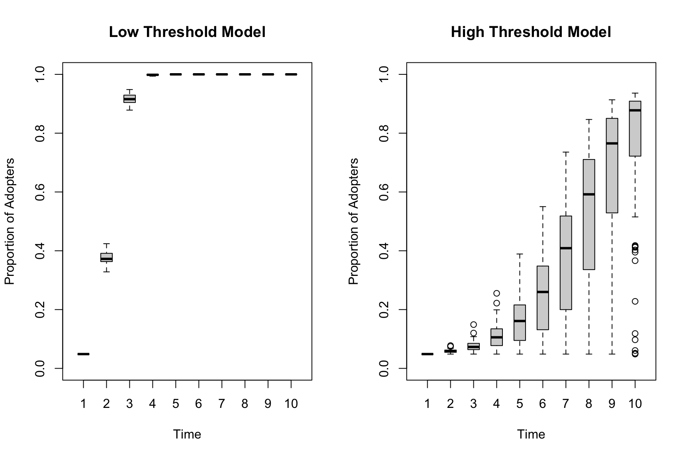

# 14, Part 2. Social Diffusion Processes {.unnumbered #ch14-Network-Diffusion-Social-Processes-R}

This is the second tutorial on diffusion processes in networks. The first tutorial focused on the spread of infectious diseases through a network. Here, we will focus on social diffusion processes, where the item being diffused is not biological and transmission happens via social processes (mimicry of friends, positive exposure to the item, etc.). We use the adoption of an innovation (like a new product) as the motivating case. We explore diffusion processes using a fixed network structure.
 
The main question of this tutorial is how quickly an innovation becomes widely adopted. We are particularly interested in the conditions which increase/decrease the potential for widespread adoption. For example, how does network structure combine with adoption behavior to shape diffusion potential? Is diffusion slower when the network has strong group boundaries? If so, is this always the case, or does it depend on the process by which actors adopt the product? For example, what happens when the probability of adoption (in a given interaction) is very low or very high?  We will consider two main approaches to modeling diffusion processes. First, we will consider simple contagion models, where the probability of adoption is based only on the probability of direct transmission from i to j. Second, we will consider threshold models, where there is some base number of friends that must adopt before an actor will consider adopting; e.g., an actor may only take up a risky behavior if more than 1 of their friends have already done so.  

## Setting up the Session

We will utilize a network from the Add Health study for this tutorial. The basic idea is to condition, or constrain, our analyses on the features of an observed network. Add Health is a study of adolescents in schools. The study collected detailed health and behavior information for each student across a large number of schools. They also collected network information, asking each student to name up to 5 male and 5 female friends. Here, we take one school network as the basis for the analysis. We will utilize a synthetic version of the network; one that is generated based on the original data (with the same basic features) but cannot be linked back to the original data. The network of interest has 658 nodes. We begin by reading in the edgelist: 


```r
url1 <- "https://github.com/JeffreyAlanSmith/Integrated_Network_Science/raw/master/data/addhealth_edgelist.txt"

ah_edgelist <- read.table(file = url1, header = T)
```


```r
head(ah_edgelist) 
```

```
##   sender receiver
## 1      1      274
## 2      1      449
## 3      1      457
## 4      1      564
## 5      2      417
## 6      2      459
```

An edge exists if i nominated j as a friend. Note that the edgelist is based on a network that has already been symmetrized, so that if i nominated j or j nominated i we assume that a tie exists. Let's go ahead and make a network object to be used in our diffusion analysis. We will utilize the **igraph** package.


```r
library(igraph) 
```

Now, we will create an igraph object based on the edgelist read in above. We treat the network as undirected and denote that there are 658 nodes, setting the ids in the vertices statement.  


```r
ah_network <- graph_from_data_frame(d = ah_edgelist, directed = F,
                                    vertices = data.frame(ids = 1:658)) 
```

We will also utilize a second, comparison network in our diffusion analysis. For the second network, we will use a random network with the same number of nodes and degree distribution as in the Add Health network. This offers a nice comparison, as we can see how two networks with the same degree distribution (and thus density) but different structural features yield different diffusion results. Let's go ahead and read in the edgelist for this random network (one could also have created it within R using the `sample_degseq()` function). 


```r
url2 <- "https://github.com/JeffreyAlanSmith/Integrated_Network_Science/raw/master/data/randnet_edgelist_ahexample.txt"

randnet_edgelist <- read.table(file = url2, header = T)
```

And now we create the igraph object from the edgelist:


```r
rand_network <- graph_from_data_frame(d = randnet_edgelist, directed = F, 
                                   vertices = data.frame(ids = 1:658))
```

Let's calculate some basic network statistics for our two networks. We start with density.


```r
edge_density(ah_network)
```

```
## [1] 0.01327763
```

```r
edge_density(rand_network) 
```

```
## [1] 0.01327763
```

We can see the density is the same across the two networks. And now we calculate transitivity.


```r
transitivity(ah_network)
```

```
## [1] 0.1472136
```

```r
transitivity(rand_network) 
```

```
## [1] 0.01814668
```

Clearly transitivity is higher in the Add Health network than in the random network. And now we calculate distance, doing a summary over all distances, excluding the diagonal.


```r
dist_mat_ah <- distances(graph = ah_network, mode = "out") 
summary(dist_mat_ah[dist_mat_ah != 0]) 
```

```
##    Min. 1st Qu.  Median    Mean 3rd Qu.    Max. 
##   1.000   3.000   4.000   3.517   4.000   7.000
```


```r
dist_mat_randnet <- distances(graph = rand_network, mode = "out") 
summary(dist_mat_randnet[dist_mat_randnet != 0])
```

```
##    Min. 1st Qu.  Median    Mean 3rd Qu.    Max. 
##   1.000   3.000   3.000   3.229   4.000   7.000
```

We can see that the distance between nodes tends to be a little higher in the Add Health network. More generally, we can see that the two networks have the same density but otherwise are structurally different, with the Add Health network with higher levels of transitivity and higher distance between nodes. This is indicative of subgroups forming in the school that do not emerge when edges form randomly. 

## Simple Diffusion Models
We will utilize simulation to explore different diffusion processes. In general, simulations are useful as they naturally capture the complex, stochastic process by which items spread (or not) through a network. This would be difficult to capture using traditional statistical models. Simulation also makes it easy to systematically vary key features, while holding others constant. Note that in this analysis we will hold the network fixed within a given simulation. Thus, items flow over a network that does not change over time (see [Chapter 15](#ch15-coevolution-networks-behaviors-siena-saom-R) for the coevolution of behaviors and networks). For concreteness, we can think of the innovation spreading through the network as a new product, where actors who are surrounded by people who adopt the product are more likely to take up the new product themselves. 

Let’s begin the process of specifying our diffusion model. There are a number of possible diffusion models that we may want to explore, but here we focus on simple contagion. In general, the model works by starting, in period 1, with an initial set of seeds who are 'infected' with the item of interest. This can be selected at random or using more specific criteria. In period 2, the first adopter 'interacts' with their immediate neighbor, passing it on with a given probability (either set to explore different conditions or based on actual data). Thus, once i has acquired the item of interest, they can pass it on (probabilistically) to all of the people they are directly connected to; individuals who pick it up from i can then pass it on to their friends, and so on. It is also possible to allow nodes to drop the product, so they no longer use a product they once did. In subsequent periods the process repeats itself with nodes adopting the product, dropping the product and passing it on. Thus, simple contagion works by focusing only on the direct probability of infection from i to j. 

To facilitate running diffusion simulations over these networks, we will make use of a set of simple R functions written for this tutorial. The functions make it easy to run a diffusion simulation where the model is based on simple contagion and the network is held fixed. Let's read these functions in:


```r
source("https://github.com/JeffreyAlanSmith/Integrated_Network_Science/raw/master/R/simple_contagion_function.R")
```

The main function is `simple_contagion_function()`. The arguments are:

- net = network of interest, as an igraph object
- initial_seeds = vector indicating which nodes start as 'infected'
- time_periods = number of periods in simulation
- prob_infection = probability of passing from i to j
- prob_recovery = probability of recovering in a given time period

The function will run a simulation model where the initial seeds start as infected, pass it to their neighbors with the probability set in prob_infection. They adopt probabilistically and the process continues until the simulation reaches the period set in time_periods. 

Here, we will set our inputs to explore the joint effects of network structure and adoption rules on diffusion. We set the probability of infection (or adopting the product) at two different levels, one 'high' and one 'low', to see how differing the probability of adoption shapes diffusion through the network. The high value will be set at .3 (so that j has a .3 probability of adopting the product if i has adopted the product). The low value is set at .1. We will set the recovery rate at .05 in all simulations (so that a node has a .05 probability of dropping the product once adopted). We will run the simulation over 25 time periods. We will pick one node to serve as our initial seed. Note that we would generally want to run this multiple times, with different seeds to see how this affects the results. Here we set node 3 as the seed, our initially infected node.


```r
initial_seeds <- 3
time_periods <- 25
prob_recovery <- .05
```

First, let's run the simulation using the Add Health network and a high transmission probability (prob_infection = .3). For everything else we will use the values set above. Before we run the simulation, let's set a seed in R to make it easier to replicate. 


```r
set.seed(5000) 

ah_simresults_highprob <- simple_contagion_function(net = ah_network, 
                                                    initial_seeds = initial_seeds, 
                                                    time_periods = time_periods, 
                                                    prob_infection = .3, 
                                                    prob_recovery = prob_recovery)
```


```r
names(ah_simresults_highprob) 
```

```
## [1] "results"         "cumulative_prop"
```

The output is a list with two elements. The first part of the list is a list of results, with one element corresponding to each time period in the simulation. For each time period, we see the nodes that are infected (i.e. adopters) and those that are susceptible, those cases who are not infected but could be. The second part of the list is a cumulative distribution, showing the total proportion infected at the end of each time period. 


```r
head(ah_simresults_highprob$cumulative_prop)
```

```
## [1] 0.001519757 0.004559271 0.010638298 0.025835866 0.080547112 0.220364742
```

Now, let's do the same thing using the lower value for the probability of transmission (prob_infection = .1). All other inputs are the same.


```r
ah_simresults_lowprob <- simple_contagion_function(net = ah_network, 
                                                   initial_seeds = initial_seeds, 
                                                   time_periods = time_periods,   
                                                   prob_infection = .1,  
                                                   prob_recovery = prob_recovery)
```

And for the sake of comparison, let's run the same simulations using the random network. Here we use the high transmission probability.


```r
rand_simresults_highprob <- simple_contagion_function(net = rand_network, 
                                                      initial_seeds = initial_seeds, 
                                                      time_periods = time_periods, 
                                                      prob_infection = .3, 
                                                      prob_recovery = prob_recovery)
```

And here we use the low transmission probability.


```r
rand_simresults_lowprob <- simple_contagion_function(net = rand_network, 
                                                     initial_seeds = initial_seeds, 
                                                     time_periods = time_periods, 
                                                     prob_infection = .1, 
                                                     prob_recovery = prob_recovery)
```

Let's take a look at the results. The easiest way to compare the results across runs is to plot the proportion who adopt for each of the four scenarios, the two networks by the two levels of adoption. First, we set up the plot to have 25 time periods on the x-axis and 0 to 1 (proportion adopting) on the y-axis. We then add 4 lines to the plot. The high probability lines will be blue while the low probability lines will be red. We will use a solid line for the random network and a dashed line for the Add Health network. 


```r
plot(x = 1:25, ylim = c(0, 1), type = "n", 
     xlab = "Time Period", ylab = "Proportion Adopting", 
     main = "Diffusion Curves across Networks and Adoption Behavior")

# high transmission probability, random network
lines(x = 1:25, y = rand_simresults_highprob$cumulative_prop, 
      lty = 1, col = "blue")

# high transmission probability, Add Health network
lines(x = 1:25, y = ah_simresults_highprob$cumulative_prop, 
      lty = 2, col = "blue")

# low transmission probability, random network
lines(x = 1:25, y = rand_simresults_lowprob$cumulative_prop, 
      lty = 1, col = "red")

# low transmission probability, Add Health network
lines(x = 1:25, y = ah_simresults_lowprob$cumulative_prop, 
      lty = 2, col = "red")

# adding a legend
legend("bottomright", c("Random Net High Prob", "Add Health High Prob", 
                        "Random Net Low Prob", "Add Health Low Prob"), 
       col = c("blue", "blue", "red", "red"), lty = c(1, 2, 1, 2))
```


We can see that in this case both network structure and adoption behavior (here set by the probability of adoption) have large impacts on diffusion.  For example, looking at the low probability simulations, the random network has a steeper diffusion curve than the Add Health network. The random network has higher rates of early adoption, reaches saturation earlier, and has a higher level of adoption at the end of the 25 time periods. This demonstrates how two networks with the same density (volume of ties) but different patterns of interaction can have different potential for diffusion. More specifically, the Add Health network, with stronger clustering, tends to have slower diffusion (as least in this case). The differences between the random network and the Add Health network are, however, much smaller in the high probability analysis, suggestive of the potentially complex interaction between network structure and adoption behavior. Putting the effects of network structure and behavior together can lead to large differences in diffusion. For example, compare the diffusion curve for the low probability, Add Health network (dashed red line) to the curve for the high probability, random network (solid blue line). 

It is important to note that the results are based on a single run (or only one iteration). If we had run the same simulation again, we would have gotten somewhat different results. More generally, these kinds of simulations can be highly variable. It is thus important to gauge the uncertainty in the estimates (and substantive conclusions) by summarizing over a large number of simulations, although we will not walk through this here. For an analysis like this, we might do 1000 simulations (although the only cost to doing more is computing time). 

## Threshold Models of Diffusion 
We have so far utilized a fairly simple model of diffusion in our analysis. We assumed that nodes passed on the innovation (or cultural item more generally) to their nearest neighbors with a certain probability. But what about if the process of diffusion doesn't work like that? For example, drawing on the diffusion of innovation literature (see Tom Valente's work for example, @Valente2020) we might think that actors adopt (or not) based on the number of people they are connected to that have already adopted. An actor may, for example, only adopt the product if they see that a large number of their friends have already adopted. This is likely to be the case for many actual outcomes, such as adopting a new product, joining a social movement/protest and the like. This is the basic idea behind threshold models of diffusion; where diffusion occurs when a certain threshold of adopters around the focal node is met. Different outcomes may have different kinds of thresholds, while different nodes may have different thresholds for adopting. 

### Simulating Diffusion Processes using the netdiffuseR Package
We will make use of the **netdiffuseR** package [@netdiffuseR] to run our threshold-based diffusion models. This package has many useful functions, but we will primarily focus on the diffusion simulation capabilities. 


```r
library(netdiffuseR)
```

**netdiffuseR** takes the network as a matrix, so we will begin by transforming our network object (in igraph) into a matrix. We will do this for both the Add Health network and the random network. 


```r
ah_network_mat <- as_adjacency_matrix(graph = ah_network)
rand_network_mat <- as_adjacency_matrix(graph = rand_network)
```

The function to run the diffusion simulation is `rdiffnet()`. The main arguments to `rdiffnet()` are:

- t = number of time periods in the simulation
- seed.nodes = nodes to be set as seeds, those who have already adopted the innovation at the beginning of the simulation. This can also be set as a character string, like "random", telling the function to select seeds at random.
- seed.p.adopt = proportion to be selected as seeds if seeds not set by researcher in seed.nodes
- seed.graph = network of interest, as a matrix (or name of random graph to create)
- rewire = T/F, should network slices over time be generated by randomly rewiring ties? 
- threshold.dist = a single value or scalar setting the thresholds (at what point will node i adopt the innovation?). Could also be a function determining the thresholds of each node. 
- exposure.args = inputs to exposure function, such as normalized (T/F, should exposure be calculated as proportion (T) or absolute number of alters who adopt (F)?)

We need to specify the network of interest (seed.graph), either as a static or dynamic graph. We will continue our example and use the static version of the simulation, but it is important to note that it is possible to incorporate a dynamic network into the simulation (see [Chapter 3, Part 2](#ch3-Dynamic-Network-Data-R) for the data structure). We also need to specify the initial seeds (who have adopted the product prior to the start of the simulation), as well as the model of diffusion; i.e., what is the process/rules by which node i will adopt the innovation.

Let's begin by setting the seeds to act as our initial adopters. We will randomly select 5% of the nodes to be seeds. Let's first define the number of nodes in the network.


```r
num_nodes <- nrow(ah_network_mat)
```

Now we will define the number to be selected as initial seeds (5% of the total). 


```r
num_seeds <- round(.05 * num_nodes)
```


```r
num_seeds
```

```
## [1] 33
```

And here we use a `sample()` function to randomly select 33 nodes from the full set of nodes. We use `set.seed()` to help in reproducing the results. 


```r
set.seed(15) 
seeds <- sample(1:num_nodes, size = num_seeds)
```

We will set the rest of the inputs within the function itself. We set time (t) to 10 periods, the network (seed.graph) to the Add Health network and rewire to FALSE. We will also set threshold.dist to 1. This means that each node will adopt the period after at least 1 of their nearest neighbors has adopted the innovation. We can think of this as a low risk product, as nodes adopt with relatively weak signals from their neighbors. We also set normalized to FALSE (in exposure.args) to ensure that the exposure is based on the number of people who have adopted around the focal node and not the proportion (to match the threshold model of 1 neighbor adopting leading to ego's adoption). 


```r
exposure_list <- list(normalized = FALSE)

ah_simresults_threshold1 <- rdiffnet(t = 10, seed.nodes = seeds, 
                                     seed.graph = ah_network_mat, 
                                     rewire = FALSE, threshold.dist = 1, 
                                     exposure.args = exposure_list)
```


```r
class(ah_simresults_threshold1)
```

```
## [1] "diffnet"
```

We can see the resulting object is a diffnet object. Let's take a look at the pieces of this diffnet object.


```r
names(ah_simresults_threshold1)
```

```
## [1] "graph"               "toa"                 "adopt"               "cumadopt"            "vertex.static.attrs" "vertex.dyn.attrs"    "graph.attrs"         "meta"
```

There are a number of useful things here. For example, we can grab the toa vector, showing the time of adoption for each node in the simulation. 


```r
head(ah_simresults_threshold1$toa)
```

```
## 1 2 3 4 5 6 
## 3 1 3 3 2 2
```

We see that node 1 adopted in period 3, node 2 adopted in period 1 and so on. We can also grab the cumadopt matrix, showing the point of adoption for each node. The rows are the nodes and the columns are the time periods. There is a 1 if node i has adopted by time period j. 


```r
head(ah_simresults_threshold1$cumadopt)
```

```
##      [,1] [,2] [,3] [,4] [,5] [,6] [,7] [,8] [,9] [,10]
## [1,]    0    0    1    1    1    1    1    1    1     1
## [2,]    1    1    1    1    1    1    1    1    1     1
## [3,]    0    0    1    1    1    1    1    1    1     1
## [4,]    0    0    1    1    1    1    1    1    1     1
## [5,]    0    1    1    1    1    1    1    1    1     1
## [6,]    0    1    1    1    1    1    1    1    1     1
```

We can use this matrix to calculate the proportion adopting after each time period. We simply sum up the columns (number adopting in period j) and divide by the total number of nodes: 


```r
cumul_adopt <- colSums(ah_simresults_threshold1$cumadopt) / num_nodes
```


```r
head(cumul_adopt)
```

```
## [1] 0.05015198 0.39361702 0.91641337 0.99848024 1.00000000 1.00000000
```

This is the same as using the `cumulative_adopt_count()` function, focusing on the prop row. 


```r
cumulative_adopt_count(ah_simresults_threshold1)
```

```
##                1          2           3            4           5   6   7   8   9  10
## num  33.00000000 259.000000 603.0000000 657.00000000 6.58000e+02 658 658 658 658 658
## prop  0.05015198   0.393617   0.9164134   0.99848024 1.00000e+00   1   1   1   1   1
## rate  0.00000000   6.848485   1.3281853   0.08955224 1.52207e-03   0   0   0   0   0
```

We can see that 0.394 adopted by period 2, 0.916 by period 3, etc. It is also useful to plot the cumulative distribution of adopters. Here we can use the `plot_adopters()` function, with the diffnet object as input. 


```r
plot_adopters(ah_simresults_threshold1)
```


By default, the plot shows the proportion adopting at each time period and the cumulative proportion adopting.

The `plot_diffnet()` function also offers a useful way of representing the results of the simulation. `plot_diffnet()` plots the network at different time slices, coloring the nodes by whether they have adopted the innovation (also differentiating between old and new adopters). Here we plot time period 1, 3, 5 and 7.


```r
plot_diffnet(ah_simresults_threshold1, slices = c(1, 3, 5, 7))
```


Finally, we can do a summary on the diffnet object. Note that this will take a couple seconds to run.


```r
sum_model1 <- summary(ah_simresults_threshold1)
```

```
## Diffusion network summary statistics
## Name     : A diffusion network
## Behavior : Random contagion
## -----------------------------------------------------------------------------
##  Period   Adopters   Cum Adopt. (%)   Hazard Rate   Density   Moran's I (sd)  
## -------- ---------- ---------------- ------------- --------- ---------------- 
##        1         33        33 (0.05)             -      0.01 -0.00 (0.00)     
##        2        226       259 (0.39)          0.36      0.01  0.01 (0.00) *** 
##        3        344       603 (0.92)          0.86      0.01  0.01 (0.00) *** 
##        4         54       657 (1.00)          0.98      0.01 -0.00 (0.00) *   
##        5          1       658 (1.00)          1.00      0.01               -  
##        6          0       658 (1.00)          0.00      0.01               -  
##        7          0       658 (1.00)          0.00      0.01               -  
##        8          0       658 (1.00)          0.00      0.01               -  
##        9          0       658 (1.00)          0.00      0.01               -  
##       10          0       658 (1.00)          0.00      0.01               -  
## -----------------------------------------------------------------------------
##  Left censoring  : 0.05 (33)
##  Right centoring : 0.00 (0)
##  # of nodes      : 658
## 
##  Moran's I was computed on contemporaneous autocorrelation using 1/geodesic
##  values. Significane levels  *** <= .01, ** <= .05, * <= .1.
```

The summary offers the number of adopters in each period, the cumulative number, the cumulative proportion of adopters, as well as a number of other useful summary measures. For example, the hazard (of adopting) is the proportion adopting in that period given they had already 'survived' (i.e., not adopted) prior to that period. So, for period 2 the hazard is: 226 / (658 - 33) = .362, as there are 226 adopters, 658 total nodes and 33 had adopted in period 1. 

### Comparing Diffusion under Different Network and Adoption Behavior Conditions
We are now in a position to systematically change aspects of the simulation, to see how shifts in network structure, adoption behavior, etc. affect the profile of adoption. This is one of the main strengths of simulation, as we can systematically change the features of the world, seeing how these items aggregate up to affect more global outcomes (like the cumulative adoption rate for the whole network). We begin by keeping everything the same but running the simulation over the random network generated above. Thus, only the network structure is allowed to vary from the previous simulation. We change the seed.graph argument (to the random network, specified as a matrix) but nothing else. 


```r
randnet_simresults_threshold1 <- rdiffnet(t = 10, seed.nodes = seeds, 
                                          seed.graph = rand_network_mat, 
                                          rewire = FALSE, threshold.dist = 1, 
                                          exposure.args = exposure_list)
```

Let's also vary the threshold model, governing adoption behavior in the simulation. Here, we will set threshold.dist = 3. This means that nodes must have at least three friends adopt the innovation before they will pick it up themselves. We can think of this as a case of complex contagion, where the item of interest is risky, or uncertain, so that nodes need a higher number of positive signals before adopting. Let's rerun the simulation with this higher threshold, first for the Add Health network and then for the random network. 


```r
ah_simresults_threshold3 <- rdiffnet(t = 10, seed.nodes = seeds, 
                                     seed.graph = ah_network_mat, 
                                     rewire = FALSE, threshold.dist = 3, 
                                     exposure.args = exposure_list)
```


```r
randnet_simresults_threshold3 <- rdiffnet(t = 10, seed.nodes = seeds, 
                                          seed.graph = rand_network_mat, 
                                          rewire = FALSE, threshold.dist = 3, 
                                          exposure.args = exposure_list)
```

We will now plot the results of our four simulations. This will make it easier to compare across the four conditions of interest (random, low threshold; Add Health, low threshold; random, high threshold; Add Health high threshold). We will make use of the `plot_adopters function()`. We will do this four times, once for each of the simulations. 

We begin with the random network, low threshold simulation. We will set up the plot so that the color (bg) is blue and the shape is a triangle (pch = 25). We also set the what argument to "cumadopt" to get the cumulative proportion adopted. We then plot the results for the Add Health network with the low threshold. Here we set the shape to a circle (pch = 21) and also set add = T to add it to the previous plot. We then do the same thing for the high threshold simulations, setting the color to red. We once again use a triangle symbol for the random network and a circle for the Add Health network. 


```r
#random network, low threshold
plot_adopters(randnet_simresults_threshold1, bg = "blue", pch = 25, 
              include.legend = FALSE, what = "cumadopt", 
              main = "Diffusion across Networks and Adoption Behavior") 

#AH network, low threshold
plot_adopters(ah_simresults_threshold1, bg = "blue", pch = 21,
              add = TRUE, what = "cumadopt") 

#random network, high threshold
plot_adopters(randnet_simresults_threshold3, bg = "red", pch = 25,
              add = TRUE, what = "cumadopt")

#AH network, high threshold
plot_adopters(ah_simresults_threshold3, bg = "red", pch = 21,
              add = TRUE, what = "cumadopt")

legend("bottomright", c("Random Net Low Threshold", 
                        "Add Health Low Threshold", 
                        "Random Net High Threshold", 
                        "Add Health High Threshold"), 
       pt.bg = c("blue", "blue", "red", "red"), pch = c(25, 21, 25, 21))
```


There are a number of substantively important results that come out of this figure. First, it is clear that setting a higher threshold dramatically reduces the rate of adoption in the network. The red lines, with high thresholds, are much flatter, with fewer people adopting each period and lower overall rates of adoption at the end of the simulation. This is the case as nodes require more friends to adopt before they adopt, meaning fewer people will take on the innovation in each period. Second, looking at the low threshold simulations, we can see that the random network has slightly higher rates of diffusion than the Add Health network, but the lines are very close together; suggesting (again) that network structure matters less when adoption is easy and fast. Third, the story is very different with the high threshold model. Here, the Add Health network actually has faster diffusion than the random network. Thus, counter to our previous results, the network with strong group structure and higher transitivity actually has faster diffusion when the item of interest is complex (see @centola2007, for example). In the Add Health network, if i and j are friends they are likely to know the same people, making it more likely that a node will get the same kinds of signals (to adopt) from their nearest neighbors. In the random network, i and j are less likely to know the same people, making it harder to have a cluster of people all adopting. Diffusion in the random network is thus particularly slowed with complex contagion, as the focal node must have at least 3 (in this case) of their friends already adopt. More generally, we can see that random networks will not necessarily always have faster diffusion, and this depends crucially on the adoption behavior of the nodes.

Threshold models can be sensitive to the initial seeds and it is substantively important to understand what happens to diffusion potential as different types of nodes are selected as early adopters. To answer this question, we will rerun the same simulations as before but this time select seeds that are central to the network. We will again use the high threshold adoption behavior model. We could, as above, set the seeds for the simulation ourselves. Alternatively, we can handle this within the `rdiffnet()` function by setting seed.nodes to "central" (with seed.p.adopt set to the proportion that are set as seeds, .05). This automates the process, selecting the nodes that are most central to the network and making them seeds. Centrality is defined based on the degree of the nodes.

Here we run the simulation for the Add Health network, with central nodes as seeds and the threshold set to high (threshold.dist = 3) 


```r
ah_simresults_threshold3_central <- rdiffnet(t = 10, seed.nodes = "central", 
                                             seed.p.adopt = .05, 
                                             seed.graph = ah_network_mat, 
                                             rewire = FALSE, 
                                             threshold.dist = 3,
                                             exposure.args = exposure_list)
```

Here we run the same simulation for the random network.


```r
randnet_simresults_threshold3_central <- rdiffnet(t = 10, 
                                                  seed.nodes = "central", 
                                                  seed.p.adopt = .05, 
                                                  seed.graph = rand_network_mat,
                                                  rewire = FALSE, 
                                                  threshold.dist = 3, 
                                                  exposure.args = exposure_list)
```

Now, let's redo our plot, this time comparing the central versus random seed results. We will only consider the high threshold simulations. First, we plot the random network results using central seeds. We will color this blue and use a triangle as the shape (pch = 25). We then plot the Add Health network using central seeds. We color this blue and use the circle as the shape (pch = 21). We then do the same thing for the random seed simulations (here we use red for the color). 


```r
#random network, central seeds
plot_adopters(randnet_simresults_threshold3_central, bg = "blue", pch = 25,
              include.legend = FALSE, what = "cumadopt", 
              main = "Random Versus Central Seeds: High Threshold Results")

#AH, random seeds
plot_adopters(ah_simresults_threshold3_central, bg = "blue", pch = 21,
              add = TRUE, what = "cumadopt")

#random network, central seeds
plot_adopters(randnet_simresults_threshold3, bg = "red", pch = 25,
              add = TRUE, what = "cumadopt")

#AH, random seeds
plot_adopters(ah_simresults_threshold3, bg = "red", pch = 21, 
              add = TRUE, what = "cumadopt")

legend("bottomright", c("Random Net, Central Seeds",
                        "Add Health, Central Seeds", 
                        "Random Net, Rand Seeds", 
                        "Add Health, Rand Seeds"), 
       pt.bg = c("blue", "blue", "red", "red"), pch = c(25, 21, 25, 21))
```


Substantively, we see that the seeds shape the simulation in important ways. Not surprisingly, when central nodes act as early adopters, diffusion tends to be quicker, and this is true for both the random and Add Health networks. What is perhaps more surprising is how much the shift in seeds affects the random network (compared to the Add Health network). With central nodes acting as seeds, the random network once again has faster diffusion than the Add Health network (at least after period 4), even with the complex contagion model. Thus, the Add Health network only has faster diffusion (under complex contagion) when seeds are selected at random. These results demonstrate the interdependencies between factors in the simulation, where having central nodes as seeds spreads the adoption far enough at the beginning to overcome the lack of group structure in the random network, leading to faster diffusion rates in the long run. 

There are a number of other factors we could alter in the simulation. For example, we could specify a more complicated adoption behavior model. So far we have changed the threshold levels for adoption but kept that level the same for every node in the simulation. But a more realistic simulation could allow different nodes to have different thresholds. Perhaps some actors are easily convinced to pick up the new product while others need more convincing. We can parametize this by creating a vector of thresholds, capturing how many friends must adopt before a given node will adopt.

We will demonstrate how to handle heterogeneous thresholds with a simple example. We will begin by setting the threshold of each node by taking a random draw from a uniform distribution with mean 3 (min = 0 and max = 6). Thus, on average, the threshold is the same as in the previous simulations, but here nodes can be a bit above or below the mean value. 


```r
thresholds <- round(runif(n = num_nodes, min = 0, max = 6))
```


```r
head(thresholds)
```

```
## [1] 2 2 4 5 5 2
```

We can see, for example, that node 1 will only adopt when 2 neighbors have already adopted, while node 3 requires 4 neighbors. 

We will now rerun our simulation, using the random seeds (same as used above), the Add Health network, but a different adoption behavioral model than before; in this case, setting threshold.dist to the vector of thresholds, allowing each node to have a different susceptibility to adoption. 


```r
ah_simresults_diffthreshold <- rdiffnet(t = 10, seed.nodes = seeds,
                                        seed.graph = ah_network_mat, 
                                        rewire = FALSE, 
                                        threshold.dist = thresholds,  
                                        exposure.args = exposure_list)
```

And now let's compare the results. We will compare this new simulation (with variable thresholds) to the simulation using the same network and seeds but fixing the threshold at 3 for all nodes. Let's first plot the new model, with the variable thresholds. We will color this blue. We then plot the results with the fixed threshold of 3. We make this red. 


```r
#AH, variable thresholds
plot_adopters(ah_simresults_diffthreshold, bg = "blue", pch = 21, 
              include.legend = FALSE, what = "cumadopt", 
              main = "Comparing Variable and Fixed Thresholds")

#AH, fixed thresholds
plot_adopters(ah_simresults_threshold3, bg = "red", pch = 21, 
              add = TRUE, what = "cumadopt")

legend("bottomright",  
       c("Add Health, Varied Thresholds", "Add Health, Threshold = 3"), 
       pt.bg = c("blue", "red"), pch = c(21, 21))
```


The results clearly show that having variable thresholds increases the rate of diffusion. While some nodes are reluctant to take up the innovation, some need very little prompting (i.e., few neighbors need to adopt before they adopt), making diffusion easier in the early time periods. On the other hand, the variable threshold model plateaus at late time periods (as high threshold nodes are likely slowing down diffusion at the very end of the simulation), while the fixed threshold model does not. 

### Simulations using Multiple Runs
So far, we have run the simulation models for different scenarios. In each case we ran the simulation one time, plotting the results for a particular run. The netdiffuseR package makes it easy to run a simulation multiple times, however. This is useful as it makes it possible to see how variable the results are across different runs of the same basic simulation. In this case, we will rerun our random seed models but do it multiple times, each time using different randomly selected seeds as starting points. Here we will employ a `rdiffnet_multiple()` function. This has identical arguments as rdiffnet but with a few added options to control the multiple runs:

- statistic = function describing the statistic of interest to be calculated for each run
- R = number of times to repeat simulation
- ncpus = number of cores to utilize if using parallel processing

In this case, we first create a function to tell `rdiffnet_multiple()` what outcomes to save out for each simulation. We will create a function to save out the cumulative proportion adopting for each time period (using `cumulative_adopt_count`). Note that the input will be a diffnet object, based on the given simulation. 


```r
stat_func <- function(x) {cumulative_adopt_count(x)["prop", ]}
```

This function then becomes an input to `rdiffnet_multiple()`. We will also set R to 100 (doing 100 simulations) and ncpus to 2 (using 2 processors). We will repeat the analysis twice, first using threshold set to 1 and then using threshold set to 3. In both cases we will use the Add Health network. Note that we need to set seed.nodes to "random" and seed.p.adopt to .05, telling the function to randomly select 5% of the nodes as seeds in each simulation. 


```r
ah_simresults_multiple_threshold1 <- rdiffnet_multiple(statistic = stat_func,
                                                       R = 100, 
                                                       ncpus = 2,
                                                       t = 10, 
                                                       seed.nodes = "random",
                                                       seed.p.adopt = .05, 
                                                    seed.graph = ah_network_mat,
                                                      rewire = FALSE, 
                                                      threshold.dist = 1, 
                                                  exposure.args = exposure_list,
                                                      stop.no.diff = FALSE)
```


```r
class(ah_simresults_multiple_threshold1)
```

```
## [1] "matrix" "array"
```

```r
dim(ah_simresults_multiple_threshold1)
```

```
## [1]  10 100
```

The output is a matrix with 10 rows and 100 columns. The rows correspond to the time periods in the simulation. The columns correspond to the different simulations performed, in this case 100 (set using R). Let's take a look at the first five columns, where each value shows the proportion adopting for that time period and simulation. 


```r
ah_simresults_multiple_threshold1[, 1:5]
```

```
##          [,1]       [,2]       [,3]       [,4]       [,5]
## 1  0.04863222 0.04863222 0.04863222 0.04863222 0.04863222
## 2  0.36170213 0.36626140 0.38753799 0.39969605 0.36778116
## 3  0.92097264 0.91185410 0.91489362 0.94072948 0.90425532
## 4  1.00000000 0.99696049 0.99392097 0.99848024 1.00000000
## 5  1.00000000 1.00000000 1.00000000 1.00000000 1.00000000
## 6  1.00000000 1.00000000 1.00000000 1.00000000 1.00000000
## 7  1.00000000 1.00000000 1.00000000 1.00000000 1.00000000
## 8  1.00000000 1.00000000 1.00000000 1.00000000 1.00000000
## 9  1.00000000 1.00000000 1.00000000 1.00000000 1.00000000
## 10 1.00000000 1.00000000 1.00000000 1.00000000 1.00000000
```

We can see that the first period (row) always has the same proportion adopting (as the number of seeds does not vary across the simulations), but there is variation elsewhere, with different proportions of nodes adopting after each time period in different simulations.  Now we do the same thing but set the threshold to 3 for all nodes.


```r
ah_simresults_multiple_threshold3 <- rdiffnet_multiple(statistic = stat_func,
                                                       R = 100, 
                                                       ncpus = 2, 
                                                       t = 10,
                                                       seed.nodes = "random", 
                                                       seed.p.adopt = .05, 
                                                    seed.graph = ah_network_mat,
                                                       rewire = FALSE, 
                                                       threshold.dist = 3, 
                                                  exposure.args = exposure_list,
                                                      stop.no.diff = FALSE)
```

And now we will plot the two sets of results as a series of boxplots. We will have two plots, one for the low threshold model and one for the high threshold model. The x-axis will be the time period and each boxplot will capture the distribution of proportion adopting across simulations. We set up the plot to have two panels. Note that we transpose the matrices so that we put the time periods on the x-axis.


```r
par(mfrow = c(1, 2))

# Low threshold
boxplot(t(ah_simresults_multiple_threshold1), xlab = "Time", 
        ylab = "Proportion of Adopters",  
        main = "Low Threshold Model", boxwex = .5, ylim = c(0, 1))

# High threshold
boxplot(t(ah_simresults_multiple_threshold3), xlab = "Time",
        ylab = "Proportion of Adopters", 
        main = "High Threshold Model", boxwex = .5, ylim = c(0, 1))
```



The variance is clearly lower (across simulation runs) for the low threshold model compared to the high threshold model. The low threshold model has such easy diffusion that global adoption happens quickly in every simulation. The high threshold model has the real potential for diffusion to not occur, meaning the initial seeds matter more and there is more variation run to run. 

## Working with Empirical Data
Our analysis has thus far focused on using simulation to understand the conditions that amplify/dampen the potential for widespread diffusion. The netdiffuseR package also has a number of useful functions for dealing with empirical data. Here we assume that a researcher has collected information about the adoption of an innovation (product, etc.) over time and would like to model this is as a threshold process. 

Let's begin by reading in some example data for us to use. The data are based on the same Add Health network used above. We will read in a data frame containing the attributes of those nodes. 


```r
url3 <- "https://github.com/JeffreyAlanSmith/Integrated_Network_Science/raw/master/data/addhealth_attributes.txt"

ah_attributes <- read.table(file = url3, header = T)
```


```r
head(ah_attributes) 
```

```
##   ids gender  race grade toa
## 1   1 female white    12  NA
## 2   2   male white    11  NA
## 3   3 female white    11   8
## 4   4 female white     9   4
## 5   5   male white    12   4
## 6   6   male white    10   5
```

We see that the data contain basic demographic information, like `gender` and `grade`. The data frame also contains a variable called `toa`, which is a variable showing the time of adoption for a new product (constructed for this example). NA indicates that the node never adopted the new product. A researcher with this kind of data, coupled with the network data used above, may be interested in knowing if people tend to adopt if their neighbors adopt. They may also want to know which actors have higher/lower thresholds of adoption, showing which actors take up the adoption easily and which need more prompting. 

The first step is to create a diffnet object based on the empirical data. Once we create our diffnet object we will able to make use of the various summary functions used above (demonstrated on the diffnet objects outputted from the simulation). We will make use of the `new_diffnet()` function to create the diffnet object. The main arguments are:

- graph = network of interest. This can be a static or dynamic (longitudinal) network.
- toa = vector showing time of adoption for each node
- vertex.static.attrs = data frame showing attributes for each node (restricted to attributes that don't change over time); see vertex.dyn.attrs for attributes that are allowed to change over time. 

Here, we create a new diffnet object based on the Add Health network, attributes and time of adoption. 


```r
ah_diffnet <- new_diffnet(graph = ah_network_mat, toa = ah_attributes$toa, 
                          vertex.static.attrs = ah_attributes)
```


```r
ah_diffnet
```

```
## Dynamic network of class -diffnet-
##  Name               : Diffusion Network
##  Behavior           : Unspecified
##  # of nodes         : 658 (1, 2, 3, 4, 5, 6, 7, 8, ...)
##  # of time periods  : 10 (1 - 10)
##  Type               : directed
##  Final prevalence   : 0.86
##  Static attributes  : ids, gender, race, grade, toa (5)
##  Dynamic attributes : -
```

Let's do a summary on the diffnet object (again, this can take a few seconds to run).


```r
summary(ah_diffnet) 
```

```
## Diffusion network summary statistics
## Name     : Diffusion Network
## Behavior : Unspecified
## -----------------------------------------------------------------------------
##  Period   Adopters   Cum Adopt. (%)   Hazard Rate   Density   Moran's I (sd)  
## -------- ---------- ---------------- ------------- --------- ---------------- 
##        1         33        33 (0.05)             -      0.01 -0.00 (0.00)     
##        2         31        64 (0.10)          0.05      0.01  0.00 (0.00) *** 
##        3         47       111 (0.17)          0.08      0.01  0.01 (0.00) *** 
##        4         74       185 (0.28)          0.14      0.01  0.01 (0.00) *** 
##        5        104       289 (0.44)          0.22      0.01  0.02 (0.00) *** 
##        6        109       398 (0.60)          0.30      0.01  0.02 (0.00) *** 
##        7         87       485 (0.74)          0.33      0.01  0.01 (0.00) *** 
##        8         55       540 (0.82)          0.32      0.01  0.01 (0.00) *** 
##        9         18       558 (0.85)          0.15      0.01  0.01 (0.00) *** 
##       10          7       565 (0.86)          0.07      0.01  0.01 (0.00) *** 
## -----------------------------------------------------------------------------
##  Left censoring  : 0.05 (33)
##  Right centoring : 0.14 (93)
##  # of nodes      : 658
## 
##  Moran's I was computed on contemporaneous autocorrelation using 1/geodesic
##  values. Significane levels  *** <= .01, ** <= .05, * <= .1.
```

A simple summary, as we saw above, offers important information, like number of adopters, cumulative proportion and the hazard rate of adoption. Note that we can use the plotting functions (like `plot_adopters()` and `plot_diffnet()`) to display the results. 

The first key question we will address is how the adoption thresholds vary across our nodes. As a researcher, we will not directly observe the threshold for each node, showing at what point they would have adopted the innovation (unlike with the simulations, where this was a known input). Rather, we simply get the exposure of each node to the innovation and the time of adoption. We can, however, use these two pieces of information to estimate the range of possible thresholds for each node (assuming that a threshold model of adoption fits this case well, so that nodes actually adopt the innovation after a certain number of their neighbors have done so). 

We will begin by getting the exposure of each node to the innovation using the `exposure()` function. The arguments are:

- graph = the diffnet object
- normalized = T/F; T if results should be presented as proportion of neighbors who have adopted; F if reported as counts 
- lags = period, in lags, from which to output exposure; if set to 0 then outputs level of exposure in given period. 

First, let's grab the level of exposure at each time period with no lags. 


```r
exposure_overall <- exposure(ah_diffnet, normalized = FALSE, lags = 0)
```


```r
head(exposure_overall) 
```

```
##   1 2 3  4  5  6  7  8  9 10
## 1 0 0 0  1  3  4  4  4  4  4
## 2 0 0 0  0  0  1  1  1  1  2
## 3 0 0 0  1  2  5  6  6  7  7
## 4 1 2 3  4  7 10 11 11 11 12
## 5 2 3 8 10 12 13 13 13 13 13
## 6 0 0 1  3  5  8  8 10 10 10
```

The rows correspond to the nodes in the network. The columns correspond to time periods. The values show the number of friends in that period, for that node, who have already adopted the innovation, thus capturing the exposure of node i. We can see, for example, that node 1 had 0 friends adopt until period 4, where they had 1 friend adopt, then 3 friends had adopted by period 5 and so on. Now, we will take our results from the `exposure()` function and use it to estimate the underlying threshold for each node. We will begin by calculating the level of exposure prior to adoption, or lagged exposure. The function is `threshold()`. The main arguments are:

- obj = exposure matrix
- toa = vector showing time of adoption
- lags = time of exposure to consider; lags = 1 is T - 1; lags = 2 is T - 2 and so on. 

The basic idea is that each node adopts the period after their threshold is met (assuming the threshold model is appropriate in this case). If a node adopts in period T, then they must have reached their threshold in period T - 1. We also know that they did not adopt in period T - 1, meaning the threshold had not been met in period T - 2. We can thus calculate the range of possible thresholds by calculating the exposure at T - 2 and T - 1. We thus need to calculate exposure using lags = 2 and lags = 1. Let's first look at the level of exposure two periods prior to adoption.


```r
thresh_lag2 <- threshold(obj = exposure_overall, toa = ah_diffnet$toa, 
                         lags = 2)
```


```r
head(thresh_lag2)
```

```
##   threshold
## 1        NA
## 2        NA
## 3         5
## 4         2
## 5         3
## 6         1
```

We can see that for node 3 (node 1 and node 2 did not adopt) that 5 of their friends had adopted the innovation 2 periods prior to their own adoption. Now, let's do the same thing looking at the period prior to adoption. 


```r
thresh_lag1 <- threshold(obj = exposure_overall, 
                         toa = ah_diffnet$toa, lags = 1)
```


```r
head(thresh_lag1)
```

```
##   threshold
## 1        NA
## 2        NA
## 3         6
## 4         3
## 5         8
## 6         3
```

Here we see that node 3 had 6 friends adopt prior to their own adoption. Let's put those two vector together in a data frame. The latent threshold level must be greater than the exposure at T - 2 (as they did not adopt in T - 1) and less than or equal to the exposure at T - 1 (as they did adopt in T). 


```r
threshold_dat <- data.frame(lower_bound = thresh_lag2[, 1], 
                            upper_bound = thresh_lag1[, 1])
```


```r
head(threshold_dat)
```

```
##   lower_bound upper_bound
## 1          NA          NA
## 2          NA          NA
## 3           5           6
## 4           2           3
## 5           3           8
## 6           1           3
```

This would suggest that node 3 has a latent threshold that must be greater than 5 and less than or equal to 6, making the threshold equal to 6 in this case. Or, looking at node 5, we see the threshold must be greater than 3 and less than or equal to 8 (so between 4 and 8). We do not know where the threshold is in that range, only that 3 was too little to have them adopt and that 8 was enough. Whether it took all 8 friends to convince them or less would have done it, is unclear from the data. 

We can go one step further and actually estimate a diffusion regression model, estimating the effect of exposure on the probability of adopting. The outcome of interest is whether a node adopted the innovation (0 = no adoption; 1 = adoption) at a given time period. The units are thus node X time period. So, if node i adopted in period 3, they would have a 0, 0, 1 as the outcome of interest. If node j adopted in period 4, they would have a 0, 0, 0, 1 as the outcome. The main independent variable is the level of exposure for each node in the previous period (how many friends around node i has already adopted the innovation?). Here we can make use of the handy `diffreg()` function, which will take our diffnet object and put it in a form appropriate for a logistic regression (estimated using glm). As a researcher, you simply need to put in a formula with the diffnet object as the outcome. The main predictor is exposure, here set to the exposure in T - 1 (so the exposure prior to the period in question). We will also include controls for time period, as adoption might start off quick but slow down over time. This is accomplished by using factor(per) in the formula. 


```r
diffnet_model1 <- diffreg(ah_diffnet ~ exposure(normalized = F, lags = 1) + 
                            factor(per), type = "logit")
```


```r
summary(diffnet_model1)
```

```
## 
## Call:
## glm(formula = Adopt ~ exposure + factor(per), family = binomial(link = "logit"), 
##     data = dat, subset = ifelse(is.na(toa), TRUE, toa >= per))
## 
## Coefficients:
##               Estimate Std. Error z value Pr(>|z|)    
## (Intercept)   -3.85357    0.20086 -19.186  < 2e-16 ***
## exposure       1.16615    0.05139  22.691  < 2e-16 ***
## factor(per)3  -0.30245    0.26504  -1.141 0.253815    
## factor(per)4  -0.45997    0.26052  -1.766 0.077474 .  
## factor(per)5  -0.54952    0.26307  -2.089 0.036718 *  
## factor(per)6  -0.58495    0.27179  -2.152 0.031382 *  
## factor(per)7  -0.97272    0.29785  -3.266 0.001092 ** 
## factor(per)8  -1.09052    0.32706  -3.334 0.000855 ***
## factor(per)9  -2.00491    0.39573  -5.066 4.05e-07 ***
## factor(per)10 -2.80214    0.50595  -5.538 3.05e-08 ***
## ---
## Signif. codes:  0 '***' 0.001 '**' 0.01 '*' 0.05 '.' 0.1 ' ' 1
## 
## (Dispersion parameter for binomial family taken to be 1)
## 
##     Null deviance: 2900.5  on 3258  degrees of freedom
## Residual deviance: 1700.3  on 3249  degrees of freedom
##   (658 observations deleted due to missingness)
## AIC: 1720.3
## 
## Number of Fisher Scoring iterations: 6
```

We can see that the exposure does seem to predict adoption in this case (a positive, significant coefficient on exposure), net of the baseline time trends in adoption. The odds of adopting the innovation increase by exp(1.16615) = 3.210 times for every additional friend who had adopted the innovation in the previous period.  

We can also include controls for individual characteristics, important if we are trying to isolate the effect of exposure from individual propensities to adopt. Here we will control for gender and grade. These attributes are immediately available to be included in the formula as they were part of the original diffnet object constructed above. 


```r
diffnet_model2 <- diffreg(ah_diffnet ~ exposure(normalized = F, lags = 1) + 
                            factor(per) + factor(gender) + grade, type = "logit")
```


```r
summary(diffnet_model2)
```

```
## 
## Call:
## glm(formula = Adopt ~ exposure + factor(per) + factor(gender) + 
##     grade, family = binomial(link = "logit"), data = dat, subset = ifelse(is.na(toa), 
##     TRUE, toa >= per))
## 
## Coefficients:
##                    Estimate Std. Error z value Pr(>|z|)    
## (Intercept)        -4.15794    0.64658  -6.431 1.27e-10 ***
## exposure            1.16647    0.05147  22.662  < 2e-16 ***
## factor(per)3       -0.30610    0.26589  -1.151  0.24963    
## factor(per)4       -0.44895    0.26124  -1.719  0.08570 .  
## factor(per)5       -0.53517    0.26393  -2.028  0.04259 *  
## factor(per)6       -0.55529    0.27236  -2.039  0.04147 *  
## factor(per)7       -0.94968    0.29917  -3.174  0.00150 ** 
## factor(per)8       -1.02542    0.32808  -3.126  0.00177 ** 
## factor(per)9       -1.94833    0.39604  -4.919 8.68e-07 ***
## factor(per)10      -2.76384    0.50760  -5.445 5.18e-08 ***
## factor(gender)male -0.38988    0.12814  -3.043  0.00235 ** 
## grade               0.04644    0.05824   0.797  0.42525    
## ---
## Signif. codes:  0 '***' 0.001 '**' 0.01 '*' 0.05 '.' 0.1 ' ' 1
## 
## (Dispersion parameter for binomial family taken to be 1)
## 
##     Null deviance: 2900.5  on 3258  degrees of freedom
## Residual deviance: 1690.7  on 3247  degrees of freedom
##   (658 observations deleted due to missingness)
## AIC: 1714.7
## 
## Number of Fisher Scoring iterations: 6
```

The results suggest that exposure is still an important predictor of adoption, net of these individual-level controls. Note that the model assumes that there is no selection effect (so that individuals do not strongly form ties based on both having already adopted the innovation). If this assumption is badly violated, we would want to consider alternative modeling strategies, such as the models explored in [Chapter 15](#ch15-coevolution-networks-behaviors-siena-saom-R). 

Overall, this tutorial has demonstrated the complex ways that network structure and adoption behavior come together to shape diffusion rates. For example, we saw that random networks tend to have fast diffusion, but not always, particularly when the item of interest is a risky one, requiring many people to adopt before actors will take up the innovation. We explored many different simulations but there are a number of ways that we could have extended our analysis. For example, we could have considered how homophily affects diffusion rates. It may be the case that individuals are influenced to a greater extent by those similar to them (here in terms of grade or gender). We could alter the adoption behavior model to put more weight on certain friends. We could then see how diffusion rates vary, given this homophily-based adoption model, in the random network (low homophily) and Add Health network (high homophily). Similarly, our analysis utilized a static network, but it is possible to incorporate a dynamic network, where the ties change over time. By incorporating a dynamic network, we can see how patterns of tie gain and loss affect the potential for diffusion in the network. We explore similar problems in [Chapter 15](#ch15-coevolution-networks-behaviors-siena-saom-R), where we cover the coevolution of behaviors and networks using SIENA models (see also [Part 1](#ch14-Network-Diffusion-Infectious-Diseases-R) from this chapter).


