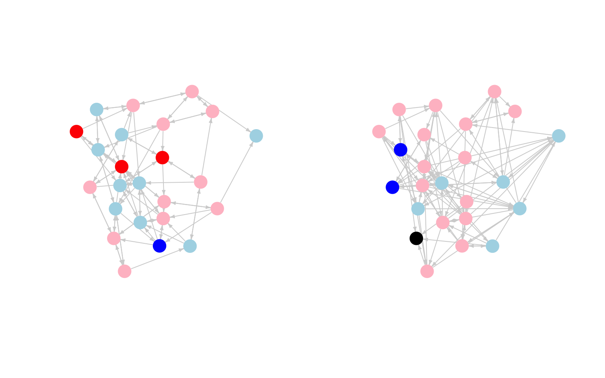

# Social Influence: Coevolution of Networks and Behaviors {#ch15-coevolution-networks-behaviors-siena-saom-R}

Chapter 15 covers models of social influence. We are interested in how actors come to resemble their peers in terms of behaviors (or attitudes, tastes, etc.). We will address questions of peer influence using SIENA (Simulation Investigation for Empirical Network Analysis), a stochastic actor orientated model (SAOM) designed to statistically capture the coevolution of networks and behaviors [@snijders2010; @steglich2010].

SIENA models accomplish similar tasks as the STERG models in [Chapter 13](#ch13-Longitudinal-Network-Models-STERGM-R), in terms of modeling network dynamics. With SIENA, however, it becomes possible to simultaneously look at changes in behaviors and network ties, opening up questions about influence, selection and wider network processes. Thus, with SIENA, we can still predict how ties change from T to T+1, as a function of mechanisms like reciprocity, but here we can also ask about peer influence on behavior (e.g., alcohol consumption). In this way, the tutorial connects the statistical models of [Chapter 13](#ch13-Statistical-Models-Networks-R) (e.g., ERGM) to the diffusion models of [Chapter 14](#ch14-Network-Diffusion-R). And more substantively, we can think of SIENA as combining ERGM-like models with an explicit model of influence. 

Empirically, we focus on problems related to peer influence and selection in the case of adolescents at school. We offer two empirical examples. The first example utilizes a small classroom-based network. The data were collected by Daniel McFarland. There are two waves of data, corresponding to semester 1 and semester 2. The key outcome of interest is how much each student liked the subject of the class, measured in both semester 1 and semester 2. There is also data on friendships for both semesters. We want to know if students tend to converge on attitudes (about how much they like the subject) with people they are friends with. We also want to see how peer influence fits into a larger picture of network change, where ties are being added and dropped over time. For example, are students similar in terms of liking the subject because of peer influence or because they select friends with similar attitudes about the class (i.e., we want to differentiate between influence and selection)? The second part of the tutorial will offer a short example focused on alcohol use. 

It is worth noting that SIENA models are designed for fairly small networks. Researchers interested in estimating peer influence effects in larger network settings (e.g., n > 2500) are likely to consider alternative approaches; such as those using more conventional regression models, which tend to scale better (see @Ragan2022 for a comparison of conventional regression models and SIENA). 

## Reading in Classroom Data
We begin with the classroom example. Let's read in the data and get it ready for the analysis. Here we read in the semester 1 edgelist.


```r
url1 <- "https://github.com/JeffreyAlanSmith/Integrated_Network_Science/raw/master/data/class237_sem1_edgelist.txt"

sem1_edgelist <- read.table(file = url1, header = T)
```


```r
head(sem1_edgelist)
```

```
##   sender receiver
## 1 113214   121470
## 2 113214   125522
## 3 113214   149552
## 4 113214   122728
## 5 113214   122706
## 6 115909   127535
```

The first column shows the sender of the tie and the second column shows the receiver of the tie. An edge exists between i->j if i named j as a friend. Let's read in the semester 2 edgelist. 


```r
url2 <- "https://github.com/JeffreyAlanSmith/Integrated_Network_Science/raw/master/data/class237_sem2_edgelist.txt"

sem2_edgelist <- read.table(file = url2, header = T)
```

Let’s also read in the attribute file, containing nodal characteristics.


```r
url3 <- "https://github.com/JeffreyAlanSmith/Integrated_Network_Science/raw/master/data/class237_attributes.txt"

attributes <- read.table(file = url3, header = T)
```


```r
head(attributes)
```

```
##      ids sem_id cls_id expected_grade like_subject had_teacher_before like_teacher course_challenging
## 1 113214      1    237              4            4                  0            3                  1
## 2 121470      1    237              3            2                  0            3                  3
## 3 122728      1    237              4            2                  0            3                  2
## 4 125522      1    237              4            3                  0            3                  4
## 5 126359      1    237              4            4                  0            4                  3
## 6 122706      1    237              4            3                  0            3                  3
```

The main variables are: `ids` = id of actor; `sem_id` = semester where data comes from; expected_grade: D = 1 C = 2 B = 3 A = 4; `like_subject`: 1-4 scale, with 1 = strong dislike to 4 = like it a lot; `like_teacher`: 1-4 scale, with 1 = strong dislike to 4 = like it a lot. 

Let’s load some useful packages. We will utilize the **igraph** package to start. 


```r
library(igraph) 
library(reshape)
library(car)
```

As this is over time data, we need to be aware of the fact that nodes can come in and out of the network through time. It is possible to do the analysis while incorporating the changing composition of the network (e.g., using structural zeros for the missing cases, as in the two-mode STERGM example in [Chapter 13](#ch13-Two-mode-Network-Models-ERGM-STERGM-R)) and we will consider this in the second example below. Here we will keep things simple and only consider students who were in both semester 1 and semester 2. Let's find out which students were in both semesters.


```r
ids_sem1 <- attributes$ids[attributes$sem_id == 1]
ids_sem2 <- attributes$ids[attributes$sem_id == 2]
```

Here we identify the cases from semester 1 that were also in semester 2.


```r
ids_keep <- ids_sem1[ids_sem1 %in% ids_sem2]
```

Now, let's subset the attribute data frame and the edgelists to only include those students in both semesters.


```r
attributes <- attributes[attributes$ids %in% ids_keep, ]

send_in_sem1 <- sem1_edgelist[,1] %in% ids_keep
rec_in_sem1 <- sem1_edgelist[,2] %in% ids_keep
sem1_edgelist <- sem1_edgelist[send_in_sem1 & rec_in_sem1, ]

send_in_sem2 <- sem2_edgelist[,1] %in% ids_keep
rec_in_sem2 <- sem2_edgelist[,2] %in% ids_keep
sem2_edgelist <- sem2_edgelist[send_in_sem2 & rec_in_sem2, ]
```

Let's also create separate attribute data frames for semester 1 and semester 2.


```r
sem1_attributes <- attributes[attributes$sem_id == 1, ]
sem2_attributes <- attributes[attributes$sem_id == 2, ]
```

With our attribute and edgelist data frames together, we can now go ahead and construct the networks for each semester. First, we create an igraph object using the semester 1 inputs:


```r
sem1_net <- graph_from_data_frame(d = sem1_edgelist, directed = T,
                                  vertices = sem1_attributes)
```

Now using the semester 2 inputs:


```r
sem2_net <- graph_from_data_frame(d = sem2_edgelist, directed = T,
                                  vertices = sem2_attributes)
```

We will begin with a simple plot of the two networks. The goal is to get an initial picture of what the network looks like and whether there is any evidence of influence, in terms of liking the subject matter. For our plot, we want to color the nodes by how much they like the subject. We will code it such that blue means not liking the subject and red means liking the subject. We will set missing values to black. 


```r
cols_sem1 <- recode(sem1_attributes$like_subject, as.factor = F,
                    "1 = 'blue'; 2 = 'light blue'; 3 = 'pink'; 
                     4 ='red'; NA = 'black'")

cols_sem2 <- recode(sem2_attributes$like_subject, as.factor = F,
                    "1 = 'blue'; 2 = 'light blue'; 3 = 'pink'; 
                     4 = 'red'; NA = 'black'")
```

We want to plot both networks (semester 1 and semester 2) side by side. We will first get the coordinates of the nodes so the networks are aligned the same in the plot. We will base the layout on the first semester network.


```r
layout <- layout.fruchterman.reingold(sem1_net)
```

Here we plot the semester 1 and semester 2 networks, coloring the nodes based on how much they like the subject in that semester. 


```r
par(mfrow = c(1, 2))

plot(sem1_net, vertex.label = NA, layout = layout, edge.arrow.size = .3, 
     edge.arrow.width = 1, edge.color="light gray",
     vertex.frame.color = NA, vertex.color = cols_sem1) 

plot(sem2_net, vertex.label = NA, layout = layout, edge.arrow.size = .3,
     edge.arrow.width = 1, edge.color = "light gray",
     vertex.frame.color = NA, vertex.color = cols_sem2) 
```



It looks like there may be some weak clustering by how much people like the subject. It is a bit difficult to tell from the plot if people are converging with their friend's attitudes, although it does look like students who really like the subject in semester 1 tend to have more moderate views by semester 2 (moving from red to pink). That could be a sign of peer influence, but we need to examine such hypotheses more carefully. 

## SIENA Model Setup
We now move to more formally testing our hypotheses about peer influence. The question is whether students converge with their friends in terms of how much they like the subject matter. We will address this question while also considering the larger context in which actors are forming and breaking ties. With SIENA models, the basic idea is to model the coevolution of network ties and outcomes, simultaneously predicting changes in ties (what factors make a friendship more likely to be added/kept?) and changes in behaviors (what factors make it more likely to increase liking the subject?). In this way, we can explore the existence (or not) of peer influence while also controlling for nodal, dyadic and triadic processes that affect both the formation of ties and the outcome of interest (here interest in the subject). The analysis requires the **RSiena** package [@RSiena].


```r
library(RSiena)
```

**RSiena** requires that, before the model is run, the data be shaped into objects specifying their role in the analysis. Here we walk through that process on our classroom network data. Let's first get the network data in a matrix form. We will do this for both semester 1 and semester 2.


```r
sem1_matrix <- as_adjacency_matrix(graph = sem1_net, sparse = F)
sem2_matrix <- as_adjacency_matrix(graph = sem2_net, sparse = F)
```

And let's check that the row names are the same between the semester 1 and semester 2 matrices:


```r
table(rownames(sem1_matrix) == rownames(sem2_matrix))
```

```
## 
## TRUE 
##   24
```

Looks good. Let's see how much change there is in terms of ties from semester 1 to semester 2.


```r
tab_change <- table(sem1_matrix, sem2_matrix)
```


```r
tab_change
```

```
##            sem2_matrix
## sem1_matrix   0   1
##           0 429  58
##           1  47  42
```

We can see that 42 ties are stable, 58 new ties were formed and 47 were dropped. We can use this information to calculate the Jaccard index, showing how similar (or stable) the network in time 1 is to the network in time 2. Formally, the Jaccard index is defined as: N11 / (N01 + N10 + N11), where N11 is the number of ties that were in both semesters (42), N01 is the number of ties that were not in time 1 but were in time 2 (58) and N10 is the number of ties that were in time 1 but not in time 2 (47).


```r
42 / (58 + 47 + 42)
```

```
## [1] 0.2857143
```

We can see that .286 of the total number of ties (time 1 and time 2) were in both semesters. When the average degree is stable period to period, we want Jaccard values above .3, while values below .2 suggest there might be estimation problems. Lower Jaccard values are less problematic when average degree is increasing or decreasing. Here, we see a value slightly under .3, while the average degree has gone up somewhat between semester 1 and semester 2 (3.708 to 4.167). This suggests that we should be sensitive to possible estimation problems, but we are okay to proceed with our models. We should also keep in mind that the network itself is quite small (24 actors), which might lead to uncertain estimates.

As a final preliminary check, let's also make sure that the ids in the attribute data frames are sorted in the same order.


```r
table(sem1_attributes$ids == sem2_attributes$ids)
```

```
## 
## TRUE 
##   24
```

Looks right. We can now go ahead and start to manipulate our data, putting it in a form that the **RSiena** package can use. As a first step, we will gather the matrices into an array. **RSiena** requires that the networks be put together as an n X n X p array, where n is the size of the network and p is the number of time periods. Let's first define the size of the network (based on the number of rows in the input matrix).


```r
net_size <- nrow(sem1_matrix)
```


```r
net_size
```

```
## [1] 24
```

Now, we can create the array based on the two matrices, setting the dimensions based on net_size, as well as the number of time periods (2).


```r
sem12_array <- array(c(sem1_matrix, sem2_matrix), 
                     dim = c(net_size, net_size, 2))
```


```r
dim(sem12_array)  
```

```
## [1] 24 24  2
```

We can see that we have a 24 x 24 x 2 array. We can now begin to set up the model, preparing certain objects for the main `siena07()` function. Remember that SIENA models allow for the joint modeling of network change and behavior change. We thus have two kinds of models, and thus two kinds of dependent variables. As a first step, we will construct a dependent variable based on the network, so the ties (or tie change) is the outcome of interest. The function is `sienaDependent()`. The main arguments are:

- netarray = matrix (for behaviors) or array (for network outcomes) showing behavioral or network values to predict
- type = type of dependent variable (e.g., behavior, oneMode)

Here we include the array constructed above based on the semester 1 and semester 2 networks. The type is oneMode, indicating a one-mode network. 


```r
networks <- sienaDependent(netarray = sem12_array, type = "oneMode") 
```

Now, we will construct the second dependent variable, based on our 'behavior' of interest, here how much they liked the subject in semester 1 and semester 2. The inputs are the over time values for liking the subject, constructed as a matrix.


```r
like_subject_matrix <- as.matrix(cbind(sem1_attributes$like_subject,
                                       sem2_attributes$like_subject))
```


```r
head(like_subject_matrix)
```

```
##      [,1] [,2]
## [1,]    4    3
## [2,]    2    1
## [3,]    2    3
## [4,]    3    1
## [5,]    4    3
## [6,]    3    3
```

We again use the `sienaDependent()` function to construct our dependent variable, but here netarray is set to the like_subject matrix and type is set to "behavior".


```r
like_subject <- sienaDependent(netarray = like_subject_matrix, 
                               type = "behavior") 
```

Let's also create an object that captures covariates (i.e., predictors) to be included in the model. This will typically be fixed characteristics, like gender and race/ethnicity. Here, we will include a covariate capturing if the students liked the teacher in semester 1.  The function to create covariates is `coCovar()`.


```r
like_teacher <- coCovar(sem1_attributes$like_teacher)
```

We would want to use the `varCovar()` function if the variable of interest has changing values over time. The input is an n by M - 1 matrix, where n is the number of nodes in the network and M is the number of time points (the final observation is excluded). It is only appropriate to use `varCovar()` if there are at least 3 periods of data.

Now, we will put the constructed objects together using a `sienaDataCreate()` function. This siena object will be one of the main inputs into the function to run the model. 


```r
net_behavior_covar <- sienaDataCreate(networks, like_subject, like_teacher)
```


```r
net_behavior_covar 
```

```
## Dependent variables:  networks, like_subject 
## Number of observations: 2 
## 
## Nodeset                  Actors 
## Number of nodes              24 
## 
## Dependent variable networks 
## Type               oneMode  
## Observations       2        
## Nodeset            Actors   
## Densities          0.16 0.18
## 
## Dependent variable like_subject
## Type               behavior    
## Observations       2           
## Nodeset            Actors      
## Range              1 - 4       
## 
## Constant covariates:  like_teacher
```

We see basic information about our network, like density and number of nodes, as well as useful information about the behavior of interest (such as the range of values).

## Model Specification 
We now take our constructed siena object and specify the model we want to use to predict changes in ties and changes in behaviors, here about how much they like the subject. The model is based on an evaluation function, where actors evaluate adding/dropping ties and changing behavior based on the specified model. Positive coefficients suggest the change is more likely than chance expectations, while negative coefficients suggest the change is less likely. The coefficients are estimated based on the observed tendencies seen in the input data, in terms of network and behavioral change. For example, with the network model, if actors select friends with similar behaviors as themselves, we would expect a positive coefficient on the selection term. Or, for the behavior model, if actors tend to converge on behaviors with their friends, we would expect a positive peer influence term.

**RSiena** works by 'building up' the model. We first get the base terms using a `getEffects`() function and then use an `includeEffects()` function to add terms to the base model. Let's start with getting the base model, with the main input as the siena object created above.


```r
siena_effects <- getEffects(net_behavior_covar)
```


```r
siena_effects 
```

```
##   name         effectName                    include fix   test  initialValue parm
## 1 networks     basic rate parameter networks TRUE    FALSE FALSE    9.12260   0   
## 2 networks     outdegree (density)           TRUE    FALSE FALSE   -0.71940   0   
## 3 networks     reciprocity                   TRUE    FALSE FALSE    0.00000   0   
## 4 like_subject rate like_subject period 1    TRUE    FALSE FALSE    0.81028   0   
## 5 like_subject like_subject linear shape     TRUE    FALSE FALSE   -0.10773   0   
## 6 like_subject like_subject quadratic shape  TRUE    FALSE FALSE    0.00000   0
```

The first thing to note is that there are two kinds of model terms here, one predicting how the network changes over time (name = networks) and one predicting how much they like the subject changes over time (name = like_subject). We can see that the network model, by default, includes a term for density, tie change (the rate of change between T1 and T2) and reciprocity. The default model for attitudes about the subject are the base rate of change for liking the subject, and linear and quadratic terms, showing tendencies for actors with too high (or low) values (compared to the mean) to increase/decrease their preferences. Now, let's start adding terms to the model. 

### Model Specification: Behavioral Model 
First, we will focus on the behavioral model, predicting how like_subject changes across semesters. The function to add terms is `includeEffects()`. The main arguments are:

- myeff = siena object of effects
- name of term to include
- interaction1 = siena object from which effects are being calculated
- name = name of dependent variable for which effects are being included

First, let's include a peer influence term, asking if people tend to converge on liking the subject over time. Here we add an avSim term, although there are other options to capture peer influence. avSim is the average similarity effects, showing if actors tend to have values similar to the average of their network alters. We set interaction1 = "networks" as the network data must be used to construct the effect and we set name = "like_subject" as the outcome of interest is liking the subject between semester 1 and 2.


```r
siena_effects <- includeEffects(siena_effects, avSim, 
                                interaction1 = "networks",
                                name = "like_subject")  
```

Now, let's include a term that captures if people with higher indegree tend to decrease/increase their liking of the subject (compared to people with lower indegree). The base term is called indeg, and we again have the same inputs for interaction1 and name as above. 


```r
siena_effects <- includeEffects(siena_effects, indeg, 
                                interaction1 = "networks",
                                name = "like_subject") 
```

It is useful to control for other individual-level characteristics that may affect the outcome of interest, here liking the subject. In this case, let's control for how much the student likes the teacher (`like_teacher`). Thus, we may think that students will increase their level of liking the subject if they like the teacher (measured in semester 1 and held fixed). The term is called effFrom. The interaction1 input is now "like_teacher" as we are interested using that variable as the predictor; name is still is equal to "like_subject" as this is the outcome of interest. 


```r
siena_effects <- includeEffects(siena_effects, effFrom,
                                interaction1 = "like_teacher", 
                                name = "like_subject") 
```

### Model Specification: Network Model
Here, we will add terms to the model that predicts the evolution of friendship ties as the outcome of interest, where students form and drop ties between semester 1 and 2. There are a number of terms we could add to the model but let's focus on 4 common ones. 

First, we often want to know if actors form (and keep) ties based on sharing some attitude or behavior of interest. In this case, we want to know if actors select friends with similar attitudes about the subject. We can think of this as selection, allowing us to include terms for both influence and selection in the model. We set interaction1 to "like_subject" and name to "networks", as the outcome of interest is the ties, rather than liking the subject (as above). The term is simX. 


```r
siena_effects <- includeEffects(siena_effects, simX, 
                                 interaction1 = "like_subject", 
                                 name = "networks") 
```

Let's also add degree effects, showing if people with certain attributes (here liking the subject) send out more/less ties. The term is egoX and the rest is the same. This captures the effect of liking the subject on outdegree.


```r
siena_effects <- includeEffects(siena_effects, egoX, 
                                 interaction1 = "like_subject", 
                                 name = "networks") 
```

Here we add the analogous term for ties coming in, showing if people with certain attributes (here liking the subject) receive more/less ties. The term is altX and the rest is the same. This captures the effect of liking the subject on indegree.


```r
siena_effects <- includeEffects(siena_effects, altX, 
                                 interaction1 = "like_subject", 
                                 name = "networks")
```

Finally, let's add a term for transitivity, or local clustering, in tie formation. transTrip captures the number of transitive patterns where i is tied to h and j and h is tied j.  


```r
siena_effects <- includeEffects(siena_effects, transTrip, name = "networks")
```


```r
siena_effects
```

```
##    name         effectName                             include fix   test  initialValue parm
## 1  networks     basic rate parameter networks          TRUE    FALSE FALSE    9.12260   0   
## 2  networks     outdegree (density)                    TRUE    FALSE FALSE   -0.71940   0   
## 3  networks     reciprocity                            TRUE    FALSE FALSE    0.00000   0   
## 4  networks     transitive triplets                    TRUE    FALSE FALSE    0.00000   0   
## 5  networks     like_subject alter                     TRUE    FALSE FALSE    0.00000   0   
## 6  networks     like_subject ego                       TRUE    FALSE FALSE    0.00000   0   
## 7  networks     like_subject similarity                TRUE    FALSE FALSE    0.00000   0   
## 8  like_subject rate like_subject period 1             TRUE    FALSE FALSE    0.81028   0   
## 9  like_subject like_subject linear shape              TRUE    FALSE FALSE   -0.10773   0   
## 10 like_subject like_subject quadratic shape           TRUE    FALSE FALSE    0.00000   0   
## 11 like_subject like_subject average similarity        TRUE    FALSE FALSE    0.00000   0   
## 12 like_subject like_subject indegree                  TRUE    FALSE FALSE    0.00000   0   
## 13 like_subject like_subject: effect from like_teacher TRUE    FALSE FALSE    0.00000   0
```

We could include a much more complicated set of terms to the model. This is often desirable (and necessary), to answer the question of interest and to obtain a reasonable fit. See the **RSiena** manual for a full list and discussion of possible terms. 

## Model Estimation 
We will now go ahead and estimate our model. Before we can estimate the model we need to create an object of input specifications using the `sienaAlgorithmCreate()` function. There are a number of possible inputs but here we will leave most things at the defaults. We will include a MaxDegree argument, telling the model what is the max degree possible in the network.  We set MaxDegree to 5 as students were restricted to naming only up to 5 friends in the classroom. We also add a seed argument to make it easier to replicate. 


```r
input_options <- sienaAlgorithmCreate(projname = "class_model", 
                                      MaxDegree = c(networks = 5), 
                                      seed = 30000) 
```

Now, we are ready to estimate the model using the `siena07()` function. The main arguments are:

- x = object of input specifications constructed using `sienaAlgorithmCreate()`
- data = main siena object constructed from `sienaDataCreate()` function 
- effects = model effects specified using `includeEffects()` function

It is also possible to specify arguments to speed up the estimation. In particular, we can tell R to use multiple processors in the estimation. The main added arguments are:

- useCluster = T/F; should we use multiple clusters?
- nbrNodes = number of processors to use

Here we estimate the model using 2 processors and the inputs specified above, along with the siena object and the effects object. 


```r
mod1 <- siena07(x = input_options, data = net_behavior_covar, 
                effects = siena_effects, useCluster = TRUE,
                nbrNodes = 2) 
```

Let's take a look at the results.


```r
mod1
```

```
## Estimates, standard errors and convergence t-ratios
## 
##                                                   Estimate   Standard   Convergence 
##                                                                Error      t-ratio   
## Network Dynamics 
##    1. rate basic rate parameter networks           9.1907  ( 1.6434   )   -0.0663   
##    2. eval outdegree (density)                    -0.1832  ( 0.7413   )   -0.0102   
##    3. eval reciprocity                             0.3977  ( 0.2482   )   -0.0088   
##    4. eval transitive triplets                     0.1643  ( 0.1151   )   -0.0103   
##    5. eval like_subject alter                     -0.1678  ( 0.2467   )    0.0013   
##    6. eval like_subject ego                       -1.0923  ( 1.3832   )   -0.0409   
##    7. eval like_subject similarity                -0.0888  ( 1.4954   )   -0.0293   
## 
## Behavior Dynamics
##    8. rate rate like_subject period 1              2.3505  ( 1.3174   )   -0.0540   
##    9. eval like_subject linear shape              -0.4566  ( 1.7687   )   -0.0074   
##   10. eval like_subject quadratic shape           -0.3407  ( 0.9653   )   -0.0990   
##   11. eval like_subject average similarity         4.9813  ( 7.0186   )    0.0161   
##   12. eval like_subject indegree                   0.0885  ( 0.4135   )   -0.0100   
##   13. eval like_subject: effect from like_teacher  0.2683  ( 0.8997   )   -0.0566   
## 
## Overall maximum convergence ratio:    0.1859 
## 
## 
## Degrees constrained to maximum values:
## networks : 5 
## 
## 
## Total of 2494 iteration steps.
```

First, let's check if the model converged. The overall convergence ratio is under .25, which is considered acceptable. We can also look at the convergence ratio of each estimated parameter in the model. Here values above .1 (taking the absolute value) suggest problems with the estimation. In this case the convergence looks good and we can move ahead looking at our model results. If the model did not converge, we would likely need to rerun the model under different specifications. For example, adding/dropping terms, starting the model at better coefficients (i.e., the coefficients estimated from the previous run) and allowing for a longer run time. 
 
The main items of interest in our results are the estimates and the standard errors. Note that by dividing the estimates by the standard errors we can do traditional t-tests on the coefficients. For example, we can calculate the t-statistic for reciprocity (0.3977 / 0.2482) =  1.602, suggestive of a positive, but not significant, effect of reciprocity on the formation  and keeping of ties.
 
The average similarity effect captures peer influence, showing if the focal actor tends to converge with their peers on liking the subject. We can see that that the standard errors are quite high, as is the estimated peer effect. So, while there may be peer influence, the estimate is very uncertain. The network only has 24 actors, so our behavioral model might have too many terms relative to the number of actors, leading to inflated standard errors. We might try a simpler model with fewer terms in the behavioral portion of the model. Here, we will drop indegree and the main effect of liking the teacher (setting include to FALSE).


```r
siena_effects <- includeEffects(siena_effects, indeg, 
                                interaction1 = "networks",
                                name = "like_subject", include = FALSE) 

siena_effects <- includeEffects(siena_effects, effFrom,
                                interaction1 = "like_teacher", 
                                name = "like_subject", include = FALSE) 
```

We will also allow the model to run longer by increasing the number of iterations used in phase 3 of the estimation routine. We use a n3 argument here. 


```r
input_options <- sienaAlgorithmCreate(projname = "class_model", 
                                      MaxDegree = c(networks = 5), 
                                      n3 = 3000, seed = 30000)
```

Let’s estimate the model. We will add returnDeps = TRUE to tell siena to return the simulated networks, which will be useful when doing model fit below.


```r
mod2 <- siena07(x = input_options, data = net_behavior_covar, 
                effects = siena_effects, returnDeps = TRUE,
                useCluster = TRUE, nbrNodes = 2) 
```


```r
mod2
```

```
## Estimates, standard errors and convergence t-ratios
## 
##                                            Estimate   Standard   Convergence 
##                                                         Error      t-ratio   
## Network Dynamics 
##    1. rate basic rate parameter networks    9.2289  ( 1.7967   )   -0.0102   
##    2. eval outdegree (density)             -0.1704  ( 0.6859   )    0.0211   
##    3. eval reciprocity                      0.3990  ( 0.2431   )    0.0122   
##    4. eval transitive triplets              0.1553  ( 0.1171   )    0.0076   
##    5. eval like_subject alter              -0.1578  ( 0.2777   )    0.0163   
##    6. eval like_subject ego                -1.0739  ( 1.2577   )   -0.0103   
##    7. eval like_subject similarity         -0.0108  ( 1.6674   )   -0.0212   
## 
## Behavior Dynamics
##    8. rate rate like_subject period 1       2.2906  ( 1.2435   )   -0.0138   
##    9. eval like_subject linear shape       -0.0664  ( 0.3862   )   -0.0049   
##   10. eval like_subject quadratic shape    -0.2609  ( 0.8606   )   -0.0219   
##   11. eval like_subject average similarity  5.3366  ( 6.8374   )    0.0535   
## 
## Overall maximum convergence ratio:    0.0777 
## 
## 
## Degrees constrained to maximum values:
## networks : 5 
## 
## 
## Total of 4412 iteration steps.
```

As we can see, the standard errors are still quite high and the estimates are pretty similar, even with dropping terms and increasing the number of iterations. This suggests that the limitations of the data are the likely culprit. The network is rather small (only 24 actors) and only has 2 waves, making it difficult to parse the effect of peer influence. Practically, a researcher may need to employ data on a larger network, with, ideally, more time points. We consider an example on a larger network below that has 3 waves. Before we move to that second example, let's continue with our classroom network, seeing how we can interpret the results and check model fit. 

## Interpretation 
In interpreting the coefficients, it is important to consider the form of the evaluation function specified in the model. It is also useful to distinguish between the network dynamics model and the behavioral dynamics model. We will start by interpreting the network dynamics model.

### Interpreting Network Model
The coefficients can be understood as increasing/decreasing the ratio of the log-probability that i adds (or keeps) a tie to j compared to i adding (or keeping) a tie to h, where j and h are different nodes in the network with different attributes and structural positions relative to i. For example, we see a coefficient for reciprocity of 0.399. This would suggest that the odds of a tie from i being sent to j is exp(0.399) times higher than being sent to h, assuming that j->i exists but h->i does not. 

We can interpret each term in an analogous fashion, although some terms offer more complicated functional forms and are thus harder to interpret. For example, some attributes, like liking the subject may be in multiple terms (indegree, outdegree, selection), making it potentially important to consider all terms together when interpreting effects. 

### Interpreting Behavioral Model
We now turn to the behavioral model, where we are particularly interested in peer influence effects. Note that our average similarity term had very high standard errors and we should be hesitant in pushing the interpretation of that coefficient too far, even as we use that coefficient in our calculations below. More generally, peer influence effects can be a little tricky to interpret as we need to incorporate the proper functional form used in the evaluation function and we need to include multiple terms in interpreting the effect of peer influence (in particular the linear and quadratic shape terms along with the average similarity term). Our goal here is to calculate a table of peer influence that shows how strongly students are drawn to having the same values as their peers. We will calculate the evaluation function for different students with friends who are more/less similar to them. This table of peer influence effects will aid in interpretation.  

It is important to note that the function used to calculate the peer effects will be different, depending on the exact term used in the model. Here we will consider the evaluation function related to average similarity. A researcher can calculate the influence table on their own (see **RSiena** Manual) but there are now functions available from the SIENA development team to make this task much easier. As of the writing of this tutorial, these functions must be read into R separately from the base **RSiena** package. This can be downloaded from: https://www.stats.ox.ac.uk/~snijders/siena/InfluenceTables.r. Once this file is in the working directory, we can source it into R as follows:  


```r
source(file = "InfluenceTables.r")
```

The main function we will make use of is `influenceMatrix()`. The arguments are:

- x = estimated model
- xd = siena network/behavior object
- netname = network relation name
- behname = behavioral name
- levls = levels possible for behavioral outcome


```r
influence_matrix <- influenceMatrix(x = mod2, xd = net_behavior_covar, 
                                  netname = "networks", 
                                  behname = "like_subject",
                                  levls = 1:4) 
```


```r
influence_matrix 
```

```
##            1          2          3          4
## 1  0.8824755 -0.3803648 -2.1651001 -4.4717305
## 2 -0.8963811  1.3984919 -0.3862435 -2.6928738
## 3 -2.6752378 -0.3803648  1.3926132 -0.9140172
## 4 -4.4540944 -2.1592214 -0.3862435  0.8648395
```

The columns correspond to the potential behavior of ego (values 1 through 4 corresponding to how much they like the subject). The rows correspond to a given set of behaviors of the alters. The values in the matrix contain the contribution to the evaluation function, showing the relative attractiveness of ego's behavior (given a set of alter behavior, on the row). Looking at the first row, we see that for an ego with all friends who have a value of 1, the most attractive option is also to have a value of 1. Compare the positive value in the first column, 0.8825, to the negative value in column 4, -4.4717 (i.e., taking a value of 4 when everyone else has a value of 1). We can use this table to see how much having all of one's friends like the subject increases the odds of a student increasing how much they like the subject. For example, if all of ego's friends had a value of 2 (row 2) and ego had a value of 1, the odds of ending up at a 2 is 9.923 times higher than staying a 1: `exp(1.3985) / exp(-0.8964) ` = 9.923. This is evidence of peer influence, but we must, again, remember that our estimated parameter was quite uncertain, and thus the estimates in this table are quite uncertain. 

## Checking Model Fit
Finally, it is a good idea (like with ERGM) to check the fit of the model. Here, we ask if the estimated model can reproduce key features of the network and behaviors. The basic idea is to simulate from the model and then check if the networks and behavioral distributions based on the model match the observed data. 

Let's first see if the model is reproducing the indegree distribution. The function is `sienaGOF()`. The arguments are:

- sienaFitObject = model, 
- auxiliaryFunction = function to calculate
- varName = network relation or behavior of interest


```r
gof1 <- sienaGOF(sienaFitObject = mod2, 
                 auxiliaryFunction = IndegreeDistribution, 
                 verbose = TRUE, join = TRUE, varName = "networks") 
```

And now let's plot the results.


```r
plot(gof1)   
```


We are looking for any large deviations between the observed and simulated networks. Low p-values would indicate a potential problem. The fit looks okay here. And now we look at the triad census.


```r
gof2 <- sienaGOF(sienaFitObject = mod2, auxiliaryFunction = TriadCensus, 
                 verbose = TRUE, join = TRUE, varName = "networks")
```

We will set center and scale to TRUE to make a better-looking plot: 


```r
plot(gof2, center = TRUE, scale = TRUE)   
```


Again, the fit looks okay. Here we look at the overall fit of the behavior distribution.


```r
gof_behaviour <- sienaGOF(sienaFitObject = mod2, 
                          auxiliaryFunction = BehaviorDistribution,
                          varName = "like_subject")
```


```r
plot(gof_behaviour)
```


The fit looks okay. Note that **RSiena** makes it possible to add other, user-defined statistics that are not currently defined in the **RSiena** package (e.g., we may want to look at fit for distance). See `?sienaGOF-auxiliary` for examples.

## Example with 3 Time Periods
We now turn to a short example with 3 time periods, to see how the mechanics and interpretation change in cases where there are more than 2 time periods. The network is also larger than in our first example. In this case, we will make use of one of the example data sets from the siena website, the glasgow friendship data: https://www.stats.ox.ac.uk/~snijders/siena/Glasgow_data.htm. The data are based on students in a secondary school in Glasgow. The data contain friendship information, demographic information and substance use data for three waves. Here we focus on alcohol use. Let's read in the data. 


```r
url4 <- "https://github.com/JeffreyAlanSmith/Integrated_Network_Science/raw/master/data/Glasgow-friendship.RData"

load(url(description = url4))

url5 <- "https://github.com/JeffreyAlanSmith/Integrated_Network_Science/raw/master/data/Glasgow-substances.RData"

load(url(description = url5))

url6 <- "https://github.com/JeffreyAlanSmith/Integrated_Network_Science/raw/master/data/Glasgow-demographic.RData"

load(url(description = url6))
```

Let's get the objects together to run the model. The friendship data is housed in friendship.1, friendship.2 and friendship.3. Each is a matrix showing if there is a tie between i and j, where 0 = no tie; 1 = best friend; 2 = friend; 10 = structural absence of tie (as at least one student in the ij pair was not in the school for that wave). There are also some NAs in the matrices, indicating that there is no information on whether a tie exists between i and j.  Let's look at a piece of the matrix: 


```r
friendship.1[1:10, 1:10] 
```

```
##      s001 s002 s003 s004 s005 s006 s007 s008 s009 s010
## s001    0    0    0    0    0    0    0    0    0    0
## s002    0    0    0    0    0    0    0    0    0    0
## s003    0    0    0    0    0    0    0    0    0    0
## s004    0    0    0    0    0    0    0    2    0    0
## s005    0    0    0    0    0    2    0    0    0    2
## s006    0    0    0    0    0    0    0    0    0    0
## s007    0    0    0    2    0    0    0    0    0    0
## s008    0    0    0    2    0    0    2    0    0    0
## s009    0    0    0    0    0    0    0    0    0    0
## s010    0    0    0    0    2    0    0    0    0    0
```

The alcohol data is housed in alcohol.


```r
head(alcohol)
```

```
##      t1 t2 t3
## s001  3  1  3
## s002 NA NA NA
## s003  2  2  2
## s004  2  2  3
## s005  2  3  3
## s006  3  2  5
```

The data show the value on alcohol use in the three waves of data: 1 = none; 2 = once or twice a year; 3 = once a month; 4 = once a week; 5 = more than once a week. 

There is a moderate amount of missing data in a given wave, around 13% missing on key variables, like alcohol use (excluding students who were not in the school for that wave, having entered at a later wave or already exiting the school; this is about 4% of students). It is generally considered problematic if one has more than 20% missing data. See **RSiena** manual for more details. 

For this analysis, we will keep all students who were ever in the school, thus allowing students to join and leave the network through time. This is handled by the structural zeros in the matrices, showing that no tie was possible from i to j and j to i because (at least) one of the students was not in the school for that wave. This is analogous to how we treated the longitudinal data in the two-mode ERGM tutorial. In **RSiena**, a value of 10 (in the input matrix) is a special value, indicating a structural zero is present. This is already properly coded in the friendship matrices. The model will thus be conditioned on the structural zeros present in the data. Similarly, we will not exclude cases with missing data, keeping the missing values as NAs (these values will be treated as non-informative during estimation). 

Let's begin by turning all of the 2s into 1s, so the matrix is just friend or no friend (i.e., we no longer make a distinction between best friend and friend). Values of 10 (structural zeros) will be kept at 10.


```r
friendship.1[friendship.1 == 2] <- 1
friendship.2[friendship.2 == 2] <- 1
friendship.3[friendship.3 == 2] <- 1
```

Here we take those matrices and put them into a single array.


```r
net_size_ex2 <- nrow(friendship.1)
  
net_array <- array(c(friendship.1, friendship.2, friendship.3), 
                dim = c(net_size_ex2, net_size_ex2, 3))
```


```r
dim(net_array)  
```

```
## [1] 160 160   3
```

We have a 160 x 160 X 3 array. We can now create a siena object based on the array of network data.


```r
friendship <- sienaDependent(netarray = net_array, type = "oneMode") 
```


```r
friendship
```

```
## Type         oneMode              
## Observations 3                    
## Nodeset      Actors (160 elements)
```

Now we deal with the behavioral outcome of interest, alcohol use. Here we create the behavioral siena object.


```r
alcohol_depvar <- sienaDependent(netarray = alcohol, type = "behavior") 
```


```r
alcohol_depvar
```

```
## Type         behavior             
## Observations 3                    
## Nodeset      Actors (160 elements)
```

Let's also create some covariates to be included in the model. Here we create a variable for gender. Gender is housed as sex.F. 1 = boys; 2 = girls


```r
head(sex.F)
```

```
## s001 s002 s003 s004 s005 s006 
##    2    1    2    1    1    1
```

Let’s create a covariate object:


```r
gender <- coCovar(sex.F) 
```

Here we put the constructed objects together using a `sienaDataCreate()` function:


```r
friend_behavior_covar <- sienaDataCreate(friendship, alcohol_depvar, gender)
```


```r
friend_behavior_covar
```

```
## Dependent variables:  friendship, alcohol_depvar 
## Number of observations: 3 
## 
## Nodeset                  Actors 
## Number of nodes             160 
## 
## Dependent variable friendship      
## Type               oneMode         
## Observations       3               
## Nodeset            Actors          
## Densities          0.023 0.021 0.02
## 
## Dependent variable alcohol_depvar
## Type               behavior      
## Observations       3             
## Nodeset            Actors        
## Range              1 - 5         
## 
## Constant covariates:  gender
```

### Model Specification and Estimation
Now, we specify our model of interest. We want to run a similar model as above, where the focus is on selection/influence effects, here for drinking behavior. We start with the base model.


```r
siena_effects_3wave_example <- getEffects(friend_behavior_covar) 
```


```r
siena_effects_3wave_example 
```

```
##   name           effectName                          include fix   test  initialValue parm
## 1 friendship     constant friendship rate (period 1) TRUE    FALSE FALSE    7.41692   0   
## 2 friendship     constant friendship rate (period 2) TRUE    FALSE FALSE    6.16651   0   
## 3 friendship     outdegree (density)                 TRUE    FALSE FALSE   -1.66821   0   
## 4 friendship     reciprocity                         TRUE    FALSE FALSE    0.00000   0   
## 5 alcohol_depvar rate alcohol_depvar (period 1)      TRUE    FALSE FALSE    0.76577   0   
## 6 alcohol_depvar rate alcohol_depvar (period 2)      TRUE    FALSE FALSE    1.15233   0   
## 7 alcohol_depvar alcohol_depvar linear shape         TRUE    FALSE FALSE    0.35525   0   
## 8 alcohol_depvar alcohol_depvar quadratic shape      TRUE    FALSE FALSE    0.00000   0
```

Note that we now have rate parameters (controlling for change in ties over time) for T1 to T2 and T2 to T3. Now we add a term for peer influence, as before, using avSim (do people tend to move towards their friends drinking behavior?)


```r
siena_effects_3wave_example <- includeEffects(siena_effects_3wave_example, 
                                              avSim, 
                                              interaction1 = "friendship", 
                                              name = "alcohol_depvar")
```

Also, let's include a term that controls for the main effect of gender on drinking behavior.


```r
siena_effects_3wave_example <- includeEffects(siena_effects_3wave_example, 
                                              effFrom, 
                                              interaction1 = "gender", 
                                              name = "alcohol_depvar")
```

Now, we include terms that predict friendship ties as the outcome of interest, where students form and drop ties between T1 and T2 and T2 and T3. We will include outdegree and indegree effects for drinking (do people who drink send out/receive more ties?).


```r
siena_effects_3wave_example <- includeEffects(siena_effects_3wave_example, 
                                              egoX, 
                                              interaction1 = "alcohol_depvar", 
                                              name = "friendship")

siena_effects_3wave_example <- includeEffects(siena_effects_3wave_example, 
                                              altX, 
                                              interaction1 = "alcohol_depvar", 
                                              name = "friendship")
```

Now we include a term for selection on drinking behavior (do people tend to form and maintain ties with people with similar drinking behavior?)


```r
siena_effects_3wave_example <- includeEffects(siena_effects_3wave_example, 
                                              simX,  
                                              interaction1 = "alcohol_depvar", 
                                              name = "friendship")
```

And now we add a term capturing the tendency for transitive closure in tie formation.


```r
siena_effects_3wave_example <- includeEffects(siena_effects_3wave_example, 
                                              transTrip, name = "friendship")
```

Let's take a look at the model effects:


```r
siena_effects_3wave_example
```

```
##    name           effectName                          include fix   test  initialValue parm
## 1  friendship     constant friendship rate (period 1) TRUE    FALSE FALSE    7.41692   0   
## 2  friendship     constant friendship rate (period 2) TRUE    FALSE FALSE    6.16651   0   
## 3  friendship     outdegree (density)                 TRUE    FALSE FALSE   -1.66821   0   
## 4  friendship     reciprocity                         TRUE    FALSE FALSE    0.00000   0   
## 5  friendship     transitive triplets                 TRUE    FALSE FALSE    0.00000   0   
## 6  friendship     alcohol_depvar alter                TRUE    FALSE FALSE    0.00000   0   
## 7  friendship     alcohol_depvar ego                  TRUE    FALSE FALSE    0.00000   0   
## 8  friendship     alcohol_depvar similarity           TRUE    FALSE FALSE    0.00000   0   
## 9  alcohol_depvar rate alcohol_depvar (period 1)      TRUE    FALSE FALSE    0.76577   0   
## 10 alcohol_depvar rate alcohol_depvar (period 2)      TRUE    FALSE FALSE    1.15233   0   
## 11 alcohol_depvar alcohol_depvar linear shape         TRUE    FALSE FALSE    0.35525   0   
## 12 alcohol_depvar alcohol_depvar quadratic shape      TRUE    FALSE FALSE    0.00000   0   
## 13 alcohol_depvar alcohol_depvar average similarity   TRUE    FALSE FALSE    0.00000   0   
## 14 alcohol_depvar alcohol_depvar: effect from gender  TRUE    FALSE FALSE    0.00000   0
```

Here we set up our control inputs. We set the max degree to 6 as students were limited to naming 6 friends.


```r
input_options_3wave <- sienaAlgorithmCreate(MaxDegree = c(friendship = 6),
                                            n3 = 3000, seed = 5000) 
```

And now we estimate the model. 


```r
mod1_3wave_example <- siena07(input_options_3wave, 
                              data = friend_behavior_covar, 
                              effects = siena_effects_3wave_example, 
                              returnDeps = TRUE, initC = TRUE, 
                              useCluster = TRUE, nbrNodes = 2) 
```


```r
mod1_3wave_example
```

```
## Estimates, standard errors and convergence t-ratios
## 
##                                                Estimate   Standard   Convergence 
##                                                             Error      t-ratio   
## Network Dynamics 
##    1. rate constant friendship rate (period 1) 15.2825  ( 1.7375   )   -0.0032   
##    2. rate constant friendship rate (period 2) 11.8442  ( 1.2779   )   -0.0213   
##    3. eval outdegree (density)                 -2.5172  ( 0.0492   )   -0.0171   
##    4. eval reciprocity                          2.0224  ( 0.0939   )   -0.0151   
##    5. eval transitive triplets                  0.5646  ( 0.0232   )   -0.0366   
##    6. eval alcohol_depvar alter                -0.0407  ( 0.0612   )    0.0092   
##    7. eval alcohol_depvar ego                   0.0349  ( 0.0651   )    0.0384   
##    8. eval alcohol_depvar similarity            0.7936  ( 0.3594   )   -0.0434   
## 
## Behavior Dynamics
##    9. rate rate alcohol_depvar (period 1)       1.6392  ( 0.2958   )    0.0331   
##   10. rate rate alcohol_depvar (period 2)       2.7722  ( 0.5513   )    0.0551   
##   11. eval alcohol_depvar linear shape          0.4561  ( 0.1467   )    0.0343   
##   12. eval alcohol_depvar quadratic shape       0.0623  ( 0.0997   )    0.0315   
##   13. eval alcohol_depvar average similarity    7.1645  ( 2.2501   )   -0.0708   
##   14. eval alcohol_depvar: effect from gender   0.0497  ( 0.2012   )   -0.0220   
## 
## Overall maximum convergence ratio:    0.1194 
## 
## 
## Degrees constrained to maximum values:
## friendship : 6 
## 
## 
## Total of 5224 iteration steps.
```

The first thing we see is that the model appears to have converged (looking at the overall convergence ratio and the t-ratios for each term). Looking at the estimated model, we can see that a model with three time periods looks better behaved. The standard errors tend to be lower, most noticeably for the peer influence (average similarity) coefficient. The estimate on average similarity (7.1645) is higher than what we saw above and the standard error is over 3 times smaller. The effect for peer influence is clearly significant here (with a t-statistic of: 3.184, 7.1645 / 2.2501). We also see that reciprocity is quite strong, as is the tendency for transitive relations. We also see that there is selection on alcohol use (a coefficient of 0.7936 and a standard error of 0.3594 for similarity), suggesting that not only do students tend to converge to the behaviors of their peers, they also tend to seek out those with similar drinking behavior. Again, we can use the `influenceMatrix()` function to get the full picture of how influence operates in the network in terms of alcohol use.


```r
influence_matrix_3wave <- influenceMatrix(x = mod1_3wave_example, 
                                          xd = friend_behavior_covar, 
                                          netname = "friendship", 
                                          behname = "alcohol_depvar", 
                                          levls = 1:5) 
```


```r
influence_matrix_3wave
```

```
##            1          2          3          4          5
## 1  1.3703344 -0.1540429 -1.5537744 -2.8288600 -3.9792997
## 2 -0.4208021  1.6370936  0.2373621 -1.0377235 -2.1881631
## 3 -2.2119386 -0.1540429  2.0284986  0.7534131 -0.3970266
## 4 -4.0030751 -1.9451794  0.2373621  2.5445496  1.3941099
## 5 -5.7942116 -3.7363160 -1.5537744  0.7534131  3.1852464
```

We can also take a quick look at goodness of fit, here in terms of the indegree distribution.


```r
gof1 <- sienaGOF(mod1_3wave_example, IndegreeDistribution, 
                 verbose = TRUE, join = TRUE, varName = "friendship") 
```


```r
plot(gof1)       
```


Here we look at the overall fit of the behavior distribution.


```r
gof_behaviour <- sienaGOF(mod1_3wave_example, BehaviorDistribution,
                          varName = "alcohol_depvar")
```


```r
plot(gof_behaviour)
```


### Time Heterogeneity
Finally, when we have more than two time periods, it is important to test for time heterogeneity, asking if the estimates are different from T1 to T2 compared to T2 and T3 (in the case of three waves). Let's test whether the estimates differ from T1 to T2 vs. T2 to T3 using the `sienaTimeTest()` function. The input is the estimated model.


```r
timetest <- sienaTimeTest(mod1_3wave_example)
```


```r
summary(timetest) 
```

```
## Joint significance test of time heterogeneity:
## chi-squared =  10.25, d.f. = 10, p= 0.4185, 
## where H0: The following parameters are zero:
##  ( 1) (*)Dummy2:outdegree (density)
##  ( 2) (*)Dummy2:reciprocity
##  ( 3) (*)Dummy2:transitive triplets
##  ( 4) (*)Dummy2:alcohol_depvar alter
##  ( 5) (*)Dummy2:alcohol_depvar ego
##  ( 6) (*)Dummy2:alcohol_depvar similarity
##  ( 7) (*)Dummy2:alcohol_depvar linear shape
##  ( 8) (*)Dummy2:alcohol_depvar quadratic shape
##  ( 9) (*)Dummy2:alcohol_depvar average similarity
##  (10) (*)Dummy2:alcohol_depvar: effect from gender
## 
## Individual significance tests and one-step estimators:
##                                              Initial Est. One Step Est. p-Value
## outdegree (density)                          -2.5172      -2.4831        0.0000
## reciprocity                                   2.0224       1.9256        0.0000
## transitive triplets                           0.5646       0.5222        0.0000
## alcohol_depvar alter                         -0.0407      -0.0021        0.5060
## alcohol_depvar ego                            0.0349      -0.0385        0.5920
## alcohol_depvar similarity                     0.7936       0.7868        0.0270
## alcohol_depvar linear shape                   0.4561       0.4929        0.0020
## alcohol_depvar quadratic shape                0.0623       0.1869        0.5320
## alcohol_depvar average similarity             7.1645       8.8445        0.0010
## alcohol_depvar: effect from gender            0.0497      -0.0320        0.8050
## (*)Dummy2:outdegree (density)                 0.0000      -0.0936        0.1250
## (*)Dummy2:reciprocity                         0.0000       0.1965        0.0200
## (*)Dummy2:transitive triplets                 0.0000       0.1061        0.0080
## (*)Dummy2:alcohol_depvar alter                0.0000      -0.0836        0.8830
## (*)Dummy2:alcohol_depvar ego                  0.0000       0.1449        0.3850
## (*)Dummy2:alcohol_depvar similarity           0.0000      -0.0245        0.7640
## (*)Dummy2:alcohol_depvar linear shape         0.0000       0.0097        0.9560
## (*)Dummy2:alcohol_depvar quadratic shape      0.0000      -0.2384        0.4400
## (*)Dummy2:alcohol_depvar average similarity   0.0000      -2.8301        0.9200
## (*)Dummy2:alcohol_depvar: effect from gender  0.0000       0.0721        0.9670
## 
## Effect-wise joint significance tests
## (i.e. each effect across all dummies):
##                                    chi-sq. df p-value
## outdegree (density)                   2.36  1   0.124
## reciprocity                           5.41  1   0.020
## transitive triplets                   7.07  1   0.008
## alcohol_depvar alter                  0.02  1   0.888
## alcohol_depvar ego                    0.75  1   0.386
## alcohol_depvar similarity             0.09  1   0.764
## alcohol_depvar linear shape           0.00  1   1.000
## alcohol_depvar quadratic shape        0.60  1   0.439
## alcohol_depvar average similarity     0.01  1   0.920
## alcohol_depvar: effect from gender    0.00  1   1.000
## 
## Period-wise joint significance tests
## (i.e. each period across all parameters):
##          chi-sq. df p-value
## Period 1   10.25 10   0.419
## Period 2   10.25 10   0.419
## 
## Use the following indices for plotting:
##   (1) outdegree (density)
##   (2) reciprocity
##   (3) transitive triplets
##   (4) alcohol_depvar alter
##   (5) alcohol_depvar ego
##   (6) alcohol_depvar similarity
##   (7) alcohol_depvar linear shape
##   (8) alcohol_depvar quadratic shape
##   (9) alcohol_depvar average similarity
##   (10) alcohol_depvar: effect from gender
## 
## If you would like to fit time dummies to your model,
## use the includeTimeDummy function.
## Type "?sienaTimeTest" for more information on this output.
```

The main test we are interested in is the 'joint significance' test. The null hypothesis is that the effects are the same across the waves. A p value < .05 would offer evidence to reject that null (meaning the effects may differ across waves). Here there is not strong evidence of time differences. If we had found significant differences we may want to include terms that allow the coefficients (at least some of them) to vary by time. In particular, we would want to look at the significance  tests on the specific coefficients interacted with time; here we would focus on the series of coefficients starting with 'Dummy 2', looking at which cases there is a significant t-test (suggesting that the coefficient for T2 - T3, for example, is different than the coefficient in T1 - T2). We would then use an `includeTimeDummy()` function to include the desired terms, allowing those coefficients to vary across time. For example, let's run through a quick example where we allow the coefficients on density and transitive triplets to vary between the first period of change (T1 to T2) and the second (T2 to T3).


```r
siena_effects_3wave_example <- includeTimeDummy(siena_effects_3wave_example, 
                                                density, 
                                                transTrip, 
                                                timeDummy = "2")
```


```r
siena_effects_3wave_example
```

```
##    name           effectName                          include fix   test  initialValue parm timeDummy
## 1  friendship     constant friendship rate (period 1) TRUE    FALSE FALSE    7.41692   0    ,        
## 2  friendship     constant friendship rate (period 2) TRUE    FALSE FALSE    6.16651   0    ,        
## 3  friendship     outdegree (density)                 TRUE    FALSE FALSE   -1.66821   0    2        
## 4  friendship     reciprocity                         TRUE    FALSE FALSE    0.00000   0    ,        
## 5  friendship     transitive triplets                 TRUE    FALSE FALSE    0.00000   0    2        
## 6  friendship     alcohol_depvar alter                TRUE    FALSE FALSE    0.00000   0    ,        
## 7  friendship     alcohol_depvar ego                  TRUE    FALSE FALSE    0.00000   0    ,        
## 8  friendship     alcohol_depvar similarity           TRUE    FALSE FALSE    0.00000   0    ,        
## 9  alcohol_depvar rate alcohol_depvar (period 1)      TRUE    FALSE FALSE    0.76577   0    ,        
## 10 alcohol_depvar rate alcohol_depvar (period 2)      TRUE    FALSE FALSE    1.15233   0    ,        
## 11 alcohol_depvar alcohol_depvar linear shape         TRUE    FALSE FALSE    0.35525   0    ,        
## 12 alcohol_depvar alcohol_depvar quadratic shape      TRUE    FALSE FALSE    0.00000   0    ,        
## 13 alcohol_depvar alcohol_depvar average similarity   TRUE    FALSE FALSE    0.00000   0    ,        
## 14 alcohol_depvar alcohol_depvar: effect from gender  TRUE    FALSE FALSE    0.00000   0    ,
```

Note that we now have a timeDummy column and we see a 2 in the density and transitive triplets rows. Now let's run the model and take a look at the results.


```r
mod2_3wave_example <- siena07(input_options_3wave,
                              data = friend_behavior_covar,
                              effects = siena_effects_3wave_example, 
                              returnDeps = TRUE, 
                              initC = TRUE, useCluster = TRUE, 
                              nbrNodes = 2) 
```


```r
mod2_3wave_example
```

```
## Estimates, standard errors and convergence t-ratios
## 
##                                                        Estimate   Standard   Convergence 
##                                                                     Error      t-ratio   
## Network Dynamics 
##    1. rate constant friendship rate (period 1)         14.6715  ( 1.4518   )    0.0103   
##    2. rate constant friendship rate (period 2)         11.9149  ( 1.0703   )    0.0100   
##    3. eval outdegree (density)                         -2.5164  ( 0.0498   )   -0.0219   
##    4. eval reciprocity                                  2.0263  ( 0.0954   )   -0.0207   
##    5. eval transitive triplets                          0.5675  ( 0.0234   )   -0.0120   
##    6. eval alcohol_depvar alter                        -0.0378  ( 0.0542   )   -0.0039   
##    7. eval alcohol_depvar ego                           0.0168  ( 0.0674   )    0.0219   
##    8. eval alcohol_depvar similarity                    0.7463  ( 0.3329   )    0.0177   
##    9. eval Dummy2:friendship ego x transitive triplets  0.1116  ( 0.0448   )    0.0598   
##   10. eval Dummy2:friendship ego                       -0.0240  ( 0.0846   )    0.0541   
## 
## Behavior Dynamics
##   11. rate rate alcohol_depvar (period 1)               1.6302  ( 0.3225   )   -0.0225   
##   12. rate rate alcohol_depvar (period 2)               2.7327  ( 0.5251   )   -0.0555   
##   13. eval alcohol_depvar linear shape                  0.4639  ( 0.1310   )   -0.0091   
##   14. eval alcohol_depvar quadratic shape               0.0641  ( 0.0984   )    0.0054   
##   15. eval alcohol_depvar average similarity            7.2544  ( 2.1290   )    0.0079   
##   16. eval alcohol_depvar: effect from gender           0.0576  ( 0.1965   )   -0.0018   
## 
## Overall maximum convergence ratio:    0.1001 
## 
## 
## Degrees constrained to maximum values:
## friendship : 6 
## 
## 
## Total of 5129 iteration steps.
```

We see that there are now interactions between time and two terms (density and transitive triplets). These two are labeled as 'friendship ego' and 'friendship ego X transitive triplets'. For example, we can see that there is some evidence that the effect of transitivity is higher in later time periods than in earlier ones.

Overall, this tutorial has offered two examples of running SIENA models in R. We have covered only a portion of the full range of applications that the **RSiena** package can handle. For example, it is possible to use the SIENA framework to do dynamic simulations (in an analogous fashion as we saw in [Chapter 13](#ch13-Longitudinal-Network-Models-STERGM-R)), making it possible to explore hypothetical scenarios and test theories related to the coevolution of networks and behaviors. See http://www.stats.ox.ac.uk/~snijders/siena/ for many helpful scripts and tutorials. 

This serves as the final tutorial for the book. Throughout the tutorials, we have included in-depth analyses of different network topics and models. Of course, a single book cannot hope to cover everything a researcher may want to do, and we encourage readers to explore the packages discussed in this book more thoroughly with their own data and project in mind. 
