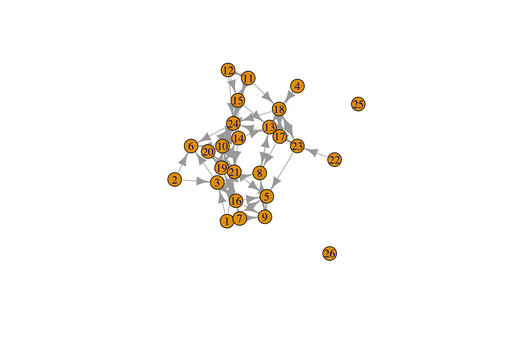

# 3, Part 1. Cross-Sectional Network Data {.unnumbered #ch3-Cross-Sectional-Network-Data-R}

This tutorial covers the basics of dealing with network data in R, focusing on the case of cross-sectional network data (a network observed at one time point). We assume that the reader has installed R, as well as a few key packages. In this tutorial we will use **igraph**, **network**, **reshape** and **intergraph**. We will learn how to take actual network data, read it into R, and then use the data to construct networks. This will make it possible to plot, summarize and manipulate the network information in a useful manner. All subsequent chapters will assume some basic knowledge of core network construction functions in R. We will end the tutorial by going over how to calculate key summary measures, like density and distance, using the **igraph** package. These measures offer important building blocks for later chapters, where we will cover topics like diffusion, hierarchy and cohesion, which require a working knowledge of more basic network measures.

The data we will use for this tutorial are based on classroom friendships collected by Daniel McFarland. The nodes, or vertices, are students in a classroom. There are 24 students. The survey asked each student to nominate classmates they "hung out with" as friends. The survey also asked each student about their gender, race and grade level. We thus have network data, based on the friendships between students, as well as node-level attribute data. 

## Reading Data into R
The first step is to read the network data into R (it is possible, but not practical, to type out the data within R). In this case, we have stored the network data as a matrix, describing the friendships between each student in the class. The network is binary and directed. The matrix is stored as a CSV file called class555_matrix.csv. The attribute data for the students in this classroom is called class555_attributedata.csv. It contains data on the gender, race and grade for each student in the class. We have also created an edgelist for this network called class555_edgelist.csv. 

We begin by reading in the data matrix using a `read.csv()` function. The main argument to the function is file, set to the location of the file we want to read in. In this case, we will read in the file directly from a URL (we could also read in a file saved locally on a computer). The first line below simply defines the URL of interest (defined as url1), while the second line reads in the file using read.csv.


```r
url1 <- "https://github.com/JeffreyAlanSmith/Integrated_Network_Science/raw/master/data/class555_matrix.csv"

class_mat <- read.csv(file = url1)
```

We have now created an object called `class_mat`, which holds the information read in from the class555_matrix file. Before we take a closer look, let's clean things up a bit. Let's first check on the class of the object we created:


```r
class(class_mat)
```

```
## [1] "data.frame"
```

We can see that `class_mat` is a data frame. Data frames are one kind of object in R, akin to traditional data sets that we may find in other programs like Stata or Excel. Data frames allow users to hold different kinds of columns (like numeric values and characters) all together in a single object. Data frames are, however, not conducive to matrix operations (like matrix multiplication). If we want to do matrix multiplication and related operations, we need to work with matrix objects, rather than data frames. Additionally, the main packages in R for network analysis take matrices as inputs. Given this, let's go ahead and turn our object, class_mat, into a matrix. We can turn our data frame into a matrix using the `as.matrix()` function:


```r
class_mat <- as.matrix(class_mat)
```

Let's also add a useful set of row names and column names to the matrix. This will make it easier to interpret the matrix when printed. We will set the row names to be 1 to the number of rows and the column names to be 1 to the number of columns.


```r
rownames(class_mat) <- 1:nrow(class_mat)
colnames(class_mat) <- 1:ncol(class_mat)
```

Now, let’s take a look at the matrix. Note that R will automatically print the object if no assignment is made, like this:  


```r
class_mat
```

```
##    1 2 3 4 5 6 7 8 9 10 11 12 13 14 15 16 17 18 19 20 21 22 23 24
## 1  0 0 1 0 1 0 1 0 0  0  0  0  0  0  0  0  0  0  0  0  1  0  0  0
## 2  0 0 1 0 0 1 0 0 0  0  0  0  0  0  0  0  0  0  0  0  0  0  0  0
## 3  0 0 0 0 0 1 0 1 0  0  0  0  0  0  0  1  0  0  0  0  0  0  0  1
## 4  0 0 0 0 0 0 0 0 0  0  0  0  1  0  0  0  0  1  0  0  0  0  0  0
## 5  0 0 0 0 0 0 0 0 0  0  0  0  0  0  0  0  0  0  0  0  0  0  0  0
## 6  0 0 0 0 0 0 0 0 0  0  0  0  0  0  0  0  0  0  0  0  0  0  0  0
## 7  1 0 0 0 0 0 0 0 1  1  0  0  0  0  0  1  0  0  0  0  0  0  0  0
## 8  0 0 1 0 0 0 0 0 1  0  0  0  1  0  0  0  0  0  0  0  0  0  0  0
## 9  0 0 0 0 1 0 0 1 0  0  0  0  0  0  0  0  0  0  0  0  0  0  0  0
## 10 0 0 0 0 0 1 0 0 0  0  0  0  0  1  0  0  0  0  1  1  0  0  0  1
## 11 0 0 0 0 0 0 0 0 0  0  0  1  0  0  1  0  0  1  0  0  0  0  0  1
## 12 0 0 0 0 0 0 0 0 0  0  1  0  0  0  1  0  0  0  0  0  0  0  0  1
## 13 0 0 0 0 0 0 0 1 0  0  0  0  0  0  0  0  0  0  0  0  0  0  0  0
## 14 0 0 0 0 0 0 0 0 0  1  0  0  1  0  0  0  0  0  1  0  1  0  0  1
## 15 0 0 0 0 0 0 0 0 0  1  1  0  1  1  0  0  0  0  0  0  0  0  0  1
## 16 0 0 1 0 1 0 0 0 1  0  0  0  0  0  0  0  0  0  1  0  0  0  0  0
## 17 0 0 0 0 0 0 0 1 0  0  0  0  1  0  0  0  0  1  0  0  0  0  1  1
## 18 0 0 0 0 0 0 0 0 0  0  0  0  1  0  0  0  1  0  0  0  0  0  1  1
## 19 0 0 0 0 0 0 0 0 0  0  0  0  0  1  0  1  0  0  0  1  1  0  0  0
## 20 0 0 0 0 0 0 0 0 0  0  0  0  0  0  0  0  0  0  1  0  1  0  0  1
## 21 0 0 0 0 1 0 0 0 0  0  0  0  0  0  0  0  0  0  1  1  0  0  0  0
## 22 0 0 0 0 0 0 0 0 0  0  0  0  0  0  0  0  0  0  0  0  0  0  1  0
## 23 0 0 0 0 1 0 0 0 0  0  0  0  1  0  0  0  1  1  0  0  0  0  0  0
## 24 0 0 0 0 0 1 0 0 0  1  0  0  0  1  1  0  0  0  0  0  1  0  0  0
```

We can see that the row names and column names run from 1 to 24, as we set above. The matrix itself consists of 0s and 1s, where a 1 means that i nominates j as a friend and 0 means that i did not nominate j as a friend, where i is the row and j is the column. For example, student 1 nominates students 3, 5, 7, and 21 as friends. Now, let's go ahead and read in the attribute data. Again, we read in the data directly using a URL, setting stringsAsFactors to T (this sets how non-numeric variables are read into R): 


```r
url2 <- "https://github.com/JeffreyAlanSmith/Integrated_Network_Science/raw/master/data/class555_attributedata.csv"

class_attributes <- read.csv(file = url2, stringsAsFactors = T)
```


```r
class_attributes
```

```
##    id gender grade  race
## 1   1   Male    12 White
## 2   2 Female    12 White
## 3   3 Female    12 White
## 4   4 Female    12 White
## 5   5   Male    12 White
## 6   6 Female    12 White
## 7   7   Male    11 Black
## 8   8   Male    11 White
## 9   9   Male    11 White
## 10 10 Female    11 White
## 11 11 Female    10 White
## 12 12 Female    10 White
## 13 13   Male    10 White
## 14 14   Male    10 White
## 15 15 Female    10 White
## 16 16   Male    10 White
## 17 17 Female    10 White
## 18 18 Female    10 White
## 19 19 Female    10 White
## 20 20 Female    10 White
## 21 21 Female    10 White
## 22 22 Female    10 White
## 23 23 Female    10 White
## 24 24 Female    10 White
```

This is a simple data frame describing the gender, grade and race of each student in the network. The data frame thus holds the attributes of our nodes. Note that the order of the data frame has to be the same as the order in the matrix. Also note that the first column is the id of each node in the network (this must be consistent with the ids in the edgelist). We can grab particular columns by using a $ command or by calling a particular column in the data frame. Here we look at the first five values for `gender`:


```r
class_attributes$gender[1:5]
```

```
## [1] Male   Female Female Female Male  
## Levels: Female Male
```

Same as above:


```r
class_attributes[1:5, "gender"] 
```

```
## [1] Male   Female Female Female Male  
## Levels: Female Male
```

The columns in a data frame can take different forms, or classes. For example, let's check on the class of the `grade` variable.


```r
class(class_attributes[, "grade"])
```

```
## [1] "integer"
```

The grade variable is an integer, meaning we can do mathematical operations on it.


```r
class_attributes[, "grade"] * 2
```

```
##  [1] 24 24 24 24 24 24 22 22 22 22 20 20 20 20 20 20 20 20 20 20 20 20 20 20
```

Note that our code above does not change the values of `grade` on the `class_attributes` data frame (as no assignment was made). If we had wanted to change the values we could do:  
`class_attributes[, "grade"] <- class_attributes[, "grade"] * 2`

Now, let's check on the class of `gender`.


```r
class(class_attributes[, "gender"])
```

```
## [1] "factor"
```

`gender` is a factor, meaning it is a categorical (i.e., non-numeric) variable with an order to it. In this case Female is first and Male is second:


```r
levels(class_attributes[, "gender"])
```

```
## [1] "Female" "Male"
```

Factors do not represent meaningful numbers and thus we cannot do mathematical operations on them. Factors are still useful, however, as we can use them in analyses to make group comparisons (Female versus Male, for example). If we do not need (or want) to have the values ordered, we can turn our factors into characters using an `as.character()` function (or set stringsAsFactors to F when reading in the data).

It is important to note that a matrix cannot hold numeric and character columns at the same time, as all columns must be of the same class (i.e., all numeric or all character). This is the main disadvantage of a matrix in R. And conversely, we can now see the main advantage of a data frame, that we can hold different kinds of columns in one object.

## Networks in igraph
Here we will use the **igraph** package to construct a network out of the friendship data. We will demonstrate how to do the same task using the **network** package below.

### Using a Matrix to Construct the Network
We begin by using the matrix representation of the network data. The advantage of turning our raw matrix into a network in the **igraph** (or **network**) format is that we can use all of the plotting, measure and statistical functions available within the various network packages. **igraph**, for example, offers a wide variety of functions to perform network calculations, plotting and simulations.  We start by loading the **igraph** package [@igraph2006].


```r
library(igraph)
```

The function in **igraph** to create a network from a matrix is `graph_from_adjacency_matrix()`. The arguments are: 

- adjmatrix = the input matrix
- mode = directed or undirected

The output is an igraph object, which holds all of the network information defined by the input matrix. Here we will create an igraph object called `class_netbymatrix` using `class_mat` as input.


```r
class_netbymatrix <- graph_from_adjacency_matrix(adjmatrix = class_mat, 
                                                 mode = "directed")
```


```r
class_netbymatrix
```

```
## IGRAPH e7e2087 DN-- 24 77 -- 
## + attr: name (v/c)
## + edges from e7e2087 (vertex names):
##  [1] 1 ->3  1 ->5  1 ->7  1 ->21 2 ->3  2 ->6  3 ->6  3 ->8  3 ->16 3 ->24
## [11] 4 ->13 4 ->18 7 ->1  7 ->9  7 ->10 7 ->16 8 ->3  8 ->9  8 ->13 9 ->5 
## [21] 9 ->8  10->6  10->14 10->19 10->20 10->24 11->12 11->15 11->18 11->24
## [31] 12->11 12->15 12->24 13->8  14->10 14->13 14->19 14->21 14->24 15->10
## [41] 15->11 15->13 15->14 15->24 16->3  16->5  16->9  16->19 17->8  17->13
## [51] 17->18 17->23 17->24 18->13 18->17 18->23 18->24 19->14 19->16 19->20
## [61] 19->21 20->19 20->21 20->24 21->5  21->19 21->20 22->23 23->5  23->13
## [71] 23->17 23->18 24->6  24->10 24->14 24->15 24->21
```

We can see that the igraph object contains lots of useful information, including the size of the network (24), the number of edges (77) and specific edge information. Now, let's map the node attributes we read in above, like gender and race, onto our igraph object. Here we need to use a `set_vertex_attr()` function. This makes it possible to take an attribute, like gender, and map it to the nodes in the network (so we will know what the gender of each node in the network is). The arguments are: 

- graph = network of interest, as igraph object
- name = name of node attribute on network to be created
- value = a vector of node attributes 

Let's first do gender, adding an attribute called `gender` to the igraph object, equal to the gender values in `class_attributes$gender`.


```r
class_netbymatrix <- set_vertex_attr(graph = class_netbymatrix, 
                                     name = "gender", 
                                     value = class_attributes$gender)
```

And now we add grade and race to the igraph object.


```r
class_netbymatrix <- set_vertex_attr(graph = class_netbymatrix, 
                                     name = "grade",
                                     value = class_attributes$grade)

class_netbymatrix <- set_vertex_attr(graph = class_netbymatrix, 
                                     name = "race",
                                     value = class_attributes$race)
```


```r
class_netbymatrix
```

```
## IGRAPH e7e2087 DN-- 24 77 -- 
## + attr: name (v/c), gender (v/x), grade (v/n), race (v/x)
## + edges from e7e2087 (vertex names):
##  [1] 1 ->3  1 ->5  1 ->7  1 ->21 2 ->3  2 ->6  3 ->6  3 ->8  3 ->16 3 ->24
## [11] 4 ->13 4 ->18 7 ->1  7 ->9  7 ->10 7 ->16 8 ->3  8 ->9  8 ->13 9 ->5 
## [21] 9 ->8  10->6  10->14 10->19 10->20 10->24 11->12 11->15 11->18 11->24
## [31] 12->11 12->15 12->24 13->8  14->10 14->13 14->19 14->21 14->24 15->10
## [41] 15->11 15->13 15->14 15->24 16->3  16->5  16->9  16->19 17->8  17->13
## [51] 17->18 17->23 17->24 18->13 18->17 18->23 18->24 19->14 19->16 19->20
## [61] 19->21 20->19 20->21 20->24 21->5  21->19 21->20 22->23 23->5  23->13
## [71] 23->17 23->18 24->6  24->10 24->14 24->15 24->21
```

We can see that we have now added `gender`, `grade` and `race` as node (or vertex) attributes to the igraph object (looking at the attr line in the output). At this point we have the basic network constructed and can start to analyze, plot, etc.

### Using an Edgelist to Construct the Network
Now we will do the same task of constructing a network (as an igraph object) but we will use an edgelist as the input data structure. Remember, an edgelist is a data set recording the edges in the network. The basic form is for the first column to be the sender of the tie and the second column to be the receiver. An edgelist contains all of the information of the matrix, except that it does not capture whether there are isolates (with no ties in and no ties out).

The first task is to read in the edgelist. As before, we read in the file directly from a URL.


```r
url3 <- "https://github.com/JeffreyAlanSmith/Integrated_Network_Science/raw/master/data/class555_edgelist.csv"

class_edges <- read.csv(file = url3)
```

And now let's use the `head()` function to look at the first six rows of the edgelist.


```r
head(class_edges) 
```

```
##   sender receiver weight
## 1      1        3      1
## 2      1        5      1
## 3      1        7      1
## 4      1       21      1
## 5      2        3      1
## 6      2        6      1
```

We see again that student 1 nominates student 3, 5, 7 and 21. Note that in many cases we will have edge attributes, or weights, capturing the strength or type of relationship between i and j. These can be easily represented by extra columns on the edgelist. Here we have included another column called `weight`. As the relation in this case is binary (friend or no friend) all the weights are the same across edges, equal to 1. In other cases the values would be different, capturing the strength of relationship between i and j. 

Now, we want to create an igraph object, as before, but this time use the edgelist as input.  Here the function is `graph_from_data_frame()`. The arguments are: 

- d = the edgelist; 
- directed = T or F (true or false).
- vertices = optional data frame with vertex (i.e, node) attributes

Here we create an igraph object called `class_netbyedgelist` based on the edgelist, `class_edges`. Note that we do not need to turn the edgelist into a matrix, as the function takes a data frame as input.


```r
class_netbyedgelist <- graph_from_data_frame(d = class_edges, directed = T)
```


```r
class_netbyedgelist
```

```
## IGRAPH 0feff96 DNW- 24 77 -- 
## + attr: name (v/c), weight (e/n)
## + edges from 0feff96 (vertex names):
##  [1] 1 ->3  1 ->5  1 ->7  1 ->21 2 ->3  2 ->6  3 ->6  3 ->8  3 ->16 3 ->24
## [11] 4 ->13 4 ->18 7 ->1  7 ->9  7 ->10 7 ->16 8 ->3  8 ->9  8 ->13 9 ->5 
## [21] 9 ->8  10->6  10->14 10->19 10->20 10->24 11->12 11->15 11->18 11->24
## [31] 12->11 12->15 12->24 13->8  14->10 14->13 14->19 14->21 14->24 15->10
## [41] 15->11 15->13 15->14 15->24 16->3  16->5  16->9  16->19 17->8  17->13
## [51] 17->18 17->23 17->24 18->13 18->17 18->23 18->24 19->14 19->16 19->20
## [61] 19->21 20->19 20->21 20->24 21->5  21->19 21->20 22->23 23->5  23->13
## [71] 23->17 23->18 24->6  24->10 24->14 24->15 24->21
```
As we can see, **igraph** will automatically add the edge attributes (here `weight`) to the igraph object. One advantage of using an edgelist is that it is easy to incorporate node attributes into the igraph object. This simply requires using a vertices argument when specifying the `graph_from_data_frame()` function. The input to vertices is a data frame of the attributes of each node, here `class_attributes`. **igraph** will add every column in the data frame (except the first column, which is assumed to be the ids of the nodes) to the created igraph object. The ids in the attribute data frame must correspond to the ids in the edgelist.  Here we will go ahead and redo the command above using a vertices argument. 


```r
class_netbyedgelist <- graph_from_data_frame(d = class_edges, directed = T,
                                             vertices = class_attributes)
```


```r
class_netbyedgelist
```

```
## IGRAPH 018f7df DNW- 24 77 -- 
## + attr: name (v/c), gender (v/c), grade (v/n), race (v/c), weight (e/n)
## + edges from 018f7df (vertex names):
##  [1] 1 ->3  1 ->5  1 ->7  1 ->21 2 ->3  2 ->6  3 ->6  3 ->8  3 ->16 3 ->24
## [11] 4 ->13 4 ->18 7 ->1  7 ->9  7 ->10 7 ->16 8 ->3  8 ->9  8 ->13 9 ->5 
## [21] 9 ->8  10->6  10->14 10->19 10->20 10->24 11->12 11->15 11->18 11->24
## [31] 12->11 12->15 12->24 13->8  14->10 14->13 14->19 14->21 14->24 15->10
## [41] 15->11 15->13 15->14 15->24 16->3  16->5  16->9  16->19 17->8  17->13
## [51] 17->18 17->23 17->24 18->13 18->17 18->23 18->24 19->14 19->16 19->20
## [61] 19->21 20->19 20->21 20->24 21->5  21->19 21->20 22->23 23->5  23->13
## [71] 23->17 23->18 24->6  24->10 24->14 24->15 24->21
```

The attributes will be added to the igraph object in the same order as in the input data frame (important when we extract information from the igraph object; see below). We can check the order of the nodes in our igraph object using: 


```r
V(class_netbyedgelist)$name
```

```
##  [1] "1"  "2"  "3"  "4"  "5"  "6"  "7"  "8"  "9"  "10" "11" "12" "13" "14" "15"
## [16] "16" "17" "18" "19" "20" "21" "22" "23" "24"
```

We offer one final note on constructing networks from an edgelist. As discussed above, the edgelist does not contain information about isolates. If there are isolates in the network and we want to construct the network from an edgelist, we need to be careful. One simple solution is to include a vertices argument, with a data frame of node attributes. Even if no attributes are available, including a data frame of just ids will tell igraph how big the network really is, including isolates (who would be missed by the edgelist alone). For example, the following code creates a network with two isolates, with ids of 25 and 26.


```r
net <- graph_from_data_frame(d = class_edges, directed = T, 
                             vertices = (id = 1:26))
plot(net)
```



More generally, it is good practice to use a vertices argument when using graph_from_data_frame. This ensures that the order of the nodes (in the created object) is set in a clear manner; rather than allow the function to set the order, which can sometimes lead to unexpected results.  

### Extracting Information from igraph Objects
Note that we can get node attributes, like `grade`, back out of the igraph object using a `vertex_attr()` function. This is useful as we no longer have to go back to the original data to grab the attributes of the nodes. Importantly, any action taken on the network (like removing isolates) would be reflected in the attributes attached to the network, unlike with the original data (i.e., any removed nodes would still be in the original data frame). This makes it easier to answer substantive questions about network structure and demographic characteristics. The basic arguments for `vertex_attr()` are graph and name (name of vertex attribute to extract).


```r
vertex_attr(graph = class_netbyedgelist, name = "grade")
```

```
##  [1] 12 12 12 12 12 12 11 11 11 11 10 10 10 10 10 10 10 10 10 10 10 10 10 10
```

We can extract the edge attribute, weight, from the igraph object using an `edge_attr()` function (with name set to the edge attribute of interest): `weights <- edge_attr(graph = class_netbyedgelist, name = "weight")`

We can also extract the edgelist and matrix, which is useful for a number of reasons. First, this makes it possible to extract an edgelist in a case where the input was a matrix (or vice versa). Second, the extracted edgelist or matrix will reflect any changes in the network (e.g., removing isolates). Similarly, certain functions will yield igraph objects as part of their output, and it is often useful to transform the igraph objects to matrices or edgelists for additional analyses. To get the edgelist we use an `as_edgelist()` function.


```r
class_edges_temp <- as_edgelist(graph = class_netbyedgelist, names = F)
```

Here, we take a look at the first six rows of the edgelist:


```r
head(class_edges_temp) 
```

```
##      [,1] [,2]
## [1,]    1    3
## [2,]    1    5
## [3,]    1    7
## [4,]    1   21
## [5,]    2    3
## [6,]    2    6
```

The matrix can be extracted using the `as_adjacency_matrix()` function.


```r
as_adjacency_matrix(graph = class_netbyedgelist) 
```

```
## 24 x 24 sparse Matrix of class "dgCMatrix"
##                                                   
## 1  . . 1 . 1 . 1 . . . . . . . . . . . . . 1 . . .
## 2  . . 1 . . 1 . . . . . . . . . . . . . . . . . .
## 3  . . . . . 1 . 1 . . . . . . . 1 . . . . . . . 1
## 4  . . . . . . . . . . . . 1 . . . . 1 . . . . . .
## 5  . . . . . . . . . . . . . . . . . . . . . . . .
## 6  . . . . . . . . . . . . . . . . . . . . . . . .
## 7  1 . . . . . . . 1 1 . . . . . 1 . . . . . . . .
## 8  . . 1 . . . . . 1 . . . 1 . . . . . . . . . . .
## 9  . . . . 1 . . 1 . . . . . . . . . . . . . . . .
## 10 . . . . . 1 . . . . . . . 1 . . . . 1 1 . . . 1
## 11 . . . . . . . . . . . 1 . . 1 . . 1 . . . . . 1
## 12 . . . . . . . . . . 1 . . . 1 . . . . . . . . 1
## 13 . . . . . . . 1 . . . . . . . . . . . . . . . .
## 14 . . . . . . . . . 1 . . 1 . . . . . 1 . 1 . . 1
## 15 . . . . . . . . . 1 1 . 1 1 . . . . . . . . . 1
## 16 . . 1 . 1 . . . 1 . . . . . . . . . 1 . . . . .
## 17 . . . . . . . 1 . . . . 1 . . . . 1 . . . . 1 1
## 18 . . . . . . . . . . . . 1 . . . 1 . . . . . 1 1
## 19 . . . . . . . . . . . . . 1 . 1 . . . 1 1 . . .
## 20 . . . . . . . . . . . . . . . . . . 1 . 1 . . 1
## 21 . . . . 1 . . . . . . . . . . . . . 1 1 . . . .
## 22 . . . . . . . . . . . . . . . . . . . . . . 1 .
## 23 . . . . 1 . . . . . . . 1 . . . 1 1 . . . . . .
## 24 . . . . . 1 . . . 1 . . . 1 1 . . . . . 1 . . .
```

Note that the matrix is outputted as a sparse matrix by default, but this behavior can be changed by setting sparse = F.

### Using an Adjacency List to Construct the Network
As another example, we will walk through how to work with network data stored as an adjacency list. Here, each node is on the rows and the columns capture who that node sends ties to. This is often how survey data will look in its raw form. Let's read in the adjacency list associated with our example network from above:


```r
url4 <- "https://github.com/JeffreyAlanSmith/Integrated_Network_Science/raw/master/data/class555_adjacency_list.csv"

class_adjacency <- read.csv(file = url4)
```


```r
class_adjacency
```

```
##    id Nomination1 Nomination2 Nomination3 Nomination4 Nomination5
## 1   1           3           5           7          21          NA
## 2   2           3           6          NA          NA          NA
## 3   3           6           8          16          24          NA
## 4   4          13          18          NA          NA          NA
## 5   5          NA          NA          NA          NA          NA
## 6   6          NA          NA          NA          NA          NA
## 7   7           1           9          10          16          NA
## 8   8           3           9          13          NA          NA
## 9   9           5           8          NA          NA          NA
## 10 10           6          14          19          20          24
## 11 11          12          15          18          24          NA
## 12 12          11          15          24          NA          NA
## 13 13           8          NA          NA          NA          NA
## 14 14          10          13          19          21          24
## 15 15          10          11          13          14          24
## 16 16           3           5           9          19          NA
## 17 17           8          13          18          23          24
## 18 18          13          17          23          24          NA
## 19 19          14          16          20          21          NA
## 20 20          19          21          24          NA          NA
## 21 21           5          19          20          NA          NA
## 22 22          23          NA          NA          NA          NA
## 23 23           5          13          17          18          NA
## 24 24           6          10          14          15          21
```
The adjacency list has 24 rows, one for each node, and 6 columns. The first column shows the id of the node (here students) and the remaining columns capture who they name as friends. Looking at the first row, we again see that node 1 nominates 3, 5, 7 and 21 as friends. It is often useful to transform our adjacency list into an edgelist (or matrix), as it is easy to construct a network from an edgelist but somewhat more difficult using an adjacency list (although see the function `graph_from_adj_list()`). Here we will use functions from the **reshape** package to turn our adjacency list into an edgelist. Let's begin by loading the **reshape** package. 


```r
library(reshape)
```

We first need to identify the columns in the adjacency list that correspond to the nomination data. In this case, the columns of interest are: Nomination1, Nomination2,...Nomination5. These are the columns that we need to stack together to form the receiver column in the edgelist. Here, we will use a paste command to create a vector of column names corresponding to the nomination columns.


```r
nomination_columns <- paste("Nomination", 1:5, sep = "") 
```


```r
nomination_columns
```

```
## [1] "Nomination1" "Nomination2" "Nomination3" "Nomination4" "Nomination5"
```
Now we use a `reshape()` function to turn our data from a 'wide' format to a 'long' format. We thus move from having the nodes as rows to having edges as rows. The basic idea is take the id variable and repeat it (forming the sender column), while stacking the nomination data to form the receiver column. In the `reshape()` function, we set data to the adjacency list created above (class_adjacency); varying to the columns to stack (nomination_columns); v.names to the name of the variable to be created in the long format; idvar to the id variable for the nodes (id); and direction to long.


```r
class_edgelist_byadjacency <- reshape(data = class_adjacency, 
                                      varying = nomination_columns, 
                                      v.names = "receiver", idvar = "id",
                                      direction = "long")  
```


```r
head(class_edgelist_byadjacency)
```

```
##     id time receiver
## 1.1  1    1        3
## 2.1  2    1        3
## 3.1  3    1        6
## 4.1  4    1       13
## 5.1  5    1       NA
## 6.1  6    1       NA
```

We can see that the data is beginning to look like an edgelist (running long rather than wide) but there is still some cleaning up to do before we can actually use it. For example, we don't really need that second column (showing the nomination column), so we want to remove it. We also want to add a better set of column names to the data. 


```r
class_edgelist_byadjacency <- class_edgelist_byadjacency[, -2]
colnames(class_edgelist_byadjacency) <- c("sender", "receiver")
```

We also need to take out any NAs in the data, which were simply copied over from the adjacency list. We can use a `complete.cases()` function to only keep those rows where we have no NA values.


```r
which_keep <- complete.cases(class_edgelist_byadjacency)
class_edgelist_byadjacency <- class_edgelist_byadjacency[which_keep, ]
```

And let's also reorder the data (although this is not strictly necessary) to match the edgelist read in before.


```r
what_order <- order(class_edgelist_byadjacency$sender)
class_edgelist_byadjacency <- class_edgelist_byadjacency[what_order, ]
```


```r
head(class_edgelist_byadjacency)
```

```
##     sender receiver
## 1.1      1        3
## 1.2      1        5
## 1.3      1        7
## 1.4      1       21
## 2.1      2        3
## 2.2      2        6
```
The edgelist looks good, and, at this point, we can take the newly constructed edgelist and construct an igraph object from it, using the syntax from above. 

## Using the network Package

We now demonstrate how to do the exact same tasks as in section 2 using the **network** package [@network] instead of **igraph**. We still want to take the input matrix (or edgelist) and attribute file and create a network. The only difference is that the format and functions will be a little different using the **network** package. The objects created by **network** can then be used with other packages, like **sna**, **ergm**, **latentnet**, etc., which allow us to perform network calculations, produce plots, and estimate sophisticated statistical models. Moreover, the functions and capabilities of **igraph** are often different than the packages associated with network. 

First let's detach the **igraph** package and load **network**.


```r
detach(package:igraph)
library(network)
```

### Using a Matrix to Construct the Network
We are first going to create a network object using the matrix as input. The function is `network()`. The basic arguments are:

- x = the name of the matrix
- directed = T/F if directed or not
- vertex.attr = list of vertex (i.e., node) attributes

Here we construct the network using the matrix read in above as input.


```r
class_netbymatrix_example2 <- network(x = class_mat, directed = T) 
```

We can also use the `network()` function to put node attributes onto the network. We can do this all at once, constructing a network based on the matrix and putting the attributes on the nodes. The input is a list of attributes. Let's first create that list. It is often easier to treat the attributes as characters (rather than factors) when they are categorical variables, like `gender` or `race`. So let's go ahead and turn `gender` and `race` into character variables using an `as.character()` function.


```r
class_attributes$race <- as.character(class_attributes$race)
class_attributes$gender <- as.character(class_attributes$gender)
```

Now let’s create a list to use as input to the `network()` function. We will use a `do.call()` function to turn the data frame into a list where each element in the list is a different attribute, taken from the class_attributes data frame.


```r
attribute_list <- do.call(list, class_attributes)
```


```r
attribute_list
```

```
## $id
##  [1]  1  2  3  4  5  6  7  8  9 10 11 12 13 14 15 16 17 18 19 20 21 22 23 24
## 
## $gender
##  [1] "Male"   "Female" "Female" "Female" "Male"   "Female" "Male"   "Male"  
##  [9] "Male"   "Female" "Female" "Female" "Male"   "Male"   "Female" "Male"  
## [17] "Female" "Female" "Female" "Female" "Female" "Female" "Female" "Female"
## 
## $grade
##  [1] 12 12 12 12 12 12 11 11 11 11 10 10 10 10 10 10 10 10 10 10 10 10 10 10
## 
## $race
##  [1] "White" "White" "White" "White" "White" "White" "Black" "White" "White"
## [10] "White" "White" "White" "White" "White" "White" "White" "White" "White"
## [19] "White" "White" "White" "White" "White" "White"
```

Now, let's create the network using the `network()` function but this time add a vertex.attr argument, set equal to the list of vertex (or node) attributes.


```r
class_netbymatrix_example2 <- network(x = class_mat, directed = T, 
                                      vertex.attr = attribute_list) 
```


```r
class_netbymatrix_example2
```

```
##  Network attributes:
##   vertices = 24 
##   directed = TRUE 
##   hyper = FALSE 
##   loops = FALSE 
##   multiple = FALSE 
##   bipartite = FALSE 
##   total edges= 77 
##     missing edges= 0 
##     non-missing edges= 77 
## 
##  Vertex attribute names: 
##     gender grade id race vertex.names 
## 
## No edge attributes
```

We see a number of vertex (i.e., node) attributes are on the constructed network. We could also have put the attributes on one at a time using the `set.vertex.attribute()` function, where the arguments are:

- x = network of interest 
- attrname = name of attribute 
- value = vector of attribute

Here, we will we create a vertex attribute called `gradenew` on the network based on the `grade` attribute. 


```r
set.vertex.attribute(x = class_netbymatrix_example2, attrname = "gradenew",
                     value = class_attributes$grade)
```

Note for this function we do not need to assign the output to a new object. It will automatically update the input network, `class_netbymatrix_example2`.


```r
class_netbymatrix_example2
```

```
##  Network attributes:
##   vertices = 24 
##   directed = TRUE 
##   hyper = FALSE 
##   loops = FALSE 
##   multiple = FALSE 
##   bipartite = FALSE 
##   total edges= 77 
##     missing edges= 0 
##     non-missing edges= 77 
## 
##  Vertex attribute names: 
##     gender grade gradenew id race vertex.names 
## 
## No edge attributes
```

### Using an Edgelist to Construct the Network
Now we will construct the same network but this time use the edgelist as input (still using the **network** package). To create a network from an edgelist, we still use the `network()` function, but this time the edgelist will be the main input. We will use the vertices argument to input the attribute information, although it is also possible to still use a vertex.attr argument.  Using vertices, the attributes are inputted as a data frame, where the first column should be the ids of the nodes. The vertices approach will be particularly useful, as it makes it easier to deal with isolates (in much the same way that we saw with igraph). Using a vertices argument is also very useful as it sets the order that the vertices will be added to the network, ensuring that unexpected behavior does not occur. Now, we use the `network()` function to create the network. As before:


```r
class_netbyedgelist_example2 <- network(x = class_edges, directed = T, 
                                        vertices = class_attributes) 
```


```r
class_netbyedgelist_example2
```

```
##  Network attributes:
##   vertices = 24 
##   directed = TRUE 
##   hyper = FALSE 
##   loops = FALSE 
##   multiple = FALSE 
##   bipartite = FALSE 
##   total edges= 77 
##     missing edges= 0 
##     non-missing edges= 77 
## 
##  Vertex attribute names: 
##     gender grade race vertex.names 
## 
##  Edge attribute names: 
##     weight
```

As with **igraph**, we can extract the matrix, edgelist and vertex attributes from the network object. For example, to get the matrix back out, use:


```r
as.matrix(class_netbyedgelist_example2)
```

```
##    1 2 3 4 5 6 7 8 9 10 11 12 13 14 15 16 17 18 19 20 21 22 23 24
## 1  0 0 1 0 1 0 1 0 0  0  0  0  0  0  0  0  0  0  0  0  1  0  0  0
## 2  0 0 1 0 0 1 0 0 0  0  0  0  0  0  0  0  0  0  0  0  0  0  0  0
## 3  0 0 0 0 0 1 0 1 0  0  0  0  0  0  0  1  0  0  0  0  0  0  0  1
## 4  0 0 0 0 0 0 0 0 0  0  0  0  1  0  0  0  0  1  0  0  0  0  0  0
## 5  0 0 0 0 0 0 0 0 0  0  0  0  0  0  0  0  0  0  0  0  0  0  0  0
## 6  0 0 0 0 0 0 0 0 0  0  0  0  0  0  0  0  0  0  0  0  0  0  0  0
## 7  1 0 0 0 0 0 0 0 1  1  0  0  0  0  0  1  0  0  0  0  0  0  0  0
## 8  0 0 1 0 0 0 0 0 1  0  0  0  1  0  0  0  0  0  0  0  0  0  0  0
## 9  0 0 0 0 1 0 0 1 0  0  0  0  0  0  0  0  0  0  0  0  0  0  0  0
## 10 0 0 0 0 0 1 0 0 0  0  0  0  0  1  0  0  0  0  1  1  0  0  0  1
## 11 0 0 0 0 0 0 0 0 0  0  0  1  0  0  1  0  0  1  0  0  0  0  0  1
## 12 0 0 0 0 0 0 0 0 0  0  1  0  0  0  1  0  0  0  0  0  0  0  0  1
## 13 0 0 0 0 0 0 0 1 0  0  0  0  0  0  0  0  0  0  0  0  0  0  0  0
## 14 0 0 0 0 0 0 0 0 0  1  0  0  1  0  0  0  0  0  1  0  1  0  0  1
## 15 0 0 0 0 0 0 0 0 0  1  1  0  1  1  0  0  0  0  0  0  0  0  0  1
## 16 0 0 1 0 1 0 0 0 1  0  0  0  0  0  0  0  0  0  1  0  0  0  0  0
## 17 0 0 0 0 0 0 0 1 0  0  0  0  1  0  0  0  0  1  0  0  0  0  1  1
## 18 0 0 0 0 0 0 0 0 0  0  0  0  1  0  0  0  1  0  0  0  0  0  1  1
## 19 0 0 0 0 0 0 0 0 0  0  0  0  0  1  0  1  0  0  0  1  1  0  0  0
## 20 0 0 0 0 0 0 0 0 0  0  0  0  0  0  0  0  0  0  1  0  1  0  0  1
## 21 0 0 0 0 1 0 0 0 0  0  0  0  0  0  0  0  0  0  1  1  0  0  0  0
## 22 0 0 0 0 0 0 0 0 0  0  0  0  0  0  0  0  0  0  0  0  0  0  1  0
## 23 0 0 0 0 1 0 0 0 0  0  0  0  1  0  0  0  1  1  0  0  0  0  0  0
## 24 0 0 0 0 0 1 0 0 0  1  0  0  0  1  1  0  0  0  0  0  1  0  0  0
```

To get the vertex attributes back out, we use a `get.vertex.attribute()` function, with two main inputs, the network of interest (defined as x) and the attribute to extract (defined as attrname). Here we extract the `grade` attribute from the network.


```r
get.vertex.attribute(x = class_netbyedgelist_example2, attrname = "grade")
```

```
##  [1] 12 12 12 12 12 12 11 11 11 11 10 10 10 10 10 10 10 10 10 10 10 10 10 10
```

And we can check the order of the nodes using:

```r
get.vertex.attribute(x = class_netbyedgelist_example2, 
                     attrname = "vertex.names")
```

```
##  [1]  1  2  3  4  5  6  7  8  9 10 11 12 13 14 15 16 17 18 19 20 21 22 23 24
```

This is useful when checking if the vertex attributes have been correctly placed onto the network object (as the attributes should be attached in an order consistent with the vertex.names).

### Putting Edge Attributes onto the Network
In cases where there are edge attributes (such as the strength of a relationship) we can use a `set.edge.attribute()` function to add the edge attribute to the network. The arguments are: 

- x = the network of interest
- attrname = name of attribute to put on network
- value = vector of edge values

Here we add an edge attribute called `weight` to the network, where `weight` is the vector of weights taken from the edgelist.


```r
set.edge.attribute(x = class_netbyedgelist_example2, 
                   attrname = "weight", value = class_edges[, "weight"])
```


```r
class_netbyedgelist_example2
```

```
##  Network attributes:
##   vertices = 24 
##   directed = TRUE 
##   hyper = FALSE 
##   loops = FALSE 
##   multiple = FALSE 
##   bipartite = FALSE 
##   total edges= 77 
##     missing edges= 0 
##     non-missing edges= 77 
## 
##  Vertex attribute names: 
##     gender grade race vertex.names 
## 
##  Edge attribute names: 
##     weight
```

An edge attribute, weight, has now been added to the network. We can extract edge attributes using a `get.edge.attribute function()`: `weights <- get.edge.attribute(class_netbyedgelist_example2, attrname = "weight")`

### Moving between igraph and network Objects
We have so far seen how to construct networks using both the **igraph** and **network** packages. It is often useful to be able to move between the two packages, so that an igraph object can be turned into a network one and vice versa. For example, we may want to plot our network using one package but use the other package to do a particular analysis. Luckily, the **intergraph** package makes conversion a fairly easy task. Let's begin by loading the **intergraph** package [@intergraph]. 


```r
library(intergraph)
```

The main functions are `asIgraph()` and `asNetwork()`. `asIgraph()` converts network objects into igraph objects while `asNetwork()` turns igraph objects into network objects. For example, here we turn our igraph object into a network one:


```r
network_from_igraph <- asNetwork(class_netbyedgelist)
```


```r
network_from_igraph
```

```
##  Network attributes:
##   vertices = 24 
##   directed = TRUE 
##   hyper = FALSE 
##   loops = FALSE 
##   multiple = FALSE 
##   bipartite = FALSE 
##   total edges= 77 
##     missing edges= 0 
##     non-missing edges= 77 
## 
##  Vertex attribute names: 
##     gender grade race vertex.names 
## 
##  Edge attribute names: 
##     weight
```

## Some Key Network Measures
In this section we will walk through the calculation of a few example network measures. The idea is to get a bit more familiar with R and to lay some of the groundwork for what follows. We will examine how to calculate these network measures using the matrix representation of the network, as well as with functions within the **igraph** package (this can also be done within the sna package). 

### Degree
We start with degree, which is a simple measure capturing the number of ties for each node. We can define outdegree as the number of ties sent from node i and indegree as the number of ties received by node i. We start by calculating degree using the raw matrix, class_mat.  We calculate outdegree by summing over the rows of the matrix. Each element of the matrix shows if i sends a tie to j. By summing over the rows, we calculate the total number of ties sent by i. 


```r
outdeg <- rowSums(class_mat) 
```


```r
outdeg 
```

```
##  1  2  3  4  5  6  7  8  9 10 11 12 13 14 15 16 17 18 19 20 21 22 23 24 
##  4  2  4  2  0  0  4  3  2  5  4  3  1  5  5  4  5  4  4  3  3  1  4  5
```

We see that the first student send 4 ties (or nominates 4 friends), the second sends 2 ties, the third sends 4, and so on. Now we sum up over the columns, calculating the number of ties received by i.


```r
indeg <- colSums(class_mat)
```


```r
indeg
```

```
##  1  2  3  4  5  6  7  8  9 10 11 12 13 14 15 16 17 18 19 20 21 22 23 24 
##  1  0  4  0  5  4  1  4  3  4  2  1  7  4  3  3  2  4  5  3  5  0  3  9
```

We see that the first student (for example) is nominated by 1 person as a friend. Now, let's do the same thing, but use the functions within the **igraph** package.


```r
detach(package:network)
library(igraph)
```

The function is `degree()`. The main arguments are graph (the network of interest) and mode, where mode sets the type of degree calculation: in, out or total (adding up outdegree and indegree). Note that we must use the network constructed as an igraph object to use the **igraph** functions.


```r
outdeg_igraph <- degree(graph = class_netbyedgelist, mode = "out")
indeg_igraph <- degree(graph = class_netbyedgelist, mode = "in")
```

Let's check if the previous calculation of outdegree is the same as the calculation from **igraph**.


```r
table(outdeg == outdeg_igraph) 
```

```
## 
## TRUE 
##   24
```

We can see that the **igraph** function yields the same outdegree values as calculated above (as outdeg is always equal to outdeg_igraph)

### Density
Density is another simple measure of network structure that captures the total number of edges (or ties) in the network divided by the total number of edges possible. Let's first calculate the density "by hand" using the size and number of edges in the network. The function `gsize()` get the number of edges and the function `gorder()` gets the number of nodes.


```r
num_edges <- gsize(class_netbyedgelist)
num_edges
```

```
## [1] 77
```

```r
num_nodes <- gorder(class_netbyedgelist)
num_nodes
```

```
## [1] 24
```

We also need to calculate the number of dyads (excluding ii pairs) which tells us how many edges are possible in the network.


```r
number_dyads <- (num_nodes * (num_nodes - 1))
```

And now we can go ahead and calculate density, taking the number of edges and dividing by the number possible.


```r
den <- num_edges / number_dyads
```


```r
den
```

```
## [1] 0.1394928
```

And here we use the canned function, `edge_density()`, in **igraph**. 


```r
edge_density(class_netbyedgelist)
```

```
## [1] 0.1394928
```

### Walks
We now turn to walks on the network, defined as any sequence of nodes and edges (backwards and forwards) that connect i to j. For example, a sequence of i->j->k->j->l would be a walk of length 4 from i to l. One item of interest is the number of walks of a given length between two nodes. We can use matrix multiplication to calculate this. By raising the matrix to the nth power, we get the number of walks of length n between all ij pairs. Let's calculate the number of walks of length two by multiplying the matrix by itself:


```r
walks2 <- class_mat %*% class_mat
```


```r
walks2 
```

```
##    1 2 3 4 5 6 7 8 9 10 11 12 13 14 15 16 17 18 19 20 21 22 23 24
## 1  1 0 0 0 1 1 0 1 1  1  0  0  0  0  0  2  0  0  1  1  0  0  0  1
## 2  0 0 0 0 0 1 0 1 0  0  0  0  0  0  0  1  0  0  0  0  0  0  0  1
## 3  0 0 2 0 1 1 0 0 2  1  0  0  1  1  1  0  0  0  1  0  1  0  0  0
## 4  0 0 0 0 0 0 0 1 0  0  0  0  1  0  0  0  1  0  0  0  0  0  1  1
## 5  0 0 0 0 0 0 0 0 0  0  0  0  0  0  0  0  0  0  0  0  0  0  0  0
## 6  0 0 0 0 0 0 0 0 0  0  0  0  0  0  0  0  0  0  0  0  0  0  0  0
## 7  0 0 2 0 3 1 1 1 1  0  0  0  0  1  0  0  0  0  2  1  1  0  0  1
## 8  0 0 0 0 1 1 0 3 0  0  0  0  0  0  0  1  0  0  0  0  0  0  0  1
## 9  0 0 1 0 0 0 0 0 1  0  0  0  1  0  0  0  0  0  0  0  0  0  0  0
## 10 0 0 0 0 0 1 0 0 0  2  0  0  1  2  1  1  0  0  2  1  4  0  0  2
## 11 0 0 0 0 0 1 0 0 0  2  2  0  2  2  2  0  1  0  0  0  1  0  1  3
## 12 0 0 0 0 0 1 0 0 0  2  1  1  1  2  2  0  0  1  0  0  1  0  0  2
## 13 0 0 1 0 0 0 0 0 1  0  0  0  1  0  0  0  0  0  0  0  0  0  0  0
## 14 0 0 0 0 1 2 0 1 0  1  0  0  0  3  1  1  0  0  2  3  2  0  0  1
## 15 0 0 0 0 0 2 0 1 0  2  0  1  1  2  2  0  0  1  2  1  2  0  0  3
## 16 0 0 0 0 1 1 0 2 0  0  0  0  0  1  0  2  0  0  0  1  1  0  0  1
## 17 0 0 1 0 1 1 0 1 1  1  0  0  3  1  1  0  2  1  0  0  1  0  1  1
## 18 0 0 0 0 1 1 0 2 0  1  0  0  2  1  1  0  1  2  0  0  1  0  1  1
## 19 0 0 1 0 2 0 0 0 1  1  0  0  1  0  0  0  0  0  4  1  2  0  0  2
## 20 0 0 0 0 1 1 0 0 0  1  0  0  0  2  1  1  0  0  1  2  2  0  0  0
## 21 0 0 0 0 0 0 0 0 0  0  0  0  0  1  0  1  0  0  1  1  2  0  0  1
## 22 0 0 0 0 1 0 0 0 0  0  0  0  1  0  0  0  1  1  0  0  0  0  0  0
## 23 0 0 0 0 0 0 0 2 0  0  0  0  2  0  0  0  1  1  0  0  0  0  2  2
## 24 0 0 0 0 1 1 0 0 0  2  1  0  2  2  0  0  0  0  3  2  1  0  0  3
```

This suggests, for example, that there is 1 walk of length 2 between node 1 and node 1 (themself). In this case, the walk is : 1->7->1. We can see this by looking at the rows for node 1 and node 7:


```r
class_mat[c(1, 7), ] 
```

```
##   1 2 3 4 5 6 7 8 9 10 11 12 13 14 15 16 17 18 19 20 21 22 23 24
## 1 0 0 1 0 1 0 1 0 0  0  0  0  0  0  0  0  0  0  0  0  1  0  0  0
## 7 1 0 0 0 0 0 0 0 1  1  0  0  0  0  0  1  0  0  0  0  0  0  0  0
```

We can see that node 1 is friends with 3, 5, 7 and 21. We can also see that node 7 is friends with 1, 9, 10 and 16, thus creating a walk of length 2: 1->7->1. We can calculate the number of walks of length 3, 4, etc. in an analogous fashion. For example, for walks of length 3:


```r
walks3 <- class_mat %*% class_mat %*% class_mat
```


```r
walks3
```

```
##    1 2 3 4 5 6 7 8 9 10 11 12 13 14 15 16 17 18 19 20 21 22 23 24
## 1  0 0 4 0 4 2 1 1 3  1  0  0  1  3  1  1  0  0  4  2  4  0  0  2
## 2  0 0 2 0 1 1 0 0 2  1  0  0  1  1  1  0  0  0  1  0  1  0  0  0
## 3  0 0 0 0 3 3 0 5 0  2  1  0  2  3  0  3  0  0  3  3  2  0  0  5
## 4  0 0 1 0 1 1 0 2 1  1  0  0  3  1  1  0  1  2  0  0  1  0  1  1
## 5  0 0 0 0 0 0 0 0 0  0  0  0  0  0  0  0  0  0  0  0  0  0  0  0
## 6  0 0 0 0 0 0 0 0 0  0  0  0  0  0  0  0  0  0  0  0  0  0  0  0
## 7  1 0 1 0 2 3 0 3 2  3  0  0  2  3  1  5  0  0  3  3  5  0  0  4
## 8  0 0 4 0 1 1 0 0 4  1  0  0  3  1  1  0  0  0  1  0  1  0  0  0
## 9  0 0 0 0 1 1 0 3 0  0  0  0  0  0  0  1  0  0  0  0  0  0  0  1
## 10 0 0 1 0 5 4 0 1 1  5  1  0  3  7  2  2  0  0 10  8  7  0  0  6
## 11 0 0 0 0 2 5 0 3 0  7  2  2  6  7  5  0  1  4  5  3  5  0  1  9
## 12 0 0 0 0 1 4 0 1 0  6  3  1  5  6  4  0  1  1  5  3  4  0  1  9
## 13 0 0 0 0 1 1 0 3 0  0  0  0  0  0  0  1  0  0  0  0  0  0  0  1
## 14 0 0 2 0 3 2 0 0 2  5  1  0  5  5  1  2  0  0 10  5  9  0  0  8
## 15 0 0 1 0 2 5 0 1 1  7  3  0  6  9  4  2  1  0  7  6  8  0  1  9
## 16 0 0 4 0 3 1 0 0 4  2  0  0  3  1  1  0  0  0  5  1  3  0  0  2
## 17 0 0 1 0 3 3 0 7 1  3  1  0  7  3  1  1  2  3  3  2  2  0  3  7
## 18 0 0 2 0 2 2 0 3 2  3  1  0  8  3  1  0  3  2  3  2  2  0  3  6
## 19 0 0 0 0 3 4 0 3 0  2  0  0  0  7  2  5  0  0  4  7  7  0  0  3
## 20 0 0 1 0 3 1 0 0 1  3  1  0  3  3  0  1  0  0  8  4  5  0  0  6
## 21 0 0 1 0 3 1 0 0 1  2  0  0  1  2  1  1  0  0  5  3  4  0  0  2
## 22 0 0 0 0 0 0 0 2 0  0  0  0  2  0  0  0  1  1  0  0  0  0  2  2
## 23 0 0 2 0 2 2 0 3 2  2  0  0  6  2  2  0  3  3  0  0  2  0  2  2
## 24 0 0 0 0 1 5 0 2 0  5  0  1  2  8  4  3  0  1  7  6 10  0  0  7
```

Here, we see that there are 0 walks of length 3 from 1 to 1, but 4 different walks from 1 to 3 (for example, 1->3->8->3). 

### Paths, Distance, and Closeness
Paths are defined as a sequence of nodes and edges starting with one node and ending with another, where a path is not allowed to revisit the same node twice (unlike with walks). For example, i->j->l would be a path of length 2. It is often of interest to know the shortest path, or the distance, between nodes in a network. Here we will rely on the `distances()` function within the **igraph** package. The main arguments are graph and mode, setting the type of distance to calculate. The 'out' value for mode says we want distance from i to j, which is what we typically want.


```r
dist_mat <- distances(graph = class_netbyedgelist, mode = "out")
```

Let's look at the first 10 rows and columns:


```r
dist_mat[1:10, 1:10] 
```

```
##      1   2   3   4   5   6   7   8   9  10
## 1    0 Inf   1 Inf   1   2   1   2   2   2
## 2  Inf   0   1 Inf   3   1 Inf   2   3   3
## 3  Inf Inf   0 Inf   2   1 Inf   1   2   2
## 4  Inf Inf   3   0   3   3 Inf   2   3   3
## 5  Inf Inf Inf Inf   0 Inf Inf Inf Inf Inf
## 6  Inf Inf Inf Inf Inf   0 Inf Inf Inf Inf
## 7    1 Inf   2 Inf   2   2   0   2   1   1
## 8  Inf Inf   1 Inf   2   2 Inf   0   1   3
## 9  Inf Inf   2 Inf   1   3 Inf   1   0   4
## 10 Inf Inf   3 Inf   3   1 Inf   3   3   0
```

This is a matrix holding the length of the shortest path between all pairs of nodes. We can see, for example, that node 1 is 1 step from node 3 and 2 steps from node 6. Note that Inf means that i can not reach j through any path.

We can get the specific paths connecting i to j using the `all_shortest_paths()` function. The main inputs are the graph and the starting node (from) and the ending node (to). As an example, let's go ahead and calculate all of the shortest paths between 1 and 6. 


```r
all_shortest_paths(class_netbyedgelist, from = 1, to = 6) 
```

```
## $res
## $res[[1]]
## + 3/24 vertices, named, from 018f7df:
## [1] 1 3 6
## 
## 
## $nrgeo
##  [1] 1 0 1 0 1 1 1 0 0 0 0 0 0 0 0 0 0 0 0 0 1 0 0 1
```

If we look at the first part of the output, we can see a path of length 2 between 1 and 6 (1->3->6). As another example, let's look at the shortest paths between 1 and 16.


```r
all_shortest_paths(class_netbyedgelist, from = 1, to = 16) 
```

```
## $res
## $res[[1]]
## + 3/24 vertices, named, from 018f7df:
## [1] 1  3  16
## 
## $res[[2]]
## + 3/24 vertices, named, from 018f7df:
## [1] 1  7  16
## 
## 
## $nrgeo
##  [1] 1 0 1 0 1 1 1 0 1 1 0 0 0 0 0 2 0 0 0 0 1 0 0 1
```

We can see there are two paths of length 2 between 1 and 16 (1->3->16; 1->7->16).

It is often of interest to summarize the distances over all ij pairs. For example, we may be interested in the mean distance between nodes. Let's go ahead and calculate the mean distance using our matrix calculated above. Before we calculate the mean, let's put an NA on the diagonal, as we are not interested in the distance to oneself (which is by definition 0). 


```r
diag(dist_mat) <-  NA
```

Here we calculate the mean distance across all pairs, excluding the NAs on the diagonal. 


```r
mean(dist_mat, na.rm = T)
```

```
## [1] Inf
```

The mean is Inf, as there are Inf values (so i and j are not reachable) in the matrix. This is not especially informative, however, only telling us that at least one pair is unreachable. One option would be to exclude the unreachable pairs. This is a common approach but also throws out information on all cases where i cannot reach j. Here we calculate mean distance while ignoring the unreachable pairs.


```r
mean(dist_mat[dist_mat != Inf], na.rm = T) 
```

```
## [1] 2.808933
```

We see a mean of 2.809, so that nodes are, on average, separated by paths of length 2.809 (excluding pairs that cannot reach other at all). 

Alternatively, researchers will often employ closeness as the summary measure when there are unreachable pairs. Closeness is based on the inverse of the distance matrix. By inverting the distance matrix, all Inf values are turned into 0s and thus can be included in the mean calculation. The inverse of the distance matrix has the opposite interpretation as above, showing show how 'close' node i is to node j. The disadvantage of a closeness measure is that the interpretation is not as intuitive as with distance. Let's go ahead and calculate the mean closeness for this network. We first take the inverse of the distance matrix.


```r
close_mat <- 1 / dist_mat
```


```r
close_mat[1:10, 1:10]
```

```
##     1  2         3  4         5         6  7         8         9        10
## 1  NA  0 1.0000000  0 1.0000000 0.5000000  1 0.5000000 0.5000000 0.5000000
## 2   0 NA 1.0000000  0 0.3333333 1.0000000  0 0.5000000 0.3333333 0.3333333
## 3   0  0        NA  0 0.5000000 1.0000000  0 1.0000000 0.5000000 0.5000000
## 4   0  0 0.3333333 NA 0.3333333 0.3333333  0 0.5000000 0.3333333 0.3333333
## 5   0  0 0.0000000  0        NA 0.0000000  0 0.0000000 0.0000000 0.0000000
## 6   0  0 0.0000000  0 0.0000000        NA  0 0.0000000 0.0000000 0.0000000
## 7   1  0 0.5000000  0 0.5000000 0.5000000 NA 0.5000000 1.0000000 1.0000000
## 8   0  0 1.0000000  0 0.5000000 0.5000000  0        NA 1.0000000 0.3333333
## 9   0  0 0.5000000  0 1.0000000 0.3333333  0 1.0000000        NA 0.2500000
## 10  0  0 0.3333333  0 0.3333333 1.0000000  0 0.3333333 0.3333333        NA
```

We see NAs on the diagonal and the closeness values for other cells in the matrix. The values range from 0 (not reachable, so minimum closeness) to 1 (directly connected, so maximum closeness). And now we take the mean, as before.


```r
mean(close_mat, na.rm = T) 
```

```
## [1] 0.3482272
```

We see a value of .348. Nodes are, on average, 1 / 2.872 paths close to each other. Note that this is somewhat different than what we saw above when calculating distance, where we had a mean distance of 2.809. Remember that the distance calculation excludes all unreachable nodes, while the closeness calculation does not. It may also be useful to calculate the median, as a means of comparison.


```r
median(dist_mat, na.rm = T)
```

```
## [1] 3
```

```r
median(close_mat, na.rm = T)
```

```
## [1] 0.3333333
```

In this case we can see that the median yields the same information in both cases, that the median distance is 3 and the median closeness is 1 / 3. 

### Reachability
Reachability captures whether node i can reach node j through any path. This can be calculated directly from the distance matrix. Node i can reach node j if the distance between i and j is less than Inf (i.e., there is some path between i and j). Here we use an `ifelse()` function to set the reachability matrix to 1 if distance is less than Inf and 0 if it is not less than Inf.


```r
reach_mat <- ifelse(dist_mat < Inf, yes = 1, no = 0) 
```


```r
reach_mat
```

```
##     1  2  3  4  5  6  7  8  9 10 11 12 13 14 15 16 17 18 19 20 21 22 23 24
## 1  NA  0  1  0  1  1  1  1  1  1  1  1  1  1  1  1  1  1  1  1  1  0  1  1
## 2   0 NA  1  0  1  1  0  1  1  1  1  1  1  1  1  1  1  1  1  1  1  0  1  1
## 3   0  0 NA  0  1  1  0  1  1  1  1  1  1  1  1  1  1  1  1  1  1  0  1  1
## 4   0  0  1 NA  1  1  0  1  1  1  1  1  1  1  1  1  1  1  1  1  1  0  1  1
## 5   0  0  0  0 NA  0  0  0  0  0  0  0  0  0  0  0  0  0  0  0  0  0  0  0
## 6   0  0  0  0  0 NA  0  0  0  0  0  0  0  0  0  0  0  0  0  0  0  0  0  0
## 7   1  0  1  0  1  1 NA  1  1  1  1  1  1  1  1  1  1  1  1  1  1  0  1  1
## 8   0  0  1  0  1  1  0 NA  1  1  1  1  1  1  1  1  1  1  1  1  1  0  1  1
## 9   0  0  1  0  1  1  0  1 NA  1  1  1  1  1  1  1  1  1  1  1  1  0  1  1
## 10  0  0  1  0  1  1  0  1  1 NA  1  1  1  1  1  1  1  1  1  1  1  0  1  1
## 11  0  0  1  0  1  1  0  1  1  1 NA  1  1  1  1  1  1  1  1  1  1  0  1  1
## 12  0  0  1  0  1  1  0  1  1  1  1 NA  1  1  1  1  1  1  1  1  1  0  1  1
## 13  0  0  1  0  1  1  0  1  1  1  1  1 NA  1  1  1  1  1  1  1  1  0  1  1
## 14  0  0  1  0  1  1  0  1  1  1  1  1  1 NA  1  1  1  1  1  1  1  0  1  1
## 15  0  0  1  0  1  1  0  1  1  1  1  1  1  1 NA  1  1  1  1  1  1  0  1  1
## 16  0  0  1  0  1  1  0  1  1  1  1  1  1  1  1 NA  1  1  1  1  1  0  1  1
## 17  0  0  1  0  1  1  0  1  1  1  1  1  1  1  1  1 NA  1  1  1  1  0  1  1
## 18  0  0  1  0  1  1  0  1  1  1  1  1  1  1  1  1  1 NA  1  1  1  0  1  1
## 19  0  0  1  0  1  1  0  1  1  1  1  1  1  1  1  1  1  1 NA  1  1  0  1  1
## 20  0  0  1  0  1  1  0  1  1  1  1  1  1  1  1  1  1  1  1 NA  1  0  1  1
## 21  0  0  1  0  1  1  0  1  1  1  1  1  1  1  1  1  1  1  1  1 NA  0  1  1
## 22  0  0  1  0  1  1  0  1  1  1  1  1  1  1  1  1  1  1  1  1  1 NA  1  1
## 23  0  0  1  0  1  1  0  1  1  1  1  1  1  1  1  1  1  1  1  1  1  0 NA  1
## 24  0  0  1  0  1  1  0  1  1  1  1  1  1  1  1  1  1  1  1  1  1  0  1 NA
```

We can see that node 1 cannot reach node 2 (for example).

### Diameter
We can also use the distance matrix to calculate diameter, showing the longest geodesic, or distance, between any two nodes in the network. Diameter thus takes all of the shortest paths between nodes (i.e., distance) and calculates the longest path among that set. Note that if we simply calculate the maximum over the distance matrix we will get back Inf if there are nodes that cannot reach other:


```r
max(dist_mat, na.rm = T)
```

```
## [1] Inf
```

We may, instead, be interested in calculating the maximum distance just over those nodes that can reach other. Here, we exclude any distance that is Inf.


```r
max(dist_mat[dist_mat != Inf], na.rm = T)
```

```
## [1] 7
```

We can also calculate diameter using the `diameter()` function in **igraph**. By default, the function will include only those pairs that are reachable.


```r
diameter(class_netbyedgelist)
```

```
## [1] 7
```

This tutorial has offered background information on constructing networks in R and calculating basic network measures. The tutorials in the rest of the book will build on this material. In the second tutorial for [Chapter 3](#ch3-Dynamic-Network-Data-R), we will cover data management and network construction for the case of dynamic network data.
