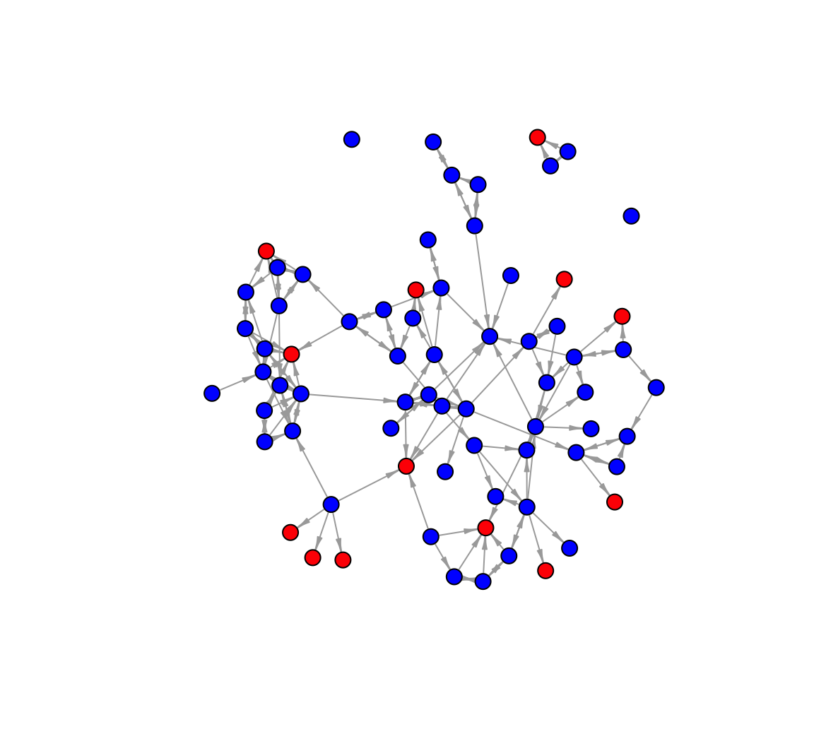

# Missing Network Data {#ch4-Missing-Network-Data-R}

This tutorial offers an empirical example dealing with missing network data in R. Missing data is a common problem faced by network researchers. Actors in the network may be absent the day of the survey, refuse to participate and in general offer incomplete information. Practically, a researcher must deal with missing data before doing any actual analyses. We will cover different strategies in assessing the possible level of bias due to missing data (focusing on the case of actor non-response). We will then cover simple imputation processes, with the goal of limiting the bias due to missing data.

## Missing Data
The data for our example are based on friendships between women in a sorority. The true network has 72 nodes. In the example that follows we will analyze the network assuming it has missing data, in the form of actor non-response. In the example, there are 14 nodes that are non-respondents, so that no information is available for those 14 nodes in terms of whom they nominated. We can assume that those 14 nodes were absent the day of the survey. Note that we still have any nominations from the non-missing nodes (those who filled out the survey) to the missing nodes (the non-respondents). Also note that the actual missing data for this example is generated for the sake of the tutorial, and does not reflect the missing data in the real network.

Here we read in a data frame that indicates which nodes in our toy example are assumed to be missing. We again read in the data from a URL (defined in the first line below).


```r
url1 <- "https://github.com/JeffreyAlanSmith/Integrated_Network_Science/raw/master/data/sorority_attributes_wmissingdata.csv"

sorority_attributes <- read.csv(file = url1)
```

Now we will read in the matrix describing the friendship between women in the sorority. We need to add row.names = 1 to tell R that the first column should be used to set the row names.


```r
url2 <- "https://github.com/JeffreyAlanSmith/Integrated_Network_Science/raw/master/data/sorority_matrix_wmissingdata.csv"

sorority_matrix <- read.csv(file = url2, row.names = 1)
```

And let's turn that data frame into a matrix to make it easier to manipulate. 


```r
sorority_matrix <- as.matrix(sorority_matrix)
```

Let's examine the data matrix and attribute file. We will first create a vector showing which nodes are missing in the network, using the missing variable in the attribute file. A 1 indicates the node is missing and 0 indicates they are not missing. The `which()` function returns which element is equal to 1.


```r
missing <- which(sorority_attributes[, "missing"] == 1)
```


```r
missing
```

```
##  [1]  2  7 12 26 29 30 44 45 47 50 54 64 65 66
```

Let's also create vector indicating which are not missing.


```r
notmissing <- which(sorority_attributes[, "missing"] == 0)
```

Now let's look at the rows and columns of our matrix, focusing on the missing cases.  Here we just look at the first missing node, node 2 (just looking at the first 15 columns):


```r
sorority_matrix[2, 1:15]
```

```
##  id1  id2  id3  id4  id5  id6  id7  id8  id9 id10 id11 id12 id13 id14 id15 
##   NA   NA   NA   NA   NA   NA   NA   NA   NA   NA   NA   NA   NA   NA   NA
```

We can see that the row is full of NAs since node 2 is missing. The matrix thus offers no information on the nominations from node 2 to other nodes in the network. Now, let's look at the column for our missing node (just for the first 15 rows):


```r
sorority_matrix[1:15, 2]
```

```
##  id1  id2  id3  id4  id5  id6  id7  id8  id9 id10 id11 id12 id13 id14 id15 
##    0   NA    0    0    0    0   NA    0    0    0    0   NA    1    0    0
```

There are 0s, 1s and NAs. A 1 indicates that a non-missing node reports a friendship with the missing node (here person 2); a 0 means that no tie is reported (between the non-missing node and missing node). For example, node 13 reports a tie with node 2 while node 1 does not. It is important to remember that we do not know about the nominations from the missing nodes; so we do not know if node 2 would have nominated node 13 back. The NAs correspond to cases involving another missing node. For example, node 7 is also missing and we see an NA in row 7, column 2. More substantively, there is no information at all about ties between two missing nodes. So we would also see an NA in row 2, column 7:


```r
sorority_matrix[2, 7]
```

```
## [1] NA
```

## Listwise Deletion 
We will begin by constructing the network assuming that the researcher deals with the missing data by performing listwise deletion. In this case, all of the missing nodes are dropped from the network when constructing the network object. This means that all ties from non-missing nodes to missing nodes will also not be included in the network. Let's create a matrix that just includes the non-missing nodes. Note that the syntax below uses the `-` sign to tell R which rows and columns in the matrix should be removed, here those cases that are missing.


```r
matrix_remove_missing <- sorority_matrix[-missing, -missing]
```


```r
dim(matrix_remove_missing)
```

```
## [1] 58 58
```

Now there are only 58 rows and 58 columns as the 14 missing cases have been removed. We will now take our reduced matrix (with only non-missing cases) and create an igraph object.


```r
library(igraph)
```


```r
net_listwise_delete  <- graph_from_adjacency_matrix(matrix_remove_missing, 
                                                    mode = "directed")
```

Let's go ahead and plot the network with the missing nodes removed, adding a few plotting options to make the graph easier to interpret.


```r
plot(net_listwise_delete, vertex.label = NA, vertex.size = 10, 
     edge.arrow.size = .5, edge.arrow.width = .5)
```


We can also calculate network statistics of interest on our incomplete network, with the missing nodes removed. Here we will assume that we are interested in measuring the mean closeness between nodes in the network. We first define the shortest path between each pair of nodes. We then take the inverse of those values (to avoid any problems with unreachable nodes; see [Chapter 3](#ch3-Cross-Sectional-Network-Data-R)) and then take the mean over those values. Here we calculate closeness on the network constructed above, using only the non-missing cases. 

The process is the same as in [Chapter 3](#ch3-Cross-Sectional-Network-Data-R), and we again use the `distances()` function with mode set to out. The diagonal is not meaningful here, so we put in a NA for that.


```r
dist_listwise_delete <- distances(graph = net_listwise_delete, mode = "out")

diag(dist_listwise_delete) <-  NA 
```

And now we can calculate how close everyone is, on average, by taking the mean over the inverted distance matrix. We set na.rm = T to ignore the NAs on the diagonal.


```r
mean_closeness_listwise_delete <- mean(1 / dist_listwise_delete, na.rm = T) 
```


```r
mean_closeness_listwise_delete
```

```
## [1] 0.1098182
```

We can also create a function that will do the same as above. Creating a function will save us from having to retype each step every time we want to calculate closeness. We will call the function `closeness_function()`. The only argument is network, equal to an igraph object. The rest of the steps are the same as above.


```r
closeness_function <- function(network){
  
  dist_matrix <-  distances(graph = network, mode = "out")
  diag(dist_matrix) <- NA
  mean_closeness <- mean(1 / dist_matrix, na.rm = T)
  return(mean_closeness)
}
```

Once we create the closeness function, all we need to do is input the network of interest to calculate closeness.


```r
closeness_function(net_listwise_delete)
```

```
## [1] 0.1098182
```

## Gauging the Level of Bias
The next question is how much bias we think there is in our estimate, here for closeness. We will examine two different strategies for gauging bias. 

### Gauging Bias Using Past Results
First, we will use past results on missing data and network measurement to estimate the level of bias. Past work has shown how missing data biases different network measures (and networks) at different rates. The idea is to use these results to gauge bias in the particular case of interest, given the features of the network and the measure of interest. A researcher would simply use the results that match their study most closely. In this case the network is small and directed, and the measure of interest is closeness. The percent missing is approximately 20% (14 missing nodes out of 72: `14/72`). Given these conditions, we can use the tables in @Smith2013 as a guide. Looking at Table 6 in @Smith2013, we can see that for the smaller, directed networks, we can miss up to 20-25% of the network and still be under a bias of .25 for closeness (or distance). Given these results we may expect the bias to be around .25 or so, assuming there is no imputation.

### Gauging Bias Using Predictive Models
Our second strategy uses predictive modeling, where the researcher inputs various features of the study into a model that yields an estimated level of bias. Here we will rely on the model presented in @Smith2017. They have provided an easy to use bias calculator at: http://www.soc.duke.edu/~jmoody77/missingdata/calculator.htm. The researcher must set a number of inputs into the bias calculator and we will walk through how to practically do this in the case of the sorority network. The main inputs are: size, percent missing, indegree standard deviation, directed/undirected and the type of missing data. 

We start by setting the size of the true network. In this case, we set the number of nodes to 72 (as this is the size of the network) and the percent missing to 20. We can estimate the indegree standard deviation using the network above:


```r
indeg <- degree(net_listwise_delete, mode = "in")
sd(indeg)
```

```
## [1] 1.609203
```

We will thus set the standard deviation to 1.609. The next input is directed/undirected and here the network is directed. The last input is the correlation between the missing nodes and their centrality. Are central nodes more/less likely to be missing? This can be difficult to determine as we do not have much information on the missing nodes. One possibility is to put in different inputs for this correlation and calculate a range of possible bias. A second option is to compare the indegree of the missing nodes to the indegree of the non-missing nodes and see which is higher. When the indegree is higher for missing nodes, the correlation is positive between being missing and centrality.  Here we will set the correlation between missing nodes and centrality at .25, a slight positive correlation, although we could try alternative values. Given these inputs, the expected bias for distance is around .19 (using the bias calculator from @Smith2017), similar to the estimate above. Note that the results are somewhat different if we set network type to a specific kind of network (here sorority).

## Simple Imputation Options
We now turn to different options in dealing with missing nodes, beyond simply removing them. Here we will consider simple imputation procedures. Simple imputation is based on the idea that a researcher can leverage the nominations from non-missing nodes to missing nodes to help fill in some of the missing data (@Smith2022). For directed networks, there are three basic versions of simple imputation: asymmetric, symmetric, and probabilistic. In this section we will walk through each one.

To begin, we will go back to the original matrix, sorority_matrix, and construct a network based on the non-missing nodes and any missing node that was nominated by a non-missing node. Let's identify which missing nodes we will put back in the network. To identify these nodes, we first subset the matrix, only looking at the nominations to the missing nodes.


```r
nominations_missing_nodes <- sorority_matrix[, missing]
```

Now we add up those columns, calculating the number of nominations each missing node received.


```r
indeg_missing <- colSums(nominations_missing_nodes, na.rm = T)
```

Finally, we ask which column sums are greater than 0 indicating that the missing node got at least one nomination from a non-missing node. We use that to subset the missing cases, just keeping those who got at least one nomination. 


```r
impute_nodes <- missing[indeg_missing > 0]
```


```r
impute_nodes
```

```
##  [1]  2  7 12 26 29 30 44 45 47 50 54 64 66
```

Let's also create a vector showing which nodes should be removed completely, so missing nodes who did not get nominations from non-missing nodes.


```r
still_missing <- missing[indeg_missing == 0]
```


```r
still_missing
```

```
## [1] 65
```

### Simple Imputation with Asymmetric Option
So far, we have defined which missing nodes should go back into the imputed network. Next, we must decide on what ties should be imputed. Here, we will focus on the potential ties from missing nodes to the non-missing nodes who nominated them. We have no observed information on these ties so we must decide how to treat them. In the asymmetric option, we do the simplest thing and just assume that no ties exist from the missing nodes back to the non-missing nodes who nominated them. Thus, we assume that all ties from n to m (where n is a non-missing node and m is a missing node) are asymmetric, so that m to n does not exist. 

First, we copy the raw matrix read in above, so we don't make any changes to the original data.


```r
matrix_impute_asym <- sorority_matrix 
```

Next, we set all potential outgoing ties from missing nodes to 0:


```r
matrix_impute_asym[missing, ] <- 0 
```

And finally we create the network based on the imputed matrix.


```r
net_impute_asym <- graph_from_adjacency_matrix(matrix_impute_asym, 
                                               mode = "directed")
```

Let's plot the network, coloring the nodes based on missing-status. We will color the nodes red if they are missing nodes and blue if they are not missing. We will use an `ifelse()` function on the `missing` column in our attribute data frame. 


```r
cols <- ifelse(sorority_attributes[, "missing"] == 1, "red", "blue")
```


```r
table(cols, sorority_attributes[, "missing"])
```

```
##       
## cols    0  1
##   blue 58  0
##   red   0 14
```

The coding looks right, so let's go ahead and put the cols vector onto the network.


```r
V(net_impute_asym)$color <- cols 
```

Right now this network includes missing nodes that received no nominations and should not be in the imputed network. They are defined in still_missing. Let's go ahead and remove them. We will use a `delete_vertices()` function. The arguments are: graph = network; v = nodes to remove.


```r
net_impute_asym <- delete_vertices(graph = net_impute_asym, v = still_missing)
```

The network will now have 71 nodes. And now let's plot the network.


```r
plot(net_impute_asym, vertex.label = NA, vertex.size = 7, 
     edge.arrow.size = .5, edge.arrow.width = .5)
```



Note that all ties going to the red nodes (missing) are unreciprocated. And for a comparison let's calculate closeness using our `closeness()` function. We will calculate closeness under each of our imputation strategies, to see how different choices affect our estimates of a basic network property. 


```r
mean_closeness_impute_asym <- closeness_function(net_impute_asym)
```


```r
mean_closeness_impute_asym
```

```
## [1] 0.08920313
```

In this case, we can see that the asymmetric imputation strategy yields a lower value of closeness (or higher distances) than under listwise deletion (where closeness was .11).

### Simple Imputation with Symmetric Option
We now repeat the same process as above, still using a simple imputation strategy, but we make different assumptions about the ties going from the missing nodes back to the non-missing nodes that nominated them. Here we use a symmetric option, where we assume that all ties from n to m (where n is a non-missing node and m is a missing node) are reciprocated, so that m to n exists. 

As before, we start by creating a copy of the friendship matrix, so we don't make any changes to the original data.


```r
matrix_impute_sym <- sorority_matrix 
```

Now, for any case where a missing node nominates a non-missing node we impute a tie from the missing node back to the non-missing node. We do this by setting the outgoing ties for the missing nodes equal to the ties sent to them. Let's first grab the columns for the missing nodes to see who nominated them. This was defined as `nominations_missing_nodes` above.


```r
head(nominations_missing_nodes)
```

```
##     id2 id7 id12 id26 id29 id30 id44 id45 id47 id50 id54 id64 id65 id66
## id1   0   0    0    0    0    0    0    0    0    0    0    0    0    0
## id2  NA  NA   NA   NA   NA   NA   NA   NA   NA   NA   NA   NA   NA   NA
## id3   0   1    0    1    0    0    0    0    0    0    0    1    0    1
## id4   0   0    0    0    0    0    0    0    0    0    0    0    0    0
## id5   0   0    0    0    0    0    0    0    0    0    0    0    0    0
## id6   0   0    0    0    0    0    0    0    0    0    0    0    0    0
```

Remember that each 1 shows which non-missing node nominates which missing node, on the columns. We can see that node 3 nominates a missing case, node 7. There are 14 columns as this data only includes nominations to the missing nodes (on the columns). The NAs correspond to ties involving two missing nodes. We set those to 0 here as we are not imputing the ties between missing nodes, just assuming they do not exist (perhaps incorrectly). We also transpose the nomination matrix to make it the right dimensions to be outgoing ties (from missing nodes to non-missing nodes who nominated them). Thus, if node n (non-missing) nominates node m (missing) we would see a 1 in the n,m cell in the matrix; by taking the transpose, we will be able to impute a nomination back from m to n. 


```r
nominations_missing_nodes[is.na(nominations_missing_nodes)] <- 0
outgoing_ties_sym <- t(nominations_missing_nodes) 
```

And now we set the outgoing ties for the missing nodes based on the imputation from above.


```r
matrix_impute_sym[missing, ] <- outgoing_ties_sym
```

Let's take a look at the results, focusing on the first missing node (person 2) (for the first 15 rows): 


```r
matrix_impute_sym[1:15, 2]
```

```
##  id1  id2  id3  id4  id5  id6  id7  id8  id9 id10 id11 id12 id13 id14 id15 
##    0    0    0    0    0    0    0    0    0    0    0    0    1    0    0
```

Here we see that node 13 nominates person 2, and in this version of the imputed matrix, there is also a tie from 2 to 13.


```r
matrix_impute_sym[2, 13]
```

```
## [1] 1
```

And note that there is no tie from 2 to 13 in the previous imputation procedure:


```r
matrix_impute_asym[2, 13]
```

```
## [1] 0
```

Again, we can create a network based on the imputed data.


```r
net_impute_sym <- graph_from_adjacency_matrix(matrix_impute_sym, 
                                              mode = "directed")
```

Now let's take out any nodes that are missing and were not put back into the network, as before.


```r
net_impute_sym <- delete_vertices(graph = net_impute_sym, v = still_missing)
```


```r
net_impute_sym
```

```
## IGRAPH e310253 DN-- 71 189 -- 
## + attr: name (v/c)
## + edges from e310253 (vertex names):
##  [1] id1 ->id39 id1 ->id42 id2 ->id13 id2 ->id62 id3 ->id1  id3 ->id7 
##  [7] id3 ->id26 id3 ->id64 id3 ->id66 id7 ->id3  id8 ->id1  id8 ->id42
## [13] id8 ->id55 id9 ->id25 id9 ->id28 id9 ->id63 id9 ->id64 id9 ->id72
## [19] id10->id44 id10->id48 id10->id64 id11->id50 id11->id52 id11->id71
## [25] id12->id20 id12->id31 id12->id32 id12->id35 id12->id42 id12->id55
## [31] id13->id2  id13->id14 id13->id22 id13->id34 id13->id52 id13->id62
## [37] id14->id22 id14->id33 id14->id34 id14->id44 id14->id69 id15->id16
## [43] id15->id18 id15->id22 id16->id15 id16->id41 id17->id43 id18->id15
## + ... omitted several edges
```

Note there are still 71 nodes but now 189 edges in the imputed network (compared to the 157 edges in `net_impute_asym`).


```r
mean_closeness_impute_sym <- closeness_function(net_impute_sym)
```


```r
mean_closeness_impute_sym
```

```
## [1] 0.1574669
```

The closeness value is quite different, and higher, than under listwise deletion or the asymmetric option.

### Simple Imputation with Probabilistic Option
Now, we repeat the same process as above, but offer a probabilistic option on how to impute the ties going from the missing nodes back to the non-missing nodes that nominated them. Here, when a tie exists from n to m (where n is a non-missing node and m is a missing node) we assume that a tie from m to n exists with probability p, set to the reciprocity rate in the observed network (just using the set of non-missing nodes). First, we calculate the rate of reciprocity. This gives us a baseline estimate on the probability of a tie being reciprocated. We will use the network constructed above with missing nodes removed to calculate this. 

The function is `reciprocity()` (in the **igraph** package). Arguments are graph and mode, with mode setting the type of calculation. We will set mode to "ratio". Ratio ensures that we get the correct calculation, where the number of reciprocated dyads is divided by the total number of non-null dyads, symmetric / (asymmetric + symmetric).


```r
p <- reciprocity(graph = net_listwise_delete, mode = "ratio")
```


```r
p
```

```
## [1] 0.4204545
```

Our results suggest that about 42% of the time when i nominates j, j nominates i. Given this calculation, we can impute the ties by probabilistically assigning ties from missing nodes back to non-missing nodes. Let’s begin by copying the friendship matrix from above.


```r
matrix_impute_prob <- sorority_matrix
```

Let’s also go ahead and transpose the incoming ties matrix, showing nominations to missing nodes. This will put the matrix into the right shape to be (imputed) outgoing ties.
 

```r
outgoing_ties_prob <- t(nominations_missing_nodes)
```

Next, we will probabilistically determine which of the incoming ties will be imputed as reciprocated. For each nomination from n (non-missing) to m (missing), we will take a draw from a binomial distribution with probability set to p. This will probabilistically determine if the m to n tie exists, imputing if the nomination is reciprocated. Note that we only take draws for cases where `outgoing_ties_prob` is equal to 1, showing where a non-missing node (n) nominates a missing node (m). We use `set.seed()` to make it easier to reproduce our results.


```r
set.seed(200)

impute_tie <- outgoing_ties_prob == 1

outgoing_ties_prob[impute_tie] <- rbinom(outgoing_ties_prob[impute_tie], 
                                          size = 1, prob = p) 
```

And now we set the outgoing ties for the missing nodes equal to the probabilistic set of outgoing ties.


```r
matrix_impute_prob[missing, ] <- outgoing_ties_prob
```

Again, we can create a network, remove missing nodes with no incoming ties and calculate closeness.


```r
net_impute_prob <- graph_from_adjacency_matrix(matrix_impute_prob, 
                                               mode = "directed")

net_impute_prob <- delete_vertices(graph = net_impute_prob, v = still_missing)

mean_closeness_impute_prob <- closeness_function(net_impute_prob)
```


```r
mean_closeness_impute_prob
```

```
## [1] 0.1351686
```

Note that this introduced a bit of stochastic noise into the imputation (as we took draws from a binomial distribution). It would thus make sense to repeat this process a number of times and average over the results. 

### Comparing Estimates
Here we create a little table of our closeness results, to see how different imputation choices affect our estimates of closeness.


```r
closeness_table <- data.frame(true = .15, 
                              listwise_delete = mean_closeness_listwise_delete,
                              asym = mean_closeness_impute_asym, 
                              sym = mean_closeness_impute_sym, 
                              prob = mean_closeness_impute_prob)
```


```r
closeness_table
```

```
##   true listwise_delete       asym       sym      prob
## 1 0.15       0.1098182 0.08920313 0.1574669 0.1351686
```

In this example we can actually compare against the true value on the complete network. This is possible because the missing data in this case were simulated. This, of course, would not be possible in most empirical settings. The true closeness value is .15, and we can see that the symmetric option was clearly the best, with asymmetric imputation doing worse than listwise deletion. More sophisticated imputation options are also possible, relying on statistical network models to predict the presence/absence of missing edges.
