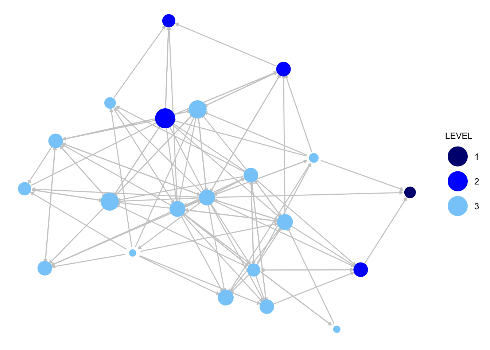

# Dyads and Triads {#ch7-Dyads-Triads-R}

This tutorial walks through an analysis of dyads and triads in R. We will examine the micro processes that govern tie formation. We will begin with dyadic processes before adding a third node and considering triads. The tutorial will draw on many of the ideas introduced in the previous chapters (including basic network construction, measurement and more substantive questions about homophily). We will consider a sociocentric network based on friendship and advice ties in an organization. Our main substantive concerns are about the basic ‘rules’ that govern advice and friendship formation. For example, do we see the same behavioral rules being followed when examining advice compared to friendship? Our second main question is how these behavioral rules map onto the structure of the organization itself. In what way does the organizational structure (different departments, levels, etc.) shape the way that individual nodes form friendships and seek advice?

## Setting up the Session
For this session we will work primarily with the **sna** package [@sna], so let's start by loading that package.


```r
library(sna)
```

We will make use of a data set collected by David Krackhardt. The data are based on three relations collected on workers in a single organization. Krackhardt asked employees at a high-tech firm that was undergoing a union certification campaign, to whom they reported, with whom they were friends, and to whom they go to for advice. These relationships provide insight into the firm's embedded social structure, which may play a strong role in shaping opinion and opinion change. We begin by constructing the networks of interest, starting with the advice network. We first read in the data on advice relations, saved as a dyad-level dataset (read in from a URL). 


```r
url1 <- "https://github.com/JeffreyAlanSmith/Integrated_Network_Science/raw/master/data/krackhardt_advice.csv"

advice_data_frame <- read.csv(file = url1) 
```


```r
head(advice_data_frame)
```

```
##   ego alter advice_tie
## 1   1     1          0
## 2   1     2          1
## 3   1     3          0
## 4   1     4          1
## 5   1     5          0
## 6   1     6          0
```

Each row in the data frame is a distinct dyad, with the first column corresponding to person 1 and the second column person 2. The third column indicates whether person 1 (or ego) seeks advice from person 2 (the alter). There is a 1 if the ij tie exists and a 0 otherwise. The first thing we will do is subset that full data frame to only keep those cases where a tie exists, thus giving us the edgelist for this network.


```r
advice_edgelist <- advice_data_frame[advice_data_frame$advice_tie == 1, ]
```

Now we will read in the data file for the attributes of the nodes:


```r
url2 <- "https://github.com/JeffreyAlanSmith/Integrated_Network_Science/raw/master/data/krackhardt_attributes.csv"

attributes <- read.csv(file = url2)
```


```r
attributes
```

```
##    ids AGE TENURE LEVEL DEPT
## 1    1  33  9.333     3    4
## 2    2  42 19.583     2    4
## 3    3  40 12.750     3    2
## 4    4  33  7.500     3    4
## 5    5  32  3.333     3    2
## 6    6  59 28.000     3    1
## 7    7  55 30.000     1    0
## 8    8  34 11.333     3    1
## 9    9  62  5.417     3    2
## 10  10  37  9.250     3    3
## 11  11  46 27.000     3    3
## 12  12  34  8.917     3    1
## 13  13  48  0.250     3    2
## 14  14  43 10.417     2    2
## 15  15  40  8.417     3    2
## 16  16  27  4.667     3    4
## 17  17  30 12.417     3    1
## 18  18  33  9.083     2    3
## 19  19  32  4.833     3    2
## 20  20  38 11.667     3    2
## 21  21  36 12.500     2    1
```

We now have a data frame, called `attributes`, which holds the characteristics of our nodes. This captures the characteristics of employees at the company. The attributes include age, tenure, level of authority and department. With the edgelist and attribute data, we are now ready to construct our network using the `network()` function. We will treat the network as directed. As we are working with an edgelist, we can use a vertices argument for the attribute information. 


```r
krack_advice <- network(x = advice_edgelist, directed = T, 
                        vertices = attributes) 
```


```r
krack_advice
```

```
##  Network attributes:
##   vertices = 21 
##   directed = TRUE 
##   hyper = FALSE 
##   loops = FALSE 
##   multiple = FALSE 
##   bipartite = FALSE 
##   total edges= 190 
##     missing edges= 0 
##     non-missing edges= 190 
## 
##  Vertex attribute names: 
##     AGE DEPT LEVEL TENURE vertex.names 
## 
##  Edge attribute names: 
##     advice_tie
```

We will now do the same thing for the friendship network. The tie information can be read in as:


```r
url3 <- "https://github.com/JeffreyAlanSmith/Integrated_Network_Science/raw/master/data/krackhardt_friendship.csv"

friends_data_frame <- read.csv(file = url3)
```


```r
head(friends_data_frame)
```

```
##   ego alter friendship_tie
## 1   1     1              0
## 2   1     2              1
## 3   1     3              0
## 4   1     4              1
## 5   1     5              0
## 6   1     6              0
```
Now we will subset the data to only include those dyads where a tie exists from i to j. 


```r
friends_edgelist <- friends_data_frame[friends_data_frame$friendship_tie == 1, ]
```

We now construct the network, as before, using the `network()` function.


```r
krack_friendship <-  network(x = friends_edgelist, directed = T, 
                             vertices = attributes)
```

Let’s do a quick plot of the advice and friendship networks to get sense of the two networks. We will use the `ggnet2()` function discussed in [Chapter 5](#ch5-Network-Visualization-R).  


```r
library(GGally)
```

We start with the advice network. We will size the nodes by indegree. 


```r
indeg_advice <- degree(krack_advice, cmode = "indegree")
```

We will also add color, coloring the nodes by level of authority in the organization, where 1 is the highest level (CEO), 2 is middle level (manager) and 3 is the lowest level. We accomplish this by adding node.color and palette arguments. 


```r
ggnet2(krack_advice, node.color = "LEVEL", node.size = indeg_advice,
       palette = c("1" = "navy", "2" = "blue", "3" = "lightskyblue"), 
       edge.size = .5, arrow.size = 3,  arrow.gap = 0.02, 
       edge.color = "grey80") +
  guides(size = "none")
```


Now for the friendship network:


```r
indeg_friendship <- degree(dat = krack_friendship, cmode = "indegree")

ggnet2(krack_friendship, node.color = "LEVEL", node.size = indeg_friendship,
       palette = c("1" = "navy", "2" = "blue", "3" = "lightskyblue"), 
       edge.size = .5, arrow.size = 3, arrow.gap = 0.02,
       edge.color = "grey80") +
  guides(size = "none")
```



We can already see that the advice network is much denser than the friendship network in this organization. Otherwise, it is difficult to immediately see the key differences in the two networks, meaning we will need to dig a little deeper to answer our questions about advice, friendship and organizational structure. 

## Dyadic Processes
Now that we have our networks constructed, we can begin to formally identify the rules of interaction that operate in this organization. We begin with the simplest case, the dyad, involving each pair of nodes in the network. 

### Dyad Census and Reciprocity
We start by calculating the dyad census, which characterizes each dyad as null, asymmetric or mutual. Here we can utilize the `dyad.census()` function in **sna**. We focus on the friendship network for now. 


```r
dyadcensus_friendship <- dyad.census(krack_friendship)
```


```r
dyadcensus_friendship
```

```
##      Mut Asym Null
## [1,]  23   56  131
```

There are 23 mutual dyads (i<->j), 56 asymmetric dyads (i->j) and 131 null dyads (no tie between i and j) in the friendship network. We can use the dyad census to calculate summary measures of interest, like reciprocity, showing how often i is tied to j when j is tied to i. We can calculate the rate of reciprocity as the proportion of non-null dyads where ij exists and ji exists. In the friendship network, we see that .709 of the non-null dyads are asymmetric (56 / (23 + 56)) and .291 are mutual (23 / (23 + 56)). The reciprocity rate is thus .291. Substantively, this suggests that there are some expectations for reciprocity but that many friendship nominations are, in fact, not reciprocated. We can also use the `grecip()` function to calculate the reciprocity rate directly. The main arguments are:

- dat = the network of interest
- measure = option indicating what kind of calculation to perform 

Here we set measure to "dyadic.nonnull" to get the calculation where only non-null dyads are considered. 


```r
recip_friendship <- grecip(dat = krack_friendship, measure = "dyadic.nonnull")
```


```r
recip_friendship 
```

```
##       Mut 
## 0.2911392
```

The value is the same as calculated above using the dyad census. The reciprocity rate is also useful at it facilitates comparisons across networks. Here, let’s compare the rate of reciprocity between the advice and friendship networks. 


```r
recip_advice <- grecip(dat = krack_advice, measure = "dyadic.nonnull")
```


```r
recip_advice
```

```
##       Mut 
## 0.3103448
```

In this case, the reciprocity rate is very similar in the two networks and the expectations surrounding reciprocation do not appear to vary dramatically across friendship and advice.

### Conditional Uniform Graph Tests
Our analysis so far has focused on summary measures. We know that the reciprocity rate in the two networks is similar, around .30. But how should we interpret this value? Is .30 ‘large’ or ‘small’? It is difficult to tell based on the value alone. What we are implicitly missing is some baseline by which to judge the magnitude of the observed value. Thus, what we want to do is compare the values we saw in the empirical network to some baseline value; for example, the value we would expect under a random network of the same density. This will give us some sense if the observed values could have been generated by chance, just based on the size and volume of the network. Substantively, we will be able to see if the tendencies we saw in the observed network deviate from what the network would have looked like if people randomly formed ties, a useful null hypothesis. Here we can use the `cug.test()` function to compare the observed values to that observed under random tie formation. The arguments are:

- dat = network
- FUN = function of interest 
- mode = setting if network is directed or not (digraph if directed)
- cmode = type of null hypothesis, or what type of random network to generate; options are size, edges (generate network with same density as network) and dyad.census (condition on dyad census itself)
- reps = number of iterations to use in simulation 
- FUN.args = list of arguments to be passed to function 

Here, we will run a conditional uniform graph test on the friendship network, focusing on reciprocity. The inputs are the friendship network, the function is grecip, mode is set to "digraph" (as the network is directed), cmode is set to "edges" as we want to condition on the density of the network. We also include an argument to FUN.args, to ensure that we have the same version of reciprocity as calculated above. 


```r
cug_recip <- cug.test(dat = krack_friendship, FUN = grecip, 
                      mode = c("digraph"), 
                      cmode = c("edges"), reps = 1000, 
                      FUN.args = list(measure = "dyadic.nonnull"))
```


```r
cug_recip
```

```
## 
## Univariate Conditional Uniform Graph Test
## 
## Conditioning Method: edges 
## Graph Type: digraph 
## Diagonal Used: FALSE 
## Replications: 1000 
## 
## Observed Value: 0.2911392 
## Pr(X>=Obs): 0 
## Pr(X<=Obs): 1
```

Let's look at the observed and generated null values. The observed value is stored as `obs.stat` in the outputted object, while the generated null values are stored as `rep.stat`.


```r
cug_recip$obs.stat
```

```
##       Mut 
## 0.2911392
```

```r
summary(cug_recip$rep.stat)
```

```
##    Min. 1st Qu.  Median    Mean 3rd Qu.    Max. 
## 0.05155 0.12088 0.13333 0.14046 0.15909 0.25926
```

We can see that under a random network with the same density as the true network we would expect, on average, to see a reciprocity rate of 0.14. In every simulated network, the observed value (.291) is larger than that expected if people were randomly forming ties (as P(X >= Obs) is equal to 0). This suggests that the actual friendship network has reciprocity rates above chance expectations. Norms of reciprocity are, at least in part, governing tie formation in this network. 

### Dyad Census by Attributes of Nodes
So far we have seen that there are more mutual dyads than we expect by chance, but that asymmetries are far from uncommon in this network. One useful way of exploring these tendencies more closely is to ask if there are certain conditions where ties are particularly likely to be asymmetric (or mutual). For example, we can ask if cross-gender ties are more/less likely to be reciprocated. Here, let’s explore the dyad census in the context of organizational structure. In this organization there are 3 basic levels of authority, a boss (1), middle manager (2) and worker (3).


```r
table(attributes$LEVEL)
```

```
## 
##  1  2  3 
##  1  4 16
```
We see that there are very few people at the top, a handful of people acting as middle managers and most at the very bottom, the actual workers. The question is how does the social structure, based on friendship or advice, map onto the organizational structure, where some people are in positions of authority and most are not. Here we will calculate the dyad census again for friendship, but do it separately for dyads that are at the same level and dyads that are not at the same level. We want to know if the rate of mutual dyads is higher/lower if the two people are at the same level of authority. 

First, let’s determine if each ij pair is in the same level of the organization. Here we will utilize an outer command, asking if i and j are at the same level, doing this over all ij pairs. 


```r
same_level <- outer(attributes$LEVEL, attributes$LEVEL, "==") 
```

Now, we need to construct a matrix that shows if each i-j pair is null, asymmetric or mutual. This will make it possible to calculate the dyad census conditioned on the attributes of the nodes in each dyad (i.e., are they at the same level of the organization or not). Let’s write a little function that will take the input network and output the matrix of dyad types. 


```r
dyad_mat_function <- function(dat){
  # Arguments:
  # dat: network object

  # getting matrix form of network
  mat <- as.matrix(dat) 
  
  # putting NA diagonal as we don’t want to consider self-ties
  diag(mat) <- NA 

  # Next, we do a little trick where we take the matrix and 
  # add it to its transpose, yielding a matrix of 0s, 1s 
  # and 2s. If it is null, the resulting value will be 0 
  # (neither ij nor ji exists); if it is asymmetric there
  # will be a 1 (as ij or ji exists but not both); and 
  # if it is mutual there will be a 2 (as there are ties 
  # from ij and ji).
  dyad_mat <- mat + t(mat) 

  # Now we label for ease of interpretation:
  dyad_mat[dyad_mat == 0] <- "null" 
  dyad_mat[dyad_mat == 1] <- "asym"
  dyad_mat[dyad_mat == 2] <- "mut"
  
  return(dyad_mat)
}
```

Let’s use our function to output the matrix of dyad types for the friendship network. 


```r
friends_dyads <- dyad_mat_function(krack_friendship)
```

Let's look at the first five rows and columns.


```r
friends_dyads[1:5, 1:5] 
```

```
##   1      2      3      4      5     
## 1 NA     "mut"  "null" "mut"  "null"
## 2 "mut"  NA     "null" "asym" "asym"
## 3 "null" "null" NA     "null" "null"
## 4 "mut"  "asym" "null" NA     "null"
## 5 "null" "asym" "null" "null" NA
```

We see that 1-2 is a mutual dyad, 1-3 is null and so on. Note that if we do a table over this and divide by 2 (as we don’t want to count each dyad twice) we get the dyad census, as above:
 

```r
table(friends_dyads) / 2
```

```
## friends_dyads
## asym  mut null 
##   56   23  131
```

Now, we calculate the dyad census but only consider dyads where `same_level` is equal to TRUE, so that i and j are both at the same level of authority.


```r
table(friends_dyads[same_level == TRUE]) / 2
```

```
## 
## asym  mut null 
##   38   19   69
```

Now, we calculate the dyad census but only consider dyads where `same_level` is equal to FALSE, so that i and j are not at the same level of authority.


```r
table(friends_dyads[same_level == FALSE]) / 2
```

```
## 
## asym  mut null 
##   18    4   62
```

The results show a clear difference between dyads that cross levels of authority and those that do not.  The rate of reciprocity is .333 when the dyads are at the same level (19 / (19 + 38)) but only .182 when they are at different levels (4 / (4 + 18)). This means that there is a much higher proportion of mutual dyads when both are at the same level than when one person is in authority position and the other is not. Friendships do tend to map onto the authority structure in the organization, where mutual friendship across levels, while possible, are unlikely. And more generally, it would appear that the clarity around friendship expectations is clearer when the two people are in the same level of the organization.

### Advice and Friendship Together 
As a second way of examining our results more closely, we can begin to ask questions about the joint nature of advice and friendship. Rather than simply looking at reciprocity across the two networks, we can see if advice maps onto friendship in particular ways. For example, if i nominates j as a friend and j does not reciprocate, does that make it more likely that ij will also have an asymmetric advice relation? More generally, what are the joint rules governing friendship and advice in this organization? To answer this question we begin by outputting the dyad type matrix for the advice network, using our function written above:  


```r
advice_dyads <- dyad_mat_function(krack_advice)
```


```r
advice_dyads[1:5, 1:5]
```

```
##   1      2      3      4      5     
## 1 NA     "asym" "asym" "mut"  "asym"
## 2 "asym" NA     "asym" "asym" "asym"
## 3 "asym" "asym" NA     "asym" "null"
## 4 "mut"  "asym" "asym" NA     "null"
## 5 "asym" "asym" "null" "null" NA
```

We can see that 1-2 is asymmetric, 1-3 is asymmetric, 1-4 is mutual, and so on. Now, let’s take the dyad matrices for friendship and advice and do a simple table. 


```r
table(friends_dyads, advice_dyads) / 2
```

```
##              advice_dyads
## friends_dyads asym mut null
##          asym   37  10    9
##          mut     9   9    5
##          null   54  26   51
```

Looking at the first row, we can see that 37 dyads are asymmetric on both relations, friendship and advice, 10 are asymmetric on friendship but mutual on advice, and 9 are asymmetric on friendship and null on advice. This suggests that dyads that tend to be asymmetric on friendship also tend to be asymmetric on advice (.661 of asymmetric friendship dyads are also asymmetric on advice). Compare this to the second row, the mutual friendship row. Mutual friendship dyads are evenly split between asymmetric and mutual advice dyads, and there is even a fairly high percentage in the null advice dyad (.391 in asymmetric, .391 in mutual and .217 in null). This means that a mutual friendship can be coupled with advice in almost anyway, while asymmetries in friendship are almost always coupled with asymmetries in advice. This may be the case as the advisee imputes a friendship onto the advisor that the advisor does not reciprocate. The very nature of advisee-advisor relationships invites the possibility of asymmetries in less formal, more friendship-based ties. More generally, we can see that advice and friendship combine in complex ways, even when we focus on just two nodes at a time.  

## Triadic Processes
We now move to more complex micro processes involving three nodes. Adding a third node adds a number of possibilities that did not exist with only two nodes. For example, there is now the possibility that one node can play the other two off each other for some gain or benefit. There is also the possibility that the relationship between two nodes (A-B) is strained because of the relationship to the third node (A likes C but B does not). The question is what kind of rules of interaction do we see in our friendship and advice networks. We also want to know if the triadic rules for friendship are different (or similar) to the triadic rules for advice. We first discuss the triad census before moving to transitivity.

### Triad Census
The triad census captures the distribution of triads across 16 basic types, representing different patterns of interaction between the three nodes. There are 16 different triad types:

-  003  A, B, C, empty triad
-  012  A->B, C 
-  102  A<->B, C  
-  021D A<-B->C 
-  021U A->B<-C 
-  021C A->B->C
-  111D A<->B<-C
-  111U A<->B->C
-  030T A->B<-C, A->C
-  030C A<-B<-C, A->C
-  201  A<->B<->C
-  120D A<-B->C, A<->C
-  120U A->B<-C, A<->C
-  120C A->B->C, A<->C
-  210  A->B<->C, A<->C
-  300  A<->B<->C, A<->C, completely connected
  
We can summarize the full distribution of triads using the `triad.census()` function. We want to compare the triad counts across the two network relations, to see if the patterns differ for friendship compared to advice. The `triad.census()` function outputs the counts in each triad type. First for friendship: 


```r
triads_friendship <- triad.census(krack_friendship)
```


```r
triads_friendship
```

```
##      003 012 102 021D 021U 021C 111D 111U 030T 030C 201 120D 120U 120C 210 300
## [1,] 376 366 143  114   34   35   39  101   23    0  20   16   25    9  23   6
```

And now for advice:


```r
triads_advice <- triad.census(krack_advice) 
```


```r
triads_advice
```

```
##      003 012 102 021D 021U 021C 111D 111U 030T 030C 201 120D 120U 120C 210 300
## [1,]  74 153  90  160   86   49   59  101  190    2  72   62   78   17 107  30
```
Let's make a table to make the comparisons easier.


```r
triad_data <- data.frame(advice = t(triads_advice), 
                         friendship = t(triads_friendship))
```


```r
triad_data
```

```
##      advice friendship
## 003      74        376
## 012     153        366
## 102      90        143
## 021D    160        114
## 021U     86         34
## 021C     49         35
## 111D     59         39
## 111U    101        101
## 030T    190         23
## 030C      2          0
## 201      72         20
## 120D     62         16
## 120U     78         25
## 120C     17          9
## 210     107         23
## 300      30          6
```
Note that the total number of triads in each network is the same, making comparisons easier. There are a number of things one could highlight between the two networks, but one striking difference is in the 030T triad, A->B<-C, A->C. The advice network has a much higher proportion of 030T triads than the friendship network, suggestive of an underlying hierarchy of advice less present in the friendship network; where A gives advice to B and C and C gives advice to B and B simply receives advice from others. The underlying hierarchy in this advice relation thus runs: A to C to B, as A influences B and C, C influences only B and B influences no one. Such a pattern of hierarchy does not emerge as clearly in the friendship network. In general, the triads associated with transitive dominance relations (021D, 120D, 021U, 030T, 120U) are more likely to be present in the advice network than the friendship network. Note that we need to be a little careful in pushing that conclusion too far, as the networks have different levels of density (and possibly reciprocity) that may be driving the differences we observe in the triad count. We need to take these baseline differences into account before formally interpreting the triad counts. Here, we will utilize a CUG test to compare the triad census to what we might expect by chance, if people randomly formed ties. We discuss other, more complex, options in future chapters. 

We use the same `cug.test()` function as we used above when looking at reciprocity. The main difference is that here we condition the random networks in a different way. In this case we will condition on the dyad census, to see how the counts of the triad census differ above what we expect from a network of the same size, density and dyadic tendencies (i.e., same rate of reciprocity). Our particular question is if different specific triad types show up more (or less) than we expect in a random network, conditioned on those features. To facilitate this, we will first write a function to make it easier to specify the test statistic of interest, here the counts of specific triad types. Our function will take the network of interest, calculate the triad census and output the count of the particular triad of interest. We could also write a similar function to take the weighted sum over a specified set of triads. Here we focus on one triad type at a time. 


```r
count_triads_function <- function(dat, triad_names){
  # Arguments:
  # dat: the network object
  # triad_names: the name of the triad type
  
  triads <- triad.census(dat) # calculating the triad census
  triads[1, triad_names] # grabbing counts of triad of interest
}
```

Let’s see how this works before we use it in a CUG test. Let’s focus again on 030T, where A gives advice to B and C and C gives advice to B.


```r
count_triads_function(krack_advice, triad_names = c("030T"))
```

```
## 030T 
##  190
```

Now, let’s use our function to count the triad type of interest but this time compare the counts to what we expect by chance, in a random network conditioned on the dyad census. We now use the `cug.test()` function. The main inputs are the network (here for advice), the desired conditioning of the random network (cmode set to "dyad.census") and the function of interest, in this case count_triads_function. The input to that function is triad_names, here set to "030T".  


```r
cug_triads_advice <- cug.test(krack_advice, 
                              FUN = count_triads_function, 
                              mode = c("digraph"), 
                              cmode = c("dyad.census"), reps = 1000, 
                              FUN.args = list(triad_names = c("030T"))) 
```


```r
cug_triads_advice
```

```
## 
## Univariate Conditional Uniform Graph Test
## 
## Conditioning Method: dyad.census 
## Graph Type: digraph 
## Diagonal Used: FALSE 
## Replications: 1000 
## 
## Observed Value: 190 
## Pr(X>=Obs): 0 
## Pr(X<=Obs): 1
```

We can see that the total number of 030T triads in the observed network is above what we expect in the random network. In all 1000 random networks, the observed count is above that seen in the randomly generated network (P(X >= Obs) is equal to 0). This means that the tendency for A to give advice to B and C and then C to give advice to B cannot be accounted for based simply on the density of advice relations and expectations of reciprocity. We now do the same analysis for the friendship network.


```r
cug_triads_friendship <- cug.test(krack_friendship, 
                                  FUN = count_triads_function, 
                                  mode = c("digraph"), 
                                  cmode = c("dyad.census"), reps = 1000, 
                                  FUN.args = list(triad_names = c("030T")))
```


```r
cug_triads_friendship
```

```
## 
## Univariate Conditional Uniform Graph Test
## 
## Conditioning Method: dyad.census 
## Graph Type: digraph 
## Diagonal Used: FALSE 
## Replications: 1000 
## 
## Observed Value: 23 
## Pr(X>=Obs): 0.127 
## Pr(X<=Obs): 0.917
```

The story is different for friendship. Here we see that in many iterations the observed value (the count of 030T) is not above that expected in a random network of that size, density and dyad census. Using traditional statistical cutoffs, we cannot be certain that there is a difference between the observed and random expectations. This suggests that the tendency for A to be friends with B and C and C to be friends with B is not particularly strong in the friendship network, at least not above what could have arisen if people randomly formed friendships (conditioned on the density of the network and the reciprocity rate). Let’s take a closer look at the observed values and the values expected under the randomly generated networks. 


```r
cug_triads_friendship$obs.stat
```

```
## 030T 
##   23
```

```r
summary(cug_triads_friendship$rep.stat) 
```

```
##    Min. 1st Qu.  Median    Mean 3rd Qu.    Max. 
##    7.00   15.00   18.00   18.04   20.00   31.00
```

On average, the expected count in the random network is 18.04, close to that observed in the true network (23). What if we had considered a different triad type in our friendship network? For example, let’s consider 120U (A->B<-C, A<->C). In this case A and C have a reciprocated friendship. They also both nominate B who does not nominate them back. There are asymmetries in such a triad, but from a balance perspective this may not be problematic. A and C are both positively linked and they have positive sentiments towards B. There is thus agreement about a third party (B) from the point of view of A and C, even if B does not consider them friends in return. Let’s do a CUG test on the count of 120U on the friendship network: 


```r
cug_triads_friendship2 <- cug.test(krack_friendship, 
                                   FUN = count_triads_function, 
                                   mode = c("digraph"), 
                                   cmode = c("dyad.census"), reps = 1000,
                                   FUN.args = list(triad_names = c("120U")))
```


```r
cug_triads_friendship2
```

```
## 
## Univariate Conditional Uniform Graph Test
## 
## Conditioning Method: dyad.census 
## Graph Type: digraph 
## Diagonal Used: FALSE 
## Replications: 1000 
## 
## Observed Value: 25 
## Pr(X>=Obs): 0 
## Pr(X<=Obs): 1
```

In this case, we can see that the observed count (25) is above that expected by chance, and this is the case in all 1000 randomly generated networks. This suggests that a triad based on balanced relations, even if not completely mutual, is observed at comparatively high rates in the friendship network. 

Overall, it would appear that the advice network is built around dominance type relations in a way that the friendship network is not. Individuals give advice in a way that follows patterns of status; where, for example, A gives advice ‘down the line’ to B and C. In contrast, the friendship network, at least in our short analysis, is consistent with balancing relations, where if two nodes are strong friends, they will tend to agree (in terms of liking or not liking) third party nodes, even if that third party does not return the friendship. This was not captured very well in the dyadic analysis, where the reciprocity rates were pretty similar in the two networks. 

To explore these ideas more carefully, a researcher may want to look at all triad types for each network. As part of this book, we have written an additional function that will automatically do a CUG test for all triad types at once (rather than a single example, as above) and then output a summary table of the results. Let's read in the function: 


```r
source("https://github.com/JeffreyAlanSmith/Integrated_Network_Science/raw/master/R/CUGtest_alltriads.R")
```

The function is called `CUGtest_alltriads()`. The arguments are dat, the network of interest (assuming it is in the network format), mode, cmode and reps, all directly analogous to cug.test. And now we will use the function on our friendship network. 


```r
CUG_test_table <- CUGtest_alltriads(dat = krack_friendship, 
                                    mode = "digraph", 
                                    cmode = "dyad.census", reps = 1000)
```


```r
CUG_test_table
```

```
##    triads obs mean_random prop_random_lte_obs
## 1     003 376     319.674               1.000
## 2     012 366     417.532               0.000
## 3     102 143     171.489               0.002
## 4    021D 114      44.029               1.000
## 5    021U  34      44.260               0.052
## 6    021C  35      87.575               0.000
## 7    111D  39      73.748               0.000
## 8    111U 101      73.418               0.999
## 9    030T  23      18.299               0.907
## 10   030C   0       6.209               0.000
## 11    201  20      28.906               0.026
## 12   120D  16       7.740               0.998
## 13   120U  25       7.754               1.000
## 14   120C   9      15.272               0.063
## 15    210  23      12.518               0.998
## 16    300   6       1.577               0.999
```

The outputted table has 4 columns. The first column is the triad type. The second column is the observed count in the network of interest. The third column is the mean count seen in the random networks (under the desired conditioning). The fourth column is the proportion of times where the value from the random network is less than or equal to the value in the observed network. We can use these results to explore which triads are found in higher or lower levels than what we expect by chance. 

### Transitivity
In analogous fashion to the reciprocity rate, we can use transitivity as a summary measure of the triad census. Transitivity is defined as the proportion of (potentially intransitive) triads that are transitive, defined as all triads with i, j, and k, such that whenever i -> j and j -> k then i -> k. Or, more colloquially, a friend of a friend is a friend. The function is `gtrans()`. The main arguments are:

- dat = network of interest
- measure = type of calculation

In this case, the measure option we want is "weak" (this calculates the proportion of transitive triads divided by the number of potentially intransitive triads, defined as triads where i -> j and j -> k; the strong version divides by the total number of triads).


```r
gtrans(dat = krack_advice, measure = "weak") 
```

```
## [1] 0.6639785
```

As we saw with the triad census, transitive closure would appear to be strong in the advice network. If i advises j and j advises k, then i will also tend to advise k, maintaining the hierarchy of relations between the nodes.

Overall, a picture of the dyadic and triadic processes in this network begins to emerge. Friendships are often reciprocated, but asymmetries are common, especially when the pair cross levels of authority in the organization. And while the friendship and advice networks have similar levels of reciprocity, there are clear differences in the triadic processes. Advise appears to be driven more heavily by hierarchical relations, while friendship tends to be driven by agreement, or balance, between close friends (in relation to a third node). More generally, the analysis shows the importance of contextualizing our basic measures, showing how they map onto the particular context (here organizational structure) of interest. The analysis also suggests the importance of considering multiple relations at once. We will return to many of these ideas in future tutorials, most directly in [Chapter 9](#ch9-Network-Centrality-Hierarchy-R) (where we cover centrality and hierarchy) and [Chapter 13](#ch13-Statistical-Models-Networks-R) (where we cover statistical network models).
