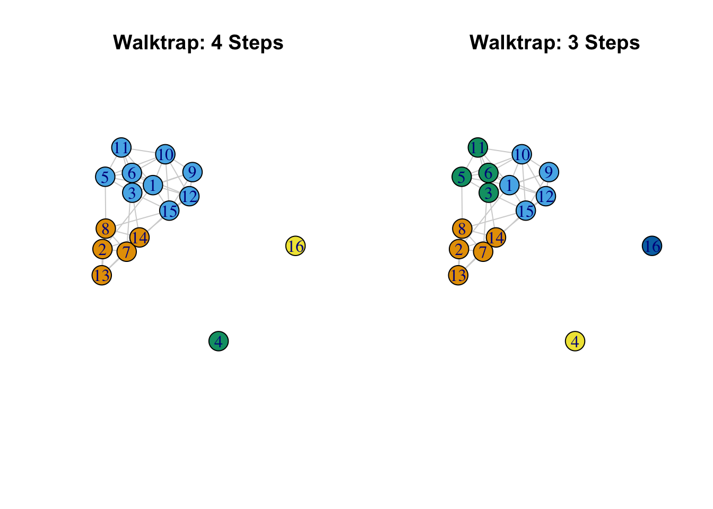
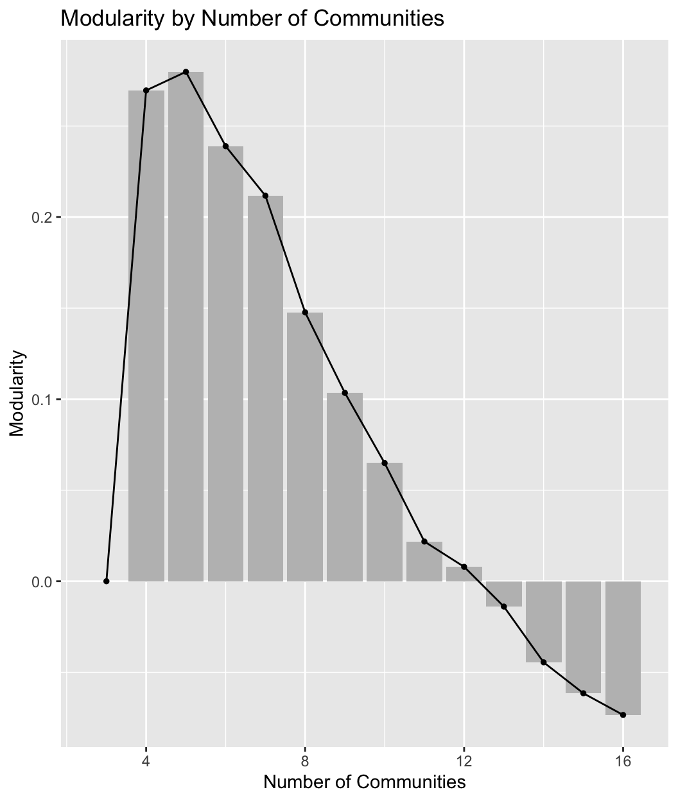
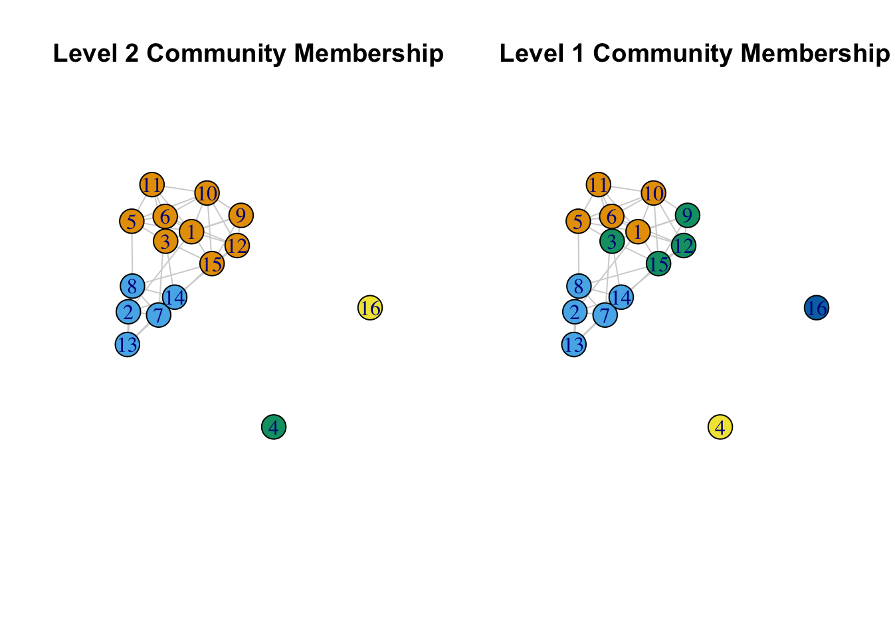
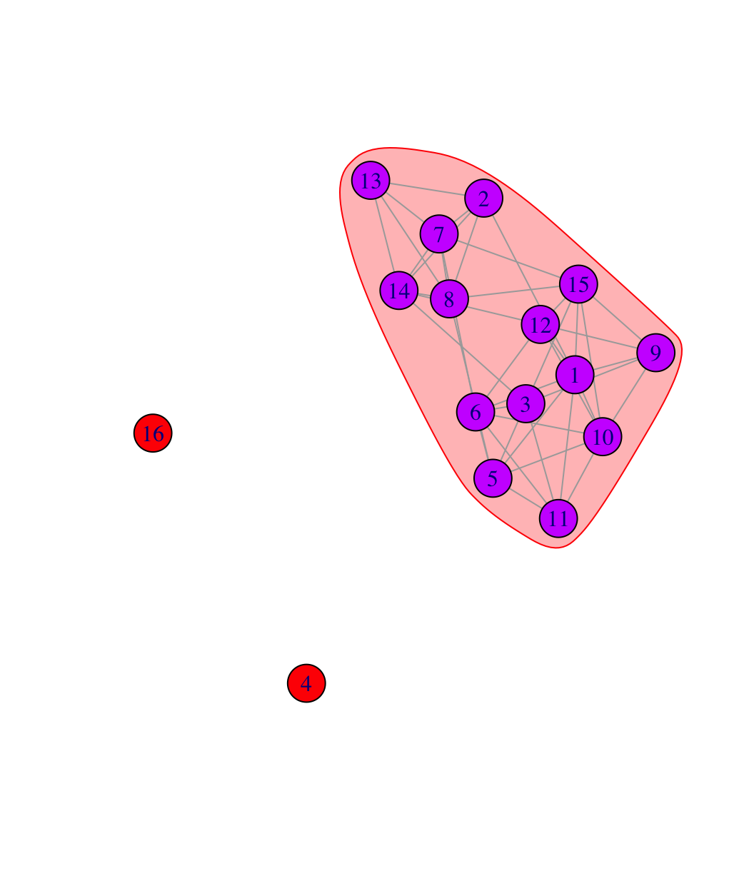
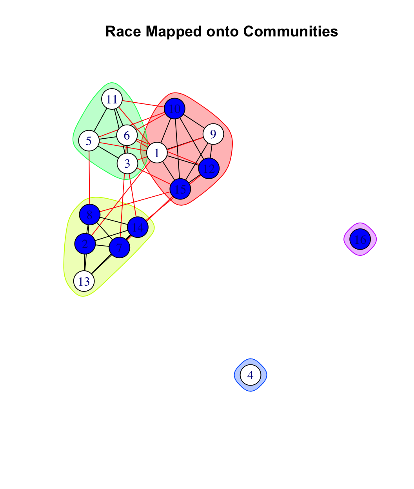
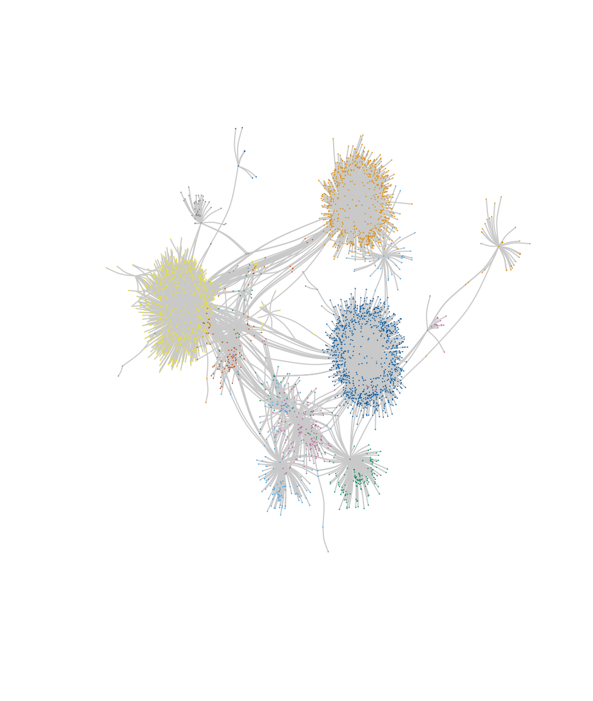

# Network Cohesion and Communities {#ch8-Network-Cohesion-Communities-R}

In this tutorial we will offer an extended example in R on cohesion and communities (or groups). We will first examine cohesion, capturing how robust the network is to being fragmented. We will then cover community structure, capturing which sets of actors form a group (in the sense that they have high rates of interaction, are close in the network, etc.). The tutorial will build on material from previous chapters, most directly from the tutorial on basic network measurement. We will utilize two example networks in our analysis. The first example comes from adolescent data collected by Daniel McFarland on the different kinds of interactions occurring in one classroom. This network is small, with only 16 actors. The second example will take up the problem of analyzing a much larger network, here an email network of over 200,000 nodes. This second example is included as a means of demonstrating some of the added complications of dealing with 'big' data, as well as to offer some suggestion on best practices when analyzing such networks. 

The classroom example is motivated by two main substantive questions. First, is the classroom network cohesive, or the does the network strongly split into local communities (or groups), with few ties between communities? This a crucial question if, for example, we are interested in the maintenance of norms in the classroom. Do we find two divided communities that are unlikely to agree on things? Or is there the possibility of general consensus, given the connections between communities? Our second question focuses on the composition of the communities themselves, focusing specifically on racial identity. Do we find distinct communities that correspond to racial identity (a ‘white’ group and a ‘black’ group) or are things more complicated? Putting these questions together, we want to know something about the potential for consensus and solidarity in the classroom and we want to know if the threats to consensus are tied to racial divides. 

## First Example Network
For this session we will work primarily with the **igraph** package. We will also load **ggplot2**. 


```r
library(igraph)
library(ggplot2)
```

Let's first read in the classroom network data (from a URL) and take a look at the first six rows:


```r
url1 <- "https://github.com/JeffreyAlanSmith/Integrated_Network_Science/raw/master/data/class182_networkdata.csv"

class182_networkdata <- read.csv(file = url1)
```


```r
head(class182_networkdata) 
```

```
##   ego alter friend_tie social_tie task_tie
## 1   1     1          0        0.0      0.0
## 2   1     2          0        0.0      0.0
## 3   1     3          0        0.0      0.0
## 4   1     4          0        0.0      0.0
## 5   1     5          0        1.2      0.3
## 6   1     6          0        0.0      0.0
```
The data frame holds information for each dyad in the classroom showing information for three relations: friendship, social interactions and task interactions. The first column is the ego, the second column is the alter, and the third, fourth and fifth columns are values, greater than or equal to zero, showing the strength of the association for the two nodes. Friendship is measured as: 2 = best friend, 1 = friend, 0 = not friend. Social interaction is measured as social interactions per hour. Task interaction is measured as task interactions per hour. Here we will utilize the friendship data. Let's also read in the attribute file.


```r
url2 <- "https://github.com/JeffreyAlanSmith/Integrated_Network_Science/raw/master/data/class182_attributedata.csv"

class182_attributes <- read.csv(file = url2)
```


```r
class182_attributes
```

```
##    ids  race grade gender
## 1    1 white    10   male
## 2    2 black    10 female
## 3    3 white    10 female
## 4    4 white    11 female
## 5    5 white    10   male
## 6    6 white    10 female
## 7    7 black    10 female
## 8    8 black    10 female
## 9    9 white    10 female
## 10  10 black    11   male
## 11  11 white    10   male
## 12  12 black    11 female
## 13  13 white    10 female
## 14  14 black    10 female
## 15  15 black    10 female
## 16  16 black    13   male
```

We have information on race, grade and gender for each student in the classroom. Let's create an edgelist based on the friendship relation. Here we will define an edge as any case where the friendship value is greater than 0. 


```r
edge_value <- class182_networkdata$friend_tie

edgelist_friendship <- class182_networkdata[edge_value > 0, 
                                            c("ego", "alter", "friend_tie")]
```


```r
head(edgelist_friendship)
```

```
##    ego alter friend_tie
## 17   2     1          1
## 23   2     7          1
## 24   2     8          1
## 29   2    13          2
## 30   2    14          1
## 37   3     5          1
```

And now we can go ahead and create our igraph object using the edgelist and attribute data frames.


```r
net182_friend <- graph_from_data_frame(d = edgelist_friendship, directed = T, 
                                       vertices = class182_attributes) 
```


```r
net182_friend 
```

```
## IGRAPH 45bbf9a DN-- 16 62 -- 
## + attr: name (v/c), race (v/c), grade (v/n), gender (v/c), friend_tie (e/n)
## + edges from 45bbf9a (vertex names):
##  [1] 2 ->1  2 ->7  2 ->8  2 ->13 2 ->14 3 ->5  3 ->6  3 ->11 3 ->14 3 ->15 5 ->1  5 ->3  5 ->6  5 ->8  5 ->10 5 ->11 6 ->1  6 ->3  6 ->5  6 ->7  6 ->10 6 ->11 6 ->12 7 ->2  7 ->8  7 ->13 7 ->14 8 ->2  8 ->5  8 ->7  8 ->13 8 ->14 8 ->15 9 ->1  9 ->3  9 ->10 9 ->12 9 ->15 10->1  10->9  10->12 10->15 11->1  11->3  11->5  11->6  11->10 12->1  12->9  12->15 13->2  13->7  13->8  13->14 14->2  14->3  14->8  14->12 15->1  15->7  15->9  15->12
```

Note that the network is directed and has an edge attribute, `friend_tie`, showing the strength of the relationship.

## Cohesion
We start by looking at the overall cohesion of the network. We will begin by doing a quick plot of the friendship network. This will give us a useful, intuitive picture of the network structure. 


```r
plot(net182_friend, vertex.label = NA, vertex.size = 10,
     edge.arrow.size = .25, edge.arrow.width = 1, 
     edge.color = "light gray", vertex.frame.color = NA)
```


We can see that the classroom network is fairly cohesive (ignoring the two isolates), although it does appear to roughly split into two groups. Let’s more formally explore some of the properties of the network, starting with density.  


```r
edge_density(net182_friend)
```

```
## [1] 0.2583333
```

We can see here that .258 of all possible ties exist in the network. We might take that as an indication of high levels of cohesion, as many observed networks have much lower values for density. It is important to remember, however, that density only captures something about the volume of ties, not the pattern of ties (it is also worth remembering that density is typically higher in smaller networks, and we are working with a small network). A network with many ties may still be fragile, in the sense that the ties are arranged in a way that some parts of the network are disconnected (or only very loosely connected) to other parts. It is thus useful to consider other measures that more directly capture cohesion. For example, let's examine component size. The main component is the largest set of nodes such that all ij pairs can reach one another. This in itself is a relatively low bar for cohesion, as it only says that i can reach j, not how interconnected i and j actually are (e.g., are i and j connected through multiple short paths or one long path?). 

The function here is called `components()`. The main arguments are graph (network of interest, as an igraph object) and mode. The mode = "strong" option defines a component as a set where i can reach j and j can reach i. The mode = "weak" option would give us the other version, where i and j are in the same component as long as i can reach j or j can reach i. Here we use the weak option. Note that the mode argument is ignored in the case of undirected networks.  


```r
components_friendship <- components(graph = net182_friend, mode = "weak")
```


```r
components_friendship
```

```
## $membership
##  1  2  3  4  5  6  7  8  9 10 11 12 13 14 15 16 
##  1  1  1  2  1  1  1  1  1  1  1  1  1  1  1  3 
## 
## $csize
## [1] 14  1  1
## 
## $no
## [1] 3
```

The output is a list with three elements: `membership` (the component each node belongs to); `csize` (the size of each component); and `no` (the number of components). Let’s calculate the proportion of nodes in each component. 


```r
components_friendship$csize / sum(components_friendship$csize) 
```

```
## [1] 0.8750 0.0625 0.0625
```

We can see that 87.5% of the nodes fall in the largest component. Our two isolates are each in their own component, while all other nodes (with ties) are in one large component. This substantively suggests that most students, while perhaps also falling into more local peer groups, do appear to be part of a larger social grouping (which is at least minimally connected), defined at the level of the classroom itself.

Past work has also often used bicomponent size to measure social cohesion [@Moody2003]. Bicomponent size is an extension of component size, showing sets of nodes that are connected by at least two independent paths, so that removing a single nodes leaves the entire set connected. Bicomponent size is an ideal measure of cohesion as it captures if the network can withstand the loss (or removal) of key nodes. A cohesive network is thus robust to disconnection, existing as a larger unit beyond the presence of particular nodes. 

The function to calculate bicomponent size is `biconnected_components()`. Note that the function will automatically treat the network as undirected, equivalent to the ‘weak’ option above for component size.


```r
bicomponents_friendship <- biconnected_components(graph = net182_friend)
```

The output is a list. The main item of interest is the nodes that are in each bicomponent. This can be found in the components part of the list.


```r
bicomponents_friendship$components
```

```
## [[1]]
## + 14/16 vertices, named, from 45bbf9a:
##  [1] 10 15 11 9  12 14 13 8  5  3  6  7  2  1
```

In this case 14 out of 16 nodes are in a single bicomponent, connected by at least two independent paths. Again, the only nodes who are not in this main bicomponent are our two isolates. This would suggest that the network has high cohesion, as all nodes (save for two isolates) are connected to each other in multiple ways. 

Building on the ideas of bicomponent size and component size, we can also explore the connectivity of specific pairs of nodes in the network, or vertex connectivity. Here we utilize the `vertex_disjoint_paths()` function. The arguments are graph, source (starting node) and target (end node). The output is the number of nodes that would need to be removed so that i can no longer reach j (excluding any direct tie from i to j). 

To be consistent with the component and bicomponent calculations above, let’s create an undirected network to look at vertex connectivity. We set mode to the "collapse" option, which uses a 'weak' rule, so if i is tied to j or j is tied to i, there is a tie between i and j. 


```r
net182_friend_und <- as.undirected(net182_friend, mode = "collapse") 
```


```r
net182_friend_und
```

```
## IGRAPH 0b7b0f7 UN-- 16 42 -- 
## + attr: name (v/c), race (v/c), grade (v/n), gender (v/c)
## + edges from 0b7b0f7 (vertex names):
##  [1] 1 --2  1 --5  3 --5  1 --6  3 --6  5 --6  2 --7  6 --7  2 --8  5 --8  7 --8  1 --9  3 --9  1 --10 5 --10 6 --10 9 --10 1 --11 3 --11 5 --11 6 --11 10--11 1 --12 6 --12 9 --12 10--12 2 --13 7 --13 8 --13 2 --14 3 --14 7 --14 8 --14 12--14 13--14 1 --15 3 --15 7 --15 8 --15 9 --15 10--15 12--15
```

Here we will calculate vertex connectivity for two example nodes, 1 and 9:


```r
vertex_disjoint_paths(graph = net182_friend_und, source = 1, target = 9)
```

```
## [1] 5
```

We can see that to disconnect node 1 and node 9 in the friendship network, one would need to remove 5 other nodes, a very high number. Node 1 and node 9 are thus highly interconnected, and likely part of the same social group. We can extend this kind of calculation to all dyads, summarizing over the distribution of vertex connectivity to create a summary measure of cohesion that complements, but extends, bicomponent size. Bicomponent size only captures being connected by a minimal threshold of two independent paths; it does not tell us the actual number of paths that connect our nodes. Note, however, that calculating the vertex connectivity over all dyads can be expensive (time-wise) and it may be useful/necessary to sample dyads to use in the calculation.

We can also use the `vertex_connectivity()` function to get the connectivity for the entire network, the minimum number of nodes that would need to be removed to disconnect the network (so that all i could not reach all j).


```r
vertex_connectivity(graph = net182_friend_und)
```

```
## [1] 0
```

We see here that vertex connectivity is 0. This is the case because of the two isolates in the network. One would not need to remove any nodes to disconnect the network. Let’s recalculate vertex connectivity, this time removing the two isolates from the network. We first identify the isolates. We then create a new network without the isolates and recalculate vertex connectivity.


```r
isolates <- which(degree(net182_friend_und) == 0)
net182_noisolates <- delete_vertices(net182_friend_und, isolates)
vertex_connectivity(graph = net182_noisolates)
```

```
## [1] 4
```

Ignoring the isolates, one would have to remove 4 nodes in order to disconnect the network. Overall, we see that this classroom setting has a high level of cohesion, outside of the two isolates. All non-isolates are part of one large bicomponent, connected by at least two independent paths. Going a little further, all non-isolates are actually connected by a minimum of 4 independent paths, making it very robust to disconnection. 

## Community (or Group) Detection 
So far we have established that the friendship network in this classroom is cohesive. We now want to zoom in, asking about the communities (or groups) within the larger cohesive set. The goal is to identify sets of nodes that have high internal density and few ties to outside members. Thus, even in a cohesive network, there may be important communities (or dense regions) within the larger network. We have three main questions. The first question is about the communities that are present in the network. Does the network divide into a number of small communities? Or does the network basically split in half, with one strong dividing line? The second question is about the composition of these communities. Does race map strongly onto the found communities? The third question is about the level of contact between communities. How do the communities (and the ties between) contribute or detract from the overall cohesion of the network? 

We utilize community detection to address these questions. There are many different ways to detect communities. In this tutorial, we will use four: walktrap, edge-betweenness, hierarchical clustering, and cohesive blocking. As we walk through them, it is important to consider how they portray communities and consider which one(s) afford a sensible view of the social world as cohesively organized. Note that igraph uses the language of communities, rather than groups, but they are interchangeable. For consistency and simplicity, we'll use the undirected network in our analysis. 

### Walktrap
This algorithm detects communities through a series of short random walks, with the idea that the nodes encountered on any given random walk are more likely to be within a community than not. The algorithm initially treats all nodes as communities of their own, then merges them into larger communities, and these into still larger communities, and so on. The walktrap algorithm calls upon the  user to specify the length of the random walks. Past work suggests using walks of length 4 or 5 but there is no guarantee that this will yield the 'best' partition; for example, the one that maximizes modularity [@Pons2005]. Modularity (discussed in greater detail in the main text, Chapter 8) measures the quality of the partition, comparing the number of edges going within communities (based on the given partition) compared to that expected under a null model.

The function is `cluster_walktrap()`. The main arguments are graph (network of interest, as an igraph object), steps (number of steps in random walk) and membership (T/F, should membership be calculated based on highest modularity score? T by default). Let's begin by going 4 steps out.


```r
friend_comm_wt4 <- cluster_walktrap(graph = net182_friend_und, steps = 4, 
                                    membership = T)
```


```r
friend_comm_wt4
```

```
## IGRAPH clustering walktrap, groups: 4, mod: 0.27
## + groups:
##   $`1`
##   [1] "2"  "7"  "8"  "13" "14"
##   
##   $`2`
##   [1] "1"  "3"  "5"  "6"  "9"  "10" "11" "12" "15"
##   
##   $`3`
##   [1] "4"
##   
##   $`4`
##   + ... omitted several groups/vertices
```
Now let's get the membership of each node as well the modularity score based on 4 our step  solution.


```r
mems_wt_4step <- membership(friend_comm_wt4)
```


```r
mems_wt_4step
```

```
##  1  2  3  4  5  6  7  8  9 10 11 12 13 14 15 16 
##  2  1  2  3  2  2  1  1  2  2  2  2  1  1  2  4
```


```r
mod_wt_4step <- modularity(friend_comm_wt4)
```


```r
mod_wt_4step
```

```
## [1] 0.2695578
```

What would happen if we used 3 steps? 


```r
friend_comm_wt3 <- cluster_walktrap(graph = net182_friend_und, 
                                    steps = 3, membership = T)
```


```r
mems_wt_3step <- membership(friend_comm_wt3)
```


```r
mems_wt_3step
```

```
##  1  2  3  4  5  6  7  8  9 10 11 12 13 14 15 16 
##  2  1  3  4  3  3  1  1  2  2  3  2  1  1  2  5
```


```r
mod_wt_3step <- modularity(friend_comm_wt3)
```


```r
mod_wt_3step
```

```
## [1] 0.2797619
```

We can see that the modularity is slightly higher when we use 3 steps. We can compare the two partitions using the `table` function: 


```r
table(mems_wt_4step, mems_wt_3step)
```

```
##              mems_wt_3step
## mems_wt_4step 1 2 3 4 5
##             1 5 0 0 0 0
##             2 0 5 4 0 0
##             3 0 0 0 1 0
##             4 0 0 0 0 1
```

We can see that the big difference is that using 3 steps seems to split one of the communities (based on 4 steps) into 2. And let's also plot the network based on the found communities, comparing the two partitions. We will plot the network as before, but color the nodes based on the communities found using the walktrap algorithm. We first define the layout to use in both plots. This ensures that the network is placed and rotated in the same way, making it easier to compare partitions. 


```r
par(mfrow = c(1, 2))
layout <- layout.fruchterman.reingold(net182_friend) 

plot(net182_friend_und, layout = layout, #note the use of layout
     vertex.color = mems_wt_4step, edge.color = "light gray", 
     vertex.size = 20, main = "Walktrap: 4 Steps")

plot(net182_friend_und, layout = layout, #note the use of layout
     vertex.color = mems_wt_3step, edge.color = "light gray", 
     vertex.size = 20, main = "Walktrap: 3 Steps")
```



The results suggest, so far, that there are 2 basic communities (2, 7, 8, 13, 14 and 1, 3, 5, 6, 9, 10, 11, 12, 15) (ignoring the isolates) with one of those communities having their own internal division. We see with the 3 step solution that the larger community is split in two: (3, 5, 6, 11) and (1, 9, 10, 12, 15). Note that is it possible to include a weights argument on the edges so that larger values correspond to stronger ties (the default is to use the edges weights on the igraph object).

### Edge Betweenness 
The idea of the edge-betweenness algorithm is that it is likely that edges connecting separate communities have high edge-betweenness, as all the shortest paths from one community to another must traverse through them. So, if we iteratively remove the edge with the highest edge-betweenness score we will get a hierarchical map of the communities in the graph. See @Newman2004 for more details. The function is `cluster_edge_betweenness()`.


```r
friend_comm_eb <- cluster_edge_betweenness(graph = net182_friend_und)
```


```r
friend_comm_eb
```

```
## IGRAPH clustering edge betweenness, groups: 5, mod: 0.28
## + groups:
##   $`1`
##   [1] "1"  "9"  "10" "12" "15"
##   
##   $`2`
##   [1] "2"  "7"  "8"  "13" "14"
##   
##   $`3`
##   [1] "3"  "5"  "6"  "11"
##   
##   $`4`
##   + ... omitted several groups/vertices
```

The default is to select the communities that will maximize modularity. Let's grab the membership and compare the partition to the 3 step walktrap solution above.


```r
mems_eb <- membership(friend_comm_eb)
```


```r
table(mems_wt_3step, mems_eb) 
```

```
##              mems_eb
## mems_wt_3step 1 2 3 4 5
##             1 0 5 0 0 0
##             2 5 0 0 0 0
##             3 0 0 4 0 0
##             4 0 0 0 1 0
##             5 0 0 0 0 1
```

In this case the found communities are the same across the algorithms (even though the labeling of the communities may be different). Note that while the default is to select the membership based on the highest modularity value, it is also possible to examine the full hierarchical splitting of nodes into communities.


```r
plot(as.dendrogram(friend_comm_eb))
```


This is a dendrogram plot for the edge betweenness results. The y-axis captures the order that the communities are split, with higher values indicating that nodes (in separate branches) are split out early in the process of edge removal (and are thus less likely to be placed in a community). The dendrogram is hierarchical, showing the composition of the communities at different levels of disaggregation. For example, 4 and 16 are split out first, followed by splitting (11, 6, 5, 3, 15, 12, 10, 9, 1) and (14, 13, 8, 7, 2). The next level splits (11, 6, 5, 3) and (15, 12, 10, 9, 1).  We can use the dendrogram to visually examine the communities at different levels of disaggregation. As we move down the dendrogram, we look at more disaggregated solutions, with a higher number of communities.

### Scree Plots 
We will often want to go beyond visual inspection and more formally examine the clustering solutions at different levels of dissaggregation. This amounts to asking how the fit changes as the number of communities increases. The goal is to produce a figure where the modularity scores are plotted against the number of communities. We can use these scree plots as a means of deciding what range of solutions are worth looking at in more detail. In this way, we can do a little better than automatically using the solution with the highest modularity score. This is especially important for larger networks, as there are many possible partitions, and many solutions will offer similar modularity scores. 

We will begin by writing a function to extract the number of communities and modularity scores over all levels of disaggregation. The arguments are communities (the communities object) and graph (the igraph network of interest). The function assumes that the community detection algorithm has a hierarchical structure (as with walktrap or edge betweenness).


```r
extract_modularity_data <- function(communities, graph){

  # Arguments:
  # communities: igraph communities object
  # graph: igraph object
  
  mems_list <- list() # list where membership information will be saved
  num_communities <- NA # vector where number of communities will be saved
  modularities <- NA # avector to store modularity scores

  # Extracting levels of aggregation, or steps,
  # in the hierarchical merge data.
  num_merges <- 0:nrow(communities$merges)

  # Note that we start from 0 as the first level
  # corresponds to all nodes in their own community,
  # and that does not have a row in the  merge data frame.

  # Looping through each level of aggregation
  for (x in 1:length(num_merges)){
    # We first extract the membership 
    # information at the given merge level using a 
    # cut_at function. The inputs are the community
    # object and the merge step of interest. 
  
    mems_list[[x]] <- cut_at(communities, steps = num_merges[x])
    
    # Now we calculate the number of communities associated
    # with the given clustering solution: 
    num_communities[x] <- length(unique(mems_list[[x]]))
    
    # Let's also calculate the modularity score, just to make sure
    # we get the right value for that set of community memberships:
    modularities[x] <- modularity(graph, mems_list[[x]])
    }

  # We will now put together our extracted 
  # information in a data frame. 
  
  plot_data <- data.frame(modularity = modularities, 
                          num_communities = num_communities)

  # Let's reorder to go from low number of communities to high:
  mems_list <- mems_list[order(plot_data$num_communities)]
  plot_data <- plot_data[order(plot_data$num_communities), ] 
  rownames(plot_data) <- 1:nrow(plot_data)

  # outputting results in a list:
  return(list(summary_data = plot_data, 
       membership_list = mems_list))
}
```

Let's go ahead and run our function, `extract_modularity_data()`, using our edge betweenness results as input.


```r
modularity_data <- extract_modularity_data(communities = friend_comm_eb, 
                                           graph = net182_friend_und)
```

The output is a list with two elements. The first is a summary data frame, showing the modularity scores as the number of communities increases. The second is a list, showing the community memberships under each clustering solution (one for each row in the summary data frame). Let's extract the summary data frame and take a look:


```r
summary_data <- modularity_data[[1]]
```


```r
summary_data
```

```
##      modularity num_communities
## 1   0.000000000               3
## 2   0.269557823               4
## 3   0.279761905               5
## 4   0.238945578               6
## 5   0.211734694               7
## 6   0.147675737               8
## 7   0.103458050               9
## 8   0.064909297              10
## 9   0.021825397              11
## 10  0.007936508              12
## 11 -0.013888889              13
## 12 -0.044501134              14
## 13 -0.061507937              15
## 14 -0.073412698              16
```
The first column reports the modularity score for each clustering solution. The second column is the number of communities associated with that modularity score. 

We are now in a position to plot the results. We will use `ggplot()` to create a scree plot with number of communities on the x-axis and modularity score on the y-axis. We will include a line and bar plot. Note that we could subset our input data frame (`summary_data`) if we only wanted to plot some of the modularity scores; this can be useful in large networks where the number of values to plot can be quite large.


```r
ggplot(summary_data, aes(num_communities, modularity)) +
  geom_bar(stat = "identity", fill = "grey") + 
  geom_line(color = "black", linetype = "solid") + 
  geom_point(shape = 19, size = 1, color = "black") +
  labs(title = "Modularity by Number of Communities",
       x = "Number of Communities", y = "Modularity")
```



Such plots are useful in trying to decide what is the optimal number of communities. In general, we want solutions with high modularity, but we may not necessarily choose the one with the highest modularity, especially if adding more communities only marginally improves the fit and the simpler solution offers a more intuitive, substantively clearer story. Additionally, many solutions may offer similar modularity scores, and scree plots can help us determine which solutions to look at in more detail. Looking at our plot, it is clear that the two best solutions are with 4 or 5 communities, after which the modularity scores start to decrease. We would want to examine these two solutions more carefully.

In fact, we have already examined the 5 community solution, as this is the solution with the highest modularity, automatically included in the original edge betweenness results. The 4 community results are not as easily accessed. We first need to extract the membership list from `modularity_data` (the outputted object from our function), showing the community memberships for each solution represented in the summary plot above. The membership list is the second element in `modularity_data`. 


```r
mems_list <- modularity_data[[2]]
```

We will now determine what part of the membership list to grab. We want the membership ids associated with 4 communities.


```r
mems_ids <- which(summary_data$num_communities == 4) 
```

We now extract the memberships for the 4 community solution.


```r
mems_eb4 <- mems_list[[mems_ids]]
```


```r
mems_eb4
```

```
##  [1] 1 2 1 3 1 1 2 2 1 1 1 1 2 2 1 4
```

As it turns out, this is the same set of communities using the walktrap algorithm, using 4 steps. 

### Multi-level Clustering
Another commonly used approach is multi-level clustering, or multi-level modularity optimization. The basic idea is to begin with each node in its own community. Each vertex is then moved to a community to increase modularity the most (or, for each node i, the algorithm selects the move that will increase modularity the most).  If no gain is positive it stays in its own community. This phase continues until a local maxima of modularity is reached. The process then begins again based on the newly merged communities, where the new nodes are the communities found in the previous phase. See @Blondel2008. The function in igraph is `cluster_louvain()`. 

We can set a resolution argument, which determines the resolution that the algorithm will use when looking for communities; higher values will yield a larger number of smaller communities, while lower values will yield a smaller number of larger communities. Here we will set it at 1, the default, but we might also want to run this over multiple values and explore the results under fewer/greater numbers of communities (similar to the analysis above). We will also set a seed to help replicate the results. 


```r
set.seed(100)
friend_comm_multi <- cluster_louvain(graph = net182_friend_und, 
                                     resolution = 1)
```

Let's look at the multi-level community structure.


```r
friend_comm_multi$memberships 
```

```
##      [,1] [,2] [,3] [,4] [,5] [,6] [,7] [,8] [,9] [,10] [,11] [,12] [,13] [,14] [,15] [,16]
## [1,]    1    2    3    4    1    1    2    2    3     1     1     3     2     2     3     5
## [2,]    1    2    1    3    1    1    2    2    1     1     1     1     2     2     1     4
```

We can see that there are two rows, or levels. We can think of this as looking at the community/group structure at two different levels of granularity. The output is organized from least aggregated (row 1) to most aggregated (row 2). Let's do a quick table to see how individuals at one level are nested at the second level.


```r
mems_mult_level1 <- friend_comm_multi$memberships[1, ]
mems_mult_level2 <- friend_comm_multi$memberships[2, ]
table(mems_mult_level1, mems_mult_level2) 
```

```
##                 mems_mult_level2
## mems_mult_level1 1 2 3 4
##                1 5 0 0 0
##                2 0 5 0 0
##                3 4 0 0 0
##                4 0 0 1 0
##                5 0 0 0 1
```

We can see that everyone in community 1 at the second level is split into two communities at the first level. We can also look at the modularity associated with each solution:


```r
friend_comm_multi$modularity
```

```
## [1] 0.2559524 0.2695578
```

And now we plot the two solutions.


```r
par(mfrow = c(1, 2))

#4 communities
plot(net182_friend_und, layout = layout, vertex.color = mems_mult_level2, 
     edge.color = "light gray", vertex.size = 20,
     main = "Level 2 Community Membership")

#5 communities
plot(net182_friend_und, layout = layout, vertex.color = mems_mult_level1, 
     edge.color = "light gray", vertex.size = 20,
     main = "Level 1 Community Membership")
```



This is similar to what we saw with the edge betweenness at different levels of aggregation, although the 5 community solution here is a little different (and offers a somewhat lower modularity score).  More generally, the edge betweenness and multilevel algorithms agree on the basic divides in the network (when there are 4 communities), but not on how to divide the network further (looking within the larger communities). 

Note that other algorithms, like fast and greedy and label propagation offer similar results, although that will not always be the case. See other options: `?cluster_fast_greedy` `?cluster_label_prop` `?cluster_spinglass`

### Cohesive Blocking
As a fourth example, we consider the cohesive blocking scheme of Moody and White to look at cohesive groups in the friendship network [@Moody2003]. The idea is to hierarchically subset the network into groups based on vertex connectivity. A set of nodes are k-connected if it would take the removal of k nodes before all members could no longer reach other. The algorithm works by successively finding sets of nodes with higher levels of connectivity. This builds on the kinds of ideas we explored above in the cohesion section. For example, in the earlier calculation of vertex connectivity, we saw that all non-isolates were 4-connected. The function to run the cohesive blocking scheme of Moody and White is `cohesive_blocks()`.


```r
friend_comm_cohesive <- cohesive_blocks(graph = net182_friend_und)
```


```r
friend_comm_cohesive
```

```
## Cohesive block structure:
## B-1      c 0, n 16
## '- B-2   c 4, n 14   ooo.oooooo ooooo.
```

The output consists of block membership and cohesion (for each block). It looks like there are two blocks, one with vertex connectivity 0 and the second with vertex connectivity 4. We can also plot the results.


```r
plot(friend_comm_cohesive, net182_friend_und) 
```



Clearly the blocking scheme first separates the isolates from the main component. Everyone in the main component is connected at cohesion level 4 so that it takes the removal of 4 people to disconnect the set. This mirrors the results we saw above. 

So far, we have walked through different algorithms to determine the communities in the friendship network. The results suggest that that there are likely 5 well-defined communities (including the two isolates). The cohesive blocking scheme would suggest that the main component, while potentially splitting into 3 subgroups, is itself still fairly cohesive (as all members are connected by 4 independent paths). 

We can take the results of the community analysis and do further analysis to tease out the substantive implications of the found communities. We could ask about behavioral norms across communities (e.g., deviant behaviors), the identities mapped onto each community, the relationships between communities (i.e., do members of one group dislike another?), and so on. Here we will look at how demographic characteristics do (or do not) map onto the communities. We will then look at the relationships between communities. 

## Demographic Characteristics
For the sake of simplicity, we will use the communities based on the edge betweenness algorithm and focus on a single characteristic, racial identification. The question is how salient is race in this classroom. Does race map strongly onto the communities? Or are the communities organized around something else? We will begin by plotting the network again, but this time we want to color the nodes by race. We first set the color for the nodes based on race: blue if black and white if white.


```r
library(car)

cols <- recode(class182_attributes$race, 
               as.factor = F, "'black' = 'blue'; NA = NA; else = 'white'")
```

Let's check to make sure it worked.


```r
table(class182_attributes$race, cols) 
```

```
##        cols
##         blue white
##   black    8     0
##   white    0     8
```

Looks good. Now, let's produce a plot where we color the nodes by race and put polygons around the found communities (based on the edge_betweenness partitioning above).


```r
plot(friend_comm_eb, net182_friend_und, 
     col = cols, layout = layout, 
     main = "Race Mapped onto Communities")
```



We can see that this classroom divides into three communities based on racial composition: a predominately black community, a predominately white community and one community that is split evenly. This suggests that social communities can, but need not, correspond to a priori social categories, like white/black.  As a network analyst, the task is to ask what social communities emerge rather than assume they map onto pre-determined labels. Similarly, we can see that the large community that is subdivided is divided within itself along racial lines (white (3, 6, 5, 11) versus more integrated (1, 9, 10, 12 15)). 

We can also calculate the proportion white/black in each community and compare that to what we would expect by chance. Let's write a little function to calculate the racial distribution for each community.


```r
proportion_function <- function(communities, attribute){ 
  
  # Arguments:
  # communities: vector of community membership
  # attribute: attribute vector

  # Here we calculate the proportion that fall into each category 
  # found in attribute. We first do a table and then find the proportion 
  # in each category. This is done for each community (using tapply 
  # over the communities).
  
  dat <- tapply(factor(attribute), communities, 
             function(x) {y <-  table(x); y / sum(y)})

  # We then output it as a matrix using do.call
  return(do.call(rbind, dat))
} 
```

Let's use our function with the edge_betweenness membership to define the communities and the race vector to define the attributes. 


```r
proportion_function(communities = mems_eb, attribute = class182_attributes$race)
```

```
##   black white
## 1   0.6   0.4
## 2   0.8   0.2
## 3   0.0   1.0
## 4   0.0   1.0
## 5   1.0   0.0
```

We see that in community 1, .6 are black and .4 are white. In community 2, .8 are black and .2 and white, and so on.  Note that the above bit of code, which utilized a function, could  be accomplished in a number of ways. For example:


```r
table_list <- list()
race_factor <- factor(class182_attributes$race)

for (i in 1:max(mems_eb)){
  tab <- table(race_factor[mems_eb == i])
  table_list[[i]] <- tab / sum(tab)
}

do.call(rbind, table_list)
```

```
##      black white
## [1,]   0.6   0.4
## [2,]   0.8   0.2
## [3,]   0.0   1.0
## [4,]   0.0   1.0
## [5,]   1.0   0.0
```

We can also compare the proportions in each community to what we would expect under random expectations (a similar problem to what we saw in the ego network tutorial). For example, we could hold the network and the community membership fixed but randomly assign characteristics to the members, showing what the distribution of race would like if students were randomly distributed across the communities. In this case, we will do this a bit informally and start with a simple table of race in the classroom. 


```r
table(class182_attributes$race)
```

```
## 
## black white 
##     8     8
```

In this case, with 8 people identifying as black and 8 as white we would expect .50 of each community to be black and .50 to be white. Clearly, the actual results deviate from this random baseline, particularly in community 2 and 3, which are predominately black and white respectively. Community 1, the 'mixed' community, is right at what we would expect if individuals were randomly forming communities, with no sorting based on race. Communities 4 and 5 are both isolated nodes and thus no variation is possible. We could, of course, also use simulation to generate the null hypothesis; where through a series of draws, we randomly assign individuals to communities, calculate the proportion white/black in each community and compare those values to the observed values (on the actual network). 

## Community Overlap
Here we examine the level of contact between our communities. How many friendships are within (or across) communities? This will tell us about the interconnections (or lack thereof) between the found communities. This combines aspects of community detection with more general questions about cohesion; as the connections between communities largely structure how cohesive the network is as a whole. We will begin by creating a table of within and between community friendship ties (and non-ties). This necessitates having two pieces of information for each dyad: first, if i-j are friends; and second, if i-j are in the same community. Let's first grab the dyad data frame from above.


```r
class182_dyads <- class182_networkdata[, c("ego", "alter")]
```


```r
head(class182_dyads)
```

```
##   ego alter
## 1   1     1
## 2   1     2
## 3   1     3
## 4   1     4
## 5   1     5
## 6   1     6
```

Now, let's get a vector showing if ego and alter are tied together. First, we grab the matrix. We then put a NA on the diagonal as we don't want to consider ties to oneself. We then take the take the matrix and string it out into a vector, using a transpose to make sure the order is correct, running from rows to columns: 1-2; 1-3...
 

```r
mat182_friend <- as_adjacency_matrix(net182_friend_und, sparse = F)
diag(mat182_friend) <- NA 
friend <- c(t(mat182_friend))  
```


```r
head(friend) 
```

```
## [1] NA  1  0  0  1  1
```

A 1 means that i and j are friends and 0 means that i and j are not friends. Now, we make a vector showing if each dyad is in the same community or not. For this example, we will use the membership based on the multilevel solution with 4 communities, `mems_mult_level2`. The following bit of code takes the membership based on the multilevel solution, subsets it by ego (`class_182_dyads$ego`), subsets it by alter (`class_182_dyads$alter`), and then asks if ego and alter are in the same community or not.


```r
ego_community <- mems_mult_level2[class182_dyads$ego]
alter_community <- mems_mult_level2[class182_dyads$alter]

same_comm <- ego_community == alter_community
```

Putting this together, we are now in a position to create a table of community status (are  i and j in the same community?) by friendship (are i and j friends?). We divide by 2 as the ij information is the same as the ji information and there is no reason to double count. 


```r
table(same_comm, friend) / 2
```

```
##          friend
## same_comm  0  1
##     FALSE 67  7
##     TRUE  11 35
```

The table suggests that 67 dyads are not friends and are not in the same community; 11 are not friends but are in the same community; 7 are friends but are in different communities; and 35 are friends and in the same community. Given this kind of table, we can calculate various statistics of interest. Here we will calculate an odds ratio, showing the odds of two people in the same community choosing each other as friends (compared to the odds of two people in different communities choosing each other as friends). 


```r
(35 * 67) / (7 * 11)
```

```
## [1] 30.45455
```

Clearly there are many more ties within groups than between groups. But, as we have seen throughout the analysis, there are enough cross-group ties (coupled with the small size of the network) to make the overall network quite cohesive. Similarly, we see that race does, by and large, map onto the groups. Such mapping of demographics onto social groups does not really pose a strong threat to the overall solidarity of the classroom, however, as the groups themselves are interconnected. 

## Big Data Example
We now turn to a second, completely different example using the email patterns of individuals working at a large European research institute. The goal is to work through a community analysis on a much larger network than the classroom data used above. The email network has 265,214 nodes and over 400,000 edges. The data are freely available at: https://snap.stanford.edu/data/email-EuAll.html

Let's first read in the data and construct a network.


```r
url3 <- "https://github.com/JeffreyAlanSmith/Integrated_Network_Science/raw/master/data/email-EuAll.txt"

email_edges <- read.table(file = url3)
```


```r
dim(email_edges)
```

```
## [1] 420045      2
```


```r
head(email_edges) 
```

```
##   V1 V2
## 1  0  1
## 2  0  4
## 3  0  5
## 4  0  8
## 5  0 11
## 6  0 20
```

The edges capture if person i sent at least one email to person j. We need to clean this up a bit before we can create our network. First, let's put some useful column names on the data.


```r
colnames(email_edges) <- c("ego", "alter")
```

Second, we need to add 1 to all of the ids, as the raw file was indexed by 0, but we want to start with 1.


```r
email_edges <- email_edges + 1
```

There are also a couple of cases where  i sent an email to i, and let's take those out.


```r
email_edges <- email_edges[email_edges[, 1] != email_edges[, 2], ]
```

Now, let's create our igraph object. We make sure to capture any isolates by setting the vertices argument, denoting the ids of all nodes in the network.


```r
email_network <- graph_from_data_frame(d = email_edges, directed = T, 
                                       vertices = (id = as.numeric(1:265214)))
```

Let's treat the network as undirected.


```r
email_network <- as.undirected(email_network, mode = "collapse")
```

Given the number of nodes in the network, strategies that were effective with the classroom network have to be tweaked or even abandoned with a network of this size. Our interpretation of the output will also have to shift somewhat. In particular, some of the algorithms are likely to yield solutions with a small number of large communities (as such solutions may optimize modularity when looking at a very coarse resolution). This may tell us that a few large divides exist, but will not be so useful in giving us more detailed communities that make up these larger divisions. It may then be important to look at the communities that exist at different levels of the network, or different granularity. Let's take a look at one strategy for dealing with larger networks. 

### Multi-level Clustering
Past work has shown that some algorithms scale much better than others as network size increases. In particular, some algorithms will have quite long run times and utilize large amounts of memory on large networks. This doesn't mean one couldn't use these algorithms, but it is important to understand the potential costs of such a strategy. For example, @yang2016 show that the multilevel clustering approach works well on large networks, compared to other approaches, like edge betweenness or spin glass. Here we will utilize a multi-level approach on a network with over 200000 nodes. 


```r
set.seed(101)
email_comm_multi <- cluster_louvain(graph = email_network,
                                    resolution = 1)
```

This can take much longer with other algorithms. For example: `email_comm_wt <- cluster_walktrap(graph = email_network, steps = 4, membership = T)`

We now take a look at the community/group structure at different levels of aggregation.


```r
email_mems <- email_comm_multi$memberships
```


```r
nrow(email_mems) 
```

```
## [1] 3
```

It looks like there are 3 different levels. Let's see how many communities exist at each level of aggregation. Here, we write a little function to calculate the number of people in each community. 


```r
length_func <- function(x) {length(unique(x))} 
```

And now we apply it over the rows of the membership matrix.


```r
num_comms <- apply(email_mems, 1, length_func) 
```


```r
num_comms 
```

```
## [1] 18351 16022 15920
```

We can see that the least aggregated solution has 18351 communities and the most aggregated has 15920 communities. Let's also look at the modularity of each solution.


```r
email_comm_multi$modularity
```

```
## [1] 0.6897286 0.7852888 0.7906157
```

We will focus on the most aggregated solution (level 3) and see what the results look like. As a first step to assessing the found communities, let's see how big the communities are based on this solution. We will calculate a table on the membership vector and a summary on that table, to see what the size distribution of communities looks like.


```r
mems_email <- email_comm_multi$memberships[3, ]
summary(as.numeric(table(mems_email))) 
```

```
##     Min.  1st Qu.   Median     Mean  3rd Qu.     Max. 
##     1.00     2.00     2.00    16.66     2.00 16233.00
```

As we can see, the median (and 75 percentile) is size 2, while the max is 16233, suggesting that most of the groups are small but that a few large groups exist. Some of these larger communities are over 1000, even 10000 nodes.  It is likely that a community of 10000 nodes is too large to be directly interpretable, even if does constitute a set of people with relatively high in-group density. Thus, one strategy would be to take the initial communities as the new starting point, rather than the  whole network, and do community detection within each community. This would break the initially found communities into yet smaller communities, yielding a nested structure of communities within communities. This means we would be able to look at the community structure at increasingly high levels of granularity, while maintaining the overall (low resolution) picture seen with the initial results.

### Looking at the Community Structure within the Initial Communities
Here, we demonstrate how to perform community detection within the set of communities already detected. We will utilize a different algorithm to perform the community detection, as having smaller networks makes it more plausible to use other options. For each desired community that we want to divide further, we need to form a network of just those members and then perform community detection on that subgraph. Let's write a little function to do this task:


```r
create_subcommunity <- function(graph, initial_communities, community_number){
  
  # Arguments:
  # graph: igraph object
  # initial_communities: the original community memberships
  # community_number: the community number of interest (i.e., the
  # community that you want to divide further).

  # here we will create a subgraph of just the community of interest
  in_community <- which(initial_communities == community_number)
  subgraph1 <- induced_subgraph(graph = graph,
                                vids = in_community) 

  # We now perform a community detection algorithm (using fast and greedy) 
  # on the subgraph
  comm1 <- cluster_fast_greedy(graph = subgraph1) 

  # grabbing the community membership of each 
  # person in the subgraph
  mems_subgraph1 <- membership(comm1) 

  # Now we grab the ids of those in the subgraph, so we can map them back 
  # onto the original, full network 
  ids_map <- as.numeric(vertex_attr(subgraph1, "name")) 

  mems_new <- initial_communities # just copying the original communities

  # Here, we begin to relabel the communities so we can put 
  # them back onto the original set of communities on 
  # the full network. We want to make sure that 
  # these new community ids are unique, so we take the max
  # original community number and add that to the community
  # ids on the subgraph.

  mems_subgraph1_relabel <- mems_subgraph1 + max(initial_communities) 

  # Here we put the new communities onto a vector of community 
  # membership corresponding to the whole network. 
  mems_new[ids_map] <- mems_subgraph1_relabel 

  # Note we just change those in the subgraph of interest.

  # We can then relabel all communities, if desired, to take out the old 
  # community number and put in order from low to high:
  num_comms_new <- length(unique(mems_new))
  mems_updated <- as.numeric(as.character(factor(mems_new, 
                                                 labels = 1:num_comms_new)))

  # here we output the subgraph, the membership and the updated
  # vector of community membership:
  return(list(subgraph = subgraph1, 
              mems_subgraph = mems_subgraph1, 
              membership_updated = mems_updated))
}
```

Now, let's run it on an example community, here community number 33, which has over 3000 nodes. The inputs are the email network (set using the graph argument), the original set of communities (set using initial_communities) and the community of interest to look within (set using community_number). 


```r
subcommunity_dat <- create_subcommunity(graph = email_network, 
                                        initial_communities = mems_email,
                                        community_number = 33) 
```

Let's grab the subgraph, the membership within that subgraph and the updated membership vector on the entire graph.


```r
subnet <- subcommunity_dat$subgraph
mems_subnet <- subcommunity_dat$mems_subgraph
mems_updated <- subcommunity_dat$membership_updated
```

Now, let's plot the subgraph with the nodes colored by community membership, based on this more disaggregated analysis.


```r
layout_email <- layout.fruchterman.reingold(subnet)

plot(subnet, vertex.label = NA, vertex.size = .6,
     layout = layout_email, edge.color = "light gray", 
     edge.curved = .2, vertex.frame.color = NA, 
     vertex.color = mems_subnet)
```



We can see that there is a set of subcommunities that emerge within community 33 but were missed originally (where everyone in this plot is placed in the same community in the original analysis). 

It is also useful to check the membership of the focal community in the new community vector (`mems_updated`). Here we do a table on `mems_updated`, only looking at those nodes who were originally in community 33 (defined in `mems_email`). 


```r
table(mems_updated[mems_email == 33])
```

```
## 
## 15920 15921 15922 15923 15924 15925 15926 15927 15928 15929 15930 15931 15932 15933 15934 15935 15936 15937 
##   682   178   180   846   952   104   167    43    72    47    17    16    14     6     5     3     3     5
```

We can see that everyone who used to be in community 33 is now split between 18 communities. The labels of these communities have also been set to unique values in the overall vector of communities. We can also check the modularity score with this new set of community memberships:


```r
modularity(email_network, mems_updated)
```

```
## [1] 0.7901395
```

Note that subdividing community 33 did not actually yield a higher modularity score. Nonetheless, it still may be of substantive interest to see what the subcommunities (within the larger groupings) look like across the network. Given our function, we could extend this kind of analysis to any community of interest. We could loop over (or use `lapply()`) to do this over any set of communities. For example, we could further subdivide all communities larger than a certain size threshold. This would yield a set of communities analyzed at different levels of resolution. For example, here we look at community 2, the largest community:


```r
subcommunity_dat <- create_subcommunity(graph = email_network, 
                                        initial_communities = mems_updated,
                                        community_number = 2)  
```

Two things to note. First, we must remember that the initial_communities input would have to be updated with the new membership list each time we update that vector (here we used `mems_updated`). Remember that we defined `mems_updated` as:
`mems_updated <- subcommunity_dat$membership_updated`. And second, note that the community of interest may change number as we update the community membership vector and would need to be updated accordingly as the process continues iteratively.

Overall, this tutorial has offered a number of analyses related to cohesion and community structure. These topics are important in their own right and also serve as building blocks for other analyses, such as work on hierarchy, two-mode networks, culture and diffusion (see [Chapters 9](#ch9-Network-Centrality-Hierarchy-R), [11](#ch11-Two-mode-Networks), [12](#ch12-Networks-Culture-R) and [14](#ch14-Network-Diffusion-R)).
