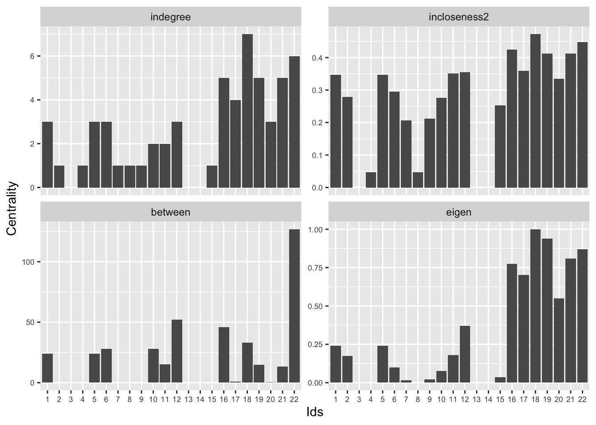
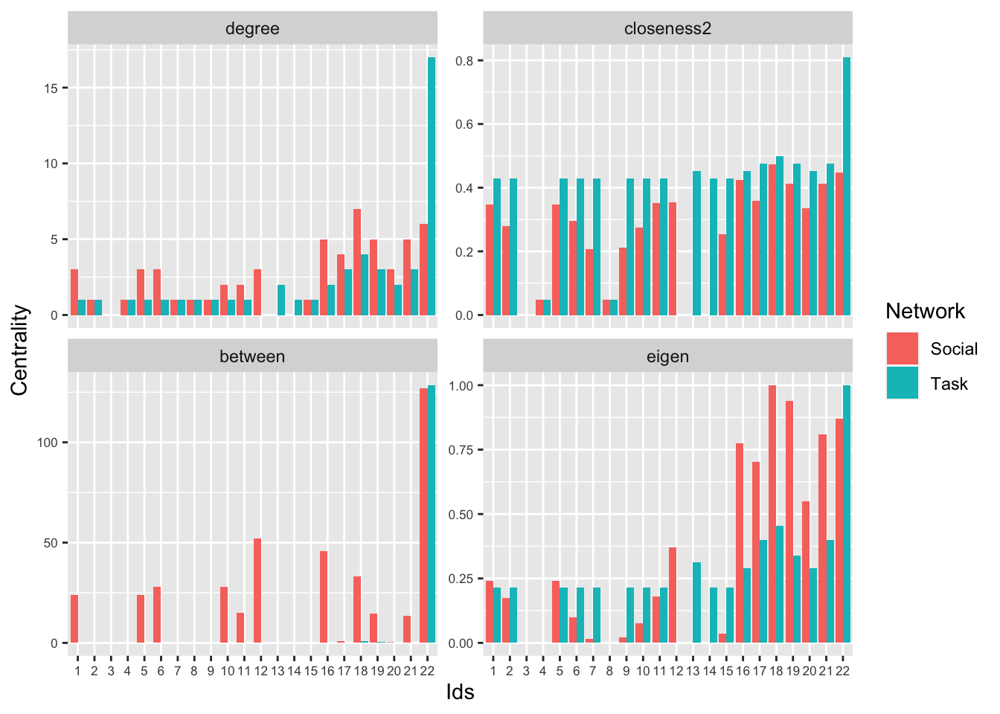

# Network Centrality and Hierarchy {#ch9-Network-Centrality-Hierarchy-R}

This tutorial walks through the analysis of centrality and hierarchy in R. We will begin by looking at various centrality measures, to determine how they are interrelated, and to discern what they mean. In this way students develop different metrics for node network positioning. We will then explore network-level measures of hierarchy, moving away from individual level positioning to look at the structure of the whole network. This tutorial will build directly on the material from previous tutorials, most clearly from the network measurement tutorial ([Chapter 3](#ch3-Network-Data-R)) and the dyad/triad tutorial ([Chapter 7](#ch7-Dyads-Triads-R)).

## Setting up the Session
We will work primarily with the **igraph** package for this tutorial. 


```r
library(igraph)
```

This tutorial uses classroom network data collected by Daniel McFarland. The class is a biology 2 class at a public high school. We will focus on two network relations, one based on social interaction (i talks in a social way with j) and another based on task-based interactions (i actively engages in a task with j). Let's go ahead and read in the network data for the social relation (read in from a URL). 


```r
url1 <- "https://github.com/JeffreyAlanSmith/Integrated_Network_Science/raw/master/data/social_interactions_s641.csv"

social_data <- read.csv(file = url1)
```

Looking at the first six rows:


```r
head(social_data) 
```

```
##   ego alter social_tie
## 1   1     1      0.000
## 2   1     2      0.000
## 3   1     3      0.000
## 4   1     4      0.000
## 5   1     5      5.625
## 6   1     6      1.500
```

We now have a data frame called `social_data`. The first column is the ego, the second column is the alter, and the third column shows the frequency of social interactions between the two students. We will reduce the data frame to just include those dyads where social interaction occurred:


```r
edgelist_social <- social_data[social_data$social_tie > 0, ] 
```


```r
head(edgelist_social)
```

```
##    ego alter social_tie
## 5    1     5      5.625
## 6    1     6      1.500
## 22   1    22      1.875
## 44   2    22      0.375
## 74   4     8      1.875
## 89   5     1      5.250
```

Now we can go ahead and create our igraph object based on the edgelist defined above. The size of the network is 22, so we will set the vertices input to define the ids of the nodes, running from 1 to 22.


```r
s641_social <- graph_from_data_frame(d = edgelist_social, directed = T, 
                                     vertices = (id = 1:22)) 
```

Note that if we did not want the isolates included we could have done: 


```r
net641_social_noisolates <- graph_from_data_frame(d = edgelist_social, 
                                                  directed = T) 
```

And now we read in the task data:


```r
url2 <- "https://github.com/JeffreyAlanSmith/Integrated_Network_Science/raw/master/data/task_interactions_s641.csv"

task_data <- read.csv(file = url2)
```


```r
head(task_data)
```

```
##   ego alter task_tie
## 1   1     1        0
## 2   1     2        0
## 3   1     3        0
## 4   1     4        0
## 5   1     5        0
## 6   1     6        0
```

The `task_tie` variable shows the frequency of task-based interactions between nodes i and j. We will now reduce the data to just those dyads where a task interaction occurred and create the igraph object. We will treat the task network as undirected as if i does a task with j, j does a task with i. We will thus reduce the edgelist so that each edge is only listed once (accomplished by reducing the edgelist to rows where the ego id is smaller than the alter id).


```r
edgelist_task <- task_data[task_data$task_tie > 0, ] 

edgelist_task <- edgelist_task[edgelist_task$ego < edgelist_task$alter, ]

s641_task <- graph_from_data_frame(d = edgelist_task, directed = F,
                                   vertices = (id = 1:22)) 
```

We will now plot both networks.


```r
par(mfrow = c(1, 2)) 

plot(s641_social, vertex.frame.color = NA, edge.arrow.size = .25, 
     vertex.size = 8, main = "Social Interactions", margin = -.08)

plot(s641_task, vertex.frame.color = NA, edge.arrow.size = .25, 
     vertex.size = 8, main = "Task Interactions", margin = -.08)
```


From the figure alone we can see that the features of these two networks are very different. The task network would appear to have one very central node, with lots of ties, while the social network splits more clearly into groups with one node acting as a bridge between the groups. We will use measures of centrality and centralization to more formally explore these features. Our main substantive goal is to determine which nodes are most important in the classroom and how (or if) this varies across network relation and measure of centrality. Are individuals who are prominent in the task network also prominent in the social interaction network? Which nodes act as bridges? Are they the same nodes with the highest degree? We also want to uncover something about the overall level of inequality and hierarchy that exists in this classroom. Is this a world where one node dominates? 

## Centrality 

### Centrality Measures for Social Interactions
Centrality measures, such as degree and betweenness, capture something about which nodes are most important to the network. These node-level measures can be used as predictors of other outcomes, like attitudes, behaviors, etc. The centrality scores can also be used as the main outcome of interest. Here, we will walk through the code to calculate a number of commonly used measures, with a particular focus on how different measures offer similar or different pictures of which nodes are more central to the network. We begin with the social interaction network. 

Indegree centrality measures how many ties each node receives, in this case the number of people that talks to node i in a social way. The function is `degree()`. The main arguments are graph (the network, as an igraph object) and mode (in, out or total). For indegree we set mode to "in". 


```r
indegree_social <- degree(graph = s641_social, mode = "in")
```

Let's look at first 6 values:

```r
head(indegree_social) 
```

```
## 1 2 3 4 5 6 
## 3 1 0 1 3 3
```

This means that 3 people talk to node 1, 1 person talks to node 2, and so on. Outdegree centrality measures how many ties the node sends out, in this case the number of people that the node talks to in a social way. For outdegree we set mode to "out". 


```r
outdegree_social <- degree(graph = s641_social, mode = "out")
```


```r
head(outdegree_social)
```

```
## 1 2 3 4 5 6 
## 3 1 0 1 3 3
```

Closeness is the inverse of the mean geodesic distance between a given node and all other nodes. In a directed network, we can think of in-closeness centrality as the average number of steps one would have to go through to get TO a given node FROM all other reachable nodes in the network. Out-closeness centrality measures the same thing with the directionality reversed (average number of steps to get from i to all other j nodes). We invert the mean distance to make it a closeness measure, where higher values mean the nodes are more central (i.e., closer to other nodes). When calculating closeness, igraph (at least more recent versions of the package) will only include nodes that actor i can reach in the calculation, and so is most easily interpreted for fully connected graphs, where all nodes can reach all other nodes. The function is `closeness()` and the arguments are:

- graph = network of interest, as igraph object
- mode = "in", or "out"
- normalized = T/F, should scores be normalized? (divided by n-1, where n is the number of people in the network)

Let's first calculate out-closeness using the igraph function. 


```r
outcloseness_social <- closeness(graph = s641_social, mode = "out",
                                 normalized = T)
```


```r
head(outcloseness_social)
```

```
##         1         2         3         4         5         6 
## 0.4210526 0.3720930       NaN 1.0000000 0.4210526 0.3200000
```

We can interpret those values as the inverse of the mean distance of each node to all other nodes that the focal node can reach. Isolates are assigned an NA value. Now we will do the same thing for in-closeness.


```r
incloseness_social <- closeness(graph = s641_social, mode = "in", 
                                normalized = T)
```


```r
head(incloseness_social)
```

```
##         1         2         3         4         5         6 
## 0.4117647 0.3589744       NaN 1.0000000 0.4117647 0.3181818
```

An alternative version of this is to take the mean based on the inverse distance matrix. This avoids the problem of excluding unreachable nodes when calculating the mean distance to or from each node and is more appropriate when all nodes cannot reach all other nodes. Here we get the distance matrix in the right form for that calculation.


```r
dist_mat_social <- distances(graph = s641_social, mode = "out") 
diag(dist_mat_social) <- NA #ignoring the diagonal
dist_mat_social_inverted <- 1 / dist_mat_social #inverting distance matrix
```

Now we can use `apply()` to take the mean over all of the rows at once. Note that we use a 1 within the `apply()` function to take the mean over the rows, set FUN to the mean and include an argument to exclude the NAs.


```r
outcloseness_social2 <- apply(dist_mat_social_inverted, MARGIN = 1, 
                              FUN = mean, na.rm = T) 
```


```r
head(outcloseness_social2)
```

```
##          1          2          3          4          5          6 
## 0.39444444 0.32698413 0.00000000 0.04761905 0.39444444 0.32698413
```

Let's compare the two versions of out-closeness centrality:


```r
cor(outcloseness_social, outcloseness_social2, use = "complete.obs") 
```

```
## [1] -0.6850724
```

We see a pretty strong, negative correlation. This is the case as the original calculation (outcloseness_social) calculates closeness only including the reachable nodes for each actor. This means that nodes like 4, 8, 11 and 15 get surprisingly high closeness values (1), as they reach only one other node at distance 1. This might not be what we want as these nodes are, in fact, not very central in the network (see figure above) but are assigned a high centrality value. The alternative version of out-closeness handles this better and assigns a low value for these nodes. If we remove those 'odd' cases, the two versions are very highly correlated: 


```r
cor(outcloseness_social[-c(4, 8, 11, 15)], 
    outcloseness_social2[-c(4, 8, 11, 15)], 
    use = "complete.obs") 
```

```
## [1] 0.9806626
```

And now we calculate the alternative version of in-closeness. Here, we take the mean over each column of the inverted distance matrix to get the in-coming paths. This is accomplished by using a 2 for MARGIN in the `apply()` statement:


```r
incloseness_social2 <- apply(dist_mat_social_inverted, MARGIN = 2, 
                             FUN = mean, na.rm = T) 
```


```r
head(incloseness_social2)
```

```
##          1          2          3          4          5          6 
## 0.34682540 0.27936508 0.00000000 0.04761905 0.34682540 0.29523810
```

Betweenness centrality is based on the number of shortest paths going through a specific vertex; it is returned by the `betweenness()` function. We need to set normalized to T/F, determining if the  scores should be normalized by the number of pairs of nodes (not including i), capturing the number of possible paths a node could be between.


```r
betweenness_social <- betweenness(graph = s641_social, normalized = F) 
```


```r
head(betweenness_social)
```

```
##  1  2  3  4  5  6 
## 24  0  0  0 24 28
```

Eigenvector centrality gives greater weight to a node the more it is connected to other highly connected nodes. A node connected to five high-scoring nodes will have higher eigenvector centrality than a node connected to five low-scoring nodes. Thus, it is often interpreted as measuring a node's network importance. In directed networks, there are 'In' and 'Out' versions. In information flow studies, for instance, In-Eigenvector scores would reflect which nodes are high on receiving information, while Out-Eigenvector scores would reflect which nodes are high on broadcasting information. For these data, we will simply symmetrize to generate an undirected eigenvector centrality score. Unlike the other centrality measures, the `evcent()` function returns a complex object rather than a simple vector. Thus, we need to first get the evcent output and then select the eigenvector scores from it. Here we symmetrize our network before calculating eigenvector centrality, making a tie between i and j if i is tied with j or j is tied with i. 


```r
s641_social_undirected <- as.undirected(s641_social, mode = "collapse") 
```

We now calculate eigenvector centrality: 


```r
ev_obj_social <- eigen_centrality(s641_social_undirected)
eigen_social <- ev_obj_social$vector
```


```r
head(eigen_social)
```

```
##            1            2            3            4            5            6 
## 2.418251e-01 1.735366e-01 0.000000e+00 5.622518e-17 2.418251e-01 1.004841e-01
```

Note that we can calculate a closely related Bonacich power centrality score using the `power_centrality()` function.

We now have a basic set of centrality scores for our social interaction network. To facilitate comparison across the different measures, we'll construct a data frame with the nodes as rows and the centrality scores as columns. We include a variable for the network type, here social interaction, as well as the ids of the nodes. We first grab the ids from the igraph object.


```r
ids <- V(s641_social)$name
```

And now we put together the data frame.


```r
central_social <- data.frame(ids = ids, net = "social", 
                             indegree = indegree_social, 
                             outdegree = outdegree_social, 
                             incloseness2 = incloseness_social2, 
                             outcloseness2 = outcloseness_social2,
                             between = betweenness_social, 
                             eigen = eigen_social)
```


```r
head(central_social)
```

```
##   ids    net indegree outdegree incloseness2 outcloseness2 between        eigen
## 1   1 social        3         3   0.34682540    0.39444444      24 2.418251e-01
## 2   2 social        1         1   0.27936508    0.32698413       0 1.735366e-01
## 3   3 social        0         0   0.00000000    0.00000000       0 0.000000e+00
## 4   4 social        1         1   0.04761905    0.04761905       0 5.622518e-17
## 5   5 social        3         3   0.34682540    0.39444444      24 2.418251e-01
## 6   6 social        3         3   0.29523810    0.32698413      28 1.004841e-01
```

Now we'll examine the table to find the most central nodes according to the different measures we have. When looking at each of these measures, it's a good idea to have your plot of the social interaction network on hand so you can sanity-check the results.
 
Let’s order each column from high to low centrality seeing which nodes have the top centrality on each measure. We will use an `order()` function to rank order the nodes. The `order()` function returns a vector in ascending or descending order, showing which cases have the highest/lowest values. We will set decreasing equal to T to make it descending (running high to low). We will set FUN to order within the `apply()` statement. We use` apply()` to order all of the columns at once. We exclude the first two columns as they are not centrality scores. 


```r
apply(central_social[, -c(1, 2)], MARGIN = 2, FUN = order, decreasing = T)
```

```
##       indegree outdegree incloseness2 outcloseness2 between eigen
##  [1,]       18        22           18            22      22    18
##  [2,]       22        18           22            19      12    19
##  [3,]       16        19           16            16      16    22
##  [4,]       19        16           19            18      18    21
##  [5,]       21        17           21            21       6    16
##  [6,]       17        21           17             1      10    17
##  [7,]        1         1           12             5       1    20
##  [8,]        5         5           11            17       5    12
##  [9,]        6         6            1            12      11     1
## [10,]       12        12            5            20      19     5
## [11,]       20        20           20             2      21    11
## [12,]       10        10            6             6      17     2
## [13,]       11         2            2            10      20     6
## [14,]        2         4           10             9       2    10
## [15,]        4         7           15             7       3    15
## [16,]        7         8            9             4       4     9
## [17,]        8         9            7             8       7     7
## [18,]        9        11            4            11       8     4
## [19,]       15        15            8            15       9     8
## [20,]        3         3            3             3      13     3
## [21,]       13        13           13            13      14    13
## [22,]       14        14           14            14      15    14
```

If we start with indegree, we see the top nodes are 18, 22 and 16. Or, for outdegree, the top three nodes are 22, 18 and 19.  We see nodes 18, 22 and 16 are most central for inclosenss. Finally, we see similar, but somewhat different ordering for betweenness, with nodes 22, 12 and 16 the top three. Node 12 in particular has much higher betweenness centrality than they do for degree, closeness, etc. 

Let's make a plot with these summary statistics. To visualize these data, we can create a barplot for our centrality measures. To make this task a little easier, we will first rearrange our data set to make it a 'long' format. We will focus on just a handful of our centrality measures, indegree, incloseness2, betweenness and eigen centrality. Here we use the `melt()` function (in the **reshape** package) to rearrange our data, basically stacking the variables of interest (here centrality scores) on top of each other, differentiated by an id.vars variables (here the ids of the nodes).


```r
library(reshape)
```


```r
vars_to_stack <-c("ids", "indegree", "incloseness2", "between", "eigen")

social_long <- melt(central_social[, vars_to_stack], id.vars = "ids")  
```


```r
head(social_long)
```

```
##   ids variable value
## 1   1 indegree     3
## 2   2 indegree     1
## 3   3 indegree     0
## 4   4 indegree     1
## 5   5 indegree     3
## 6   6 indegree     3
```
We can see that we now have three variables. An ids variable corresponding to the node; a variable corresponding to the centrality measure and value corresponding to the actual score for that person on that centrality measure. Now, let's create a barplot using `ggplot()` for each of our centrality scores. The y-axis is the score, and the x-axis is the node. We will have 4 different panels, one for each measure of interest. We use the `aes()` function and the `geom_bar()` function to create the basic bar plot for each node (ids) based on the value variable; and a `facet_wrap()` function to set up the plot to have 2 columns.


```r
library(ggplot2)

ggplot(social_long, aes(x = factor(ids, levels = 1:length(ids)), y = value)) +
  geom_bar(stat = "identity", position = "dodge") +
  facet_wrap(~ variable, scales = "free_y", ncol = 2) +
  xlab("Ids") + ylab("Centrality") +
 theme(axis.text = element_text(size = 6.5))
```



Given our results, what can we say about the social nodes if we compare the bar plots? Who seems to run the show in sociable affairs? Who seems to bridge sociable conversations? For example, we can see that node 22 plays a key bridging role and shows up as highly centrality in general, but particularly for betweenness. Node 22 has the highest centrality by far in betweenness but has similar indegree to other top nodes. This suggests that multiple nodes (16, 18, 19, 22) have high volume (or prominence) in the network, but only one plays the role of bridging different groups in the classroom (22). To highlight this, let's go back to our picture and size the nodes by betweenness centrality (scaled a bit to make the picture a little nicer): 


```r
plot(s641_social, vertex.size = central_social$between / 5,
     vertex.label = V(s641_social)$name, 
     edge.arrow.size = 0.25, layout = layout.fruchterman.reingold, 
     main = "Classroom S641 Social Talk", margin = -.08)
```


### Correlations between Centrality Measures
We have so far seen which nodes are the most central on different measures. We now want to formalize this a bit more by computing the correlations between the centrality scores, showing how closely these measures of centrality are interrelated. More substantively, we want to know which measures tend to yield the same nodes as central and which tend to disagree on the most important nodes. Here we generate a table of pairwise correlations. Again, we take out the first column of ids and the second column showing the network type when doing the correlation matrix (we also round the values in the correlation matrix when printing).


```r
cor_tab1 <- cor(central_social[, -c(1, 2)])
```


```r
round(cor_tab1, 3)
```

```
##               indegree outdegree incloseness2 outcloseness2 between eigen
## indegree         1.000     0.960        0.874         0.860   0.629 0.940
## outdegree        0.960     1.000        0.822         0.874   0.738 0.914
## incloseness2     0.874     0.822        1.000         0.879   0.548 0.794
## outcloseness2    0.860     0.874        0.879         1.000   0.595 0.800
## between          0.629     0.738        0.548         0.595   1.000 0.507
## eigen            0.940     0.914        0.794         0.800   0.507 1.000
```

Indegree and outdegree are very closely correlated (rho = 0.96), indicating that social talk with others is almost always reciprocated (i.e., if you talk to others, they tend to talk back to you). Indegree and outdegree are also highly correlated with eigenvector centrality, indicating that the students that talk the most to others (or, relatedly, are talked to the most by others) are also the ones that are connected to other highly connected students -- possibly indicating high density cliques around these individuals. The degree centralities are less correlated with our closeness centrality scores, suggesting that nodes with high degree are not always (although often) close to other nodes. 

Betweenness shows the highest correlation with outdegree, followed by indegree. In the case of this particular network, it seems that individuals that talk the most to others are the likeliest to serve as bridges between the particular cliques (see, e.g., 22 in the plot). Note that betweenness is not all that highly correlated with closeness centrality. This suggests that nodes may sit between groups, and thus have high betweenness, but not necessarily be close to all nodes, on average. For example, node 19 has high closeness centrality but not especially high betweenness centrality. If we look at the last plot, we can see that node is 19 deeply embedded in one social group and has ties to node 22, who has high betweenness, connecting different parts of the network. Thus, node 19 has high closeness as they can reach everyone else (through node 22) but low betweenness, as the shortest paths connecting different groups would not have to run through node 19. 

Thus, if the process that we thought was most important was about information flow based on shortest paths, we may think that node 19 is well positioned to influence the rest of the network. If, however, the key is being the bridge itself, then 19 is clearly not as important as node 22. Thus, while there is much agreement between the centrality scores (with nodes 22, 16, 18 and 19 showing up consistently as central) it is possible for a node to be high on one measure and low on another. 

### Centrality for Task Interactions
We now repeat the analysis for the task interaction network. Note that the in and out measures will be the same as the network is undirected, meaning that we only need one calculation for measures like degree or closeness. It also means that we do not need to set mode as an argument.


```r
degree_task <- degree(s641_task)

dist_mat_task <- distances(graph = s641_task)
diag(dist_mat_task) <- NA
dist_mat_task_inverted <- 1 / dist_mat_task

closeness_task2 <- apply(dist_mat_task_inverted, MARGIN = 1, 
                         FUN = mean, na.rm = T)

betweenness_task <- betweenness(s641_task, normalized = F)

ev_obj_task <- evcent(s641_task)
eigen_task <- ev_obj_task$vector
```

And now we put the results together, as before, into a data frame with all the centrality values.


```r
central_task <- data.frame(ids = ids, net = "task", 
                           degree = degree_task,
                           closeness2 = closeness_task2, 
                           between = betweenness_task, 
                           eigen = eigen_task)
```


```r
head(central_task)
```

```
##   ids  net degree closeness2 between     eigen
## 1   1 task      1 0.42857143       0 0.2154856
## 2   2 task      1 0.42857143       0 0.2154856
## 3   3 task      0 0.00000000       0 0.0000000
## 4   4 task      1 0.04761905       0 0.0000000
## 5   5 task      1 0.42857143       0 0.2154856
## 6   6 task      1 0.42857143       0 0.2154856
```

We will now quickly take a look at the nodes with the top centrality scores for the task network. 


```r
apply(central_task[, -c(1, 2)], MARGIN = 2, FUN = order, decreasing = T)
```

```
##       degree closeness2 between eigen
##  [1,]     22         22      22    22
##  [2,]     18         18      18    18
##  [3,]     17         17      19    17
##  [4,]     19         19       1    21
##  [5,]     21         21       2    19
##  [6,]     13         13       3    13
##  [7,]     16         16       4    20
##  [8,]     20         20       5    16
##  [9,]      1          1       6     1
## [10,]      2          2       7     5
## [11,]      4          5       8     6
## [12,]      5          6       9     7
## [13,]      6          7      10    10
## [14,]      7          9      11    14
## [15,]      8         10      12    11
## [16,]      9         11      13    15
## [17,]     10         14      14     2
## [18,]     11         15      15     9
## [19,]     14          4      16     8
## [20,]     15          8      17     3
## [21,]      3          3      20     4
## [22,]     12         12      21    12
```

In this case, we can see nodes 22, 18 and 17 are consistently the most important nodes, but node 22 is by the far most central. This becomes clear if we plot the network, scaling the nodes by degree: 


```r
plot(s641_task, vertex.size = central_task$degree, 
     vertex.label = V(s641_social)$name, 
     edge.arrow.size = 0.25, layout = layout.fruchterman.reingold, 
     main = "Classroom S641 Task Interactions", margin = -.08)
```


### Task/Social Correlations 
We have seen that node 22 dominates task interactions in a way that was less clear-cut in the social interactions network. Let's explore the similarities/differences between the two networks by doing a quick bar plot comparing four centrality measures (degree, closeness2, betweenness and eigen) on social and task centrality. We will first rearrange the task centrality data frame, as we did with the social centrality data frame, to make it in a long format. 


```r
vars_to_stack_task <- c("ids", "degree", "closeness2", "between", "eigen")
task_long <- melt(central_task[, vars_to_stack_task], id.vars = "ids") 
```


```r
head(task_long)
```

```
##   ids variable value
## 1   1   degree     1
## 2   2   degree     1
## 3   3   degree     0
## 4   4   degree     1
## 5   5   degree     1
## 6   6   degree     1
```

Now, let's also add a variable in both the social and task data frames that indicate network type.


```r
task_long$net <- "task"
social_long$net <- "social"
```

Now we will put together the two long format data frames:


```r
social_task_long <- rbind(social_long, task_long)
```

And let's make sure the labels are the same between the social and task rows. Let's change incloseness2 to closeness2 and indegree to degree, so the social labels match the task labels.


```r
library(car)

social_task_long$variable <- recode(social_task_long$variable, as.factor = T, 
                                    "'incloseness2' = 'closeness2'; 
                                    'indegree' = 'degree'",
                                    levels = c("degree", "closeness2", 
                                               "between", "eigen"))
```
Now, let's produce the same barplot as before, but include the task centrality score along side the social centrality scores. This is accomplished by adding a fill argument (in the `aes()` function) set to the net variable, and by setting the colors using a `scale_fill_discrete()` function (to distinguish social from task).


```r
ggplot(social_task_long, aes(x = factor(ids, levels = 1:length(ids)), 
                             y = value, fill = net)) +
  geom_bar(stat = "identity", position = "dodge") +
  facet_wrap(~ variable, scales = "free_y", ncol = 2)+ 
  scale_fill_discrete(name = "Network", 
                      breaks = c("social", "task"), 
                      labels = c("Social", "Task")) +
  xlab("Ids") + ylab("Centrality") +
  theme(axis.text = element_text(size = 6.5))
```



We can see node 22 has extremely high centrality in the task network over all measures of centrality. Node 22 also tends to be high centrality in the social interaction network, but there are other nodes (like 16, 18 or 19) with similar centrality scores (except for betweenness). Now, let's calculate the correlation between task and social over all our measures.


```r
cor_tab2 <- cor(central_social[, -c(1, 2)], central_task[, -c(1, 2)])
```

Let’s add some useful row and column names to our correlation table. We will use a paste command to tack "_social" onto the existing row names.


```r
rownames(cor_tab2) <- paste(rownames(cor_tab2), "social", sep = "_")
```

And here we add "_task"  to the end of the column names.


```r
colnames(cor_tab2) <- paste(colnames(cor_tab2), "task", sep = "_") 
```

And let's look at the columns for `eigen_task`, `degree_task`, and `closeness2_task`.


```r
round(cor_tab2[, c("eigen_task", "degree_task", "closeness2_task")], 3)
```

```
##                      eigen_task degree_task closeness2_task
## indegree_social           0.650       0.558           0.494
## outdegree_social          0.734       0.700           0.536
## incloseness2_social       0.553       0.394           0.554
## outcloseness2_social      0.570       0.460           0.507
## between_social            0.681       0.803           0.412
## eigen_social              0.657       0.549           0.481
```

`eigen_task` is correlated with `betweenness_social` (rho = .681) and `outdegree_social` (rho = .734), possibly because those who are important in tasks also serve as bridges for talk on social issues and have many outbound ties. `degree_task` and `between_social` (rho = .803) are correlated, possibly because the number of outdegree ties a node has with respect to task talk, the more they serve as a bridge on social talk. `closeness_task2` and `incloseness_social2` (rho = .554) are correlated, meaning that those who serve in shortest paths are equivalent for both social talk and task talk.

## Centralization
We have so far seen which nodes are most important in the classroom using different definitions of centrality. We have also seen how this differs across social and task interactions. To flesh out the story more clearly, it will be useful to formally summarize the distribution of the centrality measures, telling us something about the network as a whole. For example, a network with one node capturing the vast majority of ties is highly centralized, or highly unequal, as all of the activity in the network is focused on a particular node. A highly centralized network is also relatively fragile, as removing the one central node would greatly reduce the connectivity of the network. We could examine the distribution of any of the centrality scores we calculated above. Here, let's focus on degree as a way of exploring the level of centralization in the two networks. Let's start with a summary of the degree distributions (indegree for social and degree for task).


```r
summary(indegree_social)
```

```
##    Min. 1st Qu.  Median    Mean 3rd Qu.    Max. 
##   0.000   1.000   2.500   2.591   3.750   7.000
```

```r
summary(degree_task)
```

```
##    Min. 1st Qu.  Median    Mean 3rd Qu.    Max. 
##   0.000   1.000   1.000   2.182   2.000  17.000
```

```r
sd(indegree_social)
```

```
## [1] 2.03912
```

```r
sd(degree_task)
```

```
## [1] 3.459099
```

We can see that the mean and median of degree is higher in the social interaction network than in the task network. In contrast, the maximum value, as well as the standard deviation is much higher in the task network. This confirms our story from above, where the task network is centered strongly on one node, while the social interaction network is based more on groups, where a single node won't necessarily dominate. Note that a simple standard deviation score can serve as an effective measure of centralization. It is also possible to employ traditional centralization measures. 

To calculate centralization, we take the centrality scores of interest and sum up the total deviations from the highest value. We then typically divide the total summation by the maximum possible level of centralization in a network of that size (i.e., the centralization we would have observed in a hub and spoke structure).

**igraph** has different centralization functions for each centrality score. For degree the function is `cent_degree()`. The arguments are graph (network of interest), mode (in, out, total) loops (T/F should self-loops be considered), and normalized (T/F should divide by theoretical max?) Here we calculate indegree centralization for the social interaction network, ignoring self loops and dividing by the theoretical max. 


```r
cent_social <- centr_degree(graph = s641_social, mode = "in", 
                            loops = FALSE, normalized = TRUE)
```


```r
cent_social
```

```
## $res
##  [1] 3 1 0 1 3 3 1 1 1 2 2 3 0 0 1 5 4 7 5 3 5 6
## 
## $centralization
## [1] 0.2199546
## 
## $theoretical_max
## [1] 441
```

We could also calculate this directly by doing: 


```r
sum(max(indegree_social) - indegree_social) / sum(21 - rep(0, 21)) 
```

```
## [1] 0.2199546
```

The code simply takes the max centrality score and subtracts the centrality of each node in the network, summing over all nodes. We then divide by the theoretical max, the centralization score if one node received nominations from everyone (indegree = 21 in this case) and everyone else received none (indegree = 0).

And now we do the same thing for the task network.


```r
cent_task <- centr_degree(graph = s641_task,
                          loops = FALSE, normalized = TRUE)
```


```r
cent_task
```

```
## $res
##  [1]  1  1  0  1  1  1  1  1  1  1  1  0  2  1  1  2  3  4  3  2  3 17
## 
## $centralization
## [1] 0.7761905
## 
## $theoretical_max
## [1] 420
```
Note that the theoretical max is a little different as we treated the task network as undirected. Clearly, the task network is considerably more centralized. In fact, the task network almost approaches maximum centralization, or a perfect hub and spoke structure. 

Now, let's do a simple plot of the two degree distributions. We will put degree on the x-axis and plot a smoothed density curve for each distribution. First, we need to get the density curves for each network, starting with the social interaction network (we set from to 0 in the `density()` function as indegree cannot be less than 0). 


```r
den_social <- density(indegree_social, from = 0) 
```

And now for the task network: 


```r
den_task <- density(degree_task, from = 0)
```

And now we set up the plot, plot the two lines and add a legend.


```r
plot(range(den_social$x, den_task$x), range(den_social$y, den_task$y), 
     type = "n", xlab = "degree", 
     ylab = "density", 
     main = "Degree Distribution for Social and Task Networks")

lines(den_social, col = "red" , lty = 2, lwd = 2)
lines(den_task, col = "light blue", lty = 2, lwd = 2)

legend("topright", c("Social", "Task"),
       col = c("red", "light blue"), lty = 2, lwd = 2) 
```


Here we see that for the task network most people have one or two ties and one person has a very high degree. The social interaction network has a much more even distribution, with many people close to the mean. The story is clear that the task network is highly centralized, with one node being the focal point of all of the task interactions. Social interactions are much evenly dispersed, occurring within groups of people but not centered on a single well-connected node. 

More generally, our centrality and centralization analyses paint a picture of two different kinds of interactional tendencies. For the social interaction network, we have a set of divided groups bridged by one focal node with high betweenness. Within each group there are prominent nodes with high degree, closeness, etc. but only one node holds the whole network together. For the task network, there is only one focal node, with everyone doing task interactions with them and few interactions happening otherwise. 

## Clustering and Hierarchy
We have so far used centrality and centralization to explore the classroom networks. Centrality is focused on individual positions in the network and can tell us who holds important positions and who does not. Centralization helps us understand how unequally distributed centrality is in the network. Neither measure (centrality nor centralization) can tell us much about hierarchy at the group level. We may, however, want to know if the groups that exist in our classroom are themselves hierarchically arranged. 

To explore hierarchy at the group-level, it will be useful to consider other kinds of measures. Here, we will use the tau statistic. The tau statistic captures how micro processes aggregate to create different macro structures. The basic idea is to create hypotheses in the form of different triad counts (the micro processes), that should yield different features at the macro-level. Thus, different micro hypotheses (about which triads should be in the network at high/low rates) correspond to different kinds of emergent features at the macro level. By comparing the observed triad counts to that expected under a null hypothesis, we can see what kinds of hierarchical arrangements exist in the network of interest. Formally, we compare the observed triad counts to the expectations under a null hypothesis of a random network with the same dyad census. This is analogous to the kinds of tests we explored in [Chapter 7](#ch7-Dyads-Triads-R), but the tau statistic is presented as a z-score (how many standard deviations from the null hypothesis is the observed value), making it akin to more traditional statistical tests. 

Let's first transform our network from an igraph object into a network object using the **intergraph** package (as the function we need assumes a network object). 


```r
library(intergraph)
```

For this analysis we will focus on the social interaction network. 


```r
s641_social_network <- asNetwork(s641_social)
```

Here we read in a function to calculate the tau statistic.


```r
source(file = "https://github.com/JeffreyAlanSmith/Integrated_Network_Science/raw/master/R/tau_functions.R")
```

Now we load the **ergm** and **sna** packages which is used by the tau function read in above. 


```r
library(ergm)
library(sna)
```

Let's test different hypotheses about the distribution of triads in the network, telling us something about the macro structure in terms of hierarchy. We will consider a ranked clustering hypothesis, a clustering hypothesis and a balance hypothesis. Each hypothesis is represented by a vector, indicating which triads should be summed up and compared to our baseline expectations.  The triad types are:

-  003  A, B, C, empty triad.
-  012  A->B, C 
-  102  A<->B, C  
-  021D A<-B->C 
-  021U A->B<-C 
-  021C A->B->C
-  111D A<->B<-C
-  111U A<->B->C
-  030T A->B<-C, A->C
-  030C A<-B<-C, A->C.
-  201  A<->B<->C.
-  120D A<-B->C, A<->C.
-  120U A->B<-C, A<->C.
-  120C A->B->C, A<->C.
-  210  A->B<->C, A<->C.
-  300  A<->B<->C, A<->C, completely connected.

A ranked clustering hypothesis poses that 003, 102, 021D, 021U, 030T, 120D, 120U and 300 should be present in the network at higher rates than we what we expect based on dyadic processes alone. The idea is that a network with these triads will tend to create macro structures that correspond to ranked clustering, where there are mutual ties within groups and asymmetric ties across groups; where the lower status groups send ties to higher status groups but not vice versa. Let's create a vector that corresponds to the ranked clustering hypothesis, putting a 1 in each spot of the triad census (following the order above) that corresponds to a triad in that hypothesis. 


```r
weights_rankedcluster <- c(1, 0, 1, 1, 1, 0, 0, 0, 1, 0, 0, 1, 1, 0, 0, 1)
```

A clustering hypothesis poses that 003, 102, and 300 should be present in the network at higher rates than we what we expect based on dyadic processes alone. The clear difference with the ranked clustering hypothesis is that triads that create hierarchies (021U, 120U, etc.) are not included here. The macro network structure implied by a triad census fitting the clustering model is one with a number of social groups, with mutual ties within groups and few ties between groups. Thus, there are a number of groups differentiated by high internal rates of interaction (see [Chapter 8](#ch8-Network-Cohesion-Communities-R)) but there is no clear hierarchy between the groups. 


```r
weights_cluster <- c(1, 0, 1, 0, 0, 0, 0, 0, 0, 0, 0, 0, 0, 0, 0, 1)
```

A balance hypothesis is the simplest hypothesis and only includes 102 and 300. This is very similar to the clustering hypothesis but differs in the exclusion of the null triad, 003. The key macro structural difference is that the clustering hypothesis implies a number of social groups to emerge (with no hierarchy) while the balance hypothesis implies that only two groups should emerge, with mutual ties within the groups and few ties between.


```r
weights_balance <- c(0, 0, 1, 0, 0, 0, 0, 0, 0, 0, 0, 0, 0, 0, 0, 1)
```

The function is `tau_stat_function()`. The arguments are network and weight.vector (the vector of weights). For ranked clustering:


```r
tau_rankedcluster <- tau_stat_function(network = s641_social_network, 
                                       weight.vector = weights_rankedcluster)
```


```r
tau_rankedcluster 
```

```
## $tau
##          [,1]
## [1,] 2.968397
## 
## [[2]]
##                  observed.triads expected.triads weight.vector
## triadcensus.003             1029    1.012569e+03             1
## triadcensus.012               37    4.579457e+01             0
## triadcensus.102              403    4.121511e+02             1
## triadcensus.021D               1    1.144864e-01             1
## triadcensus.021U               0    1.144864e-01             1
## triadcensus.021C               0    2.289728e-01             0
## triadcensus.111D               4    6.182267e+00             0
## triadcensus.111U              10    6.182267e+00             0
## triadcensus.030T               0    5.695842e-04             1
## triadcensus.030C               0    1.898614e-04             0
## triadcensus.201               38    5.357965e+01             0
## triadcensus.120D               0    1.537877e-02             1
## triadcensus.120U               0    1.537877e-02             1
## triadcensus.120C               0    3.075755e-02             0
## triadcensus.210                7    7.996962e-01             0
## triadcensus.300               11    2.221378e+00             1
```

The output is a list, with the first element the tau statistic and the second a data frame with the observed and expected triads, as well as the weighting vector. Now for the clustering hypothesis:


```r
tau_cluster <- tau_stat_function(network = s641_social_network, 
                                 weight.vector = weights_cluster)
```


```r
tau_cluster
```

```
## $tau
##          [,1]
## [1,] 2.867246
## 
## [[2]]
##                  observed.triads expected.triads weight.vector
## triadcensus.003             1029    1.012569e+03             1
## triadcensus.012               37    4.579457e+01             0
## triadcensus.102              403    4.121511e+02             1
## triadcensus.021D               1    1.144864e-01             0
## triadcensus.021U               0    1.144864e-01             0
## triadcensus.021C               0    2.289728e-01             0
## triadcensus.111D               4    6.182267e+00             0
## triadcensus.111U              10    6.182267e+00             0
## triadcensus.030T               0    5.695842e-04             0
## triadcensus.030C               0    1.898614e-04             0
## triadcensus.201               38    5.357965e+01             0
## triadcensus.120D               0    1.537877e-02             0
## triadcensus.120U               0    1.537877e-02             0
## triadcensus.120C               0    3.075755e-02             0
## triadcensus.210                7    7.996962e-01             0
## triadcensus.300               11    2.221378e+00             1
```

Now for the balance hypothesis:


```r
tau_balance <- tau_stat_function(network = s641_social_network, 
                                 weight.vector = weights_balance)
```


```r
tau_balance
```

```
## $tau
##             [,1]
## [1,] -0.03377649
## 
## [[2]]
##                  observed.triads expected.triads weight.vector
## triadcensus.003             1029    1.012569e+03             0
## triadcensus.012               37    4.579457e+01             0
## triadcensus.102              403    4.121511e+02             1
## triadcensus.021D               1    1.144864e-01             0
## triadcensus.021U               0    1.144864e-01             0
## triadcensus.021C               0    2.289728e-01             0
## triadcensus.111D               4    6.182267e+00             0
## triadcensus.111U              10    6.182267e+00             0
## triadcensus.030T               0    5.695842e-04             0
## triadcensus.030C               0    1.898614e-04             0
## triadcensus.201               38    5.357965e+01             0
## triadcensus.120D               0    1.537877e-02             0
## triadcensus.120U               0    1.537877e-02             0
## triadcensus.120C               0    3.075755e-02             0
## triadcensus.210                7    7.996962e-01             0
## triadcensus.300               11    2.221378e+00             1
```

In general, larger values offer support for the hypothesis in question. We can see here that there is little support for the balance hypothesis compared to the other hypotheses. This suggests that the balance hypothesis is too simple. More specifically, it looks like there are many more null triads (003) than we would expect in a network where everyone falls into two groups (under the balance hypothesis). The tau statistics are similar between the ranked clustering and clustering hypotheses. A value of 2.968 (for ranked clustering) suggests that the observed (summed) counts are about 3 standard deviations away from what we expect under the null. Values over 2 offer support for the hypothesis in question under traditional hypothesis testing criteria.

Let's take a closer look at the results for the ranked clustering model. We will focus on the expected and observed triad counts, particularly those triads that are in the ranked clustering model but not the clustering model (021D, 021U, 030T, 120D, 120U). The idea is to grab the data frame from the ranked cluster results, only keeping those rows for certain triads.


```r
triad_names <- c("triadcensus.021D", "triadcensus.021U", "triadcensus.030T",
                 "triadcensus.120D","triadcensus.120U")

tau_rankedcluster[[2]][rownames(tau_rankedcluster[[2]]) %in% triad_names, ]
```

```
##                  observed.triads expected.triads weight.vector
## triadcensus.021D               1    0.1144864249             1
## triadcensus.021U               0    0.1144864249             1
## triadcensus.030T               0    0.0005695842             1
## triadcensus.120D               0    0.0153787735             1
## triadcensus.120U               0    0.0153787735             1
```

In every case but 021D, the observed counts are basically the same as that expected by the null model. In fact, we see 0 observed triads for 021U, 030T, 120D and 120U. This would suggest that the ranked clustering model really isn't offering much over the clustering model. The ranked clustering model offers similar fit to the clustering model but is more complicated, adding 5 triads that do not seem to deviate much from chance expectations. We may then have good reason to interpret the network in terms of the clustering model, where there are multiple groups but few asymmetries. 

Overall, the analysis shows that the social interaction network is best characterized as a network with multiple groups without a clear hierarchical arrangement. Given the very high levels of reciprocity in social interactions, asymmetries are rare and do not consistently emerge between groups. The tau statistic reinforces our story of the social interaction network consisting of distinct social groups with one bridge and no clear hierarchy. Compare this to the task network, which has a clear hub and spoke structure, but no emergent groups.  

We end the tutorial by noting that centrality and hierarchy will come up again in a number of tutorials; for example, in [Chapter 11](#ch11-Two-mode-Networks) (two-mode), [Chapter 13](#ch13-Statistical-Models-Networks-R) (statistical network models), [Chapter 14](#ch14-Network-Diffusion-R) (diffusion) and [Chapter 15](#ch15-coevolution-networks-behaviors-siena-saom-R) (social influence).
