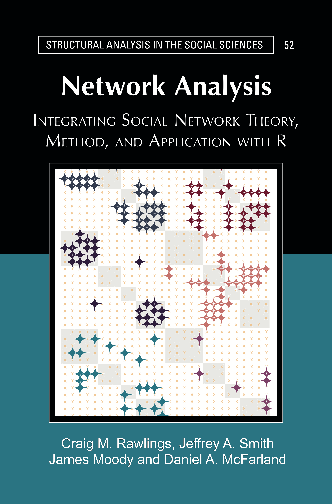

# Introduction {#ch1-intro}

<style>
p.comment {
padding: 10px;
border: 1px solid black;
margin-left: 25px;
border-radius: 5px;
}

</style>



Welcome to the website for *Network Analysis: Integrating Social Network Theory, Method, and Application with R*. Here you will find the R tutorials that accompany the printed manuscript, which is available through [Cambridge University Press](https://www.cambridge.org/us/universitypress/subjects/sociology/research-methods-sociology-and-criminology/network-analysis-integrating-social-network-theory-method-and-application-r). 

The printed manuscript offers substantive, theoretical and methodological discussions on how to conceptually conduct network analysis. The printed book thus offers the motivation and logic behind asking research questions from a network perspective. These tutorials serve as the practical counterpart, offering detailed examples on how to manipulate, visualize, summarize and analyze network data in R. The tutorials are motivated by substantive problems and include in-depth examples and interpretation. Many, but not all, of the examples are based on adolescents in school, as they serve as a familiar case study useful for drawing out larger, more general themes.

## How to Read the Book

The material on this website is meant to be paired with the printed manuscript. It is not an online version of the printed book. A reader would ideally read a chapter in the printed manuscript and then walk through the associated online R tutorials step-by-step.  Readers may choose to go through each R tutorial in order or opt to cover specific topics of interest, depending on the goals and experience of the reader. Each tutorial is self-contained, so that more experienced readers could choose to cover the tutorials out of order. For those readers not strictly following the published book, it is important to remember that the R tutorials are numbered to coincide exactly with the chapters in the published manuscript. 

The book covers a wide range of topics related to network analysis. There are often multiple tutorials associated with a given topic. Topics include: 

* [Data Management](#ch3-Network-Data-R)
* [Missing Data](#ch4-Missing-Network-Data-R)
* [Visualization](#ch5-Network-Visualization-R)
* [Ego Networks](#ch6-Ego-Network-Data-R)
* [Dyads and Triads](#ch7-Dyads-Triads-R)
* [Cohesion and Communities](#ch8-Network-Cohesion-Communities-R)
* [Centrality](#ch9-Network-Centrality-Hierarchy-R)
* [Positions and Roles](#ch10-Positions-Roles-R)
* [Affiliations and Duality](#ch11-Two-mode-Networks)
* [Networks and Culture](#ch12-Networks-Culture-R)
* [Statistical Network Models](#ch13-Statistical-Models-Networks-R)
* [Diffusion](#ch14-Network-Diffusion-R)
* [Social Influence](#ch15-coevolution-networks-behaviors-siena-saom-R)

## Citations and Use

You can cite the tutorials on this website as:

<p class="comment">
Rawlings, Craig M., Jeffrey A. Smith, James Moody, and Daniel A. McFarland 2023. _Network Analysis: Integrating Social Network Theory, Method, and Application with R_. New York: Cambridge University Press.</p>

The online R tutorials, like the printed manuscript, is in copyright. No reproduction of any part may take place without the written permission of Cambridge University Press & Assessment
(© Craig M. Rawlings, Jeffrey A. Smith, James Moody, and Daniel A. McFarland, 2023). The tutorials are, however, made freely available through this site.  

## Updates and Feedback

The authors are committed to keeping these chapters as up to date as possible, especially when there are major updates to key packages. The original version of the tutorials were completed and published in August 2023. It is possible that future versions of this online book will include additional tutorials on topics not currently covered. If you find errors or breaks in any of the code you can note them here:  https://github.com/JeffreyAlanSmith/Integrated_Network_Science/issues
or contact one of the authors directly. You can also find additional functions and data sets used throughout this book on the following github site: https://github.com/JeffreyAlanSmith/Integrated_Network_Science.

## Acknowledgments

There are many people we would like to thank for providing feedback and suggestions on these tutorials. Special thanks goes to Robin Gauthier, Sela Harcey and Julia McQuillan for their insightful comments and support, as well as graduate students Gabriel Varela, Tom Wolff, and Joe Quinn for reviews and beta testing. These tutorials have also been taught at various network analysis classes at Duke, Stanford and UNL. The advice and suggestions of our students have greatly strengthened the material presented here. We would also like to thank Mark Granovetter for his continued support, enthusiasm and belief in this project.

Many of the R tutorials presented in this textbook were built off prior versions developed at Stanford University by Daniel McFarland, Solomon Messing, Michael Nowak, Sean J. Westwood, and Sanne Smith. Chapter 5’s tutorial for NDTV drew on Skye Bender-deMoll’s materials; Chapter 12 on LDA/CA from Love Börjeson and Daniel McFarland; Chapter 13 concerning “ERGM” and “relevant” drew on Carter Butts’ materials; Chapter 15 on SIENA/SAOM drew on ICS materials. Finally, a great many resources from the Duke Network Analysis Center (DNAC) helped us in formulating elements in many of the tutorials. For example, Chapter 4 on missing data imputation drew on James Moody, Jeffrey A. Smith and Jon Morgan's work, as did Chapter 14 on diffusion. We are grateful to these institutions and individuals for sharing code and helping us formulate applications for each chapter’s theories.

## Author Informtion 

Craig M. Rawlings is Associate Professor of Sociology at Duke University, where he is affiliated with the Duke Network Analysis Center. His work focuses on the connections between social structures and culture, including belief systems, knowledge, meaning-making processes, and attitude change. His publications have appeared in the American Journal of Sociology, American Sociological Review, Social Forces, Sociological Science, and Poetics.

Jeffrey A. Smith is Senior Policy Analyst in Mental Health and Addictions at the Nova Scotia Health Authority. He has done methodological work on network sampling and missing data, as well as more substantive work on network processes, drug use, and health outcomes. His work has been published in the American Sociological Review, Sociological Methodology, Social Networks, and other venues.

James Moody is Professor of Sociology at Duke University and focuses on the network foundations of social cohesion and diffusion, using network analysis to help understand topics including racial segregation, disease spread, and the development of scientific disciplines. He has won the Freeman Award for contributions to network analysis and a James S. McDonnel Foundation Complexity Scholars award.

Daniel A. McFarland is Professor of Education and (by courtesy) Sociology and Organizational Behavior at Stanford University, where he founded Stanford’s Center for Computational Social Science. His past work studied social network dynamics of communication, relationships, affiliations, and knowledge structures in educational contexts. His current work integrates social network analysis and natural language processing to study the development of scientific knowledge. 

## Session Information

This version of the book was built using R version `r getRversion()`. See below for the session information:

```{r, echo = F}
sessioninfo::session_info(c("sna", "network", "igraph", "RSiena","ergm", "tergm",
  "ndtv", "intergraph", "GGally", "ggplot2", "ggnetwork", "networkD3", "networkDynamic", "egor", "car", "NbClust", "ergm.ego", "ergm.count", "relevent", "EpiModel", "netdiffuseR"))
```


